# 附录

## Eager 模式

和 PyTorch 官方一样，我们推荐用户优先使用的 fx 量化模式。horizon_plugin_pytorch 目前支持采用 eager 模式进行量化。
Eager 模式的整体流程同样参考了 PyTorch 官方的量化接口和思路，因此，建议您先阅读 [**PyTorch 官方文档**](https://pytorch.org/docs/stable/quantization.html#quantization)中 Eager 模式相关部分。

### 与 fx 模式的区别

在 horizon_plugin_pytorch 中使用 eager 模式，和 fx 模式的主要区别在于：

- eager 模式仅支持 module 形式的算子。您需要手动将浮点模型中的函数形式的算子替换为 PyTorch 中 Module 类型的算子或者是 horizon_plugin_pytorch 中定义的专有算子，包括但不限于：

| 原始的浮点算子 | 需要替换的算子 |
|---------------|---------------|
| torch.nn.functional.relu | torch.nn.ReLU() |
| a + b <br/> torch.add  | horizon.nn.quantized.FloatFunctional().add |
| Tensor.exp | horizon.nn.Exp() |
| torch.nn.functional.interpolate | horizon.nn.Interpolate() |

- 您必须手动定义需要融合的算子，并显示调用融合函数，调用时也需指定使用 horizon_plugin_pytorch 中提供的 `fuser_func`。如下所示：

```python
import torch
from torch import nn
import horizon_plugin_pytorch as horizon


class ConvBNReLU(nn.Sequential):
    def __init__(self, in_channels, out_channels, kernel_size):
        super(ConvBNReLU, self).__init__(
            nn.Conv2d(
            in_channels=in_channels,
            out_channels=out_channels,
            kernel_size=kernel_size
            ),
            nn.BatchNorm2d(num_features=out_channels),
            nn.ReLU()
        )

    # 指定可以 fuse 的算子
    def fuse_model(self):
        torch.quantization.fuse_modules(
            self,
            ['0', '1', '2'],
            inplace=True,
            # 指定 horizon_plugin_pytorch 中提供的 fuse 函数
            fuser_func=horizon.quantization.fuse_known_modules,
        )

float_model = ConvBNReLU(1, 1, 1)
# 需要显示调用 fuse 函数
float_model.fuse_model()

print(float_model)
# ConvBNReLU(
#   (0): ConvReLU2d(
#     (0): Conv2d(1, 1, kernel_size=(1, 1), stride=(1, 1))
#     (1): ReLU()
#   )
#   (1): Identity()
#   (2): Identity()
# )
```

### 使用流程

Eager 模型下量化训练的整体流程如下图所示：



#### 构建浮点模型{#build-float-model}

Eager 模式下，您在构建浮点模型时，需要注意以下几点：

1. 在网络中插入量化和反量化节点。一般在浮点模型的开始需要插入一个量化节点，在结束部分需要插入一个反量化节点。当浮点模型在被转为待量化训练的 QAT 模型之后，插入的量化节点将会对输入进行量化操作；

2. 一些浮点的函数形式算子需要替换为 Pytorch 中继承自 Module 的算子或是 Plugin 提供的一些专有算子；

3. 定义浮点算子的融合函数，对可以融合的算子进行融合。

```python
import torch
import torch.optim as optim
import horizon_plugin_pytorch as horizon
import os
from torch import nn
from torchvision import datasets, transforms
from torch.quantization import DeQuantStub
from horizon_plugin_pytorch.quantization import QuantStub

class ConvBNReLU(nn.Sequential):
    def __init__(self, in_channels, out_channels, kernel_size):
        super(ConvBNReLU, self).__init__(
            nn.Conv2d(
            in_channels=in_channels,
            out_channels=out_channels,
            kernel_size=kernel_size
            ),
            nn.BatchNorm2d(num_features=out_channels),
            nn.ReLU()
        )

    # 指定可以融合的浮点算子
    def fuse_model(self):
        torch.quantization.fuse_modules(
            self,
            ['0', '1', '2'],
            inplace=True,
            fuser_func=horizon.quantization.fuse_known_modules,
        )

class ClassiFier(nn.Module):
    def __init__(self, in_channels, out_channels):
        super(ClassiFier, self).__init__()
        self.conv = nn.Conv2d(in_channels, out_channels, 1)

    def forward(self, data):
        return self.conv(data)

# 构建浮点模型
class Net(nn.Module):
    def __init__(self):
        super(Net, self).__init__()
        self.conv0 = ConvBNReLU(1, 10, 5)
        self.max_pool = nn.MaxPool2d(kernel_size=2)
        self.conv1 = ConvBNReLU(10, 20, 5)
        self.avg_pool = nn.AvgPool2d(kernel_size=8)
        self.classifier = ClassiFier(20, 10)
        # 为了适配 bpu，当从摄像头获取输入时 QuantStub 的 scale 必须显示地设置成 1/128
        self.quant = QuantStub(scale=1/128)
        self.dequant = DeQuantStub()

    def forward(self, x):
        # 插入量化节点对输入进行量化
        x = self.quant(x)
        x = self.conv0(x)
        x = self.max_pool(x)
        x = self.conv1(x)
        x = self.avg_pool(x)
        x = self.classifier(x)
        # 插入反量化节点对输出进行反量化
        x = self.dequant(x)
        return x

    # 定义融合函数
    def fuse_model(self):
        from horizon_plugin_pytorch import quantization

        for m in self.modules():
            if type(m) == ConvBNReLU:
                m.fuse_model()
```

#### 浮点模型预训练{#float-model-pretrain}

```python
train_batch_size = 16
test_batch_size = 16
epoch_num = 1
neval_batches = 1
model_file = 'model.pt'

class AverageMeter(object):
    """Computes and stores the average and current value"""

    def __init__(self, name, fmt=":f"):
        self.name = name
        self.fmt = fmt
        self.reset()

    def reset(self):
        self.val = 0
        self.avg = 0
        self.sum = 0
        self.count = 0

    def update(self, val, n=1):
        self.val = val
        self.sum += val * n
        self.count += n
        self.avg = self.sum / self.count

    def __str__(self):
        fmtstr = "{name} {val" + self.fmt + "} ({avg" + self.fmt + "})"
        return fmtstr.format(**self.__dict__)

criterion = nn.CrossEntropyLoss()

def accuracy(output, target, topk=(1,)):
    """Computes the accuracy over the k top predictions for the specified
    values of k
    """
    with torch.no_grad():
        maxk = max(topk)
        batch_size = target.size(0)

        _, pred = output.topk(maxk, 1, True, True)
        pred = pred.t()
        correct = pred.eq(target.view(1, -1).expand_as(pred))

        res = []
        for k in topk:
            correct_k = correct[:k].reshape(-1).float().sum(0, keepdim=True)
            res.append(correct_k.mul_(100.0 / batch_size))
        return res


def get_train_data_loader():
    train_loader = torch.utils.data.DataLoader(
        datasets.MNIST(
            'mnist_data',
            train=True,
            download=True,
            transform=transforms.Compose(
                [transforms.ToTensor(),
                 transforms.Normalize((0.5,), (0.5,))]
            )
        ),
        batch_size=train_batch_size,
        shuffle=True,
    )
    return train_loader

def get_test_data_loader():
    train_loader = torch.utils.data.DataLoader(
        datasets.MNIST(
            'mnist_data',
            train=False,
            download=True,
            transform=transforms.Compose(
                [transforms.ToTensor(),
                 transforms.Normalize((0.5,), (0.5,))]
            )
        ),
        batch_size=test_batch_size,
        shuffle=True,
    )
    return train_loader

data_loader = get_train_data_loader()
test_loader = get_test_data_loader()

def train(model, device, optimizer, epoch):
    global min_loss
    model.train()
    for batch_idx, (data, target) in enumerate(data_loader):
        data = data.to(device)
        target = target.to(device)
        output = model(data)
        output = output.view(-1, 10)
        loss = criterion(output, target)
        optimizer.zero_grad()
        loss.backward()
        optimizer.step()
        if batch_idx %  100 == 0:
            print ('Train Epoch: {} batch {} \t Loss: {:.6f}'.
                format(epoch, batch_idx, loss.item()))

def evaluate(model, device, neval_batches):
    model.eval()
    top1 = AverageMeter("Acc@1", ":6.2f")
    top5 = AverageMeter("Acc@5", ":6.2f")
    tested_batches = 0
    with torch.no_grad():
        for batch_idx, (data, target) in enumerate(test_loader):
            tested_batches += 1
            data = data.to(device)
            target = target.to(device)
            output = model(data)
            output = output.view(-1, 10)
            loss = criterion(output, target)
            acc1, acc5 = accuracy(output, target, topk=(1, 5))
            top1.update(acc1[0], data.size(0))
            top5.update(acc5[0], data.size(0))
            if tested_batches >= neval_batches:
                return top1, top5

    return top1, top5


def train_float_model(device):
    model = Net().to(device)
    optimizer = optim.SGD(model.parameters(), lr=0.001, momentum=0.1)
    for nepoch in range(epoch_num):
        train(model, device, optimizer, nepoch)
        top1, top5 = evaluate(model, device, neval_batches)
        print(
            "float training Epoch %d :float evaluation accuracy on %d images, \
            %2.2f" % (nepoch, neval_batches * test_batch_size, top1.avg)
        )
    torch.save(model.state_dict(), model_file)

train_float_model(torch.device('cuda'))
```

如果您希望在已有的浮点模型基础上进行量化训练，可以先加载浮点模型再进行后续融合算子及量化训练的步骤。如果是浮点训练完成后紧接着量化训练，则无需刻意加载，直接进行后续步骤即可。

```python
def load_model():
    model = Net()
    state_dict = torch.load(model_file)
    model.load_state_dict(state_dict)
    model.to('cpu')
    return model

qat_model = load_model()
```

#### 设置 BPU 架构{#set-bpu}

```python
# 设置 march **RDK X3** 设置BERNOULLI2， **RDK Ultra** 设置为BAYES。
horizon.march.set_march(horizon.march.March.BAYES)
```

#### 算子融合{#op-fuse}

```python
qat_model.fuse_model()
```

#### 浮点模型转为量化模型{#float-to-quantized}

```python
def load_and_prepare_qat_model(device):
    # 加载预训练浮点模型
    global qat_model
    qat_model = qat_model.to(device)
    top1, top5 = evaluate(qat_model, device, neval_batches)
    print(
        "float evaluation accuracy on %d images, \
        %2.2f" % (neval_batches * test_batch_size, top1.avg)
    )
    # 设置量化训练的量化参数用于指定如何对算子的权值 (weight) 和输出进行量化
    qat_model.qconfig = horizon.quantization.get_default_qat_qconfig()
    # 取消输出层的量化功能提高输出的准确性
    qat_model.classifier.qconfig = \
        horizon.quantization.get_default_qat_out_qconfig()
    # 将浮点模型转化为量化模型
    horizon.quantization.prepare_qat(qat_model, inplace=True)
    print(
        "After preparation for QAT, note fake-quantization modules \n",
        qat_model.conv0,
    )
    qat_model = qat_model.to(device)

load_and_prepare_qat_model(torch.device('cuda'))
```

#### 量化训练

```python
def quantization_training(device):
    # 对量化模型进行量化训练
    optimizer = optim.SGD(qat_model.parameters(), lr=0.0001)
    for nepoch in range(1):
        train(qat_model, device, optimizer, nepoch)
        # 训练一个轮次的量化模型进行评测
        top1, top5 = evaluate(qat_model, device, neval_batches)
        print(
            "QAT Epoch %d :float evaluation accuracy on %d images, %2.2f"
            % (nepoch, neval_batches * test_batch_size, top1.avg)
        )

quantization_training(torch.device('cuda'))
```

#### 量化模型转为定点模型

```python
quantized_model = horizon.quantization.convert(
    qat_model.eval(), inplace=False
)
```

#### 对定点预测模型进行检查和编译

```python
def compile_quantized_model(device):
    example_input = torch.ones(size=(neval_batches, 1, 28, 28), device=device)
    traced_model = torch.jit.trace(quantized_model, example_input)
    top1, top5 = evaluate(traced_model, device, neval_batches)
    print(
        "Traced : int evaluation accuracy on %d images, %2.2f"
        % (neval_batches * test_batch_size, top1.avg)
    )

    # 检查模型是否能够被 hbdk 编译。hbdk 是一个对定点模型进行编译的工具。
    horizon.quantization.check_model(quantized_model, example_input, advice=1)
    hbdk_dir = "hbdk_model"
    if not os.path.exists(hbdk_dir):
        os.mkdir(hbdk_dir)

    # 编译模型，hbdk_model 目录下的 model.hbm 就是编译得到的上板模型
    horizon.quantization.compile_model(
        traced_model, [example_input], opt=2, hbm=hbdk_dir + "/model.hbm"
    )
    # 对模型进行静态性能分析
    horizon.quantization.perf_model(
        traced_model,
        [example_input],
        opt=2,
        input_source=["pyramid"],
        layer_details=True,
        out_dir=hbdk_dir,
    )
    horizon.quantization.visualize_model(
        traced_model,
        [example_input],
        save_path=hbdk_dir + "/model.svg",
        show=False,
    )

compile_quantized_model(torch.device('cuda'))
```


## 支持的公版算子

### 综合说明

1. 除特别说明，Bernoulli2 架构限制算子的输入输出均为 4 维。
2. 在 eager 模式中，部分算子需要手动替换，fx 模式无需手动替换算子。
3. 以下支持的算子默认为不进行算子融合，对于可进行融合的算子（如 (conv,bn),relu)），参考[**算子融合**](./advanced_content.md#op_fusion)章节。
4. 在预测阶段，透传的算子（例如 Identity，Dropout），在部署时会被优化掉。

### torch function 类


|    算子    | eager 模式替换算子  |	Bernoulli2   |       |           |    Bayes    |          |                 |
|------------|--------------------|-----------------|-------|-----------|-------------|----------|-----------------|
|            |                    |    输入         |	输出 |	 其它限制|	   输入     |	输出   |	其它限制      |
|torch.abs   |                    | 不支持          |        |          |qint8, qint16 | 同输入   |                 |
|torch.acos  |horizon.nn.Acos	  |不支持           |        |          |qint8, qint16	|qint8, qint16|	底层查表实现，有精度风险|
|torch.acosh |	horizon.nn.Acosh  |	不支持          |       |           |参考 torch.acos|           |                  |
|torch.add  | torch.nn.quantized.FloatFunctional 或 horizon.nn.quantized.FloatFunctional| 	qint8, qint16| qint8, qint16| in_channel<=2048，不支持操作数为常数|qint8, qint16|qint8, qint16| 支持除 N 维以外的广播，只能有一个 input 广播，如果其中一个操作数为 scalar，需要调用 add_scalar|
|torch.argmax|		            |参考 torch.max     |	    |   		|参考 torch.max	|           |	|
|torch.argmin|		            |参考 torch.max		|	    |           |参考 torch.max	|           |	|
|torch.asin	| horizon.nn.Asin	|   不支持          |       |           | 参考 torch.acos|  | |
|torch.asinh	|horizon.nn.Asinh	|不支持| | |参考 torch.acos| | |
|torch.atan|	horizon.nn.Atan|	不支持| | |参考 torch.acos| | |
|torch.atanh|	horizon.nn.Atanh|	不支持| | |参考 torch.acos| | |
| torch.cat | torch.nn.quantized.FloatFunctional 或 horizon.nn.quantized.FloatFunctional | qint8, qint16 | qint8, qint16 |  |qint8, qint16 | qint8, qint16 | input shape: [N, C, H, W], N<=4096, HWC<=65536, 2<=input number<=1024 |
| torch.ceil | horizon.nn.Ceil | 不支持 |  | | qint8, qint16 |  同输入 |int8下输入数量级不要超过1e6, int16 下输入数量级不要超过 1e8。 | 
| torch.clamp |  | 不支持 | | | qint8, qint16 |  同输入 |支持min和max的输入为Tensor/常量Tensor/标量/None。 为常量Tensor时，min 和 max 的输入数据范围最好和 input 一致，否则有精度风险 |
| torch.clip |  | 不支持 |  | | 参考 torch.clamp |  | |
| torch.cos | horizon.nn.Cos  |不支持 | | |  参考 torch.acos |  | |
|torch.cosh |horizon.nn.Cosh |不支持 | | |参考 torch.acos | | |
|torch.div |horizon.nn.Div |不支持 | | |qint16 |qint16	 | |
|torch.eq | |不支持 | | |qint8, qint16 |qbool | |
|torch.erf |horizon.nn.Erf |不支持 | | |参考 torch.acos | | |
|torch.exp |horizon.nn.Exp |qint8 |qint8 |使用查表拼凑，有精度风险 | 参考 torch.acos| | |
|torch.floor |horizon.nn.Floor |不支持 | | |qint8, qint16 | 同输入|int8下输入数量级不要超过1e6, int16 下输入数量级不要超过 1e8。 |
|torch.gather | |不支持 | | |qint8, qint16, qint32 | 同输入| |
|torch.ge | |不支持 | | |参考 torch.eq | | |
|torch.greater | |不支持 | | |参考 torch.eq | | |
|torch.greater_equal | |不支持 | | |参考 torch.eq | | |
|torch.gt | |不支持 | | |参考 torch.eq | | |
|torch.le | |不支持 | | |参考 torch.eq | | |
|torch.less | |不支持 | | |参考 torch.eq | | |
|torch.less_equal | |不支持 | | |参考 torch.eq | | |
|torch.log |horizon.nn.HardLog |不支持 | | |参考 torch.acos | | |
|torch.lt | |不支持 | | |参考 torch.eq | | |
|torch.matmul |horizon.nn.quantized.FloatFunctional	 |qint8 |qint8, qint32 | | |qint8, qint16, qint32 |input shape: [N, C, H, W], input_size<1 G bytes, N<=4096, C, H, W<=8192. |
|torch.max | |qint8 |同输入 |只能作为模型输出。 输出格式和 torch 不同: 编译器支持的输出是一个 Tensor，其中一个 channel 中的值是 max_value， 另一个 channel 中的值是 max_value_index |qint8, qint16 |out: qint8, qint16 index: int32 |index 只能作为模型输出。 input_shape: [N, C, H, W], 1<=N<=4096, 1<=H, W, C<=65535 支持min和max的输入为Tensor/常量Tensor/标量/None。为常量Tensor时，min 和 max 的输入数据范围最好和 input 一致，否则有精度风险 |
|torch.maximum |horizon.nn.quantized.FloatFunctional |不支持 | | |input: qint8, qint16 <br/> other: qint8, qint16 |qint8, qint16 | |
|torch.mean |horizon.nn.quantized.FloatFunctional |qint8, qint16 |qint8, qint16 |只支持在 channel 方向的 mean。QAT 有训练参数，不要单独在预测中使用。 |qint8, qint16 |qint8, qint16 |支持在 CHW 上求 mean.QAT 有量化参数 |
|torch.min | |不支持 | | |参考 torch.max | | |
|torch.minimum |horizon.nn.quantized.FloatFunctional |不支持 | | |参考 torch.maximum | | |
|torch.mul |torch.nn.quantized.FloatFunctional 或 horizon.nn.quantized.FloatFunctional |参考 torch.add | | |参考 torch.add| | |
|torch.pow |horizon.nn.Pow |不支持 | | |参考 torch.acos | | |
|torch.reciprocal |horizon.nn.Reciprocal |不支持 | | |参考 torch.acos | | |
|torch.selu |horizon.nn.Selu |不支持 | | |参考 torch.acos | | |
|torch.sin |horizon.nn.Sin |不支持 | | |参考 torch.acos | | |
|torch.sinh |horizon.nn.Sinh |不支持 | | |参考 torch.acos | | |
|torch.split | |qint8, qint16 |同输入 | |qint8, qint16 |同输入 | |
|torch.sqrt |horizon.nn.Sqrt |不支持 | | |参考 torch.acos | | |
|torch.sub |horizon.nn.quantized.FloatFunctional |qint8, qint16 |qint8, qint16 |in_channel<=2048 |qint8, qint16 |qint8, qint16 |支持除 N 维以外的广播，只能有一个 input 广播。 |
|torch.sum |horizon.nn.quantized.FloatFunctional |qint8 |qint8, qint32 |只支持 batch 和 channel 方向的 sum。 |qint8, qint16 |qint8, qint16 |仅支持 HWC 三个维度的 sum |
|torch.tan |horizon.nn.Tan |不支持 | | |参考 torch.acos | | |
|torch.topk | |不支持 | | |qint8, qint16, qint32 |同输入 | |


### torch.nn.functional function 类

|    算子    | eager 模式替换算子  |	Bernoulli2   |       |           |    Bayes    |          |                 |
|------------|--------------------|-----------------|-------|-----------|-------------|----------|-----------------|
|            |                    |    输入         |	输出 |	 其它限制|	   输入     |	输出   |	其它限制      |
|torch.nn.functional.grid_sample | |不支持 |不支持 |不支持 |input：qint8 <br/>grid： qint8, qint16 |qint8 |输入 shape: [N, C, H, W], 1<=H, W<=1024 且 H*W<=720*1024; grid 支持 qint8 和 qint16，只支持 bilinear 和 nearest 插值 padding 模式只支持 zeros 和 border; |
|torch.nn.functional.interpolate | |qint8 |qint8 |支持 nearest 和 billinear 插值模式。1/256<缩放比例<=256 |qint8 |qint8 |只支持 nearest 和 billinear 插值模式。input_shape: [N, C, H, W], 1<=C, H, W<=8192，align_corners 支持 False 和 None，scale=[] 时要求 recompute_scale_factors 为 True |
|torch.nn.functional.pad | |不支持 |不支持 |不支持 |qint8, qint16 |同输入 |不支持 reflect 模式 |
|torch.nn.functional.relu |torch.nn.ReLU |qint8 |qint8 | |qint8 |同输入 |Conv2d+BN+ReLU 这种模式会自动 fuse |
|torch.nn.functional.relu6(fused) |torch.nn.ReLU6	 | | | |qint8 |同输入 | |

### torch.nn Module 类

|    算子    | eager 模式替换算子  |	Bernoulli2   |       |           |    Bayes    |          |                 |
|------------|--------------------|-----------------|-------|-----------|-------------|----------|-----------------|
|            |                    |    输入         |	输出 |	 其它限制|	   输入     |	输出   |	其它限制      |
|torch.nn.AdaptiveAvgPool2d | |不支持 |不支持 |不支持 |qint8 |同输入 |使用 AvgPool2d 非等价拼凑，有精度问题 |
|torch.nn.AvgPool2d | |qint8 |同输入 |1<=kernel<=7，1<=stride<=185 | | |1<=kernel, stride, padding<=256; |
|torch.nn.BatchNorm2d | | | |BatchNorm2d 在 QAT 阶段被吸收，不体现在预测模型中。由于编译器限制，独立使用的 BatchNorm2d 底层调用 BpuConvolution 实现 |qint8 |qint8 |BatchNorm2d 在 QAT 阶段被吸收，因此，不体现在模型中。独立使用限制参考 Conv2d |
|torch.nn.BatchNorm3d | | | |BatchNorm3d 在 QAT 阶段被吸收，不体现在预测模型中。由于编译器限制，独立使用的 BatchNorm3d 底层调用 BpuConvolution 实现 |qint8 |qint8 |BatchNorm3d 在 QAT 阶段被吸收，因此，不体现在模型中。独立使用限制参考 Conv2d |
|torch.nn.ChannelShuffle | |qint8 |同输入 | |qint8, qint16 |同输入 |shuffle_index 中的数值不能重复 |
|torch.nn.ConstantPad2d | |参考 torch.nn.ZeroPad2d |参考 torch.nn.ZeroPad2d | |参考 torch.nn.ZeroPad2d |参考 torch.nn.ZeroPad2d | |
|torch.nn.Conv2d | |qint8 |qint8，qint32 | |input: qint8, qint16； weight: qint8； bias: qint32 |qint8, qint16,qint32 |out_channel<=8192，作为模型输出时，out_channel <= 16384. 输入 channel<=8192, kernel<32, dilation<=16, 当 dilation!=1 时，stride 只能 为 1. 支持 sumin, 带 sumin 的 conv 只支持 stride 为 (1, 1) 或 (2, 2). weight_shape: [N, C, H, W], N, C<=8192, H, W<=31, 作为模型输出 C<=16384, weight_size < 65535. padding<=256 qint16 输入时累加和不能超过 int32 范围 |
|torch.nn.Conv3d | |不支持 |不支持 |不支持 |input: qint8, weight: qint8， bias: qint32 |qint8 |input: [N, C, D, H, W] int8, N<=128; H, W, D, C<=65536; weight: [C_o, C_i, D, H, W] int8, N, C<=65536, D, H<=9, W<=8191; bias: int32; output: [N, C, D, H, W] int8, int16, int32; stride: [D, H, W], D, H, W 等于 1 或 2, 并且 D, H, W 相同; padding: [D, H, W], D<=kernel_d/2, H<=kernel_h/2, W<=kernel_w/2(kernel_w 指 weight W 维大小) group, dilation: 暂不支持 |
|torch.nn.ConvTranspose2d | |qint8 |qint8 |2<=kernel<= 14.channel<=2048. padding H*W=[0, (kernel_h-1)/2] * [0, (kernel_w-1)/2] 2<=stride<=4, dilation=(1, 1) |qint8 |qint8 |输入 shape: [N, C, H, W], 1<=N<=128, 1<=channel<=2048; weight_shape: [N, C, H, W], 1<=N, C<=2048, 2<=H, W<=14, weight_size<=65535; kernel>=stride, 1<=stride<=14, 1<=out_channel<=2048, in_channel<=2048 pad<=kernel/stride, 0<=out_pad<=1; bias 类型为 int32; 支持 sumin, sumin 输入类型为 int8; 0<=output_padding<=1; 支持 group, 要求 weight_n 和 输入 channel 均能被 group 整除; dilation=1 |
|torch.nn.Dropout | |qint8, qint16，qint32 |同输入 | |qint8, qint16，qint32 |同输入 | |
|torch.nn.Dropout2d | |qint8, qint16，qint32 |同输入 | |qint8, qint16，qint32 |同输入 | |
|torch.nn.ELU | |不支持 |不支持 |不支持 |参考 torch.acos |参考 torch.acos | |
|torch.nn.GELU | |参考 torch.exp |参考 torch.exp |参考 torch.exp |参考 torch.acos |参考 torch.acos | |
|torch.nn.GLU | |不支持 |不支持 | |参考 torch.acos |参考 torch.acos | |
|torch.nn.HardSigmoid | |不支持 |不支持 |不支持 |参考 torch.acos |参考 torch.acos | |
|torch.nn.Identity | |qint8, qint16，qint32 |同输入 | |qint8, qint16，qint32 |同输入 | |
|torch.nn.Layernorm | |不支持 |不支持 |不支持 |qint8 |qint8, qint16 |底层使用多次查表拼凑，精度风险较高。可通过 rsqrt_kwargs 属性来控制内部 rsqrt 查表的参数，若遇到 convert 精度降低的问题可以尝试 layernorm_op.rsqrt_kwargs = {“auto_divide_strategy”: “curvature”}. H * W <= 16384, normalized_shape H * W < 16384 |
|torch.nn.LeakyReLU | |不支持 |不支持 |不支持 |参考 torch.acos |参考 torch.acos | |
|torch.nn.Linear | |不支持 |不支持 |不支持 |input: qint8； weight:qint8； bias: qint32 |qint8 |in_features <= 8192, out_features <= 8192. |
|torch.nn.LSTMCell | |不支持 |不支持 |不支持 |qint8, qint16 |qint8, qint16 |输入是 2 维 |
|torch.nn.MaxPool2d | |qint8 |同输入 |1<=kernel<=64, 1<=stride<=256, padding>=0 |qint8 |同输入 |input_shape: [N, C, H, W], 1<=H, W, C<=8192;1<=kernel, stride<=256; 0<=padding<=255; |
|torch.nn.MultiheadAttention | |不支持 |不支持 |不支持 |qint8,qint16 |qint8,qint16 |不支持 add_bias_kv、add_zero_attn 和 q k v embed_dim 不一致的情况，支持输入输出 int8/int16，底层查表算子与 mask 量化可能带来精度风险 |
|torch.nn.PixelShuffle | |qint8, qint16 |同输入 | |qint8,qint16 |同输入 | |
|torch.nn.PixelUnshuffle | |qint8, qint16 |同输入 | |qint8,qint16 |同输入 | |
|torch.nn.PReLU | |不支持 |不支持 |不支持 |参考 torch.acos |参考 torch.acos | |
|torch.nn.ReLU | |qint8 |同输入 | |qint8,qint16 |同输入 | |
|torch.nn.ReLU6 | |qint8 |同输入 | |qint8,qint16 |同输入 | |
|torch.nn.ReplicationPad2d | |参考 torch.nn.ZeroPad2d |参考 torch.nn.ZeroPad2d |参考 torch.nn.ZeroPad2d |参考 torch.nn.ZeroPad2d |参考 torch.nn.ZeroPad2d | |
|torch.nn.Sigmoid | |参考 torch.exp |参考 torch.exp |参考 torch.exp |参考 torch.acos |参考 torch.acos | |
|torch.nn.SiLU | |参考 torch.exp |参考 torch.exp |参考 torch.exp |参考 torch.acos |参考 torch.acos | |
|torch.nn.Softmax | |不支持 |不支持 |不支持 |qint8 |qint8, qint16 |使用多次查表、求和等算子拼凑，精度风险较高 |
|torch.nn.Softplus | |不支持 |不支持 |不支持 |参考 torch.acos |参考 torch.acos | |
|torch.nn.SyncBatchNorm | |qint8 |qint8 |使用 torch.nn.Conv2d 拼凑 |qint8 |qint8 |使用 torch.nn.Conv2d 拼凑 |
|torch.nn.Tanh | |参考 torch.exp |参考 torch.exp |参考 torch.exp |参考 torch.acos |参考 torch.acos |参考 torch.acos |
|torch.nn.Upsample | |参考 torch.nn.functional.interpolate |参考 torch.nn.functional.interpolate |参考 torch.nn.functional.interpolate |参考 torch.nn.functional.interpolate |参考 torch.nn.functional.interpolate |参考 torch.nn.functional.interpolate |
|torch.nn.UpsamplingBilinear2d | |参考 torch.nn.functional.interpolate |参考 torch.nn.functional.interpolate |参考 torch.nn.functional.interpolate |参考 torch.nn.functional.interpolate |参考 torch.nn.functional.interpolate |参考 torch.nn.functional.interpolate |
|torch.nn.UpsamplingNearest2d | |参考 torch.nn.functional.interpolate |参考 torch.nn.functional.interpolate |参考 torch.nn.functional.interpolate |参考 torch.nn.functional.interpolate |参考 torch.nn.functional.interpolate |参考 torch.nn.functional.interpolate |
|torch.nn.ZeroPad2d | |qint8 |同输入 | |qint8, qint16 |同输入 | |

### torch.quantization Module 类

|    算子    | eager 模式替换算子  |	Bernoulli2   |       |           |    Bayes    |          |                 |
|------------|--------------------|-----------------|-------|-----------|-------------|----------|-----------------|
|            |                    |    输入         |	输出 |	 其它限制|	   输入     |	输出   |	其它限制      |
|torch.quantization.DeQuantStub | |qint8,qint16,qint32 |float32 |典型使用场景：网络模型分段的场景，需要把数据 从 BPU 传输到 CPU，在 CPU 上进行反量化，方便 CPU 上处理 |qint8,qint16,qint32 |float32 |典型使用场景：网络模型分段的场景，需要把数据 从 BPU 传输到 CPU，在 CPU 上进行反量化，方便 CPU 上处理 |
|torch.quantization.QuantStub |horizon.quantization.QuantStub |float32 |qint8,qint16 |典型使用场景：整个网络模型的输入。模型分段的场景：数据从 CPU 送入到 BPU 之前需要把数据进行量化。scale 参数设置方法：scale 的设置和具体的输入有关。设置目标是使得输入的 float 类型的数据尽量 高精度地量化到 int8 类型 这就有两个方面的要求：可以覆盖所有的（至少是绝大部分）输入数据，量化精度高。例如：输入 float 的范围是 (-1, 1), 那么，我们可以设置 scale = 1 / 128。Float 预训练模型：在预训练模型中，由于模型已经训练好，不一定遵循上述 scale 参数设置方法，这时，可以通过插入一个特殊的 conv 的方法来解决。要求输入 QuantStub 的数据的分布是均匀的 |float32 |qint8,qint16 |典型使用场景：整个网络模型的输入。模型分段的场景，数据从 CPU 送入到 BPU 之前需要把数据进行量化。scale 参数设置方法：scale 的设置和具体的输入有关。设置目标是使得输入的 float 类型的数据尽量 高精度地量化到 int8 类型，这就有两个方面的要求：可以覆盖所有的（至少是绝大部分）输入数据，量化精度高。例如：输入 float 的范围是 (-1, 1), 那么，我们可以设置 scale = 1 / 128。Float 预训练模型：在预训练模型中，由于模型已经训练好，不一定遵循上述 scale 参数设置方法，这时，可以通过插入一个特殊的 conv 的方法来解决。要求输入 QuantStub 的数据的分布是均匀的 |


### torch.Tensor method 类

|    算子    | eager 模式替换算子  |	Bernoulli2   |       |           |    Bayes    |          |                 |
|------------|--------------------|-----------------|-------|-----------|-------------|----------|-----------------|
|            |                    |    输入         |	输出 |	 其它限制|	   输入     |	输出   |	其它限制      |
|torch.Tensor.__getitem__ | |qint8, qint16, qint32 |同输入 | | | | |
|torch.Tensor.transpose | |不支持 |不支持 |不支持 |qint8, qint16, qint32 |Tensor.dtype |不支持对 N 维的 transpose |
|torch.Tensor.argmax | |参考 torch.max |参考 torch.max |参考 torch.max |参考 torch.max |参考 torch.max |参考 torch.max |
|torch.Tensor.argmin | |参考 torch.max |参考 torch.max |参考 torch.max |参考 torch.max |参考 torch.max |参考 torch.max |
|torch.Tensor.clamp | |不支持 |不支持 |不支持 |qint8, qint16 |Tensor.dtype |dim <= 10, 1 <= each_dim_size < 65536 |
|torch.Tensor.clip | |不支持 |不支持 |不支持 |参考 torch.Tensor.clip |参考 torch.Tensor.clip |参考 torch.Tensor.clip |
|torch.Tensor.eq | |不支持 |不支持 |不支持 |参考 torch.eq |参考 torch.eq |参考 torch.eq |
|torch.Tensor.expand | |不支持 |不支持 |不支持 |qint8, qint16 |Tensor.dtype | |
|torch.Tensor.ge | |不支持 |不支持 |不支持 |参考 torch.eq |参考 torch.eq |参考 torch.eq |
|torch.Tensor.greater | |不支持 |不支持 |不支持 |参考 torch.eq |参考 torch.eq |参考 torch.eq |
|torch.Tensor.greater_equal | |不支持 |不支持 |不支持 |参考 torch.eq |参考 torch.eq |参考 torch.eq |
|torch.Tensor.gt | |不支持 |不支持 |不支持 |参考 torch.eq |参考 torch.eq |参考 torch.eq |
|torch.Tensor.le | |不支持 |不支持 |不支持 |参考 torch.eq |参考 torch.eq |参考 torch.eq |
|torch.Tensor.less | |不支持 |不支持 |不支持 |参考 torch.eq |参考 torch.eq |参考 torch.eq |
|torch.Tensor.less_equal | |不支持 |不支持 |不支持 |参考 torch.eq |参考 torch.eq |参考 torch.eq |
|torch.Tensor.max | |不支持 |不支持 |不支持 |参考 torch.max |参考 torch.max |参考 torch.max |
|torch.Tensor.min | |不支持 |不支持 |不支持 |参考 torch.max | | |
|torch.Tensor.repeat | |不支持 |不支持 |不支持 |qint8, qint16 |Tensor.dtype | |
|torch.Tensor.reshape | |不支持 |不支持 |不支持 | |Tensor.dtype | |
|torch.Tensor.tile | |不支持 |不支持 |不支持 |qint8, qint16 |Tensor.dtype | |
|torch.Tensor.abs | |不支持 |不支持 |不支持 |qint8, qint16 |Tensor.dtype | |


### torchvision 类

|    算子    | eager 模式替换算子  |	Bernoulli2   |       |           |    Bayes    |          |                 |
|------------|--------------------|-----------------|-------|-----------|-------------|----------|-----------------|
|            |                    |    输入         |	输出 |	 其它限制|	   输入     |	输出   |	其它限制      |
|torchvision.models.detection.rpn.AnchorGenerator |horizon.nn.AnchorGenerator |qint8,qint16,qint32,float32 |float32 |仅支持 Tensor.shape 可以离线确定的情况 |qint8,qint16,qint32,float32 |float32 |支持输入 int8/int16/int32/float32, 输出 float32 |
|torchvision.ops.MultiScaleRoIAlign |	horizon.nn.MultiScaleRoIAlign |参考 torchvision.ops.RoIAlign |参考 torchvision.ops.RoIAlign |参考 torchvision.ops.RoIAlign |参考 torchvision.ops.RoIAlign |参考 torchvision.ops.RoIAlign |参考 torchvision.ops.RoIAlign |
|torchvision.ops.RoIAlign | |qint8 |qint8 | |qint8 | qint8|1<=feature number<=5;bbox 仅支持 List[Tensor] 格式 shape:[1, box_num, 4], bbox 最后一维 4 个数分别为：[left, top, right, bottom] |
