# 快速上手

Horizon Plugin Pytorch (下称 Plugin ) 参考了 PyTorch 官方的量化接口和思路，Plugin 采用的是 Quantization Aware Training(QAT) 方案，因此建议用户先阅读 [PyTorch 官方文档](https://pytorch.org/docs/stable/quantization.html#quantization)中和 QAT 相关部分。

量化训练的整体流程如下图所示：



下面分别介绍各个步骤。

## 构建浮点模型{#build-float-model}

用户在构建浮点模型时，需要注意以下几点：

1. 在网络中插入量化和反量化节点。一般在浮点模型的开始需要插入一个量化节点，在结束部分需要插入一个反量化节点。当浮点模型在被转为待量化训练的 QAT 模型之后，插入的量化节点将会对输入进行量化操作。

2. 一些浮点的函数形式算子需要替换为 Pytorch 中继承自 Module 的算子或是 Plugin 提供的一些专有算子。

3. 定义浮点算子的融合函数，对可以融合的算子进行融合。

更详细的浮点模型构建要求在 Tutorial 部分展开。

```python
import torch
import torch.optim as optim
import horizon_plugin_pytorch as horizon
import os
from torch import nn
from torchvision import datasets, transforms
from torch.quantization import DeQuantStub
from horizon_plugin_pytorch.quantization import QuantStub

class ConvBNReLU(nn.Sequential):
    def __init__(self, in_channels, out_channels, kernel_size):
        super(ConvBNReLU, self).__init__(
            nn.Conv2d(
            in_channels=in_channels,
            out_channels=out_channels,
            kernel_size=kernel_size
            ),
            nn.BatchNorm2d(num_features=out_channels),
            nn.ReLU()
        )

    def fuse_model(self):
        fuse_modules(
            self, ['0', '1', '2'], inplace=True,
        )

class ClassiFier(nn.Module):
    def __init__(self, in_channels, out_channels):
        super(ClassiFier, self).__init__()
        self.conv = nn.Conv2d(in_channels, out_channels, 1)

    def forward(self, data):
        return self.conv(data)

# 构建浮点模型
class Net(nn.Module):
    def __init__(self):
        super(Net, self).__init__()
        self.conv0 = ConvBNReLU(1, 10, 5)
        self.max_pool = nn.MaxPool2d(kernel_size=2)
        self.conv1 = ConvBNReLU(10, 20, 5)
        self.avg_pool = nn.AvgPool2d(kernel_size=8)
        self.classifier = ClassiFier(20, 10)
        # 为了适配 bpu，当从摄像头获取输入时 QuantStub 的 scale 必须显示地设置成 1/128
        self.quant = QuantStub(scale=1/128)
        self.dequant = DeQuantStub()

    def forward(self, x):
        # 插入量化节点对输入进行量化
        x = self.quant(x)
        x = self.conv0(x)
        x = self.max_pool(x)
        x = self.conv1(x)
        x = self.avg_pool(x)
        x = self.classifier(x)
        # 插入反量化节点对输出进行反量化
        x = self.dequant(x)
        return x

    # 定义融合函数
    def fuse_model(self):
        from horizon_plugin_pytorch import quantization

        for m in self.modules():
            if type(m) == ConvBNReLU:
                m.fuse_model()
```

## 浮点模型预训练{#float-model-pretrain}

```python
train_batch_size = 16
test_batch_size = 16
epoch_num = 1
neval_batches = 1
model_file = 'model.pt'

class AverageMeter(object):
    """Computes and stores the average and current value"""

    def __init__(self, name, fmt=":f"):
        self.name = name
        self.fmt = fmt
        self.reset()

    def reset(self):
        self.val = 0
        self.avg = 0
        self.sum = 0
        self.count = 0

    def update(self, val, n=1):
        self.val = val
        self.sum += val * n
        self.count += n
        self.avg = self.sum / self.count

    def __str__(self):
        fmtstr = "{name} {val" + self.fmt + "} ({avg" + self.fmt + "})"
        return fmtstr.format(**self.__dict__)

criterion = nn.CrossEntropyLoss()

def accuracy(output, target, topk=(1,)):
    """Computes the accuracy over the k top predictions for the specified
    values of k
    """
    with torch.no_grad():
        maxk = max(topk)
        batch_size = target.size(0)

        _, pred = output.topk(maxk, 1, True, True)
        pred = pred.t()
        correct = pred.eq(target.view(1, -1).expand_as(pred))

        res = []
        for k in topk:
            correct_k = correct[:k].reshape(-1).float().sum(0, keepdim=True)
            res.append(correct_k.mul_(100.0 / batch_size))
        return res


def get_train_data_loader():
    train_loader = torch.utils.data.DataLoader(
        datasets.MNIST(
            'mnist_data',
            train=True,
            download=True,
            transform=transforms.Compose(
                [transforms.ToTensor(),
                 transforms.Normalize((0.5,), (0.5,))]
            )
        ),
        batch_size=train_batch_size,
        shuffle=True,
    )
    return train_loader

def get_test_data_loader():
    train_loader = torch.utils.data.DataLoader(
        datasets.MNIST(
            'mnist_data',
            train=False,
            download=True,
            transform=transforms.Compose(
                [transforms.ToTensor(),
                 transforms.Normalize((0.5,), (0.5,))]
            )
        ),
        batch_size=test_batch_size,
        shuffle=True,
    )
    return train_loader

data_loader = get_train_data_loader()
test_loader = get_test_data_loader()

def train(model, device, optimizer, epoch):
    global min_loss
    model.train()
    for batch_idx, (data, target) in enumerate(data_loader):
        data = data.to(device)
        target = target.to(device)
        output = model(data)
        output = output.view(-1, 10)
        loss = criterion(output, target)
        optimizer.zero_grad()
        loss.backward()
        optimizer.step()
        if batch_idx %  100 == 0:
            print ('Train Epoch: {} batch {} \t Loss: {:.6f}'.
                format(epoch, batch_idx, loss.item()))

def evaluate(model, device, neval_batches):
    model.eval()
    top1 = AverageMeter("Acc@1", ":6.2f")
    top5 = AverageMeter("Acc@5", ":6.2f")
    tested_batches = 0
    with torch.no_grad():
        for batch_idx, (data, target) in enumerate(test_loader):
            tested_batches += 1
            data = data.to(device)
            target = target.to(device)
            output = model(data)
            output = output.view(-1, 10)
            loss = criterion(output, target)
            acc1, acc5 = accuracy(output, target, topk=(1, 5))
            top1.update(acc1[0], data.size(0))
            top5.update(acc5[0], data.size(0))
            if tested_batches >= neval_batches:
                return top1, top5

    return top1, top5


def train_float_model(device):
    model = Net().to(device)
    optimizer = optim.SGD(model.parameters(), lr=0.001, momentum=0.1)
    for nepoch in range(epoch_num):
        train(model, device, optimizer, nepoch)
        top1, top5 = evaluate(model, device, neval_batches)
        print(
            "float training Epoch %d :float evaluation accuracy on %d images, \
            %2.2f" % (nepoch, neval_batches * test_batch_size, top1.avg)
        )
    torch.save(model.state_dict(), model_file)

train_float_model(torch.device('cuda'))
```

如果用户希望在已有的浮点模型基础上进行量化训练，可以先加载浮点模型再进行后续融合算子及量化训练的步骤。如果是浮点训练完成后紧接着量化训练，则无需刻意加载，直接进行后续步骤即可。

```python
def load_model():
    model = Net()
    state_dict = torch.load(model_file)
    model.load_state_dict(state_dict)
    model.to('cpu')
    return model

qat_model = load_model()
```

## 设置 BPU 架构{#set-bpu}

```python
horizon.march.set_march(horizon.march.March.BERNOULLI2)
```

## 算子融合{#op-fuse}

```python
qat_model.fuse_model()
```

## 浮点模型转为量化模型{#float-to-quantized}

```python
def load_and_prepare_qat_model(device):
    # 加载预训练浮点模型
    global qat_model
    qat_model = qat_model.to(device)
    top1, top5 = evaluate(qat_model, device, neval_batches)
    print(
        "float evaluation accuracy on %d images, \
        %2.2f" % (neval_batches * test_batch_size, top1.avg)
    )
    # 设置量化训练的量化参数用于指定如何对算子的权值 (weight) 和输出进行量化
    qat_model.qconfig = horizon.quantization.get_default_qat_qconfig()
    # 取消输出层的量化功能提高输出的准确性
    qat_model.classifier.qconfig = \
        horizon.quantization.get_default_qat_out_qconfig()
    # 将浮点模型转化为量化模型
    horizon.quantization.prepare_qat(qat_model, inplace=True)
    print(
        "After preparation for QAT, note fake-quantization modules \n",
        qat_model.conv0,
    )
    qat_model = qat_model.to(device)

load_and_prepare_qat_model(torch.device('cuda'))
```

## 量化训练

```python
def quantization_training(device):
    # 对量化模型进行量化训练
    optimizer = optim.SGD(qat_model.parameters(), lr=0.0001)
    for nepoch in range(1):
        train(qat_model, device, optimizer, nepoch)
        # 训练一个轮次的量化模型进行评测
        top1, top5 = evaluate(qat_model, device, neval_batches)
        print(
            "QAT Epoch %d :float evaluation accuracy on %d images, %2.2f"
            % (nepoch, neval_batches * test_batch_size, top1.avg)
        )

quantization_training(torch.device('cuda'))
```

## 量化模型转为定点模型

```python
quantized_model = horizon.quantization.convert(
    qat_model.eval(), inplace=False
)
```

## 对定点预测模型进行检查和编译

```python
def compile_quantized_model(device):
    example_input = torch.ones(size=(neval_batches, 1, 28, 28), device=device)
    traced_model = torch.jit.trace(quantized_model, example_input)
    top1, top5 = evaluate(traced_model, device, neval_batches)
    print(
        "Traced : int evaluation accuracy on %d images, %2.2f"
        % (neval_batches * test_batch_size, top1.avg)
    )

    # 检查模型是否能够被 hbdk 编译。hbdk 是一个对定点模型进行编译的工具。
    horizon.quantization.check_model(quantized_model, example_input, advice=1)
    hbdk_dir = "hbdk_model"
    if not os.path.exists(hbdk_dir):
        os.mkdir(hbdk_dir)

    # 编译模型，hbdk_model 目录下的 model.hbm 就是编译得到的上板模型
    horizon.quantization.compile_model(
        traced_model, [example_input], opt=2, hbm=hbdk_dir + "/model.hbm"
    )
    # 对模型进行静态性能分析
    horizon.quantization.perf_model(
        traced_model,
        [example_input],
        opt=2,
        input_source=["pyramid"],
        layer_details=True,
        out_dir=hbdk_dir,
    )
    horizon.quantization.visualize_model(
        traced_model,
        [example_input],
        show=False,
        save_path=hbdk_dir + "/model.svg",
    )

compile_quantized_model(torch.device('cuda'))
```

