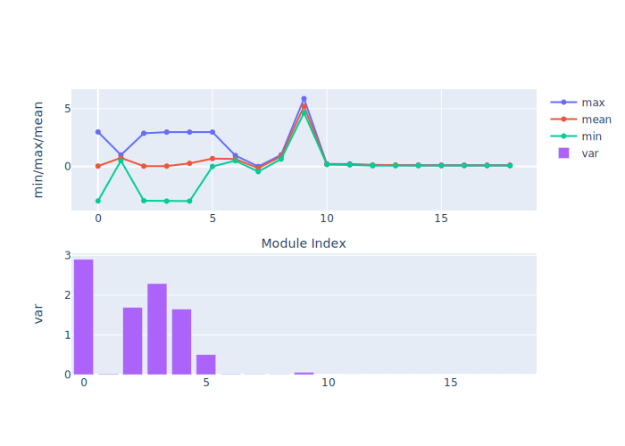

# 开发指南

## 浮点模型的要求

### symbolic_trace

和 PyTorch 的量化训练类似，horizon_plugin_pytorch 基于 fx 设计和开发，因此，要求浮点模型必须是可以正确的完成 symbolic_trace 的

### 仅支持部分算子

由于 BPU 只支持数量有限的算子，因此，horizon_plugin_pytorch 只支持算子列表中的算子和基于 BPU 限制而内部特殊定义的特殊算子。


## Calibration 指南{#Calibration}

在量化中，一个重要的步骤是确定量化参数，合理的初始量化参数能够显著提升模型精度并加快模型的收敛速度。Calibration 就是在浮点模型中插入 Observer，使用少量训练数据，在模型 forward 过程中统计各处的数据分布，以确定合理的量化参数的过程。虽然不做 Calibration 也可以进行量化训练，但一般来说，它对量化训练有益无害，所以推荐用户将此步骤作为必选项。

### 流程和示例

Calibration 与 QAT 的整体流程如下图所示：


下面分别介绍各个步骤：

1. 构建并训练浮点模型。参考 horizon_plugin_pytorch 快速入门章节中的 [**获取浮点模型**](./quick_start#Float-Model) 小节内容。

2. 在浮点模型上插入 Observer 节点。参考 horizon_plugin_pytorch 快速入门章节中的 [**Calibration**](./quick_start#Calibration) 小节内容。使用 `prepare_qat_fx` 方法转化浮点模型前，需要为模型设置 `qconfig` 。

    ```python
        model.qconfig = horizon.quantization.get_default_qconfig()
    ```

    `get_default_qconfig` 可以为 `weight` 和 `activation` 设置不同的 `observer` 。目前，calibration 可选 `observer` 有 "min_max"、 "percentile"、 "mse"、 "kl" 和 "mix"。如无特殊需求，`weight_observer` 推荐使用默认的 "min_max"，`activation_observer` 推荐使用 "mse"。特殊用法和调试技巧见下面的常见算法介绍。

    *`fake_quant` 参数对 Calibration 结果无影响，保留默认状态即可。*

    ```python
        def get_default_qconfig(
            activation_fake_quant: Optional[str] = "fake_quant",
            weight_fake_quant: Optional[str] = "fake_quant",
            activation_observer: Optional[str] = "min_max",
            weight_observer: Optional[str] = "min_max",
            activation_qkwargs: Optional[Dict] = None,
            weight_qkwargs: Optional[Dict] = None,
        ):
    ```

3. 设置 `fake quantize` 状态为 `CALIBRATION` 。

    ```python
        horizon.quantization.set_fake_quantize(model, horizon.quantization.FakeQuantState.CALIBRATION)
    ```

    `fake quantize` 一共有三种状态，分别需要在 `QAT` 、 `calibration` 、 `validation` 前将模型的 `fake quantize` 设置为对应的状态。在 calibration 状态下，仅观测各算子输入输出的统计量。在 QAT 状态下，除观测统计量外还会进行伪量化操作。而在 validation 状态下，不会观测统计量，仅进行伪量化操作。

    ```python
        class FakeQuantState(Enum):
            QAT = "qat"
            CALIBRATION = "calibration"
            VALIDATION = "validation"
    ```

4. calibration。把准备好的校准数据喂给模型，模型在 forward 过程中由 observer 观测相关统计量。

5. 设置模型状态为 eval 并设置 `fake quantize` 状态为 `VALIDATION` 。

    ```python
        model.eval()
        horizon.quantization.set_fake_quantize(model, horizon.quantization.FakeQuantState.VALIDATION)
    ```

6. 验证 `calibration` 效果。如果效果满意，则可以直接将模型转为定点或在此基础上进行量化训练，不满意则调整 `calibration qconfig` 中的参数继续 calibration。

### 常用算法介绍

:::info 备注

    有关每个算子的参数说明，请参考文末 API 文档。
:::

| 算法               | 速度排名       | 精度排名     | 易用性排名 |
|--------------------|------------   |------------|------------|
| min_max            | 1             | 5          | 1          |
| percentile         | 2             | 4          | 4          |
| mse                | 4             | 1          | 2          |
| kl                 | 5             | 2          | 3          |
| mix                | 3             | 2          | 1          |

常用的几种校准方法性能如上表所示，数字越小越好，速度表示相同数据校准耗时，精度表示该方法在大多数模型上的校准效果，易用性表示该方法的调参复杂度。

对于同一模型而言，不同方法不同参数的精度/速度会存在较大差别，最新的一些研究工作也表明，没有一种方法可以在所有模型上都取得最好的精度，需要针对地调整其参数。所以推荐用户对这几种校准方法都进行尝试。

1. min_max。此方法仅统计最大值最小值的滑动平均，用于快速确定 Batch size、average_constant 等通用参数，没有太多技巧。

2. percentile。此方法是所有方法中精度上限最高的，但也是调整起来最麻烦的，如果通过其他方法或本方法的默认参数就可以满足精度要求，那么不建议在调参上花太多时间。percentile 可调的参数一共有两个 bins、percentile。bins 越多，max 的候选项间隔越小，可供调整的粒度越细，但也意味着更高的计算耗时。建议先确定 percentile 再调整 bins，两者交替迭代缩小调参范围直至达到满意的效果。绝大部分情况下 bins 取 2048 提供的调整粒度完全足够，不需要单独调整这个参数。以下是一个模型的调参路径：


| 顺序 | percentile | bins | 精度 |
|-----|------------|------|------|
| 1   | 99.99      | 2048 | 53.75 |
| 2   | 99.99      | 4096 | 54.38 |
| 3   | 99.995     | 4096 | 16.25 |
| 4   | 99.985     | 4096 | 32.67 |
| 5   | 99.9875    | 4096 | 57.06 |
| 6   | 99.9875    | 8192 | 62.84 |
| 7   | 99.98875   | 8192 | 57.62 |
| 8   | 99.988125  | 8192 | 63.15 |

    在这个例子中，可以看到仔细调整后，精度提升了大约 10%。
    模型中不同 op 的输入输出之间存在很大差异，一组全局的 percentile 参数可能很难满足所有 op 的需求，对精度要求较高时，可以先通过上面的方法找到较好的全局参数，再通过 debug 工具找到误差较大的几个 op，单独为这几个 op 设置 percentile 参数，设置方式参照 qconfig 设置。下面列举几种常见的容易导致误差较大的数据分布：

    

    超长尾分布，percentile 的取值应当小一些，图中 99.9 是较好的取值。

    

    值域过大，且分布并不集中在一处，这种情况无论是保留尾部还是忽略尾部都会带来较大的精度损失，应该在训练浮点模型时通过调整 weight decay 等参数避免这种情况的出现。

    

    layernorm 的输出分布会呈现出若干集中度非常高的区域，此时 percentile 按照正常方法调整对于量化结果不会有任何影响，需要将 percentile 调整幅度增加。


3. mse。可调整的参数只有 stride，默认 stride 为 1，会逐步尝试最大值的 100 分位并选出量化反量化前后误差最小（L2 距离）的分位对应的值。此方法对大模型耗时较高，在合理范围内调大 stride 可以在保证精度的前提下减少耗时，stride 调整过大会影响精度。注意，调整此方法的参数只能优化耗时，并不能显著提升精度。

4. kl。可调的参数一共有两个 bin 和 update_interval。由于此方法耗时过长，不建议调整默认 bin，update_interval 默认为 1，调大可以减少耗时，但需要保证 update_interval 小于总的 calibration step，否则无法得到正常的量化参数。

5. mix。此方法为混合校准，对于每一个需要统计的地方，都会尝试 percentile 方法的不同参数，选出量化反量化前后误差最小（L2 距离）的方法。自动化程度较高，没有需要调整的参数。

### 调参技巧

1. calibration 数据越多越好，但因为边际效应的存在，当数据量大到一定程度后，对精度的提升将非常有限。如果训练集较小，可以全部用来 calibration，如果训练集较大，可以结合 calibration 耗时挑选大小合适的子集，建议至少进行 10 - 100 个 step 的校准。

2. 数据可以做水平翻转这类 augmentation，不要做马赛克这种 augmentation。尽量使用 infer 阶段的前处理 + 训练数据进行校准。

3. Batch size 尽可能大，如果数据噪声较大或模型离群点较多，可以适当减小。此参数应当在尝试 min max 方法时确定。

4. average_constant 表示每个 step 对最大值最小值的影响，average_constant 越小，当前 step 的影响越小，历史滑动均值的影响越大。该参数需要结合数据量在 0.01 ~ 0.5 之间调整。当数据量充足时（step > 100），average_constant 取 0.01，数据量不足时，average_constant 酌情增加，极端情况下，只有 2 个 step 的数据，average_constant 取 0.5。此参数应当在尝试 min max 方法时确定，之后其他方法都沿用此参数。

5. calibration 模型精度较好时，固定 feature map 的量化参数进行 QAT 训练可以取得更好的效果，精度较差时，则不能固定 calibration 得到的量化参数。关于精度是好还是坏，没有明确的标准，需要去尝试。比如：某模型精度为 100，如果 calibration  精度为 50，那么精度肯定称不上好，但如果 calibration 精度为 95，那么这个精度是否可以达到固定 feature map 量化参数的程度就需要尝试了，通常做法是固定与不固定都做实验进行对比。

6. 优先尝试 min max 方法，该方法是速度最快的，用来跑通 calibration 流程，调整并确定 batch size 和 average_constant 两个参数，接着分别尝试 percentile、kl、mse 和 mix 四种方法并选取效果最好的方法。

### Observer 参数文档

```python

    class horizon_plugin_pytorch.quantization.observer_v2.KLObserver(bins: int = 512, update_interval: int = 1, averaging_constant: float = 0.01, ch_axis: int = - 1, dtype: Union[torch.dtype, horizon_plugin_pytorch.dtype.QuantDType] = 'qint8', qscheme: torch.qscheme = torch.per_tensor_symmetric, quant_min: int = None, quant_max: int = None, is_sync_quantize: bool = False, factory_kwargs: Dict = None)

```

KL observer.
KL observer based on histogram. Histogram is calculated online and won’t be saved.

**参数**

  - **bins** – Number of histograms bins.

  - **update_interval** – Interval of computing KL entropy and update min/max. KLObserver will constantly collect histograms of activations, but only perform KL calculation when update_interval is satisfied. if it is set to 1, KL entropy will be computed every forward step. Larger interval guarantees less time and does no harm to calibration accuracy. Set it to the total calibration steps can achieve best performance. update_interval must be no greater than total calibration steps, otherwise no min/max will be computed.

  - **averaging_constant** – Averaging constant for min/max.

  - **ch_axis** – Channel axis.

  - **dtype** – Quantized data type.

  - **qscheme** – Quantization scheme to be used.

  - **quant_min** – Min quantization value. Will follow dtype if unspecified.

  - **quant_max** – Max quantization value. Will follow dtype if unspecified.

  - **is_sync_quantize** – If sync statistics when training with multiple devices.

  - **factory_kwargs** – kwargs which are passed to factory functions for min_val and max_val.

```python
    forward(x_orig)
```

Defines the computation performed at every call.

Should be overridden by all subclasses.

:::info 小技巧

  Although the recipe for forward pass needs to be defined within this function, one should call the Module instance afterwards instead of this since the former takes care of running the registered hooks while the latter silently ignores them.
:::

```python

    class horizon_plugin_pytorch.quantization.observer_v2.MSEObserver(stride: int = 1, averaging_constant: float = 0.01, ch_axis: int = - 1, dtype: Union[torch.dtype, horizon_plugin_pytorch.dtype.QuantDType] = 'qint8', qscheme: torch.qscheme = torch.per_tensor_symmetric, quant_min: int = None, quant_max: int = None, is_sync_quantize: bool = False, factory_kwargs: Dict = None)

```

MSE observer.

Observer module for computing the quantization parameters based on the Mean Square Error (MSE) between the original tensor and the quantized one.

This observer linear searches the quantization scales that minimize MSE.

**参数**

  - **stride** – Searching stride. Larger value gives smaller search space, which means less computing time but possibly poorer accuracy. Default is 1. Suggests no greater than 20.

  - **averaging_constant** – Averaging constant for min/max.

  - **ch_axis** – Channel axis.

  - **dtype** – Quantized data type.

  - **qscheme** – Quantization scheme to be used.

  - **quant_min** – Min quantization value. Will follow dtype if unspecified.

  - **quant_max** – Max quantization value. Will follow dtype if unspecified.

  - **is_sync_quantize** – If sync statistics when training with multiple devices.

  - **factory_kwargs** – kwargs which are passed to factory functions for min_val and max_val.

```python
    forward(x_orig)
```

Defines the computation performed at every call.

Should be overridden by all subclasses.

:::info 小技巧

  Although the recipe for forward pass needs to be defined within this function, one should call the Module instance afterwards instead of this since the former takes care of running the registered hooks while the latter silently ignores them.
:::

```python

    class horizon_plugin_pytorch.quantization.observer_v2.MinMaxObserver(averaging_constant: float = 0.01, ch_axis: int = - 1, dtype: Union[torch.dtype, horizon_plugin_pytorch.dtype.QuantDType] = 'qint8', qscheme: torch.qscheme = torch.per_tensor_symmetric, quant_min: int = None, quant_max: int = None, is_sync_quantize: bool = False, factory_kwargs: Dict = None)
```
Min max observer.

This observer computes the quantization parameters based on minimums and maximums of the incoming tensors. The module records the moving average minimum and maximum of incoming tensors, and uses this statistic to compute the quantization parameters.

**参数**

  - **averaging_constant** – Averaging constant for min/max.

  - **ch_axis** – Channel axis.

  - **dtype** – Quantized data type.

  - **qscheme** – Quantization scheme to be used.

  - **quant_min** – Min quantization value. Will follow dtype if unspecified.

  - **quant_max** – Max quantization value. Will follow dtype if unspecified.

  - **is_sync_quantize** – If sync statistics when training with multiple devices.

  - **factory_kwargs** – kwargs which are passed to factory functions for min_val and max_val.

```python
    forward(x_orig)
```

Record the running minimum and maximum of x.


```python

    class horizon_plugin_pytorch.quantization.observer_v2.MixObserver(averaging_constant: float = 0.01, ch_axis: int = - 1, dtype: Union[torch.dtype, horizon_plugin_pytorch.dtype.QuantDType] = 'qint8', qscheme: torch.qscheme = torch.per_tensor_symmetric, quant_min: int = None, quant_max: int = None, is_sync_quantize: bool = False, factory_kwargs: Dict = None)

```

Mix observer.

This observer computes the quantization parameters based on multiple calibration methods and selects the quantization parameters with the smallest quantization error.

**参数**

  - **averaging_constant** – Averaging constant for min/max.

  - **ch_axis** – Channel axis.

  - **dtype** – Quantized data type.

  - **qscheme** – Quantization scheme to be used.

  - **quant_min** – Min quantization value. Will follow dtype if unspecified.

  - **quant_max** – Max quantization value. Will follow dtype if unspecified.

  - **is_sync_quantize** – If sync statistics when training with multiple devices.

  - **factory_kwargs** – kwargs which are passed to factory functions for min_val and max_val.

```python
    forward(x_orig)
```

Defines the computation performed at every call.

Should be overridden by all subclasses.

:::info 小技巧

  Although the recipe for forward pass needs to be defined within this function, one should call the Module instance afterwards instead of this since the former takes care of running the registered hooks while the latter silently ignores them.
:::

```python

    class horizon_plugin_pytorch.quantization.observer_v2.PercentileObserver(percentile: float = 99.99, bins: int = 2048, averaging_constant: float = 0.01, ch_axis: int = - 1, dtype: Union[torch.dtype, horizon_plugin_pytorch.dtype.QuantDType] = 'qint8', qscheme: torch.qscheme = torch.per_tensor_symmetric, quant_min: int = None, quant_max: int = None, is_sync_quantize: bool = False, factory_kwargs: Dict = None)
```

Percentile observer.

Percentile observer based on histogram. Histogram is calculated online and won’t be saved. The minimum and maximum are moving averaged to compute the quantization parameters.

**参数**

  - **percentile** – Index percentile of histrogram

  - **bins** – Number of histograms bins.

  - **averaging_constant** – Averaging constant for min/max.

  - **ch_axis** – Channel axis.

  - **dtype** – Quantized data type.

  - **qscheme** – Quantization scheme to be used.

  - **quant_min** – Min quantization value. Will follow dtype if unspecified.

  - **quant_max** – Max quantization value. Will follow dtype if unspecified.

  - **is_sync_quantize** – If sync statistics when training with multiple devices.

  - **factory_kwargs** – kwargs which are passed to factory functions for min_val and max_val.

```python
    forward(x_orig)
```

Defines the computation performed at every call.

Should be overridden by all subclasses.

:::info 小技巧

  Although the recipe for forward pass needs to be defined within this function, one should call the Module instance afterwards instead of this since the former takes care of running the registered hooks while the latter silently ignores them.
:::

```python

    class horizon_plugin_pytorch.quantization.MovingAverageMinMaxObserver(averaging_constant=0.01, dtype=torch.qint8, qscheme=torch.per_tensor_symmetric, quant_min=None, quant_max=None, is_sync_quantize=False, factory_kwargs=None)
```

MovingAverageMinMax Observer.

Observer module for computing the quantization parameters based on the moving average of the min and max values.

This observer computes the quantization parameters based on the moving averages of minimums and maximums of the incoming tensors. The module records the average minimum and maximum of incoming tensors, and uses this statistic to compute the quantization parameters.

**参数**

  - **averaging_constant** – Averaging constant for min/max.

  - **dtype** – Quantized data type

  - **qscheme** – Quantization scheme to be used, only support per_tensor_symmetric scheme

  - **reduce_range** – Reduces the range of the quantized data type by 1 bit

  - **quant_min** – Minimum quantization value.

  - **quant_max** – Maximum quantization value.

  - **is_sync_quantize** – Whether use sync quantize

  - **factory_kwargs** – Arguments for register data buffer


```python
    forward(x_orig)
```

Record the running minimum and maximum of x.


```python

    class horizon_plugin_pytorch.quantization.MovingAveragePerChannelMinMaxObserver(averaging_constant=0.01, ch_axis=0, dtype=torch.qint8, qscheme=torch.per_channel_symmetric, quant_min=None, quant_max=None, is_sync_quantize=False, factory_kwargs=None)
```

MovingAveragePerChannelMinMax Observer.

Observer module for computing the quantization parameters based on the running per channel min and max values.

This observer uses the tensor min/max statistics to compute the per channel quantization parameters. The module records the running minimum and maximum of incoming tensors, and uses this statistic to compute the quantization parameters.

**参数**

  - **averaging_constant** – Averaging constant for min/max.

  - **ch_axis** – Channel axis

  - **dtype** – Quantized data type

  - **qscheme** – Quantization scheme to be used, Only support per_channel_symmetric

  - **quant_min** – Minimum quantization value.

  - **quant_max** – Maximum quantization value.

  - **is_sync_quantize** – whether use sync quantize

  - **factory_kwargs** – Arguments for register data buffer

```python
    forward(x_orig)
```

Defines the computation performed at every call.

Should be overridden by all subclasses.

:::info 小技巧

  Although the recipe for forward pass needs to be defined within this function, one should call the Module instance afterwards instead of this since the former takes care of running the registered hooks while the latter silently ignores them.
:::


## 量化训练指南{#quantization}

量化训练通过在模型中插入一些伪量化节点，从而使得通过量化训练得到的模型转换成定点模型时尽可能减少精度损失。
量化训练和传统的模型训练无异，开发者可以从零开始，搭建一个伪量化模型，然后对该伪量化模型进行训练。
由于部署的硬件平台有诸多限制，对于开发者来说，搞清这些限制，并且根据这些限制搭建伪量化模型门槛较高。量化训练工具通过在开发者提供的浮点模型上根据部署平台的限制自动插入伪量化量化算子的方法，降低开发者开发量化模型的门槛。

量化训练由于施加了各种限制，因此，一般来说，量化训练比纯浮点模型的训练更加困难。量化训练工具的目标是降低量化训练的难度，降低量化模型部署的工程难度。

### 流程和示例

虽然量化训练工具不强制要求用户从一个预训练的浮点模型开始，但是，经验表明，通常从预训练的高精度浮点模型开始量化训练能大大降低量化训练的难度。

```python
from horizon_plugin_pytorch.quantization import get_default_qconfig
# 将模型转为 QAT 状态
default_qat_8bit_fake_quant_qconfig = get_default_qconfig(
    activation_fake_quant="fake_quant",
    weight_fake_quant="fake_quant",
    activation_observer="min_max",
    weight_observer="min_max",
    activation_qkwargs=None,
    weight_qkwargs={
        "qscheme": torch.per_channel_symmetric,
        "ch_axis": 0,
    },
)
default_qat_out_8bit_fake_quant_qconfig = get_default_qconfig(
    activation_fake_quant=None,
    weight_fake_quant="fake_quant",
    activation_observer=None,
    weight_observer="min_max",
    activation_qkwargs=None,
    weight_qkwargs={
        "qscheme": torch.per_channel_symmetric,
        "ch_axis": 0,
    },
)
qat_model = prepare_qat_fx(
    float_model,
    {
        "": default_qat_8bit_fake_quant_qconfig,
        "module_name": {
            "classifier": default_qat_out_8bit_fake_quant_qconfig,
        },
    },
).to(device)
# 加载 Calibration 模型中的量化参数
qat_model.load_state_dict(calib_model.state_dict())
# 进行量化感知训练
# 作为一个 filetune 过程，量化感知训练一般需要设定较小的学习率
optimizer = torch.optim.SGD(
    qat_model.parameters(), lr=0.0001, weight_decay=2e-4
)

for nepoch in range(epoch_num):
    # 注意此处对 QAT 模型 training 状态的控制方法
    qat_model.train()
    set_fake_quantize(qat_model, FakeQuantState.QAT)

    train_one_epoch(
        qat_model,
        nn.CrossEntropyLoss(),
        optimizer,
        None,
        train_data_loader,
        device,
    )

    # 注意此处对 QAT 模型 eval 状态的控制方法
    qat_model.eval()
    set_fake_quantize(qat_model, FakeQuantState.VALIDATION)

    # 测试 qat 模型精度
    top1, top5 = evaluate(
        qat_model,
        eval_data_loader,
        device,
    )
    print(
        "QAT model: evaluation Acc@1 {:.3f} Acc@5 {:.3f}".format(
            top1.avg, top5.avg
        )
    )

# 测试 quantized 模型精度
quantized_model = convert_fx(qat_model.eval()).to(device)

top1, top5 = evaluate(
    quantized_model,
    eval_data_loader,
    device,
)
print(
    "Quantized model: evaluation Acc@1 {:.3f} Acc@5 {:.3f}".format(
        top1.avg, top5.avg
    )
)
```

:::caution 注意

由于部署平台的底层限制，QAT 模型无法完全代表最终上板精度，请务必监控 quantized 模型精度，确保 quantized 模型精度正常，否则可能出现模型上板掉点问题。

:::

由上述示例代码可以看到，与传统的纯浮点模型训练相比，量化训练多了两个步骤：

1. prepare_qat_fx
2. 加载 Calibration 模型参数

#### prepare_qat_fx

这一步骤的目标是对浮点网络进行变换，插入伪量化节点。

#### 加载 Calibration 模型参数

通过加载 Calibration 得到的伪量化参数，来获得一个较好的初始化。

#### 训练迭代

至此，完成了伪量化模型的搭建和参数的初始化，然后就可以进行常规的训练迭代和模型参数更新，并且监控 quantized 模型精度。

### 伪量化算子

量化训练和传统的浮点模型的训练主要区别在于插入了伪量化算子，并且，不同量化训练算法也是通过伪量化算子来体现的，因此，这里介绍一下伪量化算子。

:::info 备注

由于 BPU 只支持对称量化，因此，这里以对称量化为例介绍。
:::

#### 伪量化过程

以 int8 量化训练为例，一般来说，伪量化算子的计算过程如下：

`fake_quant_x = clip(round(x / scale)，-128, 127) * scale`

和 Conv2d 通过训练来优化 weight, bias 参数类似，伪量化算子要通过训练来优化 scale 参数。
然而，由于 round 作为阶梯函数，其梯度为 0，从而导致了伪量化算子无法直接通过梯度反向传播的方式进行训练。解决这一问题，通常有两种方案：基于统计的方法和基于“学习”的方法。

#### 基于统计的方法

量化地目标是把 Tensor 中的浮点数通过 scale 参数均匀地映射到 int8 表示的 [-128, 127] 的范围上。既然是均匀映射，那么很容易得到 scale 的计算方法：

```python
def compute_scale(x: Tensor):
    xmin, xmax = x.max(), maxv = x.min()
    return max(xmin.abs(), xmax.abs()) / 256.0
```

由于 Tensor 中数据分布不均匀以及外点问题，又衍生了不同的计算 xmin 和 xmax 的方法。可以参考 `MovingAverageMinMaxObserver` 等。

在工具中的使用方法请参考 `default_qat_8bit_fake_quant_qconfig` 及其相关接口。

#### 基于学习的方法

虽然 round 的梯度为 0，研究者通过实验发现，在该场景下，如果直接设置其梯度为 1 也可以使得模型收敛到预期的精度。

```python
def round_ste(x: Tensor):
    return (x.round() - x).detach() + x
```

在工具中的使用方法请参考 `default_qat_8bit_lsq_quant_qconfig` 及其相关接口。

有兴趣进一步了解的用户可以参考如下论文：[**Learned Step Size Quantization**](<https://arxiv.org/abs/1902.08153>)

## 异构模型指南

### 异构模型介绍

异构模型是部署时一部分运行在 BPU 上，一部分运行在 CPU 上的模型，而非异构模型部署时则完全运行在 BPU 上。通常情况下，以下两类模型在部署时会成为异构模型：

1. 包含 BPU 不支持算子的模型。

2. 由于量化精度误差过大，用户指定某些算子运行在 CPU 上的模型。

### 使用流程


通过 prepare 将浮点模型转为 QAT 模型，训练之后导出为 onnx 格式模型，由 hb_mapper 工具转为 bin 模型。

:::info 备注

用户可以通过 convert 过程得到异构定点模型，用于模型精度评测。
:::

### 算子限制

由于异构模型对接的是 horizon_nn，因此，其算子的支持情况和 horizon_nn 相同。

### 主要接口参数说明

`horizon_plugin_pytorch.quantization.prepare_qat_fx`

1. 设置 `hybrid=True` 来开启异构模型功能。
2. 用户可以通过设置 `hybrid_dict` 参数来强制指定某些 BPU 支持的算子跑在 CPU 上。

```python
def prepare_qat_fx(
    model: Union[torch.nn.Module, GraphModule],
    qconfig_dict: Dict[str, Any] = None,
    prepare_custom_config_dict: Dict[str, Any] = None,
    optimize_graph: bool = False,
    hybrid: bool = False,
    hybrid_dict: Dict[str, List] = None,
) -> ObservedGraphModule:
    """Prepare QAT 模型
        `model`: torch.nn.Module 或 GraphModule(使用 fuse_fx 后的模型)
        `qconfig_dict`: 定义 Qconfig。如果除了 qconfig_dict 以外，还使用了 eager mode 在 module 内定义 qconfig 的方式，则 module 内定义的 qconfig 优先生效。qconfig_dict 的配置格式如下：
            qconfig_dict = {
                # 可选，全局配置
                "": qconfig,
                # 可选，按 module 类型配置
                "module_type": [(torch.nn.Conv2d, qconfig), ...],
                # 可选，按 module 名配置
                "module_name": [("foo.bar", qconfig),...],
                # 优先级：global < module_type < module_name < module.qconfig
                # 非 module 类型的算子的 qconfig 默认与其父 module 的 qconfig 保持一致，如果需要单独设置，请将这部分单独封装成 module。
            }
        `prepare_custom_config_dict`: 自定义配置字典
            prepare_custom_config_dict = {
                # 暂时只支持 preserved_attributes。一般而言会自动保留所有属性，这个选项只是以防万一，几乎不会用到。
                "preserved_attributes": ["preserved_attr"],
            }
        `optimize_graph`: 保持 cat 输入输出 scale 一致，目前只有在 Bernoulli 架构下有效。
        `hybrid`: 是否使用异构模式。在以下情况下必须打开异构模式：
            1. 模型包含 BPU 不支持的算子或用户希望指定部分 BPU 算子退回 CPU。
            2. 用户希望 QAT 模型与 horizon_nn 对接进行定点化。
        `hybrid_dict`: 定义用户主动指定的 CPU 算子。
            hybrid_dict = {
                # 可选，按 module 类型配置
                "module_type": [torch.nn.Conv2d, ...],
                # 可选，按 module 名配置
                "module_name": ["foo.bar", ...],
                # 优先级：module_type < module_name
                # 与 qconfig_dict 类似，如果想要非 module 类型的算子运行在 CPU 上，需要将这部分单独封装成 module。
            }
    """
```

`horizon_plugin_pytorch.utils.onnx_helper.export_to_onnx`

导出 `onnx` 模型，从而对接 `hb_mapper` 。

:::info 备注

该接口也支持非异构模型，其导出的 ONNX 格式模型仅用于可视化。
:::

```python
def export_to_onnx(
    model,
    args,
    f,
    export_params=True,
    verbose=False,
    training=TrainingMode.EVAL,
    input_names=None,
    output_names=None,
    operator_export_type=OperatorExportTypes.ONNX_FALLTHROUGH,
    opset_version=11,
    do_constant_folding=True,
    example_outputs=None,
    strip_doc_string=True,
    dynamic_axes=None,
    keep_initializers_as_inputs=None,
    custom_opsets=None,
    enable_onnx_checker=False,
):
    """此接口与 torch.onnx.export 基本一致，隐藏了无需修改的参数，需要的注意参数有：
        `model`: 需要 export 的模型
        `args`: 模型输入，用于 trace 模型
        `f`: 保存的 onnx 文件名或文件描述符
        `operator_export_type`: 算子导出类型
            1. 对于非异构模型，onnx 仅用于可视化，不需要保证实际可用，使用默认值 OperatorExportTypes.ONNX_FALLTHROUGH
            2. 对于异构模型，onnx 需要保证实际可用，使用 None 确保导出的为标准 onnx 算子。
        `opset_version`: 只能为 11，horizon_plugin_pytorch 在 opset 11 中注册了特定的映射规则。
        注意：如果使用公版 torch.onnx.export，需要确保上述参数设置正确，
        并且 import horizon_plugin_pytorch.utils._register_onnx_ops
        以向 opset 11 中注册特定的映射规则。
    """
```

`horizon_plugin_pytorch.quantization.convert_fx`

异构模式可以复用 `convert_fx` 把伪量化模型转换成异构量化模型，用于评测模型精度。

:::caution 注意

通过 convert_fx 得到的异构量化模型无法进行部署。目前仅用于评测模型精度。
:::

```python
def convert_fx(
    graph_module: GraphModule,
    convert_custom_config_dict: Dict[str, Any] = None,
    _remove_qconfig: bool = True,
) -> QuantizedGraphModule:
    """转换 QAT 模型，仅用于评测定点模型。
        `graph_module`: 经过 prepare->(calibration)->train 之后的模型
        `convert_custom_config_dict`: 自定义配置字典
            convert_custom_config_dict = {
                # 暂时只支持 preserved_attributes。一般而言会自动保留所有属性，这个选项只是以防万一，几乎不会用到。
                "preserved_attributes": ["preserved_attr"],
            }
        `_remove_qconfig`: convert 之后是否删除 qconfig，一般不会用到
    """
```

### 流程和示例

1. 改造浮点模型。

   - 插入 `QuantStub` 与 `DeQuantStub` ，保持与非异构的用法一致。

     - 如果第一个 op 是 `cpu op` ，那么不需要插入 `QuantStub` 。

     - 如果最后一个 op 是 `cpu op` ，那么可以不用插入 `DeQuantStub` 。

   - 对于非 `module` 的运算，如果需要单独设置 `qconfig` 或指定其运行在 CPU 上，需要将其封装成 `module` ，参考示例中的 `_SeluModule` 。

2. 设置 `march` 。 **RDK X3** 设置bernoulli2， **RDK Ultra** 设置为bayes。

3. 设置 `qconfig` 。保留非异构模式下在 `module` 内设置 `qconfig` 的配置方式，除此以外，还可以通过 `prepare_qat_fx` 接口的 `qconfig_dict` 参数传入 `qconfig`，具体用法见接口参数说明。

   - 对于 `BPU op` ，必须保证有 `qconfig` ，如果其输入 op 不为 `QuantStub` ，那么还需要保证该输入 op 有 `activation qconfig` 。

   - 对于 `CPU op` ，`qconfig` 不会对其产生任何影响，但如果后面接 `BPU op` ，则必须有 `qconfig` 。

   - 推荐设置方式：先设置全局 `qconfig` 为 `horizon.quantization.default_qat_8bit_fake_quant_qconfig` (或者 `horizon.quantization.default_calib_8bit_fake_quant_qconfig` ，根据 calibration 或 qat 阶段选择) ，在此基础上根据需求修改，一般而言，只需要对 int16 和高精度输出的 op 单独设置 `qconfig` 。

:::caution 注意

目前只有BPU架构为 ``BAYES`` 的 **RDK Ultra** 支持设置 ``int16`` 量化。
:::

4. 设置 `hybrid_dict` 。可选，具体用法见接口参数说明，如果没有主动指定的 CPU 算子，可以不设置 `hybrid_dict` 。

5. 调用 `prepare_qat_fx` 并进行 `calibration` 。参考 horizon_plugin_pytorch 开发指南章节中的 [**Calibration**](#Calibration) 小节内容。

6. 调用 `prepare_qat_fx` ，加载 `calibration` 模型并进行 QAT 训练。参考 horizon_plugin_pytorch 开发指南章节中的 [**量化训练**](#quantization) 小节内容。

7. 调用 `convert_fx` 。可选，没有评测定点模型精度的需求时可以跳过。

8. 调用 `export_to_onnx` 。也可以使用 `torch.onnx.export` 但需要遵守 `export_to_onnx` 接口说明中的注意事项。

9. 使用 `hb_mapper` 转换 onnx 模型。转换后需检查算子是否运行在预期的设备上，在部分情况下， `hb_mapper` 仍然需要设置 `run_on_cpu` 参数。比如：虽然 `conv` 在 QAT 阶段没有量化，但由于其输入（上一个算子输出）经过了伪量化， `hb_mapper` 仍然会默认将其量化。


```python
import copy
import numpy as np
import torch
from horizon_plugin_pytorch.march import March, set_march
from horizon_plugin_pytorch.nn import qat
from horizon_plugin_pytorch.quantization import (
    prepare_qat_fx,
    convert_fx,
    set_fake_quantize,
    FakeQuantState,
    load_observer_params,
)
from horizon_plugin_pytorch.quantization.qconfig import (
    default_calib_8bit_fake_quant_qconfig,
    default_calib_out_8bit_fake_quant_qconfig,
    default_qat_8bit_fake_quant_qconfig,
    default_qat_out_8bit_fake_quant_qconfig,
)
from torch import nn
from torch.quantization import DeQuantStub, QuantStub
from horizon_plugin_pytorch.utils.onnx_helper import export_to_onnx

class _ConvBlock(nn.Module):
    def __init__(self, channels=3):
        super().__init__()
        self.conv = nn.Conv2d(channels, channels, 1)
        self.prelu = torch.nn.PReLU()

    def forward(self, input):
        x = self.conv(input)
        x = self.prelu(x)
        return torch.nn.functional.selu(x)

# 封装 functional selu 为 module，便于单独设置
class _SeluModule(nn.Module):
    def forward(self, input):
        return torch.nn.functional.selu(input)

class HybridModel(nn.Module):
    def __init__(self, channels=3):
        super().__init__()
        # 插入 QuantStub
        self.quant = QuantStub()
        self.conv0 = nn.Conv2d(channels, channels, 1)
        self.prelu = torch.nn.PReLU()
        self.conv1 = _ConvBlock(channels)
        self.conv2 = nn.Conv2d(channels, channels, 1)
        self.conv3 = nn.Conv2d(channels, channels, 1)
        self.conv4 = nn.Conv2d(channels, channels, 1)
        self.selu = _SeluModule()
        # 插入 DequantStub
        self.dequant = DeQuantStub()
        self.identity = torch.nn.Identity()

    def forward(self, input):
        x = self.quant(input)
        x = self.conv0(x)
        x = self.identity(x)
        x = self.prelu(x)
        x = torch.nn.functional.selu(x)
        x = self.conv1(x)
        x = self.conv2(x)
        x = self.conv3(x)
        x = self.identity(x)
        x = self.conv4(x)
        x = self.selu(x)
        return self.dequant(x)

# 设置 march **RDK X3** 设置BERNOULLI2， **RDK Ultra** 设置为BAYES。
set_march(March.BAYES)
data_shape = [1, 3, 224, 224]
data = torch.rand(size=data_shape)
model = HybridModel()
qat_model = copy.deepcopy(model)
# float 模型的推理不要放在 prepare_qat_fx 之后，prepare_qat_fx 会对 float 模型做 inplace 修改
float_res = model(data)

calibration_model = prepare_qat_fx(
    model,
    {
        "": default_calib_8bit_fake_quant_qconfig,
        # selu 为 cpu 算子，conv4 实际上是 bpu 模型的输出，设置为高精度输出
        "module_name": [("conv4", default_calib_out_8bit_fake_quant_qconfig)]
    },
    hybrid=True,
    hybrid_dict={
        "module_name": ["conv1.conv", "conv3"],
        "module_type": [_SeluModule],
    },
)
# calibration 阶段需确保原有模型不会发生变化
calibration_model.eval()
set_fake_quantize(calibration_model, FakeQuantState.CALIBRATION)

for i in range(5):
    calibration_model(torch.rand(size=data_shape))

qat_model = prepare_qat_fx(
    qat_model,
    {
        "": default_qat_8bit_fake_quant_qconfig,
        # selu 为 cpu 算子，conv4 实际上是 bpu 模型的输出，设置为高精度输出
        "module_name": [("conv4", default_qat_out_8bit_fake_quant_qconfig)]
    },
    hybrid=True,
    hybrid_dict={
        "module_name": ["conv1.conv", "conv3"],
        "module_type": [_SeluModule],
    },
)

load_observer_params(calibration_model, qat_model)
set_fake_quantize(calibration_model, FakeQuantState.QAT)

# qat training start
# ......
# qat training end

# 导出 qat.onnx
export_to_onnx(
    qat_model,
    data,
    "qat.onnx",
    operator_export_type=None,
)

# 评测定点模型
quantize_model = convert_fx(qat_model)
quantize_res = quantize_model(data)
```

打印 QAT 模型的结果。

```python
HybridModel(
  (quant): QuantStub(
    (activation_post_process): FakeQuantize(
      fake_quant_enabled=tensor([1], dtype=torch.uint8), observer_enabled=tensor([1], dtype=torch.uint8),            quant_min=-128, quant_max=127, dtype=qint8, qscheme=torch.per_tensor_symmetric, ch_axis=-1,         scale=tensor([0.0078]), zero_point=tensor([0])
      (activation_post_process): MovingAverageMinMaxObserver(min_val=tensor([-0.9995]), max_val=tensor([0.9995]))
    )
  )
  (conv0): Conv2d(
    3, 3, kernel_size=(1, 1), stride=(1, 1)
    (weight_fake_quant): FakeQuantize(
      fake_quant_enabled=tensor([1], dtype=torch.uint8), observer_enabled=tensor([1], dtype=torch.uint8),            quant_min=-128, quant_max=127, dtype=qint8, qscheme=torch.per_channel_symmetric, ch_axis=0,         scale=tensor([0.0038, 0.0041, 0.0016]), zero_point=tensor([0, 0, 0])
      (activation_post_process): MovingAveragePerChannelMinMaxObserver(min_val=tensor([-0.4881, -0.4944,  0.0787]), max_val=tensor([-0.1213,  0.5284,  0.1981]))
    )
    (activation_post_process): FakeQuantize(
      fake_quant_enabled=tensor([1], dtype=torch.uint8), observer_enabled=tensor([1], dtype=torch.uint8),            quant_min=-128, quant_max=127, dtype=qint8, qscheme=torch.per_tensor_symmetric, ch_axis=-1,         scale=tensor([0.0064]), zero_point=tensor([0])
      (activation_post_process): MovingAverageMinMaxObserver(min_val=tensor([-0.8159]), max_val=tensor([0.8159]))
    )
  )
  (prelu): PReLU(num_parameters=1)
  (conv1): _ConvBlock(
    (conv): Conv2d(3, 3, kernel_size=(1, 1), stride=(1, 1))
    (prelu): PReLU(num_parameters=1)
  )
  (conv2): Conv2d(
    3, 3, kernel_size=(1, 1), stride=(1, 1)
    (weight_fake_quant): FakeQuantize(
      fake_quant_enabled=tensor([1], dtype=torch.uint8), observer_enabled=tensor([1], dtype=torch.uint8),            quant_min=-128, quant_max=127, dtype=qint8, qscheme=torch.per_channel_symmetric, ch_axis=0,         scale=tensor([0.0040, 0.0044, 0.0040]), zero_point=tensor([0, 0, 0])
      (activation_post_process): MovingAveragePerChannelMinMaxObserver(min_val=tensor([-0.5044, -0.4553, -0.5157]), max_val=tensor([0.1172, 0.5595, 0.4104]))
    )
    (activation_post_process): FakeQuantize(
      fake_quant_enabled=tensor([1], dtype=torch.uint8), observer_enabled=tensor([1], dtype=torch.uint8),            quant_min=-128, quant_max=127, dtype=qint8, qscheme=torch.per_tensor_symmetric, ch_axis=-1,         scale=tensor([0.0059]), zero_point=tensor([0])
      (activation_post_process): MovingAverageMinMaxObserver(min_val=tensor([-0.7511]), max_val=tensor([0.7511]))
    )
  )
  (conv3): Conv2d(3, 3, kernel_size=(1, 1), stride=(1, 1))
  (conv4): Conv2d(
    3, 3, kernel_size=(1, 1), stride=(1, 1)
    (weight_fake_quant): FakeQuantize(
      fake_quant_enabled=tensor([1], dtype=torch.uint8), observer_enabled=tensor([1], dtype=torch.uint8),            quant_min=-128, quant_max=127, dtype=qint8, qscheme=torch.per_channel_symmetric, ch_axis=0,         scale=tensor([0.0025, 0.0037, 0.0029]), zero_point=tensor([0, 0, 0])
      (activation_post_process): MovingAveragePerChannelMinMaxObserver(min_val=tensor([-0.2484, -0.4718, -0.3689]), max_val=tensor([ 0.3239, -0.0056,  0.3312]))
    )
    (activation_post_process): None
  )
  (selu): _SeluModule()
  (dequant): DeQuantStub()
  (identity): Identity()
  (prelu_input_dequant): DeQuantStub()
  (selu_1_activation_post_process): _WrappedCalibFakeQuantize(
    (activation_post_process): FakeQuantize(
      fake_quant_enabled=tensor([1], dtype=torch.uint8), observer_enabled=tensor([1], dtype=torch.uint8),            quant_min=-128, quant_max=127, dtype=qint8, qscheme=torch.per_tensor_symmetric, ch_axis=-1,         scale=tensor([0.0042]), zero_point=tensor([0])
      (activation_post_process): MovingAverageMinMaxObserver(min_val=tensor([-0.5301]), max_val=tensor([0.5301]))
    )
  )
  (conv3_activation_post_process): _WrappedCalibFakeQuantize(
    (activation_post_process): FakeQuantize(
      fake_quant_enabled=tensor([1], dtype=torch.uint8), observer_enabled=tensor([1], dtype=torch.uint8),            quant_min=-128, quant_max=127, dtype=qint8, qscheme=torch.per_tensor_symmetric, ch_axis=-1,         scale=tensor([0.0072]), zero_point=tensor([0])
      (activation_post_process): MovingAverageMinMaxObserver(min_val=tensor([-0.9156]), max_val=tensor([0.9156]))
    )
  )
  (conv3_input_dequant): DeQuantStub()
  (selu_2_input_dequant): DeQuantStub()
)

def forward(self, input):
    input_1 = input
    quant = self.quant(input_1);  input_1 = None
    conv0 = self.conv0(quant);  quant = None
    identity = self.identity(conv0);  conv0 = None
    prelu_input_dequant_0 = self.prelu_input_dequant(identity);  identity = None
    prelu = self.prelu(prelu_input_dequant_0);  prelu_input_dequant_0 = None
    selu = torch.nn.functional.selu(prelu, inplace = False);  prelu = None
    conv1_conv = self.conv1.conv(selu);  selu = None
    conv1_prelu = self.conv1.prelu(conv1_conv);  conv1_conv = None
    selu_1 = torch.nn.functional.selu(conv1_prelu, inplace = False);  conv1_prelu = None
    selu_1_activation_post_process = self.selu_1_activation_post_process(selu_1);  selu_1 = None
    conv2 = self.conv2(selu_1_activation_post_process);  selu_1_activation_post_process = None
    conv3_input_dequant_0 = self.conv3_input_dequant(conv2);  conv2 = None
    conv3 = self.conv3(conv3_input_dequant_0);  conv3_input_dequant_0 = None
    conv3_activation_post_process = self.conv3_activation_post_process(conv3);  conv3 = None
    identity_1 = self.identity(conv3_activation_post_process);  conv3_activation_post_process = None
    conv4 = self.conv4(identity_1);  identity_1 = None
    selu_2_input_dequant_0 = self.selu_2_input_dequant(conv4);  conv4 = None
    selu_2 = torch.nn.functional.selu(selu_2_input_dequant_0, inplace = False);  selu_2_input_dequant_0 = None
    dequant = self.dequant(selu_2);  selu_2 = None
    return dequant
```

导出的 onnx 如图所示，红色圈出部分为 CPU 算子。


## 分析工具使用指南

当 QAT 或者定点模型出现精度问题时，您可以使用我们提供的各种工具来分析模型，定位精度掉点问题。


### 总览

各种工具的使用接口和使用场景总结如下表。除了模型可视化工具，其它工具均在 `horizon_plugin_pytorch.utils.quant_profiler` 包中。

| **工具** | **使用接口/方式** | **使用场景** |
|----------|------------------|-------------|
| [**集成接口**](#a-name-integration-a) | model_profiler | 调用其它 debug 工具并将结果集中显示到一个 html 页面;<br/>目前会调用相似度、统计量、共享 op 检查、fuse 检查、weight 比较和量化配置检查这几个工具 |
| [**fuse 检查**](#fuse-a-name-fuse-check-a) | check_unfused_operations | 检查**浮点模型**中是否有可以 fuse 但是没有 fuse 的 op pattern |
| [**共享 op 检查**](#op-a-name-shared-op-check-a) | get_module_called_count | 检查模型中是否有共享使用的 op |
| [**量化配置检查**](#a-name-qconfig-check-a) | check_qconfig | 检查 QAT 模型中量化配置是否符合预期 |
| [**模型可视化**](#onnx-a-name-onnx-a) | export_to_onnx <br/>export_quantized_onnx | 导出 onnx 模型以查看模型结构，**不支持 onnx run** |
| [**相似度对比**](#a-name-similarity-a) | featuremap_similarity | 当量化模型精度降低时，定位出现问题的 op |
| [**统计量**](#a-name-statistic-a) | get_raw_features /<br/>profile_featuremap | 输出模型中每一层输出的数值特征，用于评估当前的数据分布和量化精度是否适合量化 |
| [**模型 weight 比较**](#weight-a-name-weight-comparison-a) | compare_weights | 比较模型中每一层 weight 的相似度 |
| [**分步量化**](#a-name-step-quantization-a) | qconfig=None | 当 QAT 模型训练困难时，通过将模型中的某一部分设置为浮点来寻找精度损失的瓶颈 |
| [**单算子转换精度调试**](#a-name-single-op-error-a) | set_preserve_qat_mode | 当出现 QAT 模型转定点精度降低时，通过此接口将定点模型中的部分 op 替换为 QAT 的形式来寻找精度损失的瓶颈 |
| [**异构模型部署 device 检查**](#device-a-name-hybrid-device-check-a) | check_deploy_device | 检查异构模型部署时每个 op 是否按照预期运行在 BPU 或者 CPU 上 |
| [**torchscript 和 hbdk 结果对比**](#torchscript-hbdk) | script_profile | 比较 horizon_plugin_pytorch 生成的定点 pt 中每一个 op 和 hbdk 的解析结果是否一致 |
| [**不同版本 torchscript 的结果对比**](#torchscript) | compare_script_models | 比较相同模型，使用不同版本的 horizon_plugin_pytorch 生成的定点 pt 中每一个 op 的结果 |
| [**模型显存占用分析工具**](#a-name-cuda-memory-a) | show_cuda_memory_consumption | 分析模型显存占用情况，定位显存瓶颈 |


### 集成接口{#a-name-integration-a}

为方便使用和查看，horizon_plugin_pytorch 提供了一个集成接口 `model_profiler`，该接口会调用其它 debug 工具并将结果集中显示到一个 html 页面中，所有其它 debug 工具的结果也会同时保存。目前会调用相似度、统计量、共享 op 检查、fuse 检查、weight 比较和量化配置检查这几个工具。

:::caution 注意

该接口涉及两个模型之间的比较，fx 模式下，模型转换的过程默认都是 inplace 的，如果需要使用该工具，请您手动在进行转换前 deepcopy 一份原始模型。否则转换后，会错误地比较两个相同模型。
:::

```python
# from horizon_plugin_pytorch.utils.quant_profiler import model_profiler

def model_profiler(
    model1: torch.nn.Module,
    model2: torch.nn.Module,
    example_inputs: Any,
    mode: str,
    out_dir: Optional[str] = None,
    kwargs_dict: Optional[dict] = None,
):
    """运行各种检查分析工具并将结果统一展示到一个 html 页面

    该函数会比较：
    1）两个模型中各个 op 的相似度，统计量，weight 的相似度，同时检查模型中的共享 op
    2）检查浮点模型中是否有未 fuse 的 pattern，检查 QAT 模型的量化配置
    结果会统一展示在`profiler.html`中。

    注意：
        1）该接口仅支持同一个模型的相邻两个阶段，并按转换顺序输入的比较。如`浮点 vs QAT`
        或者`QAT vs 定点`。不支持浮点模型直接和定点模型比较，`QAT 模型 vs 浮点模型`这样
        的输入顺序也是不支持的。
        2）模型结构的 onnx 可视化结果，以及各层 featuremap 的统计直方图并没有在 html 页面中
        显示。您可以手动调用`export_to_onnx/export_quantized_onnx`和
        `profile_featuremap(with_tensorboard=True)`。此外，该接口也支持通过
        `kwargs_dict`参数来传递调用各个 debug 工具时的自定义参数。

    参数：
        model1: 浮点/校准/QAT模型
        model2: 校准/QAT/定点模型
        example_inputs: 模型输入
        mode：表示进行比较的是哪两个模型，仅支持以下三种模式
            - `FvsQ`：float 模型和 qat/calibration 模型对比
            - `QvsQ`：qat 模型和 quantized 模型对比
            - `CvsQ`：calibration 模型和 qat 模型对比
        out_dir：指定输出的结果文件`profiler.html`和所有 debug 工具调用结果的路径。默认
        为`None`，会在`ckpt_dir`指定的目录下或当前目录下生成`profiler`目录，并将所有
        结果存储在该目录下。
        kwargs_dict：调用其他 debug 工具时的参数，以`dict`的形式给出。**具体的参数可以
        参考上面每个工具的具体介绍**。支持 7 个 key 值
            1）`featuremap_similarity`：相似度
            2）`get_raw_features`：计算每一层 op 输入输出 feature 的相关特征
            3）`profile_featuremap`：统计量函数，输出模型中每一层结果的最大最小值，均
            值和方差等
            4）`get_module_called_count`：检查模型是否有共享 op
            5）`check_unfused_operations`：检查模型是否有未 fuse 的 pattern
            6）`compare_weights`：比较两个模型中 weight 的相似度
            7）`check_qconfig`：检查 QAT 模型中的 Qconfig 配置
            注意：
                1) `model`和`example_inputs`两个参数已在`model_profiler`接口中定
                义，kwargs_dict 中必须没有这两个参数的定义
                2) kwargs_dict 中的`out_dir`参数会被`model_profiler`接口中的
                `out_dir`参数替换
    """
```

使用示例：

```python
from copy import deepcopy

import numpy as np
import pytest
import torch
from torch import nn
from torch.quantization import DeQuantStub, QuantStub

import horizon_plugin_pytorch as horizon
from horizon_plugin_pytorch import nn as horizon_nn
from horizon_plugin_pytorch.march import March, set_march
from horizon_plugin_pytorch.nn.quantized import FloatFunctional
from horizon_plugin_pytorch.qat_mode import QATMode, set_qat_mode
from horizon_plugin_pytorch.quantization import (
    convert_fx,
    prepare_qat_fx,
)
from horizon_plugin_pytorch.quantization.qconfig import (
    default_qat_8bit_fake_quant_qconfig,
)
from horizon_plugin_pytorch.utils.quant_profiler import model_profiler


class Conv2dModule(nn.Module):
    def __init__(
        self,
        in_channels,
        out_channels,
        kernel_size=1,
        stride=1,
        padding=0,
        dilation=1,
        groups=1,
        bias=True,
        padding_mode="zeros",
    ):
        super().__init__()
        self.conv2d = nn.Conv2d(
            in_channels,
            out_channels,
            kernel_size,
            stride,
            padding,
            dilation,
            groups,
            bias,
            padding_mode,
        )

        self.add = FloatFunctional()
        self.bn_mod = nn.BatchNorm2d(out_channels)
        self.relu_mod = nn.ReLU()

    def forward(self, x, y):
        x = self.conv2d(x)
        x = self.bn_mod(x)
        x = self.add.add(x, y)
        x = self.relu_mod(x)

        return x


class TestFuseNet(nn.Module):
    def __init__(self, channels) -> None:
        super().__init__()
        self.quantx = QuantStub()
        self.quanty = QuantStub()
        self.convmod1 = Conv2dModule(channels, channels)
        self.convmod2 = Conv2dModule(channels, channels)
        self.convmod3 = Conv2dModule(channels, channels)
        self.shared_conv = nn.Conv2d(channels, channels, 1)
        self.bn1 = nn.BatchNorm2d(channels)
        self.bn2 = nn.BatchNorm2d(channels)
        self.sub = FloatFunctional()
        self.relu = nn.ReLU()
        self.dequant = DeQuantStub()

    def forward(self, x, y):
        x = self.quantx(x)
        y = self.quanty(y)
        x = self.convmod1(x, y)
        x = self.convmod2(y, x)
        x = self.convmod3(x, y)
        x = self.shared_conv(x)
        x = self.bn1(x)
        y = self.shared_conv(y)
        y = self.bn2(y)
        x = self.sub.sub(x, y)
        x = self.relu(x)
        return self.dequant(x)

# **RDK X3** 设置BERNOULLI2， **RDK Ultra** 设置为BAYES。
set_march(March.BAYES)
device = torch.device("cpu")
data = torch.arange(1 * 3 * 4 * 4) / 100 + 1
data = data.reshape((1, 3, 4, 4))
data = data.to(torch.float32).to(device)

float_net = TestFuseNet(3).to(device)
float_net(data, data)

qat_net = prepare_qat_fx(float_net, {"": default_qat_8bit_fake_quant_qconfig})
qat_net = qat_net.to(device)
qat_net(data, data)

# fx 模式下，需要 deepcopy 转换前的模型
qat_net2 = deepcopy(qat_net)
quantized_net = convert_fx(qat_net2)

model_profiler(qat_net, quantized_net, (data, data), mode="QvsQ")
```

若没有指定`out_dir`参数，则会在当前目录下生成`horizon_quant_debug`文件夹，`profiler.html`和各个 debug 工具的运行结果均会保存到该文件夹下。每个 debug 工具的输出详解请参考下列各个工具的具体介绍。

### fuse 检查{#fuse-a-name-fuse-check-a}

模型 `fuse` 的正确性包含两方面：

1. 可以 fuse 的算子是否都 fuse 了。
2. 已经 fuse 的算子是否正确。

该接口只能对第一种情况进行检查，对于第二种情况，请使用相似度对比工具对 fuse 前后模型的 feature 相似度进行对比，若发现从某一个算子之后所有 feature 的相似度都有问题，则这个算子的 fuse 可能是错误的（fuse 过程会将几个 op 合并为一个，其他位置用 Identity 代替，因此在这些 Identity 的位置出现 feature 相似度低的情况可能是正常的）。

**该接口仅接受浮点模型输入。**

```python
# from horizon_plugin_pytorch.utils.quant_profiler import check_unfused_operations

def check_unfused_operations(
    model: torch.nn.Module,
    example_inputs,
    print_tabulate=True,
):
"""检查模型中是否有可融合但是未融合的 op。
    该接口只能检查是否有未融合的 op。不能检查融合的正确性，若要检查 op 融合是否正确，
    请使用`featuremap_similarity`接口比较 fuse 前后两个模型的相似度。

    参数：
        model：输入模型
        example_inputs：模型输入参数
        print_tabulate：是否打印结果。默认为 True。

    输出：
        List[List[str]]：可融合的 op pattern 列表
"""
```

使用示例：

:::info 备注

该示例为 eager 模式下的示例（手动定义 fuse pattern 并调用 fuse 函数）。若使用 fx 进行量化，会自动对模型中所有可以 fuse 的 pattern 做 fuse 操作。
:::

```python
import horizon_plugin_pytorch as horizon
import numpy as np
import torch
from horizon_plugin_pytorch import nn as horizon_nn
from horizon_plugin_pytorch.march import March, set_march
from horizon_plugin_pytorch.nn.quantized import FloatFunctional
from horizon_plugin_pytorch.utils.quant_profiler import check_unfused_operations
from torch import nn
from torch.quantization import DeQuantStub, QuantStub

class Conv2dModule(nn.Module):
    def __init__(
        self,
        in_channels,
        out_channels,
        kernel_size=1,
        stride=1,
        padding=0,
        dilation=1,
        groups=1,
        bias=True,
        padding_mode="zeros",
    ):
        super().__init__()
        self.conv2d = nn.Conv2d(
            in_channels,
            out_channels,
            kernel_size,
            stride,
            padding,
            dilation,
            groups,
            bias,
            padding_mode,
        )

        self.add = FloatFunctional()
        self.bn_mod = nn.BatchNorm2d(out_channels)
        self.relu_mod = nn.ReLU()

    def forward(self, x, y):
        x = self.conv2d(x)
        x = self.bn_mod(x)
        x = self.add.add(x, y)
        x = self.relu_mod(x)

        return x

    def fuse_model(self):
        from horizon_plugin_pytorch.quantization import fuse_modules

        fuse_list = ["conv2d", "bn_mod", "add", "relu_mod"]

        fuse_modules(
            self,
            fuse_list,
            inplace=True,
        )


class TestFuseNet(nn.Module):
    def __init__(self, channels) -> None:
        super().__init__()
        self.convmod1 = Conv2dModule(channels, channels)
        self.convmod2 = Conv2dModule(channels, channels)
        self.convmod3 = Conv2dModule(channels, channels)
        self.shared_conv = nn.Conv2d(channels, channels, 1)
        self.bn1 = nn.BatchNorm2d(channels)
        self.bn2 = nn.BatchNorm2d(channels)
        self.sub = FloatFunctional()
        self.relu = nn.ReLU()

    def forward(self, x, y):
        x = self.convmod1(x, y)
        x = self.convmod2(y, x)
        x = self.convmod3(x, y)
        x = self.shared_conv(x)
        x = self.bn1(x)
        y = self.shared_conv(y)
        y = self.bn2(y)
        x = self.sub.sub(x, y)
        x = self.relu(x)

        return x

    def fuse_model(self):
        self.convmod1.fuse_model()
        self.convmod3.fuse_model()

shape = np.random.randint(10, 20, size=4).tolist()
data0 = torch.rand(size=shape)
data1 = torch.rand(size=shape)
float_net = TestFuseNet(shape[1])
float_net.fuse_model()
check_unfused_operations(float_net, (data0, data1))
```

输出结果如下：

```text
name                 type
-------------------  ------------------------------------------------
shared_conv(shared)  <class 'torch.nn.modules.conv.Conv2d'>
bn1                  <class 'torch.nn.modules.batchnorm.BatchNorm2d'>

name                 type
-------------------  ------------------------------------------------
shared_conv(shared)  <class 'torch.nn.modules.conv.Conv2d'>
bn2                  <class 'torch.nn.modules.batchnorm.BatchNorm2d'>

name               type
-----------------  --------------------------------------------------------------------------------
convmod2.conv2d    <class 'torch.nn.modules.conv.Conv2d'>
convmod2.bn_mod    <class 'torch.nn.modules.batchnorm.BatchNorm2d'>
convmod2.add       <class 'horizon_plugin_pytorch.nn.quantized.functional_modules.FloatFunctional'>
convmod2.relu_mod  <class 'torch.nn.modules.activation.ReLU'>
```

每一组可以 fuse 但是未 fuse 的 pattern 都会以表格的形式输出，第一列为 module 在模型中定义的 name，第二列为 module 的类型。

### 共享 op 检查{#op-a-name-shared-op-check-a}

此接口统计并打印模型在一次 forward 过程中每个 op 被调用的次数，以此检查模型中是否存在共享 op。若一个 module 实例在模型中以不同的名字出现了多次，函数会使用第一个名字，且将所有的调用记在这个名字上（您可以看到相关警告）。

```python
# from horizon_plugin_pytorch.utils.quant_profiler import get_module_called_count

def get_module_called_count(
    model: torch.nn.Module,
    example_inputs,
    check_leaf_module: callable = None,
    print_tabulate: bool = True,
) -> Dict[str, int]:
"""计算模型中叶子节点的调用次数

    参数：
        model：模型
        example_inputs：模型输入
        check_leaf_module：检查 module 是否是一个叶子节点。默认为 None，使用预定义的
        is_leaf_module，将所有 horizon_plugin_pytorch 中定义的 op 以及未支持的浮点 op 当作为叶子节点。
        print_tabulate：是否打印结果。默认为 True。

    输出：
        Dict[str, int]：模型中每一层的 name 以及对应的调用次数。
"""
```

使用示例：

```python
import numpy as np
import torch
from torch import nn
from torch.quantization import DeQuantStub, QuantStub
import horizon_plugin_pytorch as horizon
from horizon_plugin_pytorch import nn as horizon_nn
from horizon_plugin_pytorch.march import March, set_march
from horizon_plugin_pytorch.nn.quantized import FloatFunctional
from horizon_plugin_pytorch.utils.quant_profiler import get_module_called_count

class Net(nn.Module):
    def __init__(self, quant=False, share_op=True):
        super(Net, self).__init__()

        self.quant_stubx = QuantStub()
        self.quant_stuby = QuantStub()
        self.mul_op = FloatFunctional()
        self.cat_op = FloatFunctional()
        self.quantized_ops = nn.Sequential(
            nn.ReLU(),
            nn.Sigmoid(),
            nn.Softmax(),
            nn.SiLU(),
            horizon_nn.Interpolate(
                scale_factor=2, recompute_scale_factor=True
            ),
            horizon_nn.Interpolate(
                scale_factor=2.3, recompute_scale_factor=True
            ),
            nn.AvgPool2d(kernel_size=4),
            nn.Upsample(scale_factor=1.3, mode="bilinear"),
            nn.UpsamplingBilinear2d(scale_factor=0.7),
        )
        self.dequant_stub = DeQuantStub()
        self.float_ops = nn.Sequential(
            nn.Tanh(),
            nn.LeakyReLU(),
            nn.PReLU(),
            nn.UpsamplingNearest2d(scale_factor=0.7),
        )
        self.quant = quant
        self.share_op = share_op

    def forward(self, x, y):
        x = self.quant_stubx(x)
        y = self.quant_stuby(y)
        z = self.mul_op.mul(x, y)
        x = self.cat_op.cat((x, y), dim=1)
        if self.share_op:
            x = self.cat_op.cat((x, y), dim=1)
        x = self.quantized_ops(x)
        x = self.dequant_stub(x)
        if not self.quant:
            x = self.float_ops(x)
        return x

shape = np.random.randint(10, 20, size=4).tolist()
data0 = torch.rand(size=shape)
data1 = torch.rand(size=shape)
float_net = Net()
get_module_called_count(float_net, (data0, data1))
```

输出为一个表格，记录了模型中每个 module 的调用次数。正常情况下，每个 module 均调用 1 次；若为 0 次，则说明该 module 定义了但未被使用；若大于 1 次，则说明该 module 被共享使用了多次：

```text
name               called times
---------------  --------------
quant_stubx                   1
quant_stuby                   1
unused                        0
mul_op                        1
cat_op                        2
quantized_ops.0               1
quantized_ops.1               1
quantized_ops.2               1
quantized_ops.3               1
quantized_ops.4               1
quantized_ops.5               1
quantized_ops.6               1
quantized_ops.7               1
quantized_ops.8               1
dequant_stub                  1
float_ops.0                   1
float_ops.1                   1
float_ops.2                   1
float_ops.3                   1
```

### 量化配置检查{#a-name-qconfig-check-a}

检查 calibration/QAT 模型中每一层 op 的量化配置。 **输入必须为 QAT 或 calibration 模型** 。输出结果会保存到 `qconfig_info.txt` 文件。

```python
# from horizon_plugin_pytorch.utils.quant_profiler import check_qconfig

def check_qconfig(
    model: torch.nn.Module,
    example_inputs: Any,
    prefixes: Tuple = (),
    types: Tuple = (),
    custom_check_func: Optional[Callable] = None,
    out_dir: Optional[str] = None,
):
    """检查 calibration/QAT 模型量化配置。

    该函数会
    1）检查模型中每一层的输出 activation 和 weight 的量化配置。配置信息会保存在
    `qconfig_info.txt`中。
    2）检查模型中每一层的输入输出类型

    默认情况下，函数在检查到下列情况时会打印提示信息。
    1）输出层 activation 没有量化
    2）固定 scale
    3）非 int8 量化的 weight（目前仅支持 int8 量化的 weight）
    4）模型输入输出类型不一样
    如果要检查更多的信息，您可以通过`custom_check_func`传入自定义的检查函数

    参数：
        model：输入模型，必须为 qat 模型
        example_inputs：模型输入
        prefixes：指定要检查量化配置的 op 在模型中对应的 layer name（以 prefixes 开
        头的 layer）
        types：指定要检查量化配置的 op 的类型
        custom_check_func：自定义函数，用于检查其他信息。这个函数在 module 的 hook
        中调用，因此需要定义为如下格式：
            func(module, input, output) -> None
        out_dir：保存结果文件`qconfig_info.txt`的路径。若为 None，则默认保存在当前
        路径。
    """
```

使用示例：

```python
import numpy as np
import torch
from horizon_plugin_pytorch import nn as horizon_nn
from horizon_plugin_pytorch.dtype import qint16
from horizon_plugin_pytorch.march import March, set_march
from horizon_plugin_pytorch.nn.quantized import FloatFunctional
from horizon_plugin_pytorch.quantization import get_default_qconfig
from horizon_plugin_pytorch.quantization.qconfig import (
    default_qat_8bit_fake_quant_qconfig,
)
from horizon_plugin_pytorch.quantization.quantize_fx import (
    convert_fx,
    prepare_qat_fx,
)
from horizon_plugin_pytorch.quantization.observer import FixedScaleObserver
from horizon_plugin_pytorch.utils.quant_profiler import check_qconfig
from torch import nn
from torch.quantization import DeQuantStub, QuantStub


class Conv2dModule(nn.Module):
    def __init__(
        self,
        in_channels,
        out_channels,
        kernel_size=1,
        stride=1,
        padding=0,
        dilation=1,
        groups=1,
        bias=True,
        padding_mode="zeros",
    ):
        super().__init__()
        self.conv2d = nn.Conv2d(
            in_channels,
            out_channels,
            kernel_size,
            stride,
            padding,
            dilation,
            groups,
            bias,
            padding_mode,
        )

        self.add = FloatFunctional()
        self.bn_mod = nn.BatchNorm2d(out_channels)
        self.relu_mod = nn.ReLU()

    def forward(self, x, y):
        x = self.conv2d(x)
        x = self.bn_mod(x)
        x = self.add.add(x, y)
        x = self.relu_mod(x)

        return x


class TestFuseNet(nn.Module):
    def __init__(self, channels) -> None:
        super().__init__()
        self.convmod1 = Conv2dModule(channels, channels)
        self.convmod2 = Conv2dModule(channels, channels)
        self.convmod3 = Conv2dModule(channels, channels)
        self.shared_conv = nn.Conv2d(channels, channels, 1)
        self.bn1 = nn.BatchNorm2d(channels)
        self.bn2 = nn.BatchNorm2d(channels)
        self.sub = FloatFunctional()
        self.relu = nn.ReLU()

    def forward(self, x, y):
        x = self.convmod1(x, y)
        x = self.convmod2(y, x)
        x = self.convmod3(x, y)
        x = self.shared_conv(x)
        x = self.bn1(x)
        y = self.shared_conv(y)
        y = self.bn2(y)
        x = self.sub.sub(x, y)
        x = self.relu(x)

        return x


float_net = TestFuseNet(3)

# **RDK X3** 设置BERNOULLI2， **RDK Ultra** 设置为BAYES。
set_march(March.BAYES)

# 手动构造不支持的或特殊的 cases
sub_qconfig = get_default_qconfig(
    # 固定 sub 的输出 scale
    activation_qkwargs={
        "observer": FixedScaleObserver,
        "scale": 1 / 2 ** 15,
        "dtype": qint16,
    }
)
qat_net = prepare_qat_fx(
    float_net,
    {
        "": get_default_qconfig(
            weight_qkwargs={
                "qscheme": torch.per_channel_symmetric,
                "ch_axis": 0,
                # 不支持 weight 的 int16 量化
                "dtype": qint16,
            }
        ),
        "module_name": [("sub", sub_qconfig)]
    }
)

shape = np.random.randint(10, 20, size=4).tolist()
shape[1] = 3
data0 = torch.rand(size=shape)
data1 = torch.rand(size=shape)
check_qconfig(qat_net, (data0, data1))
```

输出结果：

- qconfig_info.txt

    ```text
    Each layer out qconfig:
    +-------------------+----------------------------------------------------------------------------+--------------------+-------------+----------------+
    | Module Name       | Module Type                                                                | Input dtype        | out dtype   | ch_axis        |
    |-------------------+----------------------------------------------------------------------------+--------------------+-------------+----------------|
    | quantx            | <class 'horizon_plugin_pytorch.nn.qat.stubs.QuantStub'>                    | torch.float32      | qint8       | -1             |
    | quanty            | <class 'horizon_plugin_pytorch.nn.qat.stubs.QuantStub'>                    | torch.float32      | qint8       | -1             |
    | convmod1.add      | <class 'horizon_plugin_pytorch.nn.qat.conv2d.ConvAddReLU2d'>               | ['qint8', 'qint8'] | qint8       | -1             |
    | convmod2.conv2d   | <class 'horizon_plugin_pytorch.nn.qat.conv2d.Conv2d'>                      | qint8              | qint8       | -1             |
    | convmod2.bn_mod   | <class 'horizon_plugin_pytorch.nn.qat.batchnorm.BatchNorm2d'>              | qint8              | qint8       | -1             |
    | convmod2.add[add] | <class 'horizon_plugin_pytorch.nn.qat.functional_modules.FloatFunctional'> | ['qint8', 'qint8'] | qint8       | -1             |
    | convmod2.relu_mod | <class 'horizon_plugin_pytorch.nn.qat.relu.ReLU'>                          | qint8              | qint8       | qconfig = None |
    | convmod3.add      | <class 'horizon_plugin_pytorch.nn.qat.conv2d.ConvAddReLU2d'>               | ['qint8', 'qint8'] | qint8       | -1             |
    | shared_conv       | <class 'horizon_plugin_pytorch.nn.qat.conv2d.Conv2d'>                      | qint8              | qint8       | -1             |
    | bn1               | <class 'horizon_plugin_pytorch.nn.qat.batchnorm.BatchNorm2d'>              | qint8              | qint8       | -1             |
    | shared_conv(1)    | <class 'horizon_plugin_pytorch.nn.qat.conv2d.Conv2d'>                      | qint8              | qint8       | -1             |
    | bn2               | <class 'horizon_plugin_pytorch.nn.qat.batchnorm.BatchNorm2d'>              | qint8              | qint8       | -1             |
    | sub[sub]          | <class 'horizon_plugin_pytorch.nn.qat.functional_modules.FloatFunctional'> | ['qint8', 'qint8'] | qint16      | -1             |
    | relu              | <class 'horizon_plugin_pytorch.nn.qat.relu.ReLU'>                          | qint16             | qint16      | qconfig = None |
    +-------------------+----------------------------------------------------------------------------+--------------------+-------------+----------------+

    Weight qconfig:
    +-----------------+--------------------------------------------------------------+----------------+-----------+
    | Module Name     | Module Type                                                  | weight dtype   |   ch_axis |
    |-----------------+--------------------------------------------------------------+----------------+-----------|
    | convmod1.add    | <class 'horizon_plugin_pytorch.nn.qat.conv2d.ConvAddReLU2d'> | qint16         |         0 |
    | convmod2.conv2d | <class 'horizon_plugin_pytorch.nn.qat.conv2d.Conv2d'>        | qint16         |         0 |
    | convmod3.add    | <class 'horizon_plugin_pytorch.nn.qat.conv2d.ConvAddReLU2d'> | qint16         |         0 |
    | shared_conv     | <class 'horizon_plugin_pytorch.nn.qat.conv2d.Conv2d'>        | qint16         |         0 |
    | shared_conv(1)  | <class 'horizon_plugin_pytorch.nn.qat.conv2d.Conv2d'>        | qint16         |         0 |
    +-----------------+--------------------------------------------------------------+----------------+-----------+

    Please check if these OPs qconfigs are expected..
    +-----------------+----------------------------------------------------------------------------+------------------------------------------------------------------+
    | Module Name     | Module Type                                                                | Msg                                                              |
    |-----------------+----------------------------------------------------------------------------+------------------------------------------------------------------|
    | convmod1.add    | <class 'horizon_plugin_pytorch.nn.qat.conv2d.ConvAddReLU2d'>               | qint16 weight!!!                                                 |
    | convmod2.conv2d | <class 'horizon_plugin_pytorch.nn.qat.conv2d.Conv2d'>                      | qint16 weight!!!                                                 |
    | convmod3.add    | <class 'horizon_plugin_pytorch.nn.qat.conv2d.ConvAddReLU2d'>               | qint16 weight!!!                                                 |
    | shared_conv     | <class 'horizon_plugin_pytorch.nn.qat.conv2d.Conv2d'>                      | qint16 weight!!!                                                 |
    | shared_conv(1)  | <class 'horizon_plugin_pytorch.nn.qat.conv2d.Conv2d'>                      | qint16 weight!!!                                                 |
    | sub[sub]        | <class 'horizon_plugin_pytorch.nn.qat.functional_modules.FloatFunctional'> | input dtype ['qint8', 'qint8'] is not same with out dtype qint16 |
    | sub[sub]        | <class 'horizon_plugin_pytorch.nn.qat.functional_modules.FloatFunctional'> | Fixed scale 3.0517578125e-05                                     |
    +-----------------+----------------------------------------------------------------------------+------------------------------------------------------------------+
    ```

    输出的 txt 文件中保存了三个表格，按照从上到下的顺序，每个表格的含义如下：

    - 每一层输出的量化信息，从左到右每一列分别表示：

        - Module Name：每个 module 在模型中定义的 name
        - Module Type：每个 module 的实际类型
        - Input dtype：每个 module 的输入类型
        - out dtype：每个 module 的输出类型
        - ch_axis：在哪一维度上进行量化。-1 表示 per-tensor 量化；若显示 qconfig=None，则说明该 module 没有配置 qconfig，不会进行量化操作

    - 每一层中 weight 的量化信息，从左到右每一列分别表示：

        - Module Name：每个 module 在模型中定义的 name
        - Module Type：每个 module 的实际类型
        - weight dtype：对 weight 采用的何种量化精度，目前仅支持 qint8 量化
        - ch_axis：在哪一维度上进行量化。-1 表示 per-tensor 量化；默认 weight 均在第 0 维上量化，若显示 qconfig=None，则说明该 module 的 weight 没有配置 qconfig，不会进行量化操作

    - 模型中特殊量化配置的 module（并不表示配置错误，需要逐个检查）。该表格也会在屏幕上输出。

        - Module Name：每个 module 在模型中定义的 name
        - Module Type：每个 module 的实际类型
        - Msg：特殊的量化配置

- 屏幕输出

    ```text
    Please check if these OPs qconfigs are expected..
    +---------------+----------------------------------------------------------------------------+------------------------------------------------------------------+
    | Module Name   | Module Type                                                                | Msg                                                              |
    |---------------+----------------------------------------------------------------------------+------------------------------------------------------------------|
    | convmod1.add  | <class 'horizon_plugin_pytorch.nn.qat.conv2d.ConvAddReLU2d'>               | qint16 weight!!!                                                 |
    | convmod2.add  | <class 'horizon_plugin_pytorch.nn.qat.conv2d.ConvAddReLU2d'>               | qint16 weight!!!                                                 |
    | convmod3.add  | <class 'horizon_plugin_pytorch.nn.qat.conv2d.ConvAddReLU2d'>               | qint16 weight!!!                                                 |
    | bn1           | <class 'horizon_plugin_pytorch.nn.qat.conv2d.Conv2d'>                      | qint16 weight!!!                                                 |
    | shared_conv   | <class 'horizon_plugin_pytorch.nn.qat.conv2d.Conv2d'>                      | qint16 weight!!!                                                 |
    | sub           | <class 'horizon_plugin_pytorch.nn.qat.functional_modules.FloatFunctional'> | input dtype ['qint8', 'qint8'] is not same with out dtype qint16 |
    | sub           | <class 'horizon_plugin_pytorch.nn.qat.functional_modules.FloatFunctional'> | Fixed scale 3.0517578125e-05                                     |
    +---------------+----------------------------------------------------------------------------+------------------------------------------------------------------+
    ```

### 可视化：ONNX 模型可视化{#onnx-a-name-onnx-a}

目前 horizon_plugin_pytorch 支持任意阶段的模型可视化。这里的可视化指的是可视化模型结构，默认导出 onnx，可以使用 `netron` 查看。**目前导出的 onnx 不支持推理，仅支持可视化查看模型结构。**

```python
# from horizon_plugin_pytorch.utils.onnx_helper import (
#     export_to_onnx,
#     export_quantized_onnx,
# )

export_to_onnx(
    model,
    args,
    f,
    export_params=True,
    verbose=False,
    training=TrainingMode.EVAL,
    input_names=None,
    output_names=None,
    operator_export_type=OperatorExportTypes.ONNX_FALLTHROUGH,
    do_constant_folding=True,
    example_outputs=None,
    dynamic_axes=None,
    enable_onnx_checker=False,
)

export_quantized_onnx(
    model,
    args,
    f,
    export_params=True,
    verbose=False,
    training=TrainingMode.EVAL,
    input_names=None,
    output_names=None,
    operator_export_type=OperatorExportTypes.ONNX_FALLTHROUGH,
    opset_version=None,
    do_constant_folding=True,
    example_outputs=None,
    dynamic_axes=None,
    keep_initializers_as_inputs=None,
    custom_opsets=None,
)
```

参数的含义和 `torch.onnx.export` 保持一致，唯一的区别是参数`operator_export_type=OperatorExportTypes.ONNX_FALLTHROUGH` 。

使用时需注意：

- 浮点模型和 QAT 模型导出 onnx 请使用 `export_to_onnx` 。

- 定点模型导出 onnx 请使用 `export_quantized_onnx` 。

- 可视化的粒度为

  - horizon_plugin_pytorch 中自定义的 op，包括浮点 op 和定点 op，op 内部的实现不会被可视化。

  - 浮点模型中使用的社区 op 的可视化粒度由社区决定。

使用示例：

```python
from copy import deepcopy

import torch
from torch import nn
from torch.quantization import DeQuantStub, QuantStub
import horizon_plugin_pytorch as horizon
from horizon_plugin_pytorch import nn as horizon_nn
from horizon_plugin_pytorch.quantization.quantize_fx import (
    convert_fx,
    prepare_qat_fx,
)
from horizon_plugin_pytorch.quantization.qconfig import (
    default_qat_8bit_fake_quant_qconfig,
)
from horizon_plugin_pytorch.march import March, set_march
from horizon_plugin_pytorch.nn.quantized import FloatFunctional
from horizon_plugin_pytorch.utils.onnx_helper import (
    export_to_onnx,
    export_quantized_onnx,
)

class Net(nn.Module):
    def __init__(self, quant=False, share_op=True):
        super(Net, self).__init__()

        self.quant_stubx = QuantStub()
        self.quant_stuby = QuantStub()
        self.mul_op = FloatFunctional()
        self.cat_op = FloatFunctional()
        self.quantized_ops = nn.Sequential(
            nn.ReLU(),
            nn.Sigmoid(),
            nn.Softmax(),
            nn.SiLU(),
            horizon_nn.Interpolate(
                scale_factor=2, recompute_scale_factor=True
            ),
            horizon_nn.Interpolate(
                scale_factor=2.3, recompute_scale_factor=True
            ),
            nn.AvgPool2d(kernel_size=4),
            nn.Upsample(scale_factor=1.3, mode="bilinear"),
            nn.UpsamplingBilinear2d(scale_factor=0.7),
        )
        self.dequant_stub = DeQuantStub()
        self.float_ops = nn.Sequential(
            nn.Tanh(),
            nn.LeakyReLU(),
            nn.PReLU(),
            nn.UpsamplingNearest2d(scale_factor=0.7),
        )
        self.quant = quant
        self.share_op = share_op

    def forward(self, x, y):
        x = self.quant_stubx(x)
        y = self.quant_stuby(y)
        z = self.mul_op.mul(x, y)
        x = self.cat_op.cat((x, y), dim=1)
        if self.share_op:
            x = self.cat_op.cat((x, y), dim=1)
        x = self.quantized_ops(x)
        x = self.dequant_stub(x)
        if not self.quant:
            x = self.float_ops(x)
        return x

# **RDK X3** 设置BERNOULLI2， **RDK Ultra** 设置为BAYES。
set_march(March.BAYES)
device = torch.device("cuda")
float_net = Net(quant=True, share_op=True).to(device)
float_net2 = deepcopy(float_net)
qat_net = prepare_qat_fx(
    float_net2, {"": default_qat_8bit_fake_quant_qconfig}
)
qat_net(data, data)
qat_net2 = deepcopy(qat_net)
quantized_net = convert_fx(qat_net2)
data = torch.arange(1 * 3 * 4 * 4) / 100 + 1
data = data.reshape((1, 3, 4, 4))
data = data.to(torch.float32).to(device)

export_to_onnx(float_net, (data, data), "float_test.onnx")
export_to_onnx(qat_net, (data, data), "qat_test.onnx")
export_quantized_onnx(quantized_net, (data, data), "quantized_test.onnx")
```

### 相似度对比{#a-name-similarity-a}

当出现定点模型相比 QAT 模型精度下降较多的情况时，可以使用相似度对比工具比较模型中每一层输出的相似度，快速定位到是哪一个 op 导致的精度下降。

:::caution 注意

- 若**某一层的输出全为0，使用余弦相似度计算时相似度结果也是0**。此时可以检查一下该层输出是否为全0，或者根据打印的 `atol` 等指标确认一下输出是否相同。若**某一层的输出完全相同，使用信噪比计算相似度时结果为inf**；

- 若`device=None`，工具不会做模型和输入数据的搬运，**需要您手动保证模型和模型输入均在同一个device上**；

- 支持任意两阶段的模型以任意输入顺序，在任意两个 `device` 上比较相似度。推荐按照 `float/qat/quantized` 的顺序输入，比如（float，qat）（qat，quantized）这样。如果是（qat，float）的顺序，对相似度和单算子误差没有影响，但是结果中`相同输入下的单算子误差`项可能会有偏差，因为无法生成和 float 模型完全对应的输入给 QAT 模型。此外，因为 QAT 训练之后，模型参数会改变，所以直接比较 float 和训练之后的 QAT 模型的相似度参考意义不大，建议比较 float 和经过 calibration 之后且未训练的 QAT 模型的相似度；

- fx 模式下，模型转换的过程默认都是 inplace 的，如果需要使用相似度工具，请您手动在进行转换前 deepcopy 一份原始模型。否则转换后，会错误地比较两个相同模型的相似度。
:::

```python
# from horizon_plugin_pytorch.utils.quant_profiler import featuremap_similarity

def featuremap_similarity(
    model1: torch.nn.Module,
    model2: torch.nn.Module,
    inputs: Any,
    similarity_func: Union[str, Callable] = "Cosine",
    threshold: Optional[Real] = None,
    devices: Union[torch.device, tuple, None] = None,
    out_dir: Optional[str] = None,
)
"""
    相似度对比函数，计算并对比两个输入模型中每一层输出特征的相似度。输入模型可以是
    浮点模型、算子融合后的模型、校准模型、QAT 模型或者定点模型。

    参数：
        model1：可以是浮点模型、算子融合后的模型、校准模型、QAT 模型或者定点模型
        model2：可以是浮点模型、算子融合后的模型、校准模型、QAT 模型或者定点模型
        inputs：模型输入
        similarity_func：计算相似度的方法。默认为余弦相似度 Cosine。支持 Cosine/
            MSE/L1/KL/SQNR/自定义的相似度计算函数。如果是自定义相似度函数，最好返回一个
            常量或者仅有一个数值的 tensor，否则显示的结果可能不符合预期。
        threshold：阈值。默认为 None，会根据不同的相似度计算函数设置成不同的默认阈值。
            如果您传进一个数值，按照相似度比较方法的不同，超过或者小于该阈值的值和对应
            op 的相似度信息会在屏幕打印。
        devices：指定计算相似度时模型在哪个 device 上进行 forward。若为 None，则默认在模
            型输入时的 device 上进行 forward；若仅有一个参数如 torch.device("cpu")，则
            会把两个模型均移动到指定的 device 上 forward；若指定了两个值如
            (torch.device("cpu"), torch.device("cuda"))，则会把两个模型分别移动到
            对应的 device 上 forward。一般用于比较同一个模型同一个阶段的 CPU/GPU 的中间结果。
        out_dir: 指定输出的结果文件和图片的路径。默认为 None，保存到当前路径。

    输出：
        输出为一个列表，列表中每一项都是一个子列表，每个子列表代表每一层的相似度信息，
        格式为 [索引，模块名，模块类型，相似度，输出值的 scale，最大误差，
        单算子误差（N scale），相同输入时输出的单算子误差（N scale）]
"""
```

使用示例：

```python
from copy import deepcopy

import torch
from torch import nn
from torch.quantization import DeQuantStub, QuantStub
import horizon_plugin_pytorch as horizon
from horizon_plugin_pytorch import nn as horizon_nn
from horizon_plugin_pytorch.quantization.quantize_fx import (
    convert_fx,
    prepare_qat_fx,
)
from horizon_plugin_pytorch.quantization.qconfig import (
    default_qat_8bit_fake_quant_qconfig,
)
from horizon_plugin_pytorch.march import March, set_march
from horizon_plugin_pytorch.nn.quantized import FloatFunctional
from horizon_plugin_pytorch.utils.quant_profiler import featuremap_similarity

class Net(nn.Module):
    def __init__(self, quant=False, share_op=True):
        super(Net, self).__init__()

        self.quant_stubx = QuantStub()
        self.quant_stuby = QuantStub()
        self.mul_op = FloatFunctional()
        self.cat_op = FloatFunctional()
        self.quantized_ops = nn.Sequential(
            nn.ReLU(),
            nn.Sigmoid(),
            nn.Softmax(),
            nn.SiLU(),
            horizon_nn.Interpolate(
                scale_factor=2, recompute_scale_factor=True
            ),
            horizon_nn.Interpolate(
                scale_factor=2.3, recompute_scale_factor=True
            ),
            nn.AvgPool2d(kernel_size=4),
            nn.Upsample(scale_factor=1.3, mode="bilinear"),
            nn.UpsamplingBilinear2d(scale_factor=0.7),
        )
        self.dequant_stub = DeQuantStub()
        self.float_ops = nn.Sequential(
            nn.Tanh(),
            nn.LeakyReLU(),
            nn.PReLU(),
            nn.UpsamplingNearest2d(scale_factor=0.7),
        )
        self.quant = quant
        self.share_op = share_op

    def forward(self, x, y):
        x = self.quant_stubx(x)
        y = self.quant_stuby(y)
        z = self.mul_op.mul(x, y)
        x = self.cat_op.cat((x, y), dim=1)
        if self.share_op:
            x = self.cat_op.cat((x, y), dim=1)
        x = self.quantized_ops(x)
        x = self.dequant_stub(x)
        if not self.quant:
            x = self.float_ops(x)
        return x

# **RDK X3** 设置BERNOULLI2， **RDK Ultra** 设置为BAYES。
set_march(March.BAYES)
device = torch.device("cuda")
float_net = Net(quant=True, share_op=True).to(device)
# fx 均为 inplace 的修改，如果需要比较相似度，需要手动将模型 deepcopy 一份再进行转换
float_net2 = deepcopy(float_net)
qat_net = prepare_qat_fx(
    float_net2, {"": default_qat_8bit_fake_quant_qconfig}
)
qat_net(data, data)
qat_net2 = deepcopy(qat_net)
bpu_net = convert_fx(qat_net2)
data = torch.arange(1 * 3 * 4 * 4) / 100 + 1
data = data.reshape((1, 3, 4, 4))
data = data.to(torch.float32).to(device)
featuremap_similarity(qat_net, bpu_net, (data, data))
```

运行后会在当前目录或者 `out_dir` 参数指定的目录下生成如下文件：

- similarity.txt：以表格的形式，按照模型 `forward` 的顺序打印每一层的相似度和单算子误差等结果，表格中从左到右每一列分别为：

    - Index：索引，按照模型 forward 顺序，从 0 开始为模型中每一个 op 编号。无实际意义，用于相似度图像中的横轴编号；

    - Module Name：该 op 在模型中定义使用的名字，如 backbone.mod1.conv；不同格式的后缀代理了不同的含义：

        - 若模块名有后缀'(I)'，表示该 op 在某一个模型中为 `Identity`；

        - 若模块名有后缀'(I vs I)'，表示该 op 在比较的两个模型中均为 `Identity`；

        - 若模块名有后缀'(i)' （i >= 1），表示该层为共享 op，且被共享了 i 次，目前是第 i+1 次调用。共享 op 第 1 次被调用时和其他 op 一样，不带后缀。

    - Module Type：该 op 的类型，如 torch.nn.Conv2d，horizon_plugin_pytorch.nn.qat.stubs.QuantStub 等；

    - Similarity：两个模型中对应 op 输出的相似度。一般来说，如果某一层相似度突然大幅降低且后续没有上升，则大概率就是该层导致的模型精度降低，可以结合统计量等工具对该层进一步分析；

    - qscale：量化模型中该 op 的 scale 值；如果是 per-channel 量化，则不会输出；

    - Acc Error(float atol)：两个模型中对应 op 输出的最大差值，`Acc Error = N * qscale`；

    - Acc Error(N out_qscale)：两个模型中对应 op 输出的最大差值为几个 scale；

    - Op Error with Same Input (N out_qscale)：两个模型中对应 op 的输入若完全相同（排除累积误差的影响），输出的最大差值为几个 scale。理论上相同输入下的单算子误差应该都在几个 scale 之内，如果相差很大，则说明该 op 转换可能存在问题导致结果相差很多。

    ```text
        ---------------------------------------------------------------
        Note:
        * Suffix '(I)' means this layer is Identity in one model
        * Suffix '(I vs I)' means this layer is Identity in both models
        * Suffix '(i)'(i >= 1) means this op is shared i times
        ---------------------------------------------------------------
        +---------+----------------------------+----------------------------------------------------------------------------+--------------+-----------+----------------+------------------+------------------------+
        | Index   | Module Name                | Module Type                                                                | Similarity   | qscale    | Acc Error      | Acc Error        | Op Error with Same     |
        |         |                            |                                                                            |              |           | (float atol)   | (N out_qscale)   | Input (N out_qscale)   |
        |---------+----------------------------+----------------------------------------------------------------------------+--------------+-----------+----------------+------------------+------------------------|
        | 0       | quant_stubx                | <class 'horizon_plugin_pytorch.nn.qat.stubs.QuantStub'>                    | 1.0000000    | 0.0115294 | 0.0000000      | 0                | 0                      |
        | 1       | quant_stuby                | <class 'horizon_plugin_pytorch.nn.qat.stubs.QuantStub'>                    | 1.0000000    | 0.0115294 | 0.0000000      | 0                | 0                      |
        | 2       | mul_op                     | <class 'horizon_plugin_pytorch.nn.qat.functional_modules.FloatFunctional'> | 0.9999989    | 0.0168156 | 0.0168156      | 1                | 1                      |
        | 3       | cat_op                     | <class 'horizon_plugin_pytorch.nn.qat.functional_modules.FloatFunctional'> | 0.9999971    | 0.0167490 | 0.0334979      | 2                | 0                      |
        | 4       | cat_op(1)                  | <class 'horizon_plugin_pytorch.nn.qat.functional_modules.FloatFunctional'> | 0.9999980    | 0.0167490 | 0.0334979      | 2                | 0                      |
        | 5       | quantized_ops.0            | <class 'horizon_plugin_pytorch.nn.qat.relu.ReLU'>                          | 0.9999980    | 0.0167490 | 0.0334979      | 2                | 0                      |
        | 6       | quantized_ops.1            | <class 'horizon_plugin_pytorch.nn.qat.segment_lut.SegmentLUT'>             | 1.0000000    | 0.0070079 | 0.0000000      | 0                | 0                      |
        | 7       | quantized_ops.2.sub        | <class 'horizon_plugin_pytorch.nn.qat.functional_modules.FloatFunctional'> | 0.9999999    | 0.0000041 | 0.0000041      | 1                | 1                      |
        | 8       | quantized_ops.2.exp        | <class 'horizon_plugin_pytorch.nn.qat.segment_lut.SegmentLUT'>             | 1.0000000    | 0.0000305 | 0.0000305      | 1                | 1                      |
        | 9       | quantized_ops.2.sum        | <class 'horizon_plugin_pytorch.nn.qat.functional_modules.FloatFunctional'> | 1.0000000    | 0.0002541 | 0.0005081      | 2                | 2                      |
        | 10      | quantized_ops.2.reciprocal | <class 'horizon_plugin_pytorch.nn.qat.segment_lut.SegmentLUT'>             | 1.0000001    | 0.0000037 | 0.0000186      | 5                | 5                      |
        | 11      | quantized_ops.2.mul        | <class 'horizon_plugin_pytorch.nn.qat.functional_modules.FloatFunctional'> | 1.0000000    | 0.0009545 | 0.0000000      | 0                | 0                      |
        | 12      | quantized_ops.3            | <class 'horizon_plugin_pytorch.nn.qat.segment_lut.SegmentLUT'>             | 1.0000000    | 0.0005042 | 0.0000000      | 0                | 0                      |
        | 13      | quantized_ops.4            | <class 'horizon_plugin_pytorch.nn.qat.interpolate.Interpolate'>            | 1.0000000    | 0.0005042 | 0.0005042      | 1                | 1                      |
        | 14      | quantized_ops.5            | <class 'horizon_plugin_pytorch.nn.qat.interpolate.Interpolate'>            | 0.9999999    | 0.0005042 | 0.0005042      | 1                | 0                      |
        | 15      | quantized_ops.6            | <class 'horizon_plugin_pytorch.nn.qat.avg_pool2d.AvgPool2d'>               | 0.9999995    | 0.0005022 | 0.0005022      | 1                | 1                      |
        | 16      | quantized_ops.7            | <class 'horizon_plugin_pytorch.nn.qat.upsampling.Upsample'>                | 0.9999998    | 0.0005022 | 0.0005022      | 1                | 0                      |
        | 17      | quantized_ops.8            | <class 'horizon_plugin_pytorch.nn.qat.upsampling.UpsamplingBilinear2d'>    | 1.0000000    | 0.0005022 | 0.0000000      | 0                | 0                      |
        | 18      | dequant_stub               | <class 'horizon_plugin_pytorch.nn.qat.stubs.DeQuantStub'>                  | 1.0000000    |           | 0.0000000      | 0                | 0                      |
        +---------+----------------------------+----------------------------------------------------------------------------+--------------+-----------+----------------+------------------+------------------------+
    ```

- ordered_op_error_similarity.txt：同样以表格的形式，按照**相同输入下单算子误差**从高到低进行排序的结果，方便您快速定位是哪个 op 的 convert 误差较大，表格中每一列的含义和 similarity.txt 相同。

    ```text
        ---------------------------------------------------------------
        Note:
        * Suffix '(I)' means this layer is Identity in one model
        * Suffix '(I vs I)' means this layer is Identity in both models
        * Suffix '(i)'(i >= 1) means this op is shared i times
        ---------------------------------------------------------------
        +---------+----------------------------+----------------------------------------------------------------------------+--------------+-----------+----------------+------------------+------------------------+
        | Index   | Module Name                | Module Type                                                                | Similarity   | qscale    | Acc Error      | Acc Error        | Op Error with Same     |
        |         |                            |                                                                            |              |           | (float atol)   | (N out_qscale)   | Input (N out_qscale)   |
        |---------+----------------------------+----------------------------------------------------------------------------+--------------+-----------+----------------+------------------+------------------------|
        | 10      | quantized_ops.2.reciprocal | <class 'horizon_plugin_pytorch.nn.qat.segment_lut.SegmentLUT'>             | 1.0000001    | 0.0000037 | 0.0000186      | 5                | 5                      |
        | 9       | quantized_ops.2.sum        | <class 'horizon_plugin_pytorch.nn.qat.functional_modules.FloatFunctional'> | 1.0000000    | 0.0002541 | 0.0005081      | 2                | 2                      |
        | 2       | mul_op                     | <class 'horizon_plugin_pytorch.nn.qat.functional_modules.FloatFunctional'> | 0.9999989    | 0.0168156 | 0.0168156      | 1                | 1                      |
        | 7       | quantized_ops.2.sub        | <class 'horizon_plugin_pytorch.nn.qat.functional_modules.FloatFunctional'> | 0.9999999    | 0.0000041 | 0.0000041      | 1                | 1                      |
        | 8       | quantized_ops.2.exp        | <class 'horizon_plugin_pytorch.nn.qat.segment_lut.SegmentLUT'>             | 1.0000000    | 0.0000305 | 0.0000305      | 1                | 1                      |
        | 13      | quantized_ops.4            | <class 'horizon_plugin_pytorch.nn.qat.interpolate.Interpolate'>            | 1.0000000    | 0.0005042 | 0.0005042      | 1                | 1                      |
        | 15      | quantized_ops.6            | <class 'horizon_plugin_pytorch.nn.qat.avg_pool2d.AvgPool2d'>               | 0.9999995    | 0.0005022 | 0.0005022      | 1                | 1                      |
        | 0       | quant_stubx                | <class 'horizon_plugin_pytorch.nn.qat.stubs.QuantStub'>                    | 1.0000000    | 0.0115294 | 0.0000000      | 0                | 0                      |
        | 1       | quant_stuby                | <class 'horizon_plugin_pytorch.nn.qat.stubs.QuantStub'>                    | 1.0000000    | 0.0115294 | 0.0000000      | 0                | 0                      |
        | 3       | cat_op                     | <class 'horizon_plugin_pytorch.nn.qat.functional_modules.FloatFunctional'> | 0.9999971    | 0.0167490 | 0.0334979      | 2                | 0                      |
        | 4       | cat_op(1)                  | <class 'horizon_plugin_pytorch.nn.qat.functional_modules.FloatFunctional'> | 0.9999980    | 0.0167490 | 0.0334979      | 2                | 0                      |
        | 5       | quantized_ops.0            | <class 'horizon_plugin_pytorch.nn.qat.relu.ReLU'>                          | 0.9999980    | 0.0167490 | 0.0334979      | 2                | 0                      |
        | 6       | quantized_ops.1            | <class 'horizon_plugin_pytorch.nn.qat.segment_lut.SegmentLUT'>             | 1.0000000    | 0.0070079 | 0.0000000      | 0                | 0                      |
        | 11      | quantized_ops.2.mul        | <class 'horizon_plugin_pytorch.nn.qat.functional_modules.FloatFunctional'> | 1.0000000    | 0.0009545 | 0.0000000      | 0                | 0                      |
        | 12      | quantized_ops.3            | <class 'horizon_plugin_pytorch.nn.qat.segment_lut.SegmentLUT'>             | 1.0000000    | 0.0005042 | 0.0000000      | 0                | 0                      |
        | 14      | quantized_ops.5            | <class 'horizon_plugin_pytorch.nn.qat.interpolate.Interpolate'>            | 0.9999999    | 0.0005042 | 0.0005042      | 1                | 0                      |
        | 16      | quantized_ops.7            | <class 'horizon_plugin_pytorch.nn.qat.upsampling.Upsample'>                | 0.9999998    | 0.0005022 | 0.0005022      | 1                | 0                      |
        | 17      | quantized_ops.8            | <class 'horizon_plugin_pytorch.nn.qat.upsampling.UpsamplingBilinear2d'>    | 1.0000000    | 0.0005022 | 0.0000000      | 0                | 0                      |
        | 18      | dequant_stub               | <class 'horizon_plugin_pytorch.nn.qat.stubs.DeQuantStub'>                  | 1.0000000    |           | 0.0000000      | 0                | 0                      |
        +---------+----------------------------+----------------------------------------------------------------------------+--------------+-----------+----------------+------------------+------------------------+
    ```

- similarity.html：一个可交互的图片，显示随着模型 forward，每一层相似度的变化曲线。可以放大缩小，光标移动到对应的点可以显示具体的相似度数值（这里展示的是 html 网页截图，没有交互功能）。

    

### 统计量{#a-name-statistic-a}

计算模型中每一层输入输出的数值特征 `min/max/mean/var/scale` 。统计量可以帮助您观察当前模型中的数据分布情况，并评估需要选用何种量化精度（int8/int16 量化）。该工具也会同时检查模型中是否有 NaN 或者 inf 这样的数值异常层。

:::caution 注意

目前只有BPU架构为 ``BAYES`` 的 **RDK Ultra** 支持设置 ``int16`` 量化。
:::

```python
# from horizon_plugin_pytorch.utils.quant_profiler import get_raw_features, profile_featuremap

get_raw_features(
    model: torch.nn.Module,
    example_inputs: Any,
    prefixes: Tuple = (),
    types: Tuple = (),
    device: torch.device = None,
    preserve_int: bool = False,
    use_class_name: bool = False,
    skip_identity: bool = False,
)
"""
    参数：
        model：需要输出统计量的模型
        example_inputs：model 的输入
        prefixes：指定要输出统计量的 op 在模型中对应的 layer name（以 prefixes 开头
        的 layer）
        types：指定要输出统计量的 op 的类型
        device：指定模型在 CPU/GPU 上 forward
        preserve_int：是否以定点数值的形式输出。默认输出为浮点值。该参数仅对 qat 和定
            点模型生效，且只会在该层输出有 scale 的情况下生效（比如，dequant 层输出的结
            果是浮点，该参数就不起效果）
        use_class_name：是否打印每一层 op 的 name，默认打印的是 op 的类型
        skip_identity：是否跳过 Identity op 的统计。默认所有类型的 op 都会输出统计量

    输出：
        list(dict)：返回的是一个列表，列表里的每个元素都是 dict，表示每一层的输入输出
        值和一些参数值，格式如下
        - "module_name": (str) 该 module 在原模型中的名字
        - "attr": (str) module 的属性。可以是 input/output/weight/bias 等等。
          input/output 表示这一层的输入/输出，其他的则表示 module 中的参数
        - "data": (Tensor) 该层对应属性的数值。若数据为 QTensor，这里记录的是反量化
          之后的数值
        - "scale": (Tensor | None) 若 data 为 QTensor，表示对应的 scale，可能是
          per-tensor 量化的 scale，也可能是 per-channel 量化的 scale；否则为 None
        - "ch_axis": (int) 若 data 为 per-channel 量化的数据，表示量化的维度。否则为 -1
        - “ff_method”: (str) 若当前module为FloatFunctional/QFunctional，记录实际
          调用的 method（add/sub/mul/...）。否则为 None
"""

profile_featuremap(
    featuremap: List[Dict],
    with_tensorboard: bool = False,
    tensorboard_dir: Optional[str] = None,
    print_per_channel_scale: bool = False,
    show_per_channel: bool = False,
    out_dir: Optional[str] = None,
    file_name: Optional[str] = None,
)
"""
    输入：
        featuremap：get_raw_features 的输出
        with_tensorboard：是否使用 tensorboard 显示数据分布。默认 False
        tensorboard_dir：tensorboard log 文件路径。默认 None。仅在
        with_tensorboard=True 时有效
        print_per_channel_scale：是否打印 per channel 量化的 scale。默认 False。
        show_per_channel：在 tensorboard 中是否以 per channel 的方式显示 feature
            中每个 channel 的数据直方图。默认为 False。
        out_dir：指定输出的结果文件和图片的路径。若未指定，则默认保存到当前路径。
        file_name：保存的文件和图片的名字。若未指定，默认为“statistic.txt”和一个
            可交互的“statistic.html”。
"""
```

:::caution 注意

- 默认两个接口配合使用 `profile_featuremap(get_raw_features(model, example_inputs), with_tensorboard=True)`。

- 默认会将统计量结果保存到 `statistic.txt`，并将结果绘图，保存到`statistic.html`文件，可用浏览器打开查看。

- 若您需要统计其他信息，可以自定义 featuremap 统计处理函数，处理 `get_raw_features` 函数的返回数据。

- 函数 `get_raw_features` 使用插入 `hooks` 的方法记录模型每一层的输入输出。但是社区的 `hooks` 暂时不支持 `kwargs` （参考[这里](https://github.com/pytorch/pytorch/blob/master/torch/nn/modules/module.py#L1193)），这会导致两个问题。

  - `cat((x,y), 1)`：这种写法，参数`dim=1`会被过滤掉，只记录 x 和 y 两个 tensor，这也符合预期；

  - `cat(x=(x,y), dim=1)`：这种写法下，两个关键字参数在 hook 运行时不会起作用。目前没有方法处理这样的情况，需要您保证模型 forward 时 **tensor 类型的数据不是以关键字参数的形式传递的** 。
:::

使用示例：

```python
import torch
from torch import nn
from torch.quantization import DeQuantStub, QuantStub
import horizon_plugin_pytorch as horizon
from horizon_plugin_pytorch import nn as horizon_nn
from horizon_plugin_pytorch.quantization.quantize_fx import (
    convert_fx,
    prepare_qat_fx,
)
from horizon_plugin_pytorch.quantization.qconfig import (
    default_qat_8bit_fake_quant_qconfig,
)
from horizon_plugin_pytorch import nn as horizon_nn
from horizon_plugin_pytorch.march import March, set_march
from horizon_plugin_pytorch.nn.quantized import FloatFunctional
from horizon_plugin_pytorch.utils.quant_profiler import (
    get_raw_features,
    profile_featuremap,
)

class Net(nn.Module):
    def __init__(self, quant=False, share_op=True):
        super(Net, self).__init__()

        self.quant_stubx = QuantStub()
        self.quant_stuby = QuantStub()
        self.mul_op = FloatFunctional()
        self.cat_op = FloatFunctional()
        self.quantized_ops = nn.Sequential(
            nn.ReLU(),
            nn.Sigmoid(),
            nn.Softmax(),
            nn.SiLU(),
            horizon_nn.Interpolate(
                scale_factor=2, recompute_scale_factor=True
            ),
            horizon_nn.Interpolate(
                scale_factor=2.3, recompute_scale_factor=True
            ),
            nn.AvgPool2d(kernel_size=4),
            nn.Upsample(scale_factor=1.3, mode="bilinear"),
            nn.UpsamplingBilinear2d(scale_factor=0.7),
        )
        self.dequant_stub = DeQuantStub()
        self.float_ops = nn.Sequential(
            nn.Tanh(),
            nn.LeakyReLU(),
            nn.PReLU(),
            nn.UpsamplingNearest2d(scale_factor=0.7),
        )
        self.quant = quant
        self.share_op = share_op

    def forward(self, x, y):
        x = self.quant_stubx(x)
        y = self.quant_stuby(y)
        z = self.mul_op.mul(x, y)
        x = self.cat_op.cat((x, y), dim=1)
        if self.share_op:
            x = self.cat_op.cat((x, y), dim=1)
        x = self.quantized_ops(x)
        x = self.dequant_stub(x)
        if not self.quant:
            x = self.float_ops(x)
        return x

# **RDK X3** 设置BERNOULLI2， **RDK Ultra** 设置为BAYES。
set_march(March.BAYES)
device = torch.device("cuda")
float_net = Net(quant=True, share_op=True).to(device)
qat_net = prepare_qat_fx(
    float_net, {"": default_qat_8bit_fake_quant_qconfig}
)
qat_net = qat_net.to(device)
data = torch.arange(1 * 3 * 4 * 4) / 100 + 1
data = data.reshape((1, 3, 4, 4))
data = data.to(torch.float32).to(device)
profile_featuremap(get_raw_features(qat_net, (data, data)), True)
```

运行后会在当前目录或者`out_dir`参数指定的目录下生成如下文件：

- statistic.txt：以表格的形式，输出每一层输入输出的统计信息。表格中从左到右每一列分别表示：

    - Module Index：索引，按照模型 forward 顺序，从 0 开始为模型中每一个 op 编号。无实际意义，用于相似度图像中的横轴编号；

    - Module Name：该 op 在模型中定义使用的名字，如 backbone.mod1.conv；不同格式的后缀代理了不同的含义：

        - 若模块名有后缀'(i)' （i >= 1），表示该层为共享 op，且被共享了 i 次，目前是第 i+1 次调用。共享 op 第 1 次被调用时和其他 op 一样，不带后缀。

    - Module Type：该 op 的类型，如 torch.nn.Conv2d，horizon_plugin_pytorch.nn.qat.stubs.QuantStub 等；

    - 属性：当前行打印的是 module 哪一个属性，可以是输入、输出、weight、bias 等；

    - Min：数据的最小值；

    - Max：数据的最大值。通过 min 和 max 可以得到当前的数据范围，结合 scale 数值可以判断当前量化精度（int8/int16）是否满足精度要求；

:::caution 注意

目前只有BPU架构为 ``BAYES`` 的 **RDK Ultra** 支持设置 ``int16`` 量化。
:::

    - Mean：数据的均值；

    - Var：数据的方差。若方差为 NaN，且 min=max=mean，说明仅有一个数值；若方差很大，说明该组数组分布不均匀，可能不适合量化；

    - Scale：数据的量化 scale，若为空，说明该组数据是 per-channel 量化或者没有量化；

    - Dtype：当前层的量化 dtype，如 qint8/qint16。若当前层没有量化，则直接打印浮点数据类型。

:::caution 注意

目前只有BPU架构为 ``BAYES`` 的 **RDK Ultra** 支持设置 ``int16`` 量化。
:::

    正常情况下，statistic.txt 中会包含两个上述格式的表格，一个是按照模型 forward 顺序打印的每一层的统计量；另一个是按照量化数据的范围从大到小打印的每一层的统计量信息，方便您快速定位到某些数值范围很大的层。若模型中某些层存在 NaN 或者 inf，那 statistic.txt 中也会额外包含一个哪些层 NaN 或者 inf 的表格，该表格也会在屏幕打印，提示您检查这些异常层。

    ```text
    +----------------+----------------------------+-------------------------------------------------------------------------------+---------------------+------------+-----------+------------+-----------+-----------+---------------+
    | Module Index   | Module Name                | Module Type                                                                   | Input/Output/Attr   | Min        | Max       | Mean       | Var       | Scale     | Dtype         |
    |----------------+----------------------------+-------------------------------------------------------------------------------+---------------------+------------+-----------+------------+-----------+-----------+---------------|
    | 0              | quant_stubx                | <class 'horizon_plugin_pytorch.nn.quantized.quantize.Quantize'>               | input               | -2.9943717 | 2.9613159 | -0.0791836 | 2.7670853 |           | torch.float32 |
    | 0              | quant_stubx                | <class 'horizon_plugin_pytorch.nn.quantized.quantize.Quantize'>               | output              | -2.9826291 | 2.9591436 | -0.0786467 | 2.7688842 | 0.0234853 | qint8         |
    | 1              | quant_stuby                | <class 'horizon_plugin_pytorch.nn.quantized.quantize.Quantize'>               | input               | 0.5011058  | 0.9995295 | 0.7525039  | 0.0210502 |           | torch.float32 |
    | 1              | quant_stuby                | <class 'horizon_plugin_pytorch.nn.quantized.quantize.Quantize'>               | output              | 0.5017246  | 0.9956098 | 0.7525385  | 0.0210164 | 0.0078394 | qint8         |
    | 2              | mul_op[mul]                | <class 'horizon_plugin_pytorch.nn.quantized.functional_modules.QFunctional'>  | input-0             | -2.9826291 | 2.9591436 | -0.0786467 | 2.7688842 | 0.0234853 | qint8         |
    | 2              | mul_op[mul]                | <class 'horizon_plugin_pytorch.nn.quantized.functional_modules.QFunctional'>  | input-1             | 0.5017246  | 0.9956098 | 0.7525385  | 0.0210164 | 0.0078394 | qint8         |
    | 2              | mul_op[mul]                | <class 'horizon_plugin_pytorch.nn.quantized.functional_modules.QFunctional'>  | output              | -2.9577060 | 2.5648856 | -0.0374420 | 1.5830494 | 0.0231071 | qint8         |
    | 3              | cat_op[cat]                | <class 'horizon_plugin_pytorch.nn.quantized.functional_modules.QFunctional'>  | input-0-0           | -2.9826291 | 2.9591436 | -0.0786467 | 2.7688842 | 0.0234853 | qint8         |
    | 3              | cat_op[cat]                | <class 'horizon_plugin_pytorch.nn.quantized.functional_modules.QFunctional'>  | input-0-1           | -2.9577060 | 2.5648856 | -0.0374420 | 1.5830494 | 0.0231071 | qint8         |
    | 3              | cat_op[cat]                | <class 'horizon_plugin_pytorch.nn.quantized.functional_modules.QFunctional'>  | output              | -2.9942081 | 2.9474237 | -0.0580113 | 2.1627743 | 0.0233923 | qint8         |
    | 4              | cat_op[cat](1)             | <class 'horizon_plugin_pytorch.nn.quantized.functional_modules.QFunctional'>  | input-0             | -2.9942081 | 2.9474237 | -0.0580113 | 2.1627743 | 0.0233923 | qint8         |
    | 4              | cat_op[cat](1)             | <class 'horizon_plugin_pytorch.nn.quantized.functional_modules.QFunctional'>  | input-1             | 0.5017246  | 0.9956098 | 0.7525385  | 0.0210164 | 0.0078394 | qint8         |
    | 4              | cat_op[cat](1)             | <class 'horizon_plugin_pytorch.nn.quantized.functional_modules.QFunctional'>  | output              | -2.9942081 | 2.9474237 | 0.2123352  | 1.5946714 | 0.0233923 | qint8         |
    | 5              | quantized_ops.0            | <class 'horizon_plugin_pytorch.nn.quantized.relu.ReLU'>                       | input               | -2.9942081 | 2.9474237 | 0.2123352  | 1.5946714 | 0.0233923 | qint8         |
    | 5              | quantized_ops.0            | <class 'horizon_plugin_pytorch.nn.quantized.relu.ReLU'>                       | output              | 0.0000000  | 2.9474237 | 0.6510122  | 0.4357365 | 0.0233923 | qint8         |
    | 6              | quantized_ops.1            | <class 'horizon_plugin_pytorch.nn.quantized.segment_lut.SegmentLUT'>          | input               | 0.0000000  | 2.9474237 | 0.6510122  | 0.4357365 | 0.0233923 | qint8         |
    | 6              | quantized_ops.1            | <class 'horizon_plugin_pytorch.nn.quantized.segment_lut.SegmentLUT'>          | output              | 0.4992901  | 0.9464155 | 0.6408262  | 0.0163976 | 0.0074521 | qint8         |
    | 7              | quantized_ops.2.sub[sub]   | <class 'horizon_plugin_pytorch.nn.quantized.functional_modules.QFunctional'>  | input-0             | 0.4992901  | 0.9464155 | 0.6408262  | 0.0163976 | 0.0074521 | qint8         |
    | 7              | quantized_ops.2.sub[sub]   | <class 'horizon_plugin_pytorch.nn.quantized.functional_modules.QFunctional'>  | input-1             | 0.6334277  | 0.9464155 | 0.7888176  | 0.0090090 | 0.0074521 | qint8         |
    | 7              | quantized_ops.2.sub[sub]   | <class 'horizon_plugin_pytorch.nn.quantized.functional_modules.QFunctional'>  | output              | -0.4471186 | 0.0000000 | -0.1479909 | 0.0140247 | 0.0000136 | qint16        |
    | 8              | quantized_ops.2.exp        | <class 'horizon_plugin_pytorch.nn.quantized.segment_lut.SegmentLUT'>          | input               | -0.4471186 | 0.0000000 | -0.1479909 | 0.0140247 | 0.0000136 | qint16        |
    | 8              | quantized_ops.2.exp        | <class 'horizon_plugin_pytorch.nn.quantized.segment_lut.SegmentLUT'>          | output              | 0.6394446  | 0.9999847 | 0.8683713  | 0.0100195 | 0.0000305 | qint16        |
    | 9              | quantized_ops.2.sum[sum]   | <class 'horizon_plugin_pytorch.nn.quantized.functional_modules.QFunctional'>  | input               | 0.6394446  | 0.9999847 | 0.8683713  | 0.0100195 | 0.0000305 | qint16        |
    | 9              | quantized_ops.2.sum[sum]   | <class 'horizon_plugin_pytorch.nn.quantized.functional_modules.QFunctional'>  | output              | 4.6700654  | 5.9043884 | 5.2101822  | 0.0529649 | 0.0001802 | qint16        |
    | 10             | quantized_ops.2.reciprocal | <class 'horizon_plugin_pytorch.nn.quantized.segment_lut.SegmentLUT'>          | input               | 4.6700654  | 5.9043884 | 5.2101822  | 0.0529649 | 0.0001802 | qint16        |
    | 10             | quantized_ops.2.reciprocal | <class 'horizon_plugin_pytorch.nn.quantized.segment_lut.SegmentLUT'>          | output              | 0.1693695  | 0.2141069 | 0.1923085  | 0.0000730 | 0.0000065 | qint16        |
    | 11             | quantized_ops.2.mul[mul]   | <class 'horizon_plugin_pytorch.nn.quantized.functional_modules.QFunctional'>  | input-0             | 0.6394446  | 0.9999847 | 0.8683713  | 0.0100195 | 0.0000305 | qint16        |
    | 11             | quantized_ops.2.mul[mul]   | <class 'horizon_plugin_pytorch.nn.quantized.functional_modules.QFunctional'>  | input-1             | 0.1693695  | 0.2141069 | 0.1923085  | 0.0000730 | 0.0000065 | qint16        |
    | 11             | quantized_ops.2.mul[mul]   | <class 'horizon_plugin_pytorch.nn.quantized.functional_modules.QFunctional'>  | output              | 0.1326724  | 0.2132835 | 0.1666716  | 0.0003308 | 0.0016794 | qint8         |
    | 12             | quantized_ops.3            | <class 'horizon_plugin_pytorch.nn.quantized.segment_lut.SegmentLUT'>          | input               | 0.1326724  | 0.2132835 | 0.1666716  | 0.0003308 | 0.0016794 | qint8         |
    | 12             | quantized_ops.3            | <class 'horizon_plugin_pytorch.nn.quantized.segment_lut.SegmentLUT'>          | output              | 0.0703202  | 0.1175087 | 0.0903590  | 0.0001112 | 0.0009253 | qint8         |
    | 13             | quantized_ops.4            | <class 'horizon_plugin_pytorch.nn.quantized.interpolate.Interpolate'>         | input               | 0.0703202  | 0.1175087 | 0.0903590  | 0.0001112 | 0.0009253 | qint8         |
    | 13             | quantized_ops.4            | <class 'horizon_plugin_pytorch.nn.quantized.interpolate.Interpolate'>         | output              | 0.0712454  | 0.1147329 | 0.0903947  | 0.0000526 | 0.0009253 | qint8         |
    | 14             | quantized_ops.5            | <class 'horizon_plugin_pytorch.nn.quantized.interpolate.Interpolate'>         | input               | 0.0712454  | 0.1147329 | 0.0903947  | 0.0000526 | 0.0009253 | qint8         |
    | 14             | quantized_ops.5            | <class 'horizon_plugin_pytorch.nn.quantized.interpolate.Interpolate'>         | output              | 0.0712454  | 0.1147329 | 0.0903947  | 0.0000461 | 0.0009253 | qint8         |
    | 15             | quantized_ops.6            | <class 'horizon_plugin_pytorch.nn.quantized.avg_pool2d.AvgPool2d'>            | input               | 0.0712454  | 0.1147329 | 0.0903947  | 0.0000461 | 0.0009253 | qint8         |
    | 15             | quantized_ops.6            | <class 'horizon_plugin_pytorch.nn.quantized.avg_pool2d.AvgPool2d'>            | output              | 0.0747764  | 0.1091563 | 0.0903856  | 0.0000372 | 0.0008595 | qint8         |
    | 16             | quantized_ops.7            | <class 'horizon_plugin_pytorch.nn.quantized.upsampling.Upsample'>             | input               | 0.0747764  | 0.1091563 | 0.0903856  | 0.0000372 | 0.0008595 | qint8         |
    | 16             | quantized_ops.7            | <class 'horizon_plugin_pytorch.nn.quantized.upsampling.Upsample'>             | output              | 0.0756359  | 0.1074373 | 0.0903877  | 0.0000286 | 0.0008595 | qint8         |
    | 17             | quantized_ops.8            | <class 'horizon_plugin_pytorch.nn.quantized.upsampling.UpsamplingBilinear2d'> | input               | 0.0756359  | 0.1074373 | 0.0903877  | 0.0000286 | 0.0008595 | qint8         |
    | 17             | quantized_ops.8            | <class 'horizon_plugin_pytorch.nn.quantized.upsampling.UpsamplingBilinear2d'> | output              | 0.0773549  | 0.1048589 | 0.0903853  | 0.0000251 | 0.0008595 | qint8         |
    | 18             | dequant_stub               | <class 'horizon_plugin_pytorch.nn.quantized.quantize.DeQuantize'>             | input               | 0.0773549  | 0.1048589 | 0.0903853  | 0.0000251 | 0.0008595 | qint8         |
    | 18             | dequant_stub               | <class 'horizon_plugin_pytorch.nn.quantized.quantize.DeQuantize'>             | output              | 0.0773549  | 0.1048589 | 0.0903853  | 0.0000251 |           | torch.float32 |
    +----------------+----------------------------+-------------------------------------------------------------------------------+---------------------+------------+-----------+------------+-----------+-----------+---------------+

    Statistics with quant range in descending order...
    +----------------+----------------------------+-------------------------------------------------------------------------------+---------------------+------------+-----------+------------+-----------+-----------+---------------+
    | Module Index   | Module Name                | Module Type                                                                   | Input/Output/Attr   | Min        | Max       | Mean       | Var       | Scale     | Dtype         |
    |----------------+----------------------------+-------------------------------------------------------------------------------+---------------------+------------+-----------+------------+-----------+-----------+---------------|
    | 9              | quantized_ops.2.sum[sum]   | <class 'horizon_plugin_pytorch.nn.quantized.functional_modules.QFunctional'>  | output              | 4.6700654  | 5.9043884 | 5.2101822  | 0.0529649 | 0.0001802 | qint16        |
    | 10             | quantized_ops.2.reciprocal | <class 'horizon_plugin_pytorch.nn.quantized.segment_lut.SegmentLUT'>          | input               | 4.6700654  | 5.9043884 | 5.2101822  | 0.0529649 | 0.0001802 | qint16        |
    | 0              | quant_stubx                | <class 'horizon_plugin_pytorch.nn.quantized.quantize.Quantize'>               | input               | -2.9943717 | 2.9613159 | -0.0791836 | 2.7670853 |           | torch.float32 |
    | 3              | cat_op[cat]                | <class 'horizon_plugin_pytorch.nn.quantized.functional_modules.QFunctional'>  | output              | -2.9942081 | 2.9474237 | -0.0580113 | 2.1627743 | 0.0233923 | qint8         |
    | 4              | cat_op[cat](1)             | <class 'horizon_plugin_pytorch.nn.quantized.functional_modules.QFunctional'>  | input-0             | -2.9942081 | 2.9474237 | -0.0580113 | 2.1627743 | 0.0233923 | qint8         |
    | 4              | cat_op[cat](1)             | <class 'horizon_plugin_pytorch.nn.quantized.functional_modules.QFunctional'>  | output              | -2.9942081 | 2.9474237 | 0.2123352  | 1.5946714 | 0.0233923 | qint8         |
    | 5              | quantized_ops.0            | <class 'horizon_plugin_pytorch.nn.quantized.relu.ReLU'>                       | input               | -2.9942081 | 2.9474237 | 0.2123352  | 1.5946714 | 0.0233923 | qint8         |
    | 0              | quant_stubx                | <class 'horizon_plugin_pytorch.nn.quantized.quantize.Quantize'>               | output              | -2.9826291 | 2.9591436 | -0.0786467 | 2.7688842 | 0.0234853 | qint8         |
    | 2              | mul_op[mul]                | <class 'horizon_plugin_pytorch.nn.quantized.functional_modules.QFunctional'>  | input-0             | -2.9826291 | 2.9591436 | -0.0786467 | 2.7688842 | 0.0234853 | qint8         |
    | 3              | cat_op[cat]                | <class 'horizon_plugin_pytorch.nn.quantized.functional_modules.QFunctional'>  | input-0-0           | -2.9826291 | 2.9591436 | -0.0786467 | 2.7688842 | 0.0234853 | qint8         |
    | 2              | mul_op[mul]                | <class 'horizon_plugin_pytorch.nn.quantized.functional_modules.QFunctional'>  | output              | -2.9577060 | 2.5648856 | -0.0374420 | 1.5830494 | 0.0231071 | qint8         |
    | 3              | cat_op[cat]                | <class 'horizon_plugin_pytorch.nn.quantized.functional_modules.QFunctional'>  | input-0-1           | -2.9577060 | 2.5648856 | -0.0374420 | 1.5830494 | 0.0231071 | qint8         |
    | 5              | quantized_ops.0            | <class 'horizon_plugin_pytorch.nn.quantized.relu.ReLU'>                       | output              | 0.0000000  | 2.9474237 | 0.6510122  | 0.4357365 | 0.0233923 | qint8         |
    | 6              | quantized_ops.1            | <class 'horizon_plugin_pytorch.nn.quantized.segment_lut.SegmentLUT'>          | input               | 0.0000000  | 2.9474237 | 0.6510122  | 0.4357365 | 0.0233923 | qint8         |
    | 8              | quantized_ops.2.exp        | <class 'horizon_plugin_pytorch.nn.quantized.segment_lut.SegmentLUT'>          | output              | 0.6394446  | 0.9999847 | 0.8683713  | 0.0100195 | 0.0000305 | qint16        |
    | 9              | quantized_ops.2.sum[sum]   | <class 'horizon_plugin_pytorch.nn.quantized.functional_modules.QFunctional'>  | input               | 0.6394446  | 0.9999847 | 0.8683713  | 0.0100195 | 0.0000305 | qint16        |
    | 11             | quantized_ops.2.mul[mul]   | <class 'horizon_plugin_pytorch.nn.quantized.functional_modules.QFunctional'>  | input-0             | 0.6394446  | 0.9999847 | 0.8683713  | 0.0100195 | 0.0000305 | qint16        |
    | 1              | quant_stuby                | <class 'horizon_plugin_pytorch.nn.quantized.quantize.Quantize'>               | input               | 0.5011058  | 0.9995295 | 0.7525039  | 0.0210502 |           | torch.float32 |
    | 1              | quant_stuby                | <class 'horizon_plugin_pytorch.nn.quantized.quantize.Quantize'>               | output              | 0.5017246  | 0.9956098 | 0.7525385  | 0.0210164 | 0.0078394 | qint8         |
    | 2              | mul_op[mul]                | <class 'horizon_plugin_pytorch.nn.quantized.functional_modules.QFunctional'>  | input-1             | 0.5017246  | 0.9956098 | 0.7525385  | 0.0210164 | 0.0078394 | qint8         |
    | 4              | cat_op[cat](1)             | <class 'horizon_plugin_pytorch.nn.quantized.functional_modules.QFunctional'>  | input-1             | 0.5017246  | 0.9956098 | 0.7525385  | 0.0210164 | 0.0078394 | qint8         |
    | 6              | quantized_ops.1            | <class 'horizon_plugin_pytorch.nn.quantized.segment_lut.SegmentLUT'>          | output              | 0.4992901  | 0.9464155 | 0.6408262  | 0.0163976 | 0.0074521 | qint8         |
    | 7              | quantized_ops.2.sub[sub]   | <class 'horizon_plugin_pytorch.nn.quantized.functional_modules.QFunctional'>  | input-0             | 0.4992901  | 0.9464155 | 0.6408262  | 0.0163976 | 0.0074521 | qint8         |
    | 7              | quantized_ops.2.sub[sub]   | <class 'horizon_plugin_pytorch.nn.quantized.functional_modules.QFunctional'>  | input-1             | 0.6334277  | 0.9464155 | 0.7888176  | 0.0090090 | 0.0074521 | qint8         |
    | 7              | quantized_ops.2.sub[sub]   | <class 'horizon_plugin_pytorch.nn.quantized.functional_modules.QFunctional'>  | output              | -0.4471186 | 0.0000000 | -0.1479909 | 0.0140247 | 0.0000136 | qint16        |
    | 8              | quantized_ops.2.exp        | <class 'horizon_plugin_pytorch.nn.quantized.segment_lut.SegmentLUT'>          | input               | -0.4471186 | 0.0000000 | -0.1479909 | 0.0140247 | 0.0000136 | qint16        |
    | 10             | quantized_ops.2.reciprocal | <class 'horizon_plugin_pytorch.nn.quantized.segment_lut.SegmentLUT'>          | output              | 0.1693695  | 0.2141069 | 0.1923085  | 0.0000730 | 0.0000065 | qint16        |
    | 11             | quantized_ops.2.mul[mul]   | <class 'horizon_plugin_pytorch.nn.quantized.functional_modules.QFunctional'>  | input-1             | 0.1693695  | 0.2141069 | 0.1923085  | 0.0000730 | 0.0000065 | qint16        |
    | 11             | quantized_ops.2.mul[mul]   | <class 'horizon_plugin_pytorch.nn.quantized.functional_modules.QFunctional'>  | output              | 0.1326724  | 0.2132835 | 0.1666716  | 0.0003308 | 0.0016794 | qint8         |
    | 12             | quantized_ops.3            | <class 'horizon_plugin_pytorch.nn.quantized.segment_lut.SegmentLUT'>          | input               | 0.1326724  | 0.2132835 | 0.1666716  | 0.0003308 | 0.0016794 | qint8         |
    | 12             | quantized_ops.3            | <class 'horizon_plugin_pytorch.nn.quantized.segment_lut.SegmentLUT'>          | output              | 0.0703202  | 0.1175087 | 0.0903590  | 0.0001112 | 0.0009253 | qint8         |
    | 13             | quantized_ops.4            | <class 'horizon_plugin_pytorch.nn.quantized.interpolate.Interpolate'>         | input               | 0.0703202  | 0.1175087 | 0.0903590  | 0.0001112 | 0.0009253 | qint8         |
    | 13             | quantized_ops.4            | <class 'horizon_plugin_pytorch.nn.quantized.interpolate.Interpolate'>         | output              | 0.0712454  | 0.1147329 | 0.0903947  | 0.0000526 | 0.0009253 | qint8         |
    | 14             | quantized_ops.5            | <class 'horizon_plugin_pytorch.nn.quantized.interpolate.Interpolate'>         | input               | 0.0712454  | 0.1147329 | 0.0903947  | 0.0000526 | 0.0009253 | qint8         |
    | 14             | quantized_ops.5            | <class 'horizon_plugin_pytorch.nn.quantized.interpolate.Interpolate'>         | output              | 0.0712454  | 0.1147329 | 0.0903947  | 0.0000461 | 0.0009253 | qint8         |
    | 15             | quantized_ops.6            | <class 'horizon_plugin_pytorch.nn.quantized.avg_pool2d.AvgPool2d'>            | input               | 0.0712454  | 0.1147329 | 0.0903947  | 0.0000461 | 0.0009253 | qint8         |
    | 15             | quantized_ops.6            | <class 'horizon_plugin_pytorch.nn.quantized.avg_pool2d.AvgPool2d'>            | output              | 0.0747764  | 0.1091563 | 0.0903856  | 0.0000372 | 0.0008595 | qint8         |
    | 16             | quantized_ops.7            | <class 'horizon_plugin_pytorch.nn.quantized.upsampling.Upsample'>             | input               | 0.0747764  | 0.1091563 | 0.0903856  | 0.0000372 | 0.0008595 | qint8         |
    | 16             | quantized_ops.7            | <class 'horizon_plugin_pytorch.nn.quantized.upsampling.Upsample'>             | output              | 0.0756359  | 0.1074373 | 0.0903877  | 0.0000286 | 0.0008595 | qint8         |
    | 17             | quantized_ops.8            | <class 'horizon_plugin_pytorch.nn.quantized.upsampling.UpsamplingBilinear2d'> | input               | 0.0756359  | 0.1074373 | 0.0903877  | 0.0000286 | 0.0008595 | qint8         |
    | 17             | quantized_ops.8            | <class 'horizon_plugin_pytorch.nn.quantized.upsampling.UpsamplingBilinear2d'> | output              | 0.0773549  | 0.1048589 | 0.0903853  | 0.0000251 | 0.0008595 | qint8         |
    | 18             | dequant_stub               | <class 'horizon_plugin_pytorch.nn.quantized.quantize.DeQuantize'>             | input               | 0.0773549  | 0.1048589 | 0.0903853  | 0.0000251 | 0.0008595 | qint8         |
    | 18             | dequant_stub               | <class 'horizon_plugin_pytorch.nn.quantized.quantize.DeQuantize'>             | output              | 0.0773549  | 0.1048589 | 0.0903853  | 0.0000251 |           | torch.float32 |
    +----------------+----------------------------+-------------------------------------------------------------------------------+---------------------+------------+-----------+------------+-----------+-----------+---------------+
    ```

- statistic.html

    

若设置`with_tensorboard=True`，则会在指定目录下生成 `tensorboard` 的 log 文件，可以使用 `tensorboard` 打开查看每组数据的分布直方图。

### 模型 weight 比较{#weight-a-name-weight-comparison-a}

该工具默认会计算模型中每一层 `weight` 的相似度（如果有的话），默认会输出到屏幕同时保存到文件。您也可以通过设置`with_tensorboard=True`，绘制 `weight` 的直方图，方便更直观地观看比较。

:::caution 注意

若使用 fx 模式进行量化，使用时需注意：
- 模型转换的过程默认都是 inplace 的，请您手动在进行转换前 deepcopy 一份原始模型。否则转换后，会错误地比较两个相同模型的 weight；
- 若涉及 float 模型的 weight 比较，请您手动调用 fuse_fx 将原始 float 模型进行 fuse。否则会错误地比较未 fuse 的 float 模型和 fuse 之后的 qat 或定点模型的 weight。
:::

```python
# from horizon_plugin_pytorch.utils.quant_profiler import compare_weights

def compare_weights(
    float_model: torch.nn.Module,
    qat_quantized_model: torch.nn.Module,
    similarity_func="Cosine",
    with_tensorboard: bool = False,
    tensorboard_dir: Optional[str] = None,
    out_dir: Optional[str] = None,
) -> Dict[str, Dict[str, torch.Tensor]]:
    """比较 float/qat/quantized 模型的 weights。

    该函数使用 torch.quantization._numeric_suite.compare_weights 比较模型中每一层的
    weight。weight 相似度和 atol 将会打印到屏幕同时保存到“weight_comparison.txt”。
    您还可以设置 with_tensorboard=True，将 weight 直方图通过 tensorboard 打印。

    参数：
        float_model: 浮点模型
        qat_quantized_model: qat/定点模型
        similarity_func: 相似度计算函数。支持 Cosine/MSE/L1/KL/SQNR 和任意您自定
            义的相似度计算函数。如果是自定义的函数，须返回标量或者仅含一个数的 tensor，
            否则结果显示可能不符合预期。默认为 Cosine。
        with_tensorboard: 是否使用 tensorboard，默认为 False。
        tensorboard_dir: tensorboard 日志文件路径。默认为 None。
        out_dir: 保存 txt 结果的路径。默认为 None, 保存到当前路径。

    输出：
        一个记录两个模型 weight 的 dict，格式如下：
            * KEY (str): module 名 (如 layer1.0.conv.weight)
            * VALUE (dict): 两个模型中对应层的 weight:
                "float": 浮点模型中的 weight
                "quantized": qat/定点模型中的weight
    """
```

使用示例：

```python
from copy import deepcopy

import horizon_plugin_pytorch as horizon
import numpy as np
import torch
from horizon_plugin_pytorch import nn as horizon_nn
from horizon_plugin_pytorch.march import March, set_march
from horizon_plugin_pytorch.nn.quantized import FloatFunctional
from horizon_plugin_pytorch.quantization import (
    convert,
    get_default_qat_qconfig,
    prepare_qat,
    fuse_modules,
)
from horizon_plugin_pytorch.quantization.quantize_fx import (
    convert_fx,
    fuse_fx,
    prepare_qat_fx,
)
from horizon_plugin_pytorch.quantization.qconfig import (
    default_qat_8bit_fake_quant_qconfig,
)
from horizon_plugin_pytorch.utils.quant_profiler import compare_weights
from torch import nn
from torch.quantization import DeQuantStub, QuantStub


# 这里略去 Resnet18 的定义
float_net = Resnet18().to(device)

# **RDK X3** 设置BERNOULLI2， **RDK Ultra** 设置为BAYES。
set_march(March.BAYES)
float_net.qconfig = get_default_qat_qconfig()
float_net2 = deepcopy(float_net)
qat_net = prepare_qat_fx(float_net2, {"": default_qat_8bit_fake_quant_qconfig})
qat_net(data)

# 必须！！否则为比较未 fuse 的 float 模型和 fuse 之后的 qat 模型，模型中的 weight
# 有可能无法对应
float_net = fuse_fx(float_net)

compare_weights(float_net, qat_net)
```

会以表格的形式，同时在屏幕输出并在 `weight_comparsion.txt` 中保存结果。表格中从左到右每一列分别表示：
- Weight Name：是模型中哪一层的 weight
- Similarity：两个模型中对应层的 weight 的相似度
- Atol: 两个模型中对应层的 weight 相差了几个 scale

```text
+-------------------------------------+--------------+-----------+
| Weight Name                         | Similarity   | Atol      |
|-------------------------------------+--------------+-----------|
| conv1.conv.weight                   | 1.0000000    | 0.0000000 |
| layer1.0.conv_cell1.conv.weight     | 1.0000000    | 0.0000000 |
| layer1.0.shortcut.conv.weight       | 1.0000000    | 0.0000000 |
| layer1.0.conv_cell2.skip_add.weight | 1.0000000    | 0.0000000 |
| layer1.1.conv_cell1.conv.weight     | 1.0000000    | 0.0000000 |
| layer1.1.conv_cell2.conv.weight     | 1.0000000    | 0.0000000 |
| layer2.0.conv_cell1.conv.weight     | 1.0000000    | 0.0000000 |
| layer2.0.shortcut.conv.weight       | 1.0000000    | 0.0000000 |
| layer2.0.conv_cell2.skip_add.weight | 1.0000000    | 0.0000000 |
| layer2.1.conv_cell1.conv.weight     | 1.0000000    | 0.0000001 |
| layer2.1.conv_cell2.conv.weight     | 1.0000000    | 0.0000001 |
| layer3.0.conv_cell1.conv.weight     | 1.0000000    | 0.0000001 |
| layer3.0.shortcut.conv.weight       | 1.0000000    | 0.0000001 |
| layer3.0.conv_cell2.skip_add.weight | 1.0000000    | 0.0000002 |
| layer3.1.conv_cell1.conv.weight     | 1.0000000    | 0.0000005 |
| layer3.1.conv_cell2.conv.weight     | 1.0000001    | 0.0000008 |
| conv2.conv.weight                   | 1.0000001    | 0.0000010 |
| pool.conv.weight                    | 0.9999999    | 0.0000024 |
| fc.weight                           | 1.0000000    | 0.0000172 |
+-------------------------------------+--------------+-----------+
```

### 分步量化{#a-name-step-quantization-a}

当遇到 QAT 模型训练困难导致指标上不去的情况时，您可能需要使用分步量化寻找精度的瓶颈，此时需要通过 `qconfig=None` 的方式将模型的某一部分设置为浮点。

:::info 备注

若您使用 fx 进行量化，可以直接参考 API 文档中的 [**prepare_qat_fx**](../api_reference/apis/qat.html#horizon_plugin_pytorch.quantization.prepare_qat_fx)，通过 `hybrid` 和 `hybrid_dict` 参数进行开启分步量化。
:::

```python
# from horizon_plugin_pytorch.quantization import prepare_qat

def prepare_qat(
    model: torch.nn.Module,
    mapping: Optional[Dict[torch.nn.Module, torch.nn.Module]] = None,
    inplace: bool = False,
    optimize_graph: bool = False,
    hybrid: bool = False,
):
"""在 prepare_qat 接口中通过 hybrid 参数来开启分步量化
    参数：
        hybrid: 生成一个中间 op 是浮点计算的混合模型。其中有一些限制是：
        1. 混合模型不能通过 check_model 也不能编译
        2. 某些量化 op 不能直接接受浮点输入，您需要手动插入 QuantStub
"""
```

:::caution 注意

- 量化算子→浮点算子：量化算子输出类型为 `QTensor` ， `QTensor` 默认不允许直接作为浮点算子的输入，因此会导致 forward 时出现 `NotImplementedError` 报错，为解决这一问题，您可以使用上述接口放开这个限制。

- 浮点算子→量化算子：QAT 时的量化算子实现一般为 **浮点算子+FakeQuant** 的形式，因此大部分情况下量化算子可以直接使用 `Tensor` 作为输入。由于和定点对齐的需求，少数算子在 QAT 时需要 input 的 scale 信息，因此必须输入 `QTensor` ，对于这种情况我们添加了检查，若您遇到相关报错，需要手动在浮点算子和量化算子之间插入`QuantStub` 。
:::

使用示例：

```python
import numpy as np
import pytest
import torch
from horizon_plugin_pytorch.march import March, set_march
from horizon_plugin_pytorch.nn import qat
from horizon_plugin_pytorch.quantization import (
    get_default_qat_qconfig,
    prepare_qat,
)
from horizon_plugin_pytorch.quantization.qconfig import (
    default_qat_8bit_fake_quant_qconfig,
)
from horizon_plugin_pytorch.quantization.quantize_fx import prepare_qat_fx
from torch import nn
from torch.quantization import DeQuantStub, QuantStub


class HyperQuantModel(nn.Module):
    def __init__(self, channels=3) -> None:
        super().__init__()

        self.quant = QuantStub()
        self.conv0 = nn.Conv2d(channels, channels, 1)
        self.conv1 = nn.Conv2d(channels, channels, 1)
        self.conv2 = nn.Conv2d(channels, channels, 1)
        self.dequant = DeQuantStub()

    def forward(self, input):
        x = self.quant(input)
        x = self.conv0(x)
        x = self.conv1(x)
        x = self.conv2(x)
        return self.dequant(x)

    def set_qconfig(self):
        self.qconfig = default_qat_8bit_fake_quant_qconfig
        self.conv1.qconfig = None


shape = np.random.randint(10, 20, size=4).tolist()
data = torch.rand(size=shape)

# **RDK X3** 设置BERNOULLI2， **RDK Ultra** 设置为BAYES。
set_march(March.BAYES)
model = HyperQuantModel(shape[1])

# 若使用 eager 模式，设置 qconfig 之后，调用 prepare_qat(hybrid=True)
# model.set_qconfig()
# qat_model = prepare_qat(model, hybrid=True)

# fx 模式，直接通过 prepare_qat_fx 接口设置
qat_model = prepare_qat_fx(
    model,
    qconfig_dict={"": default_qat_8bit_fake_quant_qconfig},
    hybrid=True,
    hybrid_dict={"module_name": ["conv1",]}
)

assert isinstance(qat_model.conv0, qat.Conv2d)
# qat 模型中 conv1 仍然是浮点 conv
assert isinstance(qat_model.conv1, nn.Conv2d)
assert isinstance(qat_model.conv2, qat.Conv2d)

qat_model(data)
```

### 单算子转换精度调试{#a-name-single-op-error-a}

当出现 QAT 转定点精度降低的情况时，您可能需要通过将定点模型中的部分重点 op 替换为 QAT 的方式来验证具体是哪个算子造成了转换掉点。

```python
# from horizon_plugin_pytorch.utils.quant_profiler import set_preserve_qat_mode

def set_preserve_qat_mode(model: nn.Module, prefixes=(), types=(), value=True):
"""
通过设置 mod.preserve_qat_mode=True，使得转换后的定点模型中 mod 仍然为 qat 状态。
支持在 float 模型或者 qat 模型时调用此函数。

需要注意以下两点：
1）对于 fuse 的模块，仅在 conv 设置了 preserve_qat_mode = True 时，fuse 后的模块才
会有 preserve_qat_mode = True。因此，可以通过设置 conv.preserve_qat_mode = True 的
方式来设置 fused.preserve_qat_mode = True。示例如下：
    class Model(torch.nn.Module):
        def __init__(self):
            super(Model, self).__init__()
            self.conv = torch.nn.Conv2d()
            self.bn = torch.nn.BatchNorm2d()
            self.add = FloatFunctional()
            self.relu = torch.nn.Relu()

    float_model = Model()

    # 设置浮点 conv，正确
    set_preserve_qat_mode(float_model, types=(torch.nn.Conv2d,))

    # 设置浮点 bn，错误
    set_preserve_qat_mode(float_model, types=(torch.nn.BatchNorm2d,))

    float_model.fuse_modules()
    float_model.qconfig = get_default_qat_qconfig()
    qat_model = prepare_qat(float_model)

    # 在 fuse 并转为 qat 模型之后，设置浮点 conv，正确。这种方式下，模型中所有的 conv
    # 和 fuse 后的模块（convbn, convbnadd, ...）都会设置 preserve_qat_mode = True
    set_preserve_qat_mode(qat_model, types=(torch.nn.Conv2d,))

    # 使用 prefixes 参数来指定某个 fuse 的模块。convbnaddrelu 会被 fuse 到 add 的位置
    set_preserve_qat_mode(qat_model, prefixes=("add",))

2）如果浮点模型使用了 torch 函数（如 torch.add, torch.pow），并使用 fx 进行转换，这些
函数会被自动替换成 horizon 的算子。若要为这些函数设置 preserve_qat_mode = True，需要
对 qat 模型中对应的 horizon 算子设置 preserve_qat_mode = True。示例如下：
    class Model(torch.nn.Module):
        def __init__(self):
            super(Model, self).__init__()
            self.add = torch.add

    float_model = Model()
    # 通过 fx 转为 qat 模型
    qat_model = prepare_qat_fx(float_model)

    # 通过 types 设置，正确。qat 模型中所有的 FloatFunctional 均会被设置
    # preserve_qat_mode = True
    set_preserve_qat_mode(qat_model, types=(FloatFunctional,))

    # 使用 prefixes 参数来指定某个函数（如 add）。"add_generated_add_0" 为自动生成
    的 add 模块的名字
    set_preserve_qat_mode(qat_model, prefixes=("add_generated_add_0",))

参数：
    model：需要输出统计量的模型
    prefixes：指定要输出统计量的 op 在模型中对应的 layer name（以 prefixes 开头的 layer）
    types：指定要输出统计量的 op 的类型。如果输入为浮点模型，types 必须为浮点 op 类型；
        若输入为 QAT 模型，types 可以是浮点或者 qat op 类型
    value：设置 preserve_qat_mode=value。默认为 True
"""
```

使用示例：

```python
import horizon_plugin_pytorch as horizon
import numpy as np
import torch
from horizon_plugin_pytorch import nn as horizon_nn
from horizon_plugin_pytorch.march import March, set_march
from horizon_plugin_pytorch.nn.quantized import FloatFunctional
from horizon_plugin_pytorch.quantization.qconfig import (
    default_qat_8bit_fake_quant_qconfig,
)
from horizon_plugin_pytorch.quantization.quantize_fx import (
    convert_fx,
    prepare_qat_fx,
)
from horizon_plugin_pytorch.utils.quant_profiler import set_preserve_qat_mode
from torch import nn
from torch.quantization import DeQuantStub, QuantStub

class Conv2dModule(nn.Module):
    def __init__(
        self,
        in_channels,
        out_channels,
        kernel_size=1,
        stride=1,
        padding=0,
        dilation=1,
        groups=1,
        bias=True,
        padding_mode="zeros",
    ):
        super().__init__()
        self.conv2d = nn.Conv2d(
            in_channels,
            out_channels,
            kernel_size,
            stride,
            padding,
            dilation,
            groups,
            bias,
            padding_mode,
        )

        self.add = FloatFunctional()
        self.bn_mod = nn.BatchNorm2d(out_channels)
        self.relu_mod = nn.ReLU()

    def forward(self, x, y):
        x = self.conv2d(x)
        x = self.bn_mod(x)
        x = self.add.add(x, y)
        x = self.relu_mod(x)

        return x


class TestFuseNet(nn.Module):
    def __init__(self, channels) -> None:
        super().__init__()
        self.convmod1 = Conv2dModule(channels, channels)
        self.convmod2 = Conv2dModule(channels, channels)
        self.convmod3 = Conv2dModule(channels, channels)
        self.shared_conv = nn.Conv2d(channels, channels, 1)
        self.bn1 = nn.BatchNorm2d(channels)
        self.bn2 = nn.BatchNorm2d(channels)
        self.sub = FloatFunctional()
        self.relu = nn.ReLU()

    def forward(self, x, y):
        x = self.convmod1(x, y)
        x = self.convmod2(y, x)
        x = self.convmod3(x, y)
        x = self.shared_conv(x)
        x = self.bn1(x)
        y = self.shared_conv(y)
        y = self.bn2(y)
        x = self.sub.sub(x, y)
        x = self.relu(x)

        return x

model = TestFuseNet(3)

# 可以调用接口设置，也可以手动指定 preserve_qat_mode=True
set_preserve_qat_mode(float_net, ("convmod1"), ())
model.convmod1.preserve_qat_mode = True

# **RDK X3** 设置BERNOULLI2， **RDK Ultra** 设置为BAYES。
set_march(March.BAYES)
qat_net = prepare_qat_fx(model, {"": default_qat_8bit_fake_quant_qconfig})
quant_model = horizon.quantization.convert_fx(qat_net)
# 定点模型中 convmod1.add 仍然为 qat.ConvAddReLU2d
assert isinstance(quant_model.convmod1.add, horizon_nn.qat.ConvAddReLU2d)
```

### 异构模型部署 device 检查{#device-a-name-hybrid-device-check-a}

horizon_plugin_pytorch 支持通过 `fx` 的方式来构建部署异构模型。异构模型 device 检查工具会检查最后部署时，模型中的每个算子运行在 BPU 还是 CPU 上。

```python
# from horizon_plugin_pytorch.utils.quant_profiler import check_deploy_device

def check_deploy_device(
    model: torch.fx.GraphModule,
    print_tabulate: bool = True,
    out_dir: Optional[str] = None,
) -> Dict[str, Tuple[str, str]]:
    """检查异构模型部署时每个算子是运行在 CPU 还是 BPU 上。

    参数：
        model: QAT 模型或定点模型。必须是通过`prepare_qat_fx`接口转换得到。
        print_tabulate：是否打印结果。默认为 True。
        out_dir: 保存 deploy_device.txt 的路径。默认为 None, 保存到当前路径。

    输出：
        一个记录每个 op 运行 device 的 dict，格式如下：
            * KEY (str): module 名 (如 layer1.0.conv.weight)
            * VALUE (Tuple): (部署 device(BPU/CPU), module 类型)
    """
```

使用示例：

```python
import numpy as np
import torch
from horizon_plugin_pytorch.march import March, set_march
from horizon_plugin_pytorch.nn import qat
from horizon_plugin_pytorch.nn.quantized import FloatFunctional
from horizon_plugin_pytorch.quantization import (
    prepare_qat_fx,
    convert_fx,
)
from horizon_plugin_pytorch.quantization.qconfig import (
    default_qat_8bit_fake_quant_qconfig,
    default_qat_out_8bit_fake_quant_qconfig,
)
from horizon_plugin_pytorch.utils.quant_profiler import check_deploy_device
from torch import nn
from torch.quantization import DeQuantStub, QuantStub


class _ConvBlock(nn.Module):
    def __init__(self, channels=3):
        super().__init__()
        self.conv = nn.Conv2d(channels, channels, 1)
        self.prelu = torch.nn.PReLU()

    def forward(self, input):
        x = self.conv(input)
        x = self.prelu(x)
        return torch.nn.functional.selu(x)


class _SeluModule(nn.Module):
    def forward(self, input):
        return torch.nn.functional.selu(input)


class HybridModel(nn.Module):
    def __init__(self, channels=3):
        super().__init__()

        self.quant = QuantStub()
        self.conv0 = nn.Conv2d(channels, channels, 1)
        self.prelu = torch.nn.PReLU()
        self.conv1 = _ConvBlock(channels)
        self.conv2 = nn.Conv2d(channels, channels, 1)
        self.conv3 = nn.Conv2d(channels, channels, 1)
        self.conv4 = nn.Conv2d(channels, channels, 1)
        self.selu = _SeluModule()
        self.dequant = DeQuantStub()
        self.identity = torch.nn.Identity()
        self.add = FloatFunctional()

    def forward(self, input):
        x = self.quant(input)
        x = self.conv0(x)
        x = self.identity(x)
        x = self.prelu(x)
        x = torch.nn.functional.selu(x)
        x = self.conv1(x)
        x = self.conv2(x)
        x = self.conv3(x)
        x = self.identity(x)
        y = self.conv4(x)
        x = self.add.add(x, y)
        x = self.selu(x)
        return self.dequant(x)

# **RDK X3** 设置BERNOULLI2， **RDK Ultra** 设置为BAYES。
set_march(March.BAYES)
shape = np.random.randint(10, 20, size=4).tolist()
infer_shape = [1] + shape[1:]
infer_data = torch.rand(size=infer_shape)

model = HybridModel(shape[1])
model(infer_data)

# 使用 fx 接口进行异构
qat_model = prepare_qat_fx(
    model,
    {
        "": default_qat_8bit_fake_quant_qconfig,
        "module_name": [("conv4", default_qat_out_8bit_fake_quant_qconfig)],
    },
    hybrid=True,
    hybrid_dict={
        "module_name": ["conv1.conv", "conv3"],
        "module_type": [_SeluModule],
    },
)
qat_model(infer_data)
check_deploy_device(qat_model)

quantize_model = convert_fx(qat_model)
check_deploy_device(quantize_model)
```

会以表格的形式，同时在屏幕输入并在`deploy_device.txt`中保存如下结果。表格中从左到右每一列分别表示：

- name：该 op 在模型中定义的 name
- deploy device：部署时实际运行的 device，是 CPU 或者 BPU
- type：该 op 在模型中的调用形式，module 或 function

```text
name                            deploy device    type
------------------------------  ---------------  --------
quant                           CPU              module
conv0                           BPU              module
prelu_input_dequant             CPU              module
prelu                           CPU              module
selu                            CPU              function
conv1.conv                      CPU              module
conv1.prelu                     CPU              module
selu_1                          CPU              function
selu_1_activation_post_process  CPU              module
conv2                           BPU              module
conv3_input_dequant             CPU              module
conv3                           CPU              module
conv3_activation_post_process   CPU              module
add_1                           BPU              method
selu_2_input_dequant            CPU              module
selu_2                          CPU              function
dequant                         CPU              module
```

### torchscript 和 hbdk 结果对比{#torchscript-hbdk}

当遇到 horizon_plugin_pytorch 生成的定点 pt 的推理结果，和编译后的 hbm 推理结果不一致的情况时，您可以使用此工具检查 pt 的推理结果和 hbdk 解析 pt 的结果是否一致。此工具会输出 pt 中每个 op 和 hbdk 解析后对应 op 的结果对比。

:::caution 注意

当遇到定点 pt 推理结果和 hbm 结果或上板结果不一致时，请先确保前后处理的过程都是一致的。此外，hbdk 对 pt 的解析仅是编译过程中的一步，hbm 推理结果和最终上板推理的结果由 hbdk 和 runtime 等决定。即使使用此工具检查确认定点 pt 的推理结果和 hbdk 对 pt 的解析结果一致，仍无法保证和最终的上板结果一致。后续过程的验证请联系 hbdk 或者 runtime 开发团队。
:::

```python
# from horizon_plugin_pytorch.utils.quant_profiler import script_profile

def script_profile(
    model: Union[torch.nn.Module, torch.jit.ScriptModule],
    example_inputs: Any,
    out_dir: Optional[str] = None,
    march: Optional[str] = None,
    mark_node_func: Optional[Callable] = None,
    compare_with_hbdk_parser: bool = True,
):
    """获取 ScriptModel 中每个 op 的结果，并和 hbdk 解析的结果对比。

    该函数将获取 ScriptModel 中每个 op 的结果，并使用 torch.save 将结果存储在
    “horizon_script_result.pt”文件中，同时也会以 dict 的形式返回改结果。

    参数：
        model: 需要检查的模型。必须是定点模型或者 trace 之后的 ScriptModule
        example_inputs: 模型输入
        out_dir: 保存结果的路径。若为 None，则保存在当前路径下。默认为 None
        march: 使用的 BPU 架构。若为 None，会自动使用 get_march() 获取当前指定的架构。
            默认为 None。 **RDK X3** 设置BERNOULLI2， **RDK Ultra** 设置为BAYES。
        mark_node_func: 标记 ScriptModule 中哪些节点的结果需要保存的标记函数。
            若为 None，使用默认的标记函数。默认为 None。
        compare_with_hbdk_parser: 是否将 ScriptModule 中每个 op 的结果和 hbdk 解析
            的结果作对比。默认为 True，会和 hbdk 的解析结果进行对比，并在屏幕输出
            对比结果。

    返回值：
        output(dict<str, tensor>): 一个记录 pt 中每个 op 结果的 dict，格式如下：
            * KEY (str): op 名称，和 hbdk 解析后的每个 op 名称一致
            * VALUE (tensor): op 结果
    """
```

使用示例：

```python
import torch
from torch import nn
from torch.quantization import DeQuantStub, QuantStub

from horizon_plugin_pytorch import nn as horizon_nn
from horizon_plugin_pytorch.march import March, set_march
from horizon_plugin_pytorch.nn.quantized import FloatFunctional
from horizon_plugin_pytorch.quantization.quantize_fx import (
    convert_fx,
    prepare_qat_fx,
)
from horizon_plugin_pytorch.quantization.qconfig import (
    default_qat_8bit_fake_quant_qconfig,
)
from horizon_plugin_pytorch.utils.quant_profiler import script_profile


class Net(nn.Module):
    def __init__(self, share_op=True):
        super(Net, self).__init__()

        self.quant_stubx = QuantStub()
        self.quant_stuby = QuantStub()
        self.unused = nn.ReLU()
        self.mul_op = FloatFunctional()
        self.cat_op = FloatFunctional()
        self.add_op = FloatFunctional()
        self.quantized_ops = nn.Sequential(
            nn.ReLU(),
            nn.Sigmoid(),
            nn.Softmax(),
            nn.SiLU(),
            horizon_nn.Interpolate(
                scale_factor=2, recompute_scale_factor=True
            ),
            horizon_nn.Interpolate(
                scale_factor=2.3, recompute_scale_factor=True
            ),
            nn.AvgPool2d(kernel_size=4),
            nn.Upsample(scale_factor=1.3, mode="bilinear"),
            nn.UpsamplingBilinear2d(scale_factor=0.7),
        )
        self.dequant_stub = DeQuantStub()
        self.share_op = share_op

    def forward(self, x, y):
        x = self.quant_stubx(x)
        y = self.quant_stuby(y)
        y = self.add_op.add(x, y)
        x = self.cat_op.cat((x, y), 1)
        if self.share_op:
            x = self.cat_op.cat((x, y), dim=1)
        a, b = x.split(15, dim=1)
        x = self.mul_op.mul(a, b)
        x = self.quantized_ops(x)
        x = self.dequant_stub(x)
        return x

# **RDK X3** 设置BERNOULLI2， **RDK Ultra** 设置为BAYES。
set_march(March.BAYES)
device = torch.device("cpu")
data = torch.rand((1, 10, 5, 5), device=device)
data = (data, data)
float_net = Net().to(device)
float_net(*data)
qat_net = prepare_qat_fx(float_net, {"": default_qat_8bit_fake_quant_qconfig})
qat_net = qat_net.to(device)
qat_net(*data)
bpu_net = convert_fx(qat_net)
script_module = torch.jit.trace(bpu_net.eval(), data)

# **RDK X3** 设置BERNOULLI2， **RDK Ultra** 设置为BAYES。
script_profile(bpu_net, data, march=March.BAYES)
```

会在屏幕输出如下对比结果：

```text
name                                        if equal
------------------------------------------  ----------
arg0                                        True
arg1                                        True
_hz_cat                                     True
_hz_cat_1                                   True
_aten_split.0                               True
_aten_split.1                               True
_hz_mul                                     True
_quantized_ops_0_aten_relu                  True
_quantized_ops_1_hz_lut                     True
_quantized_ops_2_aten_max_val               True
_quantized_ops_2_aten_max_arg               True
_quantized_ops_2_hz_sub                     True
_quantized_ops_2_exp_hz_segment_lut         True
_quantized_ops_2_hz_sum                     True
_quantized_ops_2_reciprocal_hz_segment_lut  True
_quantized_ops_2_hz_mul                     True
_quantized_ops_3_hz_lut                     True
_quantized_ops_4_hz_interpolate             True
_quantized_ops_5_hz_interpolate             True
_quantized_ops_6_hz_avg_pool2d              True
_quantized_ops_7_hz_interpolate             True
_quantized_ops_8_hz_interpolate             True
Torch run pt output is same with hbdk parser.
```

### 不同版本 torchscript 模型的结果对比{#torchscript}

当遇到 horizon_plugin_pytorch 版本变更之后，同一个模型的定点 pt 推理结果不一致的问题时，**在确保不同版本的前后处理过程一致后**，您可以使用此工具对比不同版本的 pt 中每个 op 的结果。

```python
# from horizon_plugin_pytorch.utils.quant_profiler import compare_script_models

def compare_script_models(
    model1: torch.jit.ScriptModule,
    model2: torch.jit.ScriptModule,
    example_inputs: Any,
    march: Optional[str] = None,
):
    """比较两个 ScriptModule 的结果。

    该函数比较同一个模型在不同 horizon_plugin_pytorch 下生成的 ScriptModule 中每个 op 结果是否一致。

    参数：
        model1: 使用某版本 horizon_plugin_pytorch 生成的 ScriptModule
        model2: 使用另一个版本 horizon_plugin_pytorch 生成的 ScriptModule
        example_inputs: 模型输入
        march: 使用的 BPU 架构。若为 None，会自动使用 get_march() 获取当前指定的架构。
            默认为 None。 **RDK X3** 设置BERNOULLI2， **RDK Ultra** 设置为BAYES。
    """
```

使用示例：

```python
import torch
from torch import nn
from torch.quantization import DeQuantStub, QuantStub

from horizon_plugin_pytorch import nn as horizon_nn
from horizon_plugin_pytorch.march import March, set_march
from horizon_plugin_pytorch.nn.quantized import FloatFunctional
from horizon_plugin_pytorch.quantization.quantize_fx import (
    convert_fx,
    prepare_qat_fx,
)
from horizon_plugin_pytorch.quantization.qconfig import (
    default_qat_8bit_fake_quant_qconfig,
)
from horizon_plugin_pytorch.utils.quant_profiler import compare_script_models


class Net(nn.Module):
    def __init__(self, share_op=True):
        super(Net, self).__init__()

        self.quant_stubx = QuantStub()
        self.quant_stuby = QuantStub()
        self.unused = nn.ReLU()
        self.mul_op = FloatFunctional()
        self.cat_op = FloatFunctional()
        self.add_op = FloatFunctional()
        self.quantized_ops = nn.Sequential(
            nn.ReLU(),
            nn.Sigmoid(),
            nn.Softmax(),
            nn.SiLU(),
            horizon_nn.Interpolate(
                scale_factor=2, recompute_scale_factor=True
            ),
            horizon_nn.Interpolate(
                scale_factor=2.3, recompute_scale_factor=True
            ),
            nn.AvgPool2d(kernel_size=4),
            nn.Upsample(scale_factor=1.3, mode="bilinear"),
            nn.UpsamplingBilinear2d(scale_factor=0.7),
        )
        self.dequant_stub = DeQuantStub()
        self.share_op = share_op

    def forward(self, x, y):
        x = self.quant_stubx(x)
        y = self.quant_stuby(y)
        y = self.add_op.add(x, y)
        x = self.cat_op.cat((x, y), 1)
        if self.share_op:
            x = self.cat_op.cat((x, y), dim=1)
        a, b = x.split(15, dim=1)
        x = self.mul_op.mul(a, b)
        x = self.quantized_ops(x)
        x = self.dequant_stub(x)
        return x

# **RDK X3** 设置BERNOULLI2， **RDK Ultra** 设置为BAYES。
set_march(March.BAYES)
device = torch.device("cpu")
data = torch.rand((1, 10, 5, 5), device=device)
data = (data, data)
float_net = Net().to(device)
float_net(*data)
qat_net = prepare_qat_fx(float_net, {"": default_qat_8bit_fake_quant_qconfig})
qat_net = qat_net.to(device)
qat_net(*data)
bpu_net = convert_fx(qat_net)
script_module = torch.jit.trace(bpu_net.eval(), data)

# 实际使用时应输入两个不同版本的 ScriptModule
compare_script_models(script_module, script_module, data)
```

会在屏幕输出如下结果：

```text
name                                        if equal
------------------------------------------  ----------
arg0                                        True
arg1                                        True
_hz_add                                     True
_hz_cat                                     True
_hz_cat_1                                   True
_aten_split.0                               True
_aten_split.1                               True
_hz_mul                                     True
_quantized_ops_0_aten_relu                  True
_quantized_ops_1_hz_lut                     True
_quantized_ops_2_aten_max_arg               True
_quantized_ops_2_aten_max_val               True
_quantized_ops_2_hz_sub                     True
_quantized_ops_2_exp_hz_segment_lut         True
_quantized_ops_2_hz_sum                     True
_quantized_ops_2_reciprocal_hz_segment_lut  True
_quantized_ops_2_hz_mul                     True
_quantized_ops_3_hz_lut                     True
_quantized_ops_4_hz_interpolate             True
_quantized_ops_5_hz_interpolate             True
_quantized_ops_6_hz_avg_pool2d              True
_quantized_ops_7_hz_interpolate             True
_quantized_ops_8_hz_interpolate             True
All ops in two ScriptModules are same.
```

### 模型显存占用分析工具{#a-name-cuda-memory-a}

Plugin 提供了模型显存占用的分析工具，便于您定位显存瓶颈，合理使用 checkpoint 和 saved tensor 等技术节省显存。

```python
# from horizon_plugin_pytorch.utils.quant_profiler import show_cuda_memory_consumption

def show_cuda_memory_consumption(
    model: torch.nn.Module,
    example_inputs: Any,
    device: torch.device,
    check_leaf_module=None,
    out_dir: Optional[str] = None,
    file_name: Optional[str] = None,
    custom_backward=None,
):
    """
    评估模型在 forward 和 backward 过程中的显存占用情况

    结果将保存为 html 文件

    已知问题：模型中使用了 checkpoint 时，部分 backward 条目的名称将显示为 forward，
    因为 checkpoint 使得 forward hook 在 backward 过程中被调用

    参数：
        model: 需要评估的模型
        example_inputs (Any[Tensor]): 模型输入
        device: 评估时使用的 device
        check_leaf_module: 检查 module 是否是一个叶子节点。默认为 None，使用
            预定义的 is_leaf_module，将所有 horizon_plugin_pytorch 中定义的 op 以及未支持的
            浮点 op 当作为叶子节点
        out_dir: 保存 html 结果的路径。默认为 None, 保存到当前路径
        file_name: 保存的 html 文件名。若未指定，默认为 mem_info
        custom_backward: 使用模型输出执行 backward 操作，必须设置 retain_graph=False。
            默认为 None，此时模型输出必须是单个 Tensor
    """
```

使用示例：

```python
# 这里略去 MobilenetV1 的定义
float_net = MobilenetV1()
show_cuda_memory_consumption(float_net, data, torch.device("cuda"))
```

将会在当前目前或者`out_dir`参数指定的目录下生成如下结果。

- mem_info.html


## 量化训练精度调优建议{#debug_precision}

### 参考流程


### 前言

量化训练工具是通过在训练中模拟量化的方式使得部署量化精度**尽量接近**浮点精度；而量化精度相对于浮点精度损失多少，是有很多因素决定。本章总结了一些使用经验供用户选用，期待能给您的量化训练精度调优带来帮助。

:::caution 注意

    因为量化训练是基于浮点模型的 finetune，所以本章所述的调优指南生效的基础是**符合预期精度的浮点模型**。
:::

:::info 备注

    量化训练本质上仍然是模型训练，但是由于部署平台的限制，导致模型训练难度增加。本文列举了 horizon_plugin_pytorch 总结的一些经验，希望能对用户调参有一定的帮助。
:::

### 推荐超参配置{#a-name-recommended-configuration-a}

除下述表格超参外，其他在 QAT 阶段与浮点阶段保持一致。

| 超参  | 调整策略                                                                                  |
|-------|------------------------------------------------------------------------------------------|
|LR     | lr=0.001，配置 2 次 scale=0.1 的 lr decay <br/> lr=0.0001，配置 1 次 scale=0.1 的 lr decay |
|Epoch  | 浮点 epoch 的 10%-20%                                                                     |

### 精度异常现象

QAT 训练或 quantized 模型部署时，常见的几种异常现象如下：

1. QAT 精度未达预期，但相对 float 损失不大；

   这种情况建议您根据[**调参策略**](#a-name-para-policy-a)来提升精度。

2. 出现 NAN

   一般是梯度爆炸导致数值溢出，进而出现 NAN。建议您逐一尝试以下步骤：

   1. 检查浮点模型精度是否正常。浮点阶段的模型如果有问题或者精度很低，可能造成这个问题，建议将浮点模型完全训练收敛再使用 QAT；

   2. 检查数据和 label 中有无 nan，inf；

   3. 调低学习率，或者使用 warmup 策略；

   4. 使用 torch.nn.utils.clip_grad_norm_ 进行梯度截断。

   以上均不行的话，建议 [**Debug 量化异常层**](#debug-a-name-quantization-exception-a)。

3. QAT 初始 loss 相对 float 明显异常

   如果出现 QAT 初始的 loss 相比 float 的明显异常，并且没有很快降低的现象，建议 [**Debug 量化异常层**](#debug-a-name-quantization-exception-a)。

4. Quantized 相对 QAT 精度损失偏大

   一般情况，Quantized 相比 QAT 精度损失非常小，如果出现偏大或者不符合预期的现象，建议

   - 首先明确是模型导致的精度损失，而不是前后处理的不一致导致；

   - 确认是模型层面的精度损失，建议 [**Debug 量化异常层**](#debug-a-name-quantization-exception-a)。

5. Calibration 精度偏低

   这种情况建议 [**Debug 量化异常层**](#debug-a-name-quantization-exception-a)。

### 调参策略{#a-name-para-policy-a}

除[**推荐超参配置**](#a-name-recommended-configuration-a)中 learning rate 调整外，建议考虑从以下几个方面来提升量化训练精度：

- 量化参数初始化

  采用更符合数据统计特征的量化参数做参数初始化，可以让 QAT 获取更好的精度；我们推荐在 QAT 之前使用 [**Calibration**](#Calibration)。

  :::info 备注

    如果 Calibration 的精度跟浮点相差不大时，最好不再调整 activation scale，即设置 activation  averaging_constant=0.0；具体设置方法见 [**自定义 qconfig**](../advanced_content/custom_qconfig)。
  :::

- Transform（数据增强）

  建议默认 QAT 时保持跟浮点一致，也可以适当减弱，比如分类的颜色转换可以去掉，RandomResizeCrop 的比例范围可以适当缩小等。

- Optimizer

  默认情况 QAT 时保持跟浮点一致，也可以尝试 SGD，如果浮点训练采用的是 OneCycle 等会影响 LR 设置的优化器，建议不要与浮点保持一致，使用 SGD 替换。

如果以上策略还是不能有效提升量化精度，请尝试 [**Debug 量化异常层**](#debug-a-name-quantization-exception-a)。

### Debug 量化异常层{#debug-a-name-quantization-exception-a}

从根本上来讲，模型量化精度异常都是某些层量化后的数值分辨率不足导致的；目前 QAT 工具中算子的输入输出（featuremap）对应一个量化参数（per-tensor），而 weight 对应一组量化参数（per-channel）。因此针对某组被量化数据，量化后数值分辨率越高，对量化精度影响越小。
我们建议按照如下步骤，逐一排查，找出可能导致量化分辨率不足的层：

1. 确认量化配置是否符合预期

   量化配置决定了某层的量化策略，非常关键。一般情况下，建议使用默认 int8 量化配置，某些特殊情况才需要使用特殊的量化配置，比如网络输出不量化。

   建议使用 [**量化配置检查**](#a-name-qconfig-check-a) 检查量化配置是否符合预期（目前还不支持 calibration 模型的检查）。

2. 通过 Debug 工具找到量化异常层

   典型的量化异常层有以下几个现象，可以通过[**统计量工具**](#a-name-statistic-a)和[**相似度对比工具**](#a-name-similarity-a)发现：

   1. 模型中某些层的统计量异常，具体为数值范围较大，或者直方图分布不均匀（有离群点）；

   2. 某层相似度较低（float vs calibraion 或 qat vs quantized）；

   3. 某层的单算子误差较高（float vs calibraion 或 qat vs quantized）；

   :::caution 注意

    相似度对比工具适用于比较 `float 和 calibration`、`qat 和 quantized` 模型相似度。QAT 精度异常时，考虑到 QAT 会让模型输出或 weight 的分布发生变化，请不要使用相似度对比工具。
   :::

   这三个现象可能会同时出现，比如相似度低的时候单算子误差也很高，同时统计量异常；也有可能只出现其中一种现象，比如只是统计量大，但其他并无异常。导致这些现象的可能性有很多，我们建议从模型自身出发来逐步排查：

      - 模型输入

         模型输入一般有两种：原始数据（图像，雷达等）和模型的辅助输入（如 transformer 的位置编码）；这些数据都需要量化之后才能作为量化网络的输入。

         由于 QAT 工具采用对称均匀量化的方式，如果模型输入数据本身需要**高数值分辨率或具有非对称 (相对 0)**的特点，建议通过以下手段来改进：

         1. 数据预处理时针对输入数据做关于 0 对称的归一化，之后再输入；

         2. 调整输入数据的物理含义，使用对称、数值范围小且分辨率低的数据作为输入；

         3. 查看量化配置是否合理，比如图像输入建议采用固定量化 scale=1/128.0；但固定 scale 不一定适合所有数据，需要具体分析；

         4. 如果数据分辨率要求比较高且无法调整，建议使用 int16 的量化

        :::caution 注意

            目前只有BPU架构为 ``BAYES`` 的 **RDK Ultra** 支持设置 ``int16`` 量化。
        :::

         以图像输入为例，由于原始图像（不管是 RGB 还是 YUV）输入范围是 [0, 255]，不适合对称量化，而做关于 0 对称的归一化之后，输入范围变为 [-1, 1]，可以直接使用固定 scale=1/128.0 进行量化。

        :::caution 注意

            Debug 成本：上述建议中，前 2 点均需要重训浮点，后 2 点则需要重训 QAT。
        :::

      - 模型输出

         模型输出很多时候有物理含义，可能要求比较高的分辨率，不适合 int8 量化，建议：

         1. 输出不量化。目前 conv2d 作为网络输出时，支持输出不量化；

         2. 如果 BPU 性能等原因需要量化输出，建议使用 int16 量化，或者通过调整输出物理含义的方式降低输出数据分辨率。

        :::caution 注意

            目前只有BPU架构为 ``BAYES`` 的 **RDK Ultra** 支持设置 ``int16`` 量化。
        :::

        :::caution 注意

            Debug 成本：上述建议中，如果按照第 2 点调整输出物理含义，需要重训浮点；其他则需要重训 QAT。
        :::

      - 模型中间层

         - 输出（featuremap）

            从实现角度看算子有两种：1. 单粒度算子，如 conv2d；2. 通过多个小算子实现的复杂算子，如 layernorm；这里主要关注算子整体的输出，忽略复杂算子内部的小算子输出。

            如果算子输出的数值范围较大，建议如下：

            1. 通过修改模型结构将数值限制在某个范围，可以根据不同算子采用不同的方案，比如 conv2d 后面加 BN、替换 relu 为 relu6 等；

            2. 使用 int16 量化；

            :::caution 注意

                目前只有BPU架构为 ``BAYES`` 的 **RDK Ultra** 支持设置 ``int16`` 量化。
            :::

            3. 如果遇到 conv-[bn]-[add]-relu 这样的 pattern，可以尝试在 QAT 阶段指定使用 relu6（不一定有效）。

            :::caution 注意

                Debug 成本：上述建议中，按照第 1 点调整后需要重训浮点；其他则需要重训 QAT。
            :::

         - weight

            如果存在某层的 weight 的数值范围较大，可以：

            1. 尝试调整 weight-decay；建议在 4e-5 附近做适当调整，不要过大或过小。weight decay 过小导致 weight 方差过大；过大则可能导致连锁反应，比如网络层输出的 weight 方差过大。

            :::caution 注意

                Debug 成本：调整后需要重训浮点。
            :::

         - 算子

            如果某层量化之后相比不量化的误差明显较大，则说明此算子的量化实现存在一些局限性。一般量化误差较大的算子有以下几种：

            1. 多输入算子，如 cat，如果存在不同的输入数值范围差异过大时，可能出现大数吃小数的现象，最终导致精度异常。尝试以下方式改进：

               1. 需要通过各种手段限制输入范围，让多输入的数值范围相近；

               2. 使用 int16 量化；

                :::caution 注意

                    目前只有BPU架构为 ``BAYES`` 的 **RDK Ultra** 支持设置 ``int16`` 量化。
                :::

            2. 非线性激活算子，如果算子本身在某些区间值域波动较大，比如 reciprocal；这类算子一般内部采用查表实现，由于查表项有限，当输出处于陡峭的区间时，可能导致分辨率不足。尝试以下方式改进：

               1. 评估下是否可以不使用此算子或替换成其他算子；

               2. 限制输入范围在较为平缓的区间；

               3. 使用 int16 量化；

                :::caution 注意

                    目前只有BPU架构为 ``BAYES`` 的 **RDK Ultra** 支持设置 ``int16`` 量化。
                :::

               4. 如果 QAT 精度正常但 quantized 精度不足，可尝试手动调整查表参数。

            3. 复杂算子，比如 layernorm 和 softmax，一般是由多个小算子拼接而成，其中可能存在上面提到的非线性激活算子，也会导致精度问题。尝试以下方式改进：

               1. 评估下是否可以不使用此算子或替换成其他算子；

               2. 如果 QAT 精度正常但 quantized 精度不足，可尝试手动调整查表参数，如 layernorm 和 softmax 均支持手调的参数；

            :::caution 注意

                目前只有BPU架构为 ``BAYES`` 的 **RDK Ultra** 支持设置 ``int16`` 量化。

                Debug 成本：这三种情况中如果需要调整输入范围或算子，则需要重训浮点；如果需要采用 int16 量化，需要重训 QAT；如果只是手动调整查表参数，仅需要重新转换 QAT 模型到 quantized 模型。
            :::

         - 网络结构

            网络结构实现时如果存在多分支中算子共享，会导致一个量化参数同时量化多个分支输出，进而可能使输出量化的分辨率不足。建议将共享算子拆分成多个算子。

        :::caution 注意

            Debug 成本：需要重训 QAT。
        :::

3. 通过分模块量化方式找到量化异常层

   如果通过 Debug 工具无法定位到量化异常层，需要使用分模块量化的方式来分析具体哪一模块量化导致的量化精度误差。定位到相关的模块或算子之后，说明此模块量化之后的数值分辨率不足，建议尝试使用 int16 量化。具体如何做分模块量化请参考[**分步量化工具**](#a-name-step-quantization-a)（Calibration 或 QAT 模型精度异常时使用）和[**单算子精度调试工具**](#a-name-single-op-error-a)（定点模型精度异常时使用）。

  :::caution 注意

    目前只有BPU架构为 ``BAYES`` 的 **RDK Ultra** 支持设置 ``int16`` 量化。

    Debug 成本：使用 int16 量化后需要重训 QAT。
  :::

:::info 备注

目前只有BPU架构为 ``BAYES`` 的 **RDK Ultra** 支持设置 ``int16`` 量化。

1. 采用 int16 会带来部署性能的降低，请根据具体情况选择使用；
2. 部分算子不支持 int16 量化，详见算子支持列表；
3. 为了进一步提升精度，用户可一选择异构模式部署，需要注意的是，这种方式对性能影响较大。
:::


## 量化部署 PT 模型的跨设备 Inference 说明

量化部署的 pt 模型要求 trace 时使用的 device 和后续 infer 时使用的 device 一致。

若用户试图直接通过 `to(device)` 操作修改 pt 模型的 device，可能会出现模型 forward 报错的问题，torch 官方对此进行了解释，见 [**TorchScript-Frequently Asked Questions — PyTorch documentation**](https://pytorch.org/docs/stable/jit.html#frequently-asked-questions)。

下面举例说明：

```python
import torch


class Net(torch.nn.Module):
    def forward(self, x: torch.Tensor):
        y = torch.ones(x.shape, device=x.device)
        z = torch.zeros_like(x)

        return y + z


script_mod = torch.jit.trace(
    Net(), torch.rand(2, 3, 3, 3, device=torch.device("cpu"))
)
script_mod.to(torch.device("cuda"))
print(script_mod.graph)

# graph(%self : __torch__.Net,
#       %x : Float(2, 3, 3, 3, strides=[27, 9, 3, 1], requires_grad=0, device=cpu)):
#   %4 : int = prim::Constant[value=0]()
#   %5 : int = aten::size(%x, %4)
#   %6 : Long(device=cpu) = prim::NumToTensor(%5)
#   %16 : int = aten::Int(%6)
#   %7 : int = prim::Constant[value=1]()
#   %8 : int = aten::size(%x, %7)
#   %9 : Long(device=cpu) = prim::NumToTensor(%8)
#   %17 : int = aten::Int(%9)
#   %10 : int = prim::Constant[value=2]()
#   %11 : int = aten::size(%x, %10)
#   %12 : Long(device=cpu) = prim::NumToTensor(%11)
#   %18 : int = aten::Int(%12)
#   %13 : int = prim::Constant[value=3]()
#   %14 : int = aten::size(%x, %13)
#   %15 : Long(device=cpu) = prim::NumToTensor(%14)
#   %19 : int = aten::Int(%15)
#   %20 : int[] = prim::ListConstruct(%16, %17, %18, %19)
#   %21 : NoneType = prim::Constant()
#   %22 : NoneType = prim::Constant()
#   %23 : Device = prim::Constant[value="cpu"]()
#   %24 : bool = prim::Constant[value=0]()
#   %y : Float(2, 3, 3, 3, strides=[27, 9, 3, 1], requires_grad=0, device=cpu) = aten::ones(%20, %21, %22, %23, %24)
#   %26 : int = prim::Constant[value=6]()
#   %27 : int = prim::Constant[value=0]()
#   %28 : Device = prim::Constant[value="cpu"]()
#   %29 : bool = prim::Constant[value=0]()
#   %30 : NoneType = prim::Constant()
#   %z : Float(2, 3, 3, 3, strides=[27, 9, 3, 1], requires_grad=0, device=cpu) = aten::zeros_like(%x, %26, %27, %28, %29, %30)
#   %32 : int = prim::Constant[value=1]()
#   %33 : Float(2, 3, 3, 3, strides=[27, 9, 3, 1], requires_grad=0, device=cpu) = aten::add(%y, %z, %32)
#   return (%33)
```

可以看到，在调用 `to(torch.device("cuda"))` 后，模型的 graph 中记录的 `aten::ones` 和 `aten::zeros_like` 的 device 参数仍为 `prim::Constant[value="cpu"]()`，因此在模型 forward 时，它们的输出仍为 cpu Tensor。这是因为 `to(device)` 只能移动模型中的 buffer（weight、bias 等），无法修改 `ScriptModule` 的 graph。

torch 官方对以上限制给出的解决方案是，在 trace 前就确定好 pt 模型将要在哪个 device 上执行，并在对应的 device 上 trace 即可。

针对以上限制，训练工具建议根据具体场景选择以下解决方案：

### PT 模型执行使用的 device 和 trace 不一致

对于可以确定 pt 模型将仅在 GPU 上执行，只需要修改卡号的情况，我们首先推荐使用 `cuda:0`，即零号卡进行 trace。在使用模型时，用户可以通过 `torch.cuda.set_device` 接口，将物理上的任意卡映射为逻辑上的“零卡”，此时使用 `cuda:0` trace 出的模型实际将在指定的物理卡上运行。

若 trace 时使用的 device 和执行时使用的 device 存在 CPU、GPU 的不一致，用户可以使用 `horizon_plugin_pytorch.jit.to_device` 接口实现 pt 模型的 device 迁移。此接口会寻找模型 graph 中的 device 参数，并将它们替换为需要的值。效果如下：

```python
from horizon_plugin_pytorch.jit import to_device

script_mod = to_device(script_mod, torch.device("cuda"))
print(script_mod.graph)

# graph(%self : __torch__.Net,
#       %x.1 : Tensor):
#   %38 : bool = prim::Constant[value=0]()
#   %60 : Device = prim::Constant[value="cuda"]()
#   %34 : NoneType = prim::Constant()
#   %3 : int = prim::Constant[value=0]()
#   %10 : int = prim::Constant[value=1]()
#   %17 : int = prim::Constant[value=2]()
#   %24 : int = prim::Constant[value=3]()
#   %41 : int = prim::Constant[value=6]()
#   %4 : int = aten::size(%x.1, %3)
#   %5 : Tensor = prim::NumToTensor(%4)
#   %8 : int = aten::Int(%5)
#   %11 : int = aten::size(%x.1, %10)
#   %12 : Tensor = prim::NumToTensor(%11)
#   %15 : int = aten::Int(%12)
#   %18 : int = aten::size(%x.1, %17)
#   %19 : Tensor = prim::NumToTensor(%18)
#   %22 : int = aten::Int(%19)
#   %25 : int = aten::size(%x.1, %24)
#   %26 : Tensor = prim::NumToTensor(%25)
#   %32 : int = aten::Int(%26)
#   %33 : int[] = prim::ListConstruct(%8, %15, %22, %32)
#   %y.1 : Tensor = aten::ones(%33, %34, %34, %60, %38)
#   %z.1 : Tensor = aten::zeros_like(%x.1, %41, %3, %60, %38, %34)
#   %50 : Tensor = aten::add(%y.1, %z.1, %10)
#   return (%50)
```

###  多卡并行推理

在此场景下，用户需要通过 trace 或 `to_device` 的方式取得 `cuda:0` 上的 pt 模型，并且为每块卡单独开启一个进程，通过 `torch.cuda.set_device` 的方式为每个进程设置不同的默认卡。一个简单的示例如下：

```python
import os
import torch
import signal
import torch.distributed as dist
import torch.multiprocessing as mp
from horizon_plugin_pytorch.jit import to_device

model_path = "path_to_pt_model_file"

def main_func(rank, world_size, device_ids):
    torch.cuda.set_device(device_ids[rank])
    dist.init_process_group("nccl", rank=rank, world_size=world_size)

    model = to_device(torch.jit.load(model_path), torch.device("cuda"))

    # 数据加载，模型 forward，精度计算等内容此处省略

def launch(device_ids):
    try:
        world_size = len(device_ids)
        mp.spawn(
            main_func,
            args=(world_size, device_ids),
            nprocs=world_size,
            join=True,
        )
    # 当按下 Ctrl+c 时，关闭所有子进程
    except KeyboardInterrupt:
        os.killpg(os.getpgid(os.getpid()), signal.SIGKILL)

launch([0, 1, 2, 3])
```

上述操作对 pt 模型的处理和 `torch.nn.parallel.DistributedDataParallel` 的做法一致，数据加载和模型精度计算相关内容请参考 [**Getting Started with Distributed Data Parallel — PyTorch Tutorials**](https://pytorch.org/tutorials/intermediate/ddp_tutorial.html)。


## 常见问题

### import 出错

错误一：`Cannot find the extension library(_C.so)`

解决方法：

- 确定 horizon_plugin_pytorch 版本和 cuda 版本是对应的
- 在 python3 中，找到 horizon_plugin_pytorch 的执行路径，检测该目录下是否有 .so 文件。可能同时存在多个 horizon_plugin_pytorch 的版本，需要卸载只保留一个需要的版本。

------------------------------------------------------------------------

错误二：`RuntimeError: Cannot load custom ops. Please rebuild the horizon_plugin_pytorch`

解决方法：确认本地 CUDA 环境是否正常，如路径、版本等

------------------------------------------------------------------------

### 无法正常 prepare_calibration/qat

`RuntimeError: Only Tensors created explicitly by the user (graph leaves) support the deepcopy protocol at the moment`

解决方法：一般是模型中包含 non-leaf tensor 才会出现这样的错误，尝试以下方法：

- 将 prepare_calibration/qat 的 inplace 设为 True
- 正常 horizon_plugin_pytorch 定义的算子不会出现这种错误，检查模型中自定义的算子是否有 non-leaf tensor 的定义。

------------------------------------------------------------------------

### prepare_qat 后 forward 报错

`TypeError: when calling function <built-in method conv2d of type object at >`

解决方法：自定义算子继承了某个 torch 的 Module 算子，导致 prepare_qat 没有被成功转成 qat module。建议使用 submodule 的方式调用 conv2d。

------------------------------------------------------------------------

### 编译报错

`ValueError 'unsupported node', aten::unbind`

解决方法：将 tensor 当作 list 传入 zip 处理，最终调用了 tensor 原生的 `iter`，该方法内部使用了 unbind 操作导致以上错误。请检查您的代码。

------------------------------------------------------------------------

### 量化精度异常

QAT/Quantized 精度不符合预期、出现 NAN 或 QAT 初始 loss 相对 float 明显异常

解决方法：请参考 [**量化训练精度调优指南**](#debug_precision)

------------------------------------------------------------------------

### 使用 torch.jit.load 加载 pt 文件报错

`RuntimeError: Unknown builtin op: horizon::bpu_scale_quantization`

解决方法：请检查在使用 `torch.jit.load` 前是否有 `import horizon_plugin_pytorch`。否则，加载时找不到对应的 horizon 算子。推荐使用 [**horizon.jit.save/load**](../api_reference/apis/save_load) 保存和加载 pt 文件，避免这样的错误。此外，`horizon.jit.save` 在保存 pt 时还会额外保存 horizon_plugin_pytorch 的版本号，`horizon.jit.load` 会检查当前 horizon_plugin_pytorch 的版本是否和保存 pt 时的兼容，若不兼容，会输出相应的警告。


## 常见使用误区

### 设置类错误

:::warning 错误
无需量化的模块设置了非 None 的 qconfig，例如 前后处理，loss function 等。
:::

正确做法：只需要量化的模块设置 qconfig。

------------------------------------------------------------------------

:::warning 错误
没有正确设置 march，这样可能导致模型编译失败或部署精度不一致。
:::

正确做法：根据要部署的处理器选择正确的 BPU 架构，例如：

```python

## RDK Ultra 需要使用 Bayes
horizon.march.set_march(horizon.march.March.Bayes)

## RDK X3 需要使用 Bernoulli2
horizon.march.set_march(horizon.march.March.Bernoulli2)
```

------------------------------------------------------------------------

:::warning 错误
模型输出节点没有设置成高精度输出，导致量化精度不符合预期。
:::

错误示例如下：
假设模型定义如下：

```python
class ToyNet(nn.Module):
    def __init__(self):
        self.conv0 = nn.Conv2d(4,4,3,3)
        self.relu0 = nn.ReLU()
        self.classifier = nn.Conv2d(4,4,3,3)

    def forward(self, x):
        out = self.conv0(x)
        out = self.relu(out)
        out = self.classifier(out)
        return out

# 错误的设置 qconfig 示例：

float_model = ToyNet()

qat_model = prepare_qat_fx(
    float_model,
    {
        "": default_qat_8bit_fake_quant_qconfig, # 整网设置成 int8 量化
    },
)
```

正确做法：为了提高模型精度，模型输出节点设置成高精度，示例如下：

```python
qat_model = prepare_qat_fx(
    float_model,
    {
        "module_name": {
            "classifier": default_qat_out_8bit_fake_quant_qconfig, # 网络输出 classifier 层设置为高精度
        },
        "": default_qat_8bit_fake_quant_qconfig, # 其它层设置成 int8 量化
    },
)
```

### 方法类错误

:::warning 错误
Calibration 过程使用多卡。
:::

由于底层限制，Calibration 目前不支持多卡，请使用单卡进行 Calibration 操作。

------------------------------------------------------------------------

:::warning 错误
模型输入图像数据采用数据格式为 RGB 等非 centered YUV444 格式，这样可能导致模型部署精度不一致。
:::

正确做法：由于 Horizon 硬件支持的图像格式为 centered YUV444，因此建议用户从模型训练开始就直接使用 YUV444 格式作为网络输入进行训练。

------------------------------------------------------------------------

:::warning 错误
量化训练中使用 qat 模型进行模型精测评测和监控，导致不能及时发现部署时精度异常的问题。
:::

正确做法：导致 QAT 与 Quantized 误差的原因是 QAT 阶段不能完全模拟 Quantized 中纯定点计算逻辑，建议使用 quantized 模型进行模型精度评测和监控。

```python
quantized_model = convert_fx(qat_model.eval())
acc = evaluate(quantized_model, eval_data_loader, device)
```

### 网络类错误

:::warning 错误
多次调用同一个通过 `FloatFunctional()` 定义的成员。
:::

错误示例如下：

```python
class ToyNet(nn.Module):
    def __init__(self):
        self.add = FloatFunctional()

    def forward(self, x, y, z)
        out = self.add(x, y)
        return self.add(out, z)
```

正确做法：禁止在 forward 中多次调用同一个通过 `FloatFunctional()` 定义的变量。

```python
class ToyNet(nn.Module):
    def __init__(self):
        self.add0 = FloatFunctional()
        self.add1 = FloatFunctional()

    def forward(self, x, y, z)
        out = self.add0.add(x, y)
        return self.add1.add(out, z)
```

### 算子类错误

:::warning 错误
Quantized 模型中部分算子没有经过前期的 calibration 或 QAT，如某后处理算子想要在 BPU 上加速，但是没有经过量化阶段，这时候会导致量化 Inference 失败或部署时的精度异常。
:::

正确做法：Quantized 阶段并非完全不能直接添加算子，如颜色空间转换算子等，具体添加指南详见文档。但是并非所有算子都可以直接添加，比如 cat，这种算子必须在 calibration 或 QAT 阶段统计获得的真实量化参数才能不影响最终精度，有类似需求需要调整网络结构，可以咨询框架研发。

------------------------------------------------------------------------

### 模型类错误

:::warning 错误
浮点模型过拟合。
:::

模型过拟合常见判定方法：

- 对输入数据稍加变换之后，输出结果变化较大
- 模型参数赋值较大
- 模型 activation 较大

正确做法：自行解决浮点模型过拟合问题。


