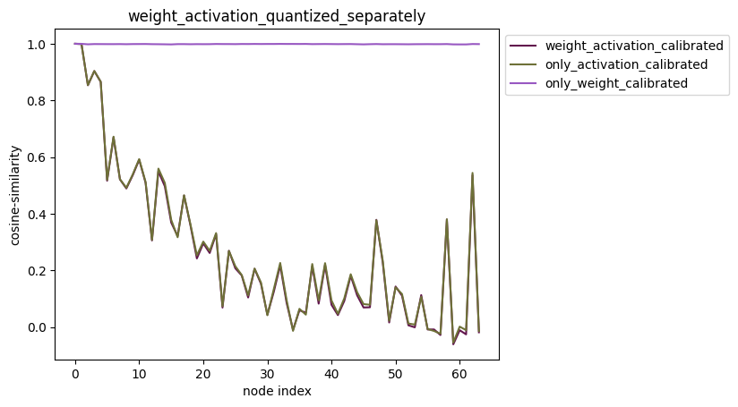

# PTQ原理及步骤详解

### 简介{#PTQ_introduction}

模型转换是指将原始浮点模型转换为地平线混合异构模型的过程。原始浮点模型（文中部分地方也称为浮点模型）是指您通过TensorFlow/PyTorch等DL框架训练得到的可用模型，这个模型的计算精度为float32；混合异构模型是一种适合在地平线处理器上运行的模型格式。
本章节将反复使用到这两种模型名词，为避免理解歧义，请先理解这个概念再阅读下文。

配合地平线算法工具链的模型完整开发过程，需要经过 **浮点模型准备**、 **模型验证**、 **模型转换**、 **性能评估** 和 **精度评估** 共五个重要阶段，如下图:


**浮点模型准备** 本阶段用来确保原始浮点模型的格式为地平线模型转换工具支持的格式，原始浮点模型来自于您通过TensorFlow/PyTorch等DL框架训练得到可用模型。具体的浮点模型要求与建议，请阅读[**浮点模型准备**](#model_preparation)章节内容。

**模型验证** 本阶段用来校验原始浮点模型是否满足地平线算法工具链的要求。地平线提供 ``hb_mapper checker`` 检查工具来完成浮点模型的检查。具体使用方法，请阅读[**验证模型**](#model_check) 章节内容。

**模型转换** 本阶段用来完成浮点模型到地平线混合异构模型的转换，经过这个阶段，您将得到一个可以在地平线处理器上运行的模型。地平线提供 ``hb_mapper makertbin`` 转换工具来完成模型优化、量化和编译等关键步骤。具体使用方法，请阅读[**模型转换**](#model_conversion)章节内容。

**性能评估** 本阶段主要用于测评地平线混合异构模型的推理性能情况，地平线提供了模型性能评估的工具，您可以使用这些工具验证模型性能是否达到应用要求。具体使用说明，请阅读 [**模型性能分析与调优**](#performance_evaluation)章节内容。

**精度评估** 本阶段主要用于测评地平线混合异构模型的推理精度情况，地平线提供了模型精度评估的工具。具体使用说明，请阅读[**模型精度分析与调优**](#accuracy_evaluation)章节内容。


### 模型准备{#model_preparation}


基于公开DL框架训练得到的浮点模型是地平线模型转换工具的输入，目前转换工具支持的DL框架如下：


  | **框架**         | Caffe | PyTorch | TensorFlow | MXNet | PaddlePaddle |
  |-------|------------|--------------|--------------|--------------|--------------|
  | **地平线工具链** | 支持  |   支持（转ONNX）|支持（转ONNX）|支持（转ONNX）|支持（转ONNX）|


以上框架中， Caffe框架导出的caffemodel是直接支持的，PyTorch、TensorFlow和MXNet等DL框架通过转换到ONNX格式间接支持。

对于不同框架到ONNX的转换，目前都有对应的标准化方案，参考如下：

-    Pytorch2Onnx：PytTorch官方API支持直接将模型导出为ONNX模型，参考链接：
         https://pytorch.org/tutorials/advanced/super_resolution_with_onnxruntime.html。

-    Tensorflow2Onnx：基于ONNX社区的onnx/tensorflow-onnx 进行转换，参考链接：
         https://github.com/onnx/tensorflow-onnx。

-    MXNet2Onnx：MXNet官方API支持直接将模型导出为ONNX模型，参考链接：
         https://github.com/dotnet/machinelearning/blob/master/test/Microsoft.ML.Tests/OnnxConversionTest.cs。

-    更多框架的ONNX转换支持，参考链接：
         https://github.com/onnx/tutorials#converting-to-onnx-format。


:::tip 小技巧

  关于Pytorch、PaddlePaddle、TensorFlow2框架的模型，我们也提供了如何导出ONNX及模型可视化的教程，请参考：

  - [**Pytorch导出ONNX及模型可视化教程**](https://developer.horizon.ai/forumDetail/146177165367615499) ；

  - [**PaddlePaddle导出ONNX及模型可视化教程**](https://developer.horizon.ai/forumDetail/146177165367615500) ；

  - [**TensorFlow2导出ONNX及模型可视化教程**](https://developer.horizon.ai/forumDetail/146177165367615501) ；
:::

:::caution 注意

  - 浮点模型中所使用的算子需要符合地平线算法工具链的算子约束条件，具体请阅读 [**模型算子支持列表**](./supported_op_list) 章节进行查询。

  - 目前转换工具仅支持输出个数小于或等于32的模型进行转换。
  
  - 支持 ``caffe 1.0`` 版本的caffe浮点模型和 ``ir_version≤7`` , ``opset=10`` 、 ``opset=11`` 版本的onnx浮点模型量化成地平线支持的定点模型, onnx模型的ir_version与onnx版本的对应关系请参考[**onnx官方文档**](https://github.com/onnx/onnx/blob/main/docs/Versioning.md) ；

  - 模型输入维度只支持 ``固定4维`` 输入NCHW或NHWC（N维度只能为1），例如：1x3x224x224或1x224x224x3， 不支持动态维度及非4维输入；

  - 浮点模型中不要包含有 ``后处理算子``，例如：nms算子。

:::

### 模型验证{#model_check}


模型正式转换前，请先使用 ``hb_mapper checker`` 工具进行模型验证，确保其符合地平线处理器的支持约束。

:::tip 小技巧

  建议参考使用地平线模型转换 ``horizon_model_convert_sample`` 示例包中的caffe、onnx等示例模型的脚本方法: ``01_check_X3.sh`` 或 ``01_check_Ultra.sh``。
:::
#### 使用 ``hb_mapper checker`` 工具验证模型
```
hb_mapper checker 工具的使用方式如下：
```
```
  hb_mapper checker --model-type ${model_type} \
                    --march ${march} \
                    --proto ${proto} \
                    --model ${caffe_model/onnx_model} \
                    --input-shape ${input_node} ${input_shape} \
                    --output ${output}
```

hb_mapper checker 参数解释：

--model-type<br/>
  用于指定检查输入的模型类型，目前只支持设置 ``caffe`` 或者 ``onnx``。

--march
  用于指定需要适配的地平线处理器类型，可设置值为 ``bernoulli2`` 和 ``bayes``；RDK X3设置为 ``bernoulli2``，RDK Ultra设置为 ``bayes``。

--proto<br/>
  此参数仅在 ``model-type`` 指定 ``caffe`` 时有效，取值为Caffe模型的prototxt文件名称。

--model<br/>
  在 ``model-type`` 被指定为 ``caffe`` 时，取值为Caffe模型的caffemodel文件名称。
  在 ``model-type``  被指定为 ``onnx`` 时，取值为ONNX模型文件名称。

--input-shape<br/>
  可选参数，明确指定模型的输入shape。
  取值为 ``{input_name} {NxHxWxC/NxCxHxW}`` ，``input_name`` 与shape之间以空格分隔。
  例如模型输入名称为 ``data1``，输入shape为 ``[1,224,224,3]``，
  则配置应该为 ``--input-shape data1 1x224x224x3``。
  如果此处配置shape与模型内shape信息不一致，以此处配置为准。
:::info 备注
  注意一个 ``--input-shape`` 只接受一个name和shape组合，如果您的模型有多个输入节点，
  在命令中多次配置 ``--input-shape`` 参数即可。
:::

:::caution
  -\-output参数已经废弃，log信息默认存储于 ``hb_mapper_checker.log`` 中。
:::


#### 检查异常处理

如果模型检查步骤异常终止或者出现报错信息，则说明模型验证不通过，请根据终端打印或在当前路径下生成的 ``hb_mapper_checker.log`` 日志文件确认报错信息和修改建议。

例如：以下配置中含不可识别算子类型 ``Accuracy``：

```
  layer {
    name: "data"
    type: "Input"
    top: "data"
    input_param { shape: { dim: 1 dim: 3 dim: 224 dim: 224 } }
  }
  layer {
    name: "Convolution1"
    type: "Convolution"
    bottom: "data"
    top: "Convolution1"
    convolution_param {
      num_output: 128
      bias_term: false
      pad: 0
      kernel_size: 1
      group: 1
      stride: 1
      weight_filler {
        type: "msra"
      }
    }
  }
  layer {
    name: "accuracy"
    type: "Accuracy"
    bottom: "Convolution3"
    top: "accuracy"
    include {
      phase: TEST
    }
  }
```
使用 ``hb_mapper checker`` 检查这个模型，您会在 ``hb_mapper_checker.log`` 中得到如下信息：

```bash
  ValueError: Not support layer name=accuracy type=Accuracy
```

:::caution 注意

  - 如果模型检查步骤异常终止或者出现报错信息，则说明模型验证不通过，请根据终端打印或在当前路径下生成的 ``hb_mapper_checker.log`` 日志文件确认报错信息和修改建议，错误信息可以在 [**模型量化错误及解决方法**](../../common_questions/toolchain#model_convert_errors_and_solutions) 章节来查找错误的解决方法，若以上步骤仍不能排除问题，请联系地平线技术支持团队或在[**地平线官方技术社区**](https://developer.horizon.ai/)提出您的问题，我们将在24小时内给您提供支持。
:::


#### 检查结果解读{#check_result}

如果不存在ERROR，则顺利通过校验。 ``hb_mapper checker`` 工具将直接输出如下信息：

```
  ==============================================
  Node         ON   Subgraph  Type
  ----------
  conv1        BPU  id(0)     HzSQuantizedConv
  conv2_1/dw   BPU  id(0)     HzSQuantizedConv
  conv2_1/sep  BPU  id(0)     HzSQuantizedConv
  conv2_2/dw   BPU  id(0)     HzSQuantizedConv
  conv2_2/sep  BPU  id(0)     HzSQuantizedConv
  conv3_1/dw   BPU  id(0)     HzSQuantizedConv
  conv3_1/sep  BPU  id(0)     HzSQuantizedConv
  ...
```

结果中每行都代表一个模型节点的check情况，每行含Node、ON、Subgraph和Type四列，分别为节点名称、执行节点计算的硬件、节点所属子图和节点映射到的地平线算子名称。
如果模型在网络结构中出现了CPU计算的算子，hb_mapper checker工具将把这个算子前后连续在BPU计算的部分拆分为两个Subgraph（子图）。

#### 检查结果的调优指导

在最理想的情况下，模型网络结构中的算子都应该在BPU上运行，也就是只有一个子图。 如果出现了CPU算子导致拆分多个子图， ``hb_mapper checker`` 工具会给出导致CPU算子出现的具体原因，以下给出了分别在RDK X3 和 RDK Ultra上示例模型验证的情况；

- 以下在 **RDK X3** 上运行的Caffe模型出现了Reshape + Pow + Reshape 的结构, 从 **RDK X3** 的算子约束列表中我们可以看到, Reshape 算子目前为在CPU上运行的算子, 而Pow的shape也是非4维的，不符合X3 BPU算子约束条件。


因此模型最终检查结果也会出现分段情况, 如下:

```
  2022-05-25 15:16:14,667 INFO The converted model node information:
  ====================================================================================
  Node                                    ON   Subgraph  Type
  -------------
  conv68                                  BPU  id(0)     HzSQuantizedConv
  sigmoid16                               BPU  id(0)     HzLut
  axpy_prod16                             BPU  id(0)     HzSQuantizedMul
  UNIT_CONV_FOR_eltwise_layer16_add_1     BPU  id(0)     HzSQuantizedConv
  prelu49                                 BPU  id(0)     HzPRelu
  fc1                                     BPU  id(0)     HzSQuantizedConv
  fc1_reshape_0                           CPU  --        Reshape
  fc_output/square                        CPU  --        Pow
  fc_output/sum_pre_reshape               CPU  --        Reshape
  fc_output/sum                           BPU  id(1)     HzSQuantizedConv
  fc_output/sum_reshape_0                 CPU  --        Reshape
  fc_output/sqrt                          CPU  --        Pow
  fc_output/expand_pre_reshape            CPU  --        Reshape
  fc_output/expand                        BPU  id(2)     HzSQuantizedConv
  fc1_reshape_1                           CPU  --        Reshape
  fc_output/expand_reshape_0              CPU  --        Reshape
  fc_output/op                            CPU  --        Mul

```

- 以下在 **RDK Ultra** 上运行的ONNX模型出现了Mul + Add + Mul的结构，从 **RDK Ultra** 的算子约束列表中我们可以看到，Mul和Add算子在五维上是支持BPU运行的，但前提要符合Ultra BPU算子约束条件，不然就会回退到CPU计算。


因此模型最终检查结果也会出现分段情况，如下:

```
  ====================================================================================
  Node                                    ON   Subgraph  Type
  -------------------------------------------------------------------------------------
  Reshape_199                             BPU  id(0)     Reshape
  Transpose_200                           BPU  id(0)     Transpose
  Sigmoid_201                             BPU  id(0)     HzLut
  Split_202                               BPU  id(0)     Split
  Mul_204                                 CPU  --        Mul
  Add_206                                 CPU  --        Add
  Mul_208                                 CPU  --        Mul
  Mul_210                                 CPU  --        Mul
  Pow_211                                 BPU  id(1)     HzLut
  Mul_213                                 CPU  --        Mul
  Concat_214                              CPU  --        Concat
  Reshape_215                             CPU  --        Reshape
  Conv_216                                BPU  id(0)     HzSQuantizedConv
  Reshape_217                             BPU  id(0)     Reshape
  Transpose_218                           BPU  id(0)     Transpose
  Sigmoid_219                             BPU  id(0)     HzLut
  Split_220                               BPU  id(0)     Split
  Mul_222                                 CPU  --        Mul
  Add_224                                 CPU  --        Add
  Mul_226                                 CPU  --        Mul
  Mul_228                                 CPU  --        Mul
  Pow_229                                 BPU  id(2)     HzLut
  Mul_231                                 CPU  --        Mul
  Concat_232                              CPU  --        Concat
  Reshape_233                             CPU  --        Reshape
  Conv_234                                BPU  id(0)     HzSQuantizedConv
  Reshape_235                             BPU  id(0)     Reshape
  Transpose_236                           BPU  id(0)     Transpose
  Sigmoid_237                             BPU  id(0)     HzLut
  Split_238                               BPU  id(0)     Split
  Mul_240                                 CPU  --        Mul
  Add_242                                 CPU  --        Add
  Mul_244                                 CPU  --        Mul
  Mul_246                                 CPU  --        Mul
  Pow_247                                 BPU  id(3)     HzLut
  Mul_249                                 CPU  --        Mul
  Concat_250                              CPU  --        Concat
  Reshape_251                             CPU  --        Reshape
```

根据 hb_mapper checker 给出的提示，一般来说算子运行在BPU上会有更好的性能表现，这里可以将pow、reshape 这类CPU算子从模型中移除，将对应算子的功能放入后处理中计算，从而减少子图数量。

当然，多个子图也不会影响整个转换流程，但会较大程度地影响模型性能，建议尽量调整模型算子到BPU上执行，可参考地平线处理器算子支持列表中的BPU算子支持列表来做同功能的算子替换或者将模型中的CPU算子移到模型推理的前、后处理中去做CPU计算。


### 模型转换{#model_conversion}

模型转换阶段会完成浮点模型到地平线混合异构模型的转换，经过这个阶段，您将得到一个可以在地平线处理器上运行的模型。
在进行转换之前，请确保已经顺利通过了上文的验证模型过程。

模型转换使用 ``hb_mapper makertbin`` 工具完成，转换期间会完成模型优化和校准量化等重要过程，校准需要依照模型预处理要求准备校准数据。
为了方便您全面了解模型转换，本节将依次介绍校准数据准备、转换工具使用、转换内部过程解读、转换结果解读和转换产出物解读等内容。


#### 准备校准数据

在进行模型转换时，校准阶段会需要 **100份左右** 标定样本输入，每一份样本都是一个独立的数据文件。
为了确保转换后模型的精度效果，我们希望这些校准样本来自于您训练模型使用的 **训练集或验证集** ，不要使用非常少见的异常样本，例如 **纯色图片、不含任何检测或分类目标的图片等**。

转换配置文件中的 ``preprocess_on`` 参数，该参数启用和关闭状态下分别对应了两种不同的预处理样本要求。
(有关参数的详细配置可参考下文校准参数组中相关说明)
``preprocess_on`` 关闭状态下，您需要把取自训练集/验证集的样本做与模型推理（inference）前一样的前处理，
处理完后的校准样本会与原始模型具备一样的数据类型( ``input_type_train`` )、尺寸( ``input_shape`` )和
layout( ``input_layout_train`` )，对于featuremap输入的模型，您可以通过 ``numpy.tofile`` 命令将数据保存为float32格式的二进制文件，
工具链校准时会基于 ``numpy.fromfile`` 命令进行读取。
例如，使用ImageNet训练的用于分类的原始浮点模型，它只有一个输入节点，输入信息描述如下：

- 输入类型：``BGR``
- 输入layout：``NCHW``
- 输入尺寸：``1x3x224x224``

使用验证集做模型推理（inference）时的数据预处理如下：

1. 图像长宽等比scale,短边缩放到256。
2. ``center_crop`` 方法获取224x224大小图像。
3. 按通道减mean。
4. 数据乘以scale系数。

针对上述举例模型的样本处理代码如下：

为避免过长代码篇幅，各种简单transformer实现代码未贴出，具体使用请参考[**transformer使用方法**](../../common_questions/toolchain#transposetransformer) 章节内容。

:::tip 小技巧

  建议参考使用地平线模型转换 ``horizon_model_convert_sample`` 示例包中的caffe、onnx等示例模型的预处理步骤方法: ``02_preprocess.sh`` 和 ``preprocess.py`` 。
:::
```
  # 本示例使用skimage，如果是opencv会有所区别
  # 需要您特别注意的是，transformers中并没有体现减mean和乘scale的处理
  # mean和scale操作已经融合到了模型中，请参考下文norm_type/mean_value/scale_value配置
  def data_transformer():
    transformers = [
    # 长宽等比scale，短边缩放至256
    ShortSideResizeTransformer(short_size=256),
    # CenterCrop获取224x224图像
    CenterCropTransformer(crop_size=224),
    # skimage读取结果为NHWC排布，转换为模型需要的NCHW
    HWC2CHWTransformer(),
    # skimage读取结果通道顺序为RGB，转换为模型需要的BGR
    RGB2BGRTransformer(),
    # skimage读取数值范围为[0.0,1.0]，调整为模型需要的数值范围
    ScaleTransformer(scale_value=255)
    ]

    return transformers

  # src_image 标定集中的原图片
  # dst_file 存放最终标定样本数据的文件名称
  def convert_image(src_image, dst_file, transformers)：
    image = skimage.img_as_float(skimage.io.imread(src_file))
    for trans in transformers:
    image = trans(image)
    # 模型指定的input_type_train BGR数值类型是UINT8
    image = image.astype(np.uint8)
    # 二进制存储标定样本到数据文件
    image.tofile(dst_file)

  if __name__ == '__main__':
    # 此处表示原始标定图片集合，伪代码
    src_images = ['ILSVRC2012_val_00000001.JPEG'，...]
    # 此处表示最终标定文件名称（后缀名不限制），伪代码
    # calibration_data_bgr_f32是您在配置文件中指定的cal_data_dir
    dst_files = ['./calibration_data_bgr_f32/ILSVRC2012_val_00000001.bgr'，...]

    transformers = data_transformer()
    for src_image, dst_file in zip(src_images, dst_files):
    convert_image(src_image, dst_file, transformers)
```

:::info
  ``preprocess_on`` 启用状态下，标定样本使用skimage支持读取的图片格式文件即可。
  转换工具读取这些图片后，会将其缩放到模型输入节点要求的尺寸大小，以此结果作为校准的输入。
  这样的操作会简单，但是对于量化的精度没有保障，因此我们强烈建议您使用关闭 ``preprocess_on`` 的方式。

:::caution 注意
  请注意，yaml文件中input_shape参数作用为指定原始浮点模型的输入数据尺寸。若为动态输入模型则可通过这个参数设置转换后的输入大小，而校准数据的shape大小应与input_shape保持一致。
  
  例如：若原始浮点模型输入节点shape为?x3x224x224（“?”号代表占位符，即该模型第一维为动态输入）, 转换配置文件中设置input_shape: 8x3x224x224，则用户需要准备的每份校准数据大小为 8x3x224x224。
  （请知悉，此类输入shape第一维不等于1的模型，不支持通过input_batch参数修改模型batch信息。）
:::


#### 使用 hb_mapper makertbin 工具转换模型{#makertbin}

hb_mapper makertbin提供两种模式，开启 ``fast-perf`` 模式和不开启 ``fast-perf`` 模式。

``fast-perf`` 模式开启后，会在转换过程中生成可以在板端运行最高性能的bin模型，工具内部主要进行以下操作：

- 将BPU可执行算子尽可能运行在BPU上（若使用 ``RDK Ultra`` 则可以通过yaml文件中node_info参数指定在BPU上运行的算子， ``RDK X3`` 是自动优化，无法通过yaml配置文件指定算子）。

- 删除模型首尾不可删除的CPU算子，包括：Quantize/Dequantize、Transpose、Cast、Reshape等。

- 以性能最高的O3优化等级编译模型。

:::tip 小技巧

  建议参考使用地平线模型转换 ``horizon_model_convert_sample`` 示例包中的caffe、onnx等示例模型的脚本方法: ``03_build_X3.sh`` 或 ``03_build_Ultra.sh``。
:::

hb_mapper makertbin命令使用方式如下：

不开启 ``fast-perf`` 模式：

```bash

  hb_mapper makertbin --config ${config_file}  \
                      --model-type  ${model_type}
```

开启 ``fast-perf`` 模式：

```bash

  hb_mapper makertbin --fast-perf --model ${caffe_model/onnx_model} --model-type ${model_type} \
                      --proto ${caffe_proto} \
                      --march ${march}
```

hb_mapper makertbin参数解释：

--help<br/>
  显示帮助信息并退出。

-c, --config<br/>
  模型编译的配置文件，为yaml格式，文件名使用.yaml后缀，完整的配置文件模板参考如下章节内容。

--model-type<br/>
  用于指定转换输入的模型类型，目前支持设置 ``caffe`` 或者 ``onnx``。

--fast-perf<br/>
  开启fast-perf模式，该模式开启后，会在转换过程中生成可以在板端运行最高性能的bin模型，方便您用于后续的模型性能评测。

  如您开启了fast-perf模式，还需要进行如下配置：

  ``--model``<br/>
  Caffe或ONNX浮点模型文件。

  ``--proto``<br/>
  用于指定Caffe模型prototxt文件。

  ``--march``<br/>
  BPU的微架构。若使用 ``RDK X3`` 则设置为 ``bernoulli2``，若使用 ``RDK Ultra`` 则设置为 ``bayes``。


:::caution 注意

  - ``RDK X3 yaml配置文件``，可直接使用[**RDK X3 Caffe模型量化yaml文件模板**](../../common_questions/toolchain#rdk_x3_caffe_yaml_template) 和[**RDK X3 ONNX模型量化yaml文件模板**](../../common_questions/toolchain#rdk_x3_onnx_yaml_template)模板文件进行填写。

  - ``RDK Ultra yaml配置文件``，可直接使用[**RDK Ultra Caffe模型量化yaml文件模板**](../../common_questions/toolchain#rdk_ultra_caffe_yaml_template) 和[**RDK Ultra ONNX模型量化yaml文件模板**](../../common_questions/toolchain#rdk_ultra_onnx_yaml_template)模板文件进行填写。 
  - 若 hb_mapper makertbin 步骤异常终止或者出现报错信息，则说明模型转换失败，请根据终端打印或在当前路径下生成的 ``hb_mapper_makertbin.log`` 日志文件确认报错信息和修改建议，错误信息可以在 [**模型量化错误及解决方法**](../../common_questions/toolchain#model_convert_errors_and_solutions)章节来查找错误的解决方法，若以上步骤仍不能排除问题，请联系地平线技术支持团队或在[**地平线官方技术社区**](https://developer.horizon.ai/)提出您的问题，我们将在24小时内给您提供支持。
:::

#### 模型转换yaml配置参数说明{#yaml_config}

:::info 备注
  要么是Caffe模型，要么是ONNX模型。即 ``caffe_model`` + ``prototxt`` 或者 ``onnx_model`` 二选一。
  即，要么是Caffe模型，要么是ONNX模型。
:::
```
  # 模型参数组
  model_parameters:
    # 原始Caffe浮点模型描述文件
    prototxt: '***.prototxt'

    # 原始Caffe浮点模型数据模型文件
    caffe_model: '****.caffemodel'

    # 原始Onnx浮点模型文件
    onnx_model: '****.onnx'

    # 转换的目标处理器架构，保持默认，地平线RDK X3使用的是bernoulli2架构， RDK Ultra使用的是bayes架构。march: 'bayes'
    march: 'bernoulli2'

    # 模型转换输出的用于上板执行的模型文件的名称前缀
    output_model_file_prefix: 'mobilenetv1'

    # 模型转换输出的结果的存放目录
    working_dir: './model_output_dir'

    # 指定转换后混合异构模型是否保留输出各层的中间结果的能力,保持默认即可
    layer_out_dump: False

    # 指定模型的输出节点
    output_nodes: {OP_name}

    # 批量删除某一类型的节点
    remove_node_type: Dequantize

    # 删除指定名称的节点
    remove_node_name: {OP_name}

  # 输入信息参数组
  input_parameters:
    # 原始浮点模型的输入节点名称
    input_name: "data"

    # 原始浮点模型的输入数据格式（数量/顺序与input_name一致）
    input_type_train: 'bgr'

    # 原始浮点模型的输入数据排布（数量/顺序与input_name一致）
    input_layout_train: 'NCHW'

    # 原始浮点模型的输入数据尺寸
    input_shape: '1x3x224x224'

    # 网络实际执行时，输入给网络的batch_size, 默认值为1
    input_batch: 1

    # 在模型中添加的输入数据预处理方法
    norm_type: 'data_mean_and_scale'

    # 预处理方法的图像减去的均值, 如果是通道均值，value之间必须用空格分隔
    mean_value: '103.94 116.78 123.68'

    # 预处理方法的图像缩放比例，如果是通道缩放比例，value之间必须用空格分隔
    scale_value: '0.017'

    # 转换后混合异构模型需要适配的输入数据格式（数量/顺序与input_name一致）
    input_type_rt: 'yuv444'

    # 输入数据格式的特殊制式
    input_space_and_range: 'regular'

    # 转换后混合异构模型需要适配的输入数据排布（数量/顺序与input_name一致），若input_type_rt配置为nv12，则此处参数不需要配置
    input_layout_rt: 'NHWC'

  # 校准参数组
  calibration_parameters:
    # 模型校准使用的标定样本的存放目录
    cal_data_dir: './calibration_data'

    # 指定校准数据二进制文件的数据存储类型。
    cal_data_type: 'float32'

    # 开启图片校准样本自动处理（skimage read; resize到输入节点尺寸）
    #preprocess_on: False  
    
    # 校准使用的算法类型, 优先使用的 default 校准算法
    calibration_type: 'default'

    # max 校准方式的参数
    # max_percentile: 1.0

    # 强制指定OP在CPU上运行，一般不需要配置，在模型精度调优阶段可以开启此功能，用于尝试精度优化
    #run_on_cpu:  {OP_name}

    # 强制指定OP在BPU上运行， 一般不需要配置，在模型性能调优阶段可以开启此功能，用于尝试性能优化
    # run_on_bpu:  {OP_name}

    # 指定是否针对每个channel进行校准
    #per_channel: False

    # 指定输出节点的数据精度
    #optimization: set_model_output_int8

  # 编译参数组
  compiler_parameters:
    # 编译策略选择
    compile_mode: 'latency'

    # 是否打开编译的debug信息，保持默认的 False 
    debug: False

    # 模型运行核心数
    core_num: 1

    # 模型编译的优化等级选择，保持默认的 O3
    optimize_level: 'O3'

    # 指定名称为data的输入数据来源
    #input_source: {"data": "pyramid"}

    # 指定模型的每个function call的最大可连续执行时间
    #max_time_per_fc: 1000

    # 指定编译模型时的进程数
    #jobs: 8
	
  # 此参数组，无需配置，只在有自定义CPU算子时开启使用
  #custom_op: 
    # 自定义op的校准方式, 推荐使用注册方式 register
    #custom_op_method: register

    # 自定义OP的实现文件, 多个文件可用";"分隔, 该文件可由模板生成, 详情见自定义OP相关文档
    #op_register_files: sample_custom.py

    # 自定义OP实现文件所在的文件夹, 请使用相对路径
    #custom_op_dir: ./custom_op
```

配置文件主要包含模型参数组、输入信息参数组、校准参数组和编译参数组。
在您的配置文件中，四个参数组位置都需要存在，具体参数分为可选和必选，可选参数可以不配置。

具体参数的设置形式为： ``param_name:  'param_value'`` ；
若参数存在多个值时，每个值之间使用 ``';'`` 符号进行分隔： ``param_name:  'param_value1; param_value2; param_value3'`` ；具体配置方法可参考：``run_on_cpu: 'conv_0; conv_1; conv12'`` 。

:::tip 小技巧
  
  - 当模型为多输入模型时, 建议用户将可选参数（ ``input_name``, ``input_shape`` 等）显式的写出, 以免造成参数对应顺序上的错误。

  - 在配置march为bayes，即在进行RDK Ultra模型转换时，如您将优化等级optimize_level配置为O3，hb_mapper makerbin默认提供缓存能力。即在您第一次使用hb_mapper makerbin对模型进行编译时，会自动创建缓存文件，后续在您的working_dir不变的情况下，在重复编译时会自动调用此文件，降低您的编译时间。
:::

:::caution 注意

  - 请注意，如果设置 ``input_type_rt`` 为 ``nv12`` 或 ``yuv444`` ，则模型的输入尺寸中不能出现奇数。
  - 请注意，目前RDK X3上暂不支持 ``input_type_rt`` 为 ``yuv444`` 且 ``input_layout_rt`` 为 ``NCHW`` 组合的场景。
  - 模型转换成功后，若出现符合地平线BPU算子约束条件的OP仍然运行在CPU上，其主要原因是该OP属于被动量化OP，关于被动量化相关内容，请阅读 [**算法工具链中的主动量化和被动量化逻辑**](https://developer.horizon.ai/forumDetail/118364000835765793) 章节。
:::

以下是具体参数信息，参数会比较多，我们依照上述的参数组次序介绍。


- ###### 模型参数组

| 参数名称 | 参数配置说明   | 取值范围说明 |    可选/必选     |
|------------|----------|----------|--------|
|``prototxt``| **参数作用**：指定Caffe浮点模型的prototxt文件名称。<br/>**参数说明**：在 ``hb_mapper makertbin``的``model-type`` 为 ``caffe`` 时必须配置。| **取值范围**：无。<br/> **默认配置**：无。|可选 |
|``caffe_model``| **参数作用**：指定Caffe浮点模型的caffemodel文件名称。<br/>**参数说明**：在 ``hb_mapper makertbin`` 的``model-type`` 为 ``caffe`` 时必须配置。| **取值范围**：无。<br/> **默认配置**：无。|可选 |
|``onnx_model``| **参数作用**：指定ONNX浮点模型的onnx文件名称。<br/>**参数说明**：在 ``hb_mapper makertbin`` 的``model-type`` 为 ``onnx`` 时必须配置。| **取值范围**：无。<br/> **默认配置**：无。|可选 |
|``march``| **参数作用**：指定产出混合异构模型需要支持的平台架构。<br/>**参数说明**：两个可选配置值依次对应RDK X3 和 RDK Ultra 对应的BPU微框架。根据您使用的平台选择。| **取值范围**：``bernoulli2`` 或 ``bayes``。<br/> **默认配置**：无。|必选 |
|``output_model_file_prefix``| **参数作用**：指定转换产出混合异构模型的名称前缀。<br/>**参数说明**：输出的定点模型文件的名称前缀。| **取值范围**：无。<br/> **默认配置**：无。|必选 |
|``working_dir``| **参数作用**：指定模型转换输出的结果的存放目录。<br/>**参数说明**：若该目录不存在, 则工具会自动创建目录。| **取值范围**：无。<br/> **默认配置**：``model_output``。|可选 |
|``layer_out_dump``| **参数作用**：指定混合异构模型是否保留输出中间层值的能力。<br/>**参数说明**：输出中间层的值是调试需要用到的手段，常规状态下请不要开启。| **取值范围**：``True`` 、 ``False``。<br/> **默认配置**：``False``。|可选 |
|``output_nodes``| **参数作用**：指定模型的输出节点。<br/>**参数说明**：一般情况下，转换工具会自动识别模型的输出节点。此参数用于支持您指定一些中间层次作为输出。设置值为模型中的具体节点名称，多个值的配置方法请参考前文对 ``param_value`` 配置描述。需要您注意的是，一旦设置此参数后，工具将不再自动识别输出节点，您通过此参数指定的节点就是全部的输出。| **取值范围**：无。<br/> **默认配置**：无。|可选 |
|``remove_node_type``| **参数作用**：设置删除节点的类型。<br/>**参数说明**：该参数为隐藏参数，不设置或设置为空不影响模型转换过程。此参数用于支持您设置待删除节点的类型信息。被删除的节点必须在模型的开头或者末尾, 与模型的输入或输出连接。注意：待删除节点会按顺序依次删除，并动态更新模型结构；同时在节点删除前还会判断该节点是否位于模型的输入输出处。因此节点的删除顺序很重要。| **取值范围**：”Quantize”, “Transpose”, “Dequantize”, “Cast”, “Reshape”。不同类型用”;”分割。<br/> **默认配置**：无。|可选 |
|``remove_node_name``| **参数作用**：设置删除节点的名称。<br/>**参数说明**：该参数为隐藏参数， 不设置或设置为空不影响模型转换过程。 此参数用于支持您设置待删除节点的名称。被删除的节点必须在模型的开头或者末尾, 与模型的输入或输出连接。注意：待删除节点会按顺序依次删除，并动态更新模型结构；同时在节点删除前还会判断该节点是否位于模型的输入输出处。因此节点的删除顺序很重要。| **取值范围**：无。不同类型用";"分割。<br/> **默认配置**：无。|可选 |
|``set_node_data_type``| **参数作用**：配置指定op的输出数据类型为int16，此参数 **只支持RDK Ultra配置！** <br/> **参数说明**：在模型转换过程中，大多数op的默认输入输出数据类型为int8，通过该参数可以指定特定op的输出数据类型为int16（在满足一定的约束条件下）。int16相关说明详见：[**int16配置说明**](#int16_config)部分的描述。 <br/> **注意：** 该参数相关功能已合并至 ``node_info`` 参数中，后续版本计划废弃。 | **取值范围**：支持配置int16的算子范围您可参考[**模型算子支持列表**](./supported_op_list)中RDK Ultra算子支持约束列表。<br/> **默认配置**：无。|可选 |
|``debug_mode``| **参数作用**：保存用于精度debug分析的校准数据。<br/>**参数说明**：该参数作用为保存用于精度debug分析的校准数据，数据格式为.npy。该数据通过np.load()可直接送入模型进行推理。若不设置此参数，您也可自行保存数据并使用精度debug工具进行精度分析。 | **取值范围**：``"dump_calibration_data"``<br/> **默认配置**：无。|可选 |
|``node_info``| **参数作用**：支持配置指定OP的输入输出数据类型为int16以及强制指定算子在CPU或BPU上运行。此参数 **只支持RDK Ultra配置！** <br/>**参数说明**：基于减少yaml中的参数的原则，我们将 ``set_node_data_type`` 、``run_on_cpu`` 和 ``run_on_bpu`` 三个参数的能力融合到本参数中，并在此基础上扩充支持配置指定op输入数据类型为int16的能力。<br/> ``node_info`` 参数使用方式：  <br/>- 仅指定OP运行在BPU/CPU上（下以BPU为例，CPU方法一致）：<br/> node_info: { <br/>"node_name":<br/> { 'ON': 'BPU', <br/>}  <br/>} <br/> - 仅配置节点数据类型： <br/> node_info: 'node_name1:int16;node_name2:int16' <br/>  多个值的配置方法请参考 `param_value配置 <param_value>`。 <br/> - 指定OP运行在BPU上，同时配置OP的输入输出数据类型：<br/> node_info: { <br/>"node_name": { <br/>'ON': 'BPU', <br/>'InputType': 'int16', <br/>'OutputType': 'int16'<br/> } <br/>  } <br/> 'InputType': 'int16'代表指定算子的所有输入数据类型为int16。 <br/>如需指定算子特定输入的InputType，可在InputType后通过指定数字来进行配置。如：<br/>'InputType0': 'int16'代表指定算子的第一个输入数据类型为int16，<br/>'InputType1': 'int16'代表指定算子的第二个输入数据类型为int16，以此类推。<br/>**注意：** 'OutputType' 不支持指定算子特定输出的OutputType，配置后对算子的所有输出生效，不支持配置 'OutputType0' 、 'OutputType1'等。 | **取值范围**：支持配置int16的算子范围您可参考[模型算子支持列表](./supported_op_list)中RDK Ultra算子支持约束列表。可指定在CPU或BPU运行的算子需为模型中包含的算子。<br/> **默认配置**：无。|可选 |

- ###### 输入信息参数组

| 参数名称 | 参数配置说明   | 取值范围说明 |    可选/必选     |
|------------|----------|----------|--------|
|``input_name``| **参数作用**：指定原始浮点模型的输入节点名称。<br/>**参数说明**：浮点模型只有一个输入节点情况时不需要配置。多于一个输入节点时必须配置以保证后续类型及校准数据输入顺序的准确性。多个值的配置方法请参考前文对param_value配置描述。| **取值范围**：无。<br/> **默认配置**：无。|可选 |
|``input_type_train``| **参数作用**：指定原始浮点模型的输入数据类型。<br/>**参数说明**：每一个输入节点都需要配置一个确定的输入数据类型。存在多个输入节点时，设置的节点顺序需要与``input_name``里的顺序严格保持一致。多个值的配置方法请参考前文对``param_value``配置描述。数据类型的选择请参考： 转换内部过程解读 部分的介绍。| **取值范围**：``rgb``、``bgr``、``yuv444``、``gray``、``featuremap``。<br/> **默认配置**：无。|必选 |
|``input_layout_train``| **参数作用**：指定原始浮点模型的输入数据排布。<br/>**参数说明**：每一个输入节点都需要配置一个确定的输入数据排布， 这个排布必须与原始浮点模型所采用的数据排布相同。存在多个输入节点时， 设置的节点顺序需要与 ``input_name`` 里的顺序严格保持一致。多个值的配置方法请参考前文对``param_value``配置描述。什么是数据排布请参考： 转换内部过程解读 部分的介绍。| **取值范围**：NHWC 、 NCHW。<br/> **默认配置**：无。|必选 |
|``input_type_rt``| **参数作用**：转换后混合异构模型需要适配的输入数据格式。<br/>**参数说明**：这里是指明您需要使用的数据格式， 不要求与原始模型的数据格式一致， 但是需要注意在平台喂给模型的数据是使用这个格式。每一个输入节点都需要配置一个确定的输入数据类型，存在多个输入节点时， 设置的节点顺序需要与``input_name``里的顺序严格保持一致。多个值的配置方法请参考前文对``param_value``配置描述。数据类型的选择请参考： 转换内部过程解读 部分的介绍。| **取值范围**：``rgb``、``bgr``、``yuv444``、``nv12``、``gray``、``featuremap``。<br/> **默认配置**：无。|必选 |
|``input_layout_rt``| **参数作用**：转换后混合异构模型需要适配的输入数据排布。<br/>**参数说明**：每一个输入节点都需要配置一个确定的输入数据排布， 这个输入是您希望给混合异构模型指定的排布。不合适的输入数据的排布设置将会影响性能， X3平台建议用户使用 NHWC 格式输入。若input_type_rt配置为nv12，则此处参数不需要配置。存在多个输入节点时，设置的节点顺序需要与``input_name``里的顺序严格保持一致。多个值的配置方法请参考前文对``param_value``配置描述。什么是数据排布请参考： 转换内部过程解读 部分的介绍。| **取值范围**：``NCHW``、 ``NHWC``。<br/> **默认配置**：无。|可选 |
|``input_space_and_range``| **参数作用**：指定输入数据格式的特殊制式。<br/>**参数说明**：这个参数是为了适配不同ISP输出的yuv420格式， 在相应 input_type_rt 为 nv12 时，该配置才有效。regular 就是常见的yuv420格式，数值范围为 [0,255]；bt601_video 是另一种视频制式yuv420，数值范围为 [16,235]。更多信息可以通过网络资料了解bt601， 在没有明确需要的情况下，您不要配置此参数。| **取值范围**：``regular`` , ``bt601_video``。<br/> **默认配置**：``regular``。|可选 |
|``input_shape``| **参数作用**：指定原始浮点模型的输入数据尺寸。<br/>**参数说明**：shape的几个维度以 x 连接，例如 1x3x224x224。原始浮点模型只有一个输入节点情况时可以不配置， 工具会自动读取模型文件中的尺寸信息。配置多个输入节点时，设置的节点顺序需要与``input_name``里的顺序严格保持一致。多个值的配置方法请参考前文对``param_value``配置描述。| **取值范围**：无。<br/> **默认配置**：无。|可选 |
|``input_batch``| **参数作用**：指定转换后混合异构模型需要适配的输入batch数量。<br/>**参数说明**：这里input_batch为转换后混合异构bin模型输入batch数量， 但不影响转换后onnx的模型的输入batch数量。此参数不配置时默认为1。此参数仅适用于单输入模型，且``input_shape``第一维必须为1。| **取值范围**：``1-128``。<br/> **默认配置**：``1``。|可选 |
|``norm_type``| **参数作用**：在模型中添加的输入数据预处理方法。<br/>**参数说明**：``no_preprocess`` 表示不添加任何数据预处理；``data_mean`` 表示提供减均值预处理；``data_scale`` 表示提供乘scale系数预处理；``data_mean_and_scale`` 表示提供先减均值再乘scale系数前处理。输入节点时多于一个时，设置的节点顺序需要与``input_name``里的顺序严格保持一致。多个值的配置方法请参考前文对``param_value``配置描述。配置该参数的影响请参考： 转换内部过程解读 部分的介绍。|**取值范围**：``data_mean_and_scale`` 、 ``data_mean`` 、``data_scale`` 、 ``no_preprocess``。<br/> **默认配置**：无。|必选 |
|``mean_value``| **参数作用**：指定预处理方法的图像减去的均值。<br/>**参数说明**：当 ``norm_type`` 存在 ``data_mean_and_scale`` 或 data_mean 时需要配置该参数。对于每一个输入节点而言，存在两种配置方式。第一种是仅配置一个数值，表示所有通道都减去这个均值；第二种是提供与通道数量一致的数值（这些数值以空格分隔开）， 表示每个通道都会减去不同的均值。配置的输入节点数量必须与 norm_type 配置的节点数量一致， 如果存在某个节点不需要 mean 处理，则为该节点配置 ``'None'``。多个值的配置方法请参考前文对``param_value``配置描述。| **取值范围**：无。<br/> **默认配置**：无。|可选 |
|``scale_value``| **参数作用**：指定预处理方法的数值scale系数。<br/>**参数说明**：当 ``norm_type`` 存在 ``data_mean_and_scale`` 或 ``data_scale`` 时需要配置该参数。对于每一个输入节点而言，存在两种配置方式。第一种是仅配置一个数值，表示所有通道都乘以这个系数；第二种是提供与通道数量一致的数值（这些数值以空格分隔开）， 表示每个通道都会乘以不同的系数。配置的输入节点数量必须与 ``norm_type`` 配置的节点数量一致， 如果存在某个节点不需要 ``scale`` 处理，则为该节点配置 ``'None'``。多个值的配置方法请参考前文对 ``param_value`` 配置描述。| **取值范围**：无。<br/> **默认配置**：无。|可选 |


- ###### 校准参数组

| 参数名称 | 参数配置说明   | 取值范围说明 |    可选/必选     |
|------------|----------|----------|--------|
|``cal_data_dir``| **参数作用**：指定模型校准使用的标定样本的存放目录。<br/>**参数说明**：目录内校准数据需要符合输入配置的要求。具体请参考 准备校准数据 部分的介绍。配置多个输入节点时， 设置的节点顺序需要与 ``input_name`` 里的顺序严格保持一致。多个值的配置方法请参考前文对 ``param_value`` 配置描述。当calibration_type为 ``load``, ``skip`` 时，cal_data_dir不用填。注意： 为了方便您的使用，如果未发现cal_data_type的配置，我们将根据文件夹 后缀对数据类型进行配置。如果文件夹后缀以 ``_f32`` 结尾，则认为数据 类型是float32，否则认为数据类型是uint8。当然，我们强烈建议您通过cal_data_type参数对数据类型进行约束。| **取值范围**：无。<br/> **默认配置**：无。|可选 |
|``cal_data_type``| **参数作用**：指定校准数据二进制文件的数据存储类型。<br/>**参数说明**：指定模型校准时使用的二进制文件的数据存储类型。没有指定值的情况下将会使用文件夹名字后缀来做判断。| **取值范围**：``float32``、``uint8``。<br/> **默认配置**：无。|可选 |
|``preprocess_on``| **参数作用**：开启图片校准样本自动处理。<br/>**参数说明**：该选项仅适用于4维图像输入的模型， 非4维模型不要打开该选项。在启动该功能时，cal_data_dir 目录下存放的都是jpg/bmp/png 等图片数据，工具会使用skimage读取图片， 并resize到输入节点需要的尺寸。为了保证校准的效果，建议您保持该参数关闭。使用的影响请参考 准备校准数据 部分的介绍。| **取值范围**：``True`` 、 ``False``。<br/> **默认配置**： ``False``。|可选 |
|``calibration_type``| **参数作用**：校准使用的算法类型。<br/>**参数说明**：每 ``kl`` 和 ``max`` 都是公开的校准量化算法， 其基本原理可以通过网络资料查阅。使用 ``load`` 方式校准时, qat模型必须是通过plugin导出的的模型。``mix`` 是一个集成多种校准方法的搜索策略，能够自动确定量化敏感节点，并在节点粒度上从不同的校准方法中挑选出最佳方法，最终构建一个融合了多种校准方法优势的组合校准方式。``default`` 是一个自动搜索的策略， 会尝试从系列校准量化参数中获得一个相对效果较好的组合。建议您先尝试 ``default``， 如果最终的精度结果不满足预期， 再根据 精度调优 部分建议配置不同的校准参数。若您只想尝试对模型性能进行验证，但对精度没有要求， 则可以尝试 “skip” 方式进行校准。该方式会使用随机数进行校准， 不需要您准备校准数据，比较适合初次尝试对模型结构进行验证。注意： 使用skip方式时，因使用随机数校准, 得到的模型不可用于精度验证。| **取值范围**：``default``、``mix`、```kl``、``max``、``load`` 和 ``skip``。<br/> **默认配置**：``default``。|必选 |
|``max_percentile``| **参数作用**：该参数为 ``max`` 校准方法的参数，用以调整 ``max`` 校准的截取点。<br/>**参数说明**：此参数仅在 ``calibration_type`` 为 ``max`` 时有效。常用配置选项有：0.99999/0.99995/0.99990/0.99950/0.99900。建议您先尝试 ``calibration_type`` 配置 ``default``， 如果最终的精度结果不满足预期， 再根据 精度调优 部分建议调整该参数。| **取值范围**：``0.0``~``1.0`` 。<br/> **默认配置**：``1.0`` 。|可选 |
|``per_channel``| **参数作用**：控制是否针对featuremap的每个channel进行校准。<br/>**参数说明**：``calibration_type`` 设置非default时有效。建议您先尝试 ``default``， 如果最终的精度结果不满足预期， 再根据 精度调优 部分建议调整该参数。| **取值范围**：``True`` 、 ``False``。<br/> **默认配置**：``False``。|可选 |
|``run_on_cpu``| **参数作用**：强制指定算子在CPU上运行。<br/>**参数说明**：CPU上虽然性能不及BPU，但是提供的是float精度计算。如果您确定某些算子需要在CPU上计算， 可以通过该参数指定。 设置值为模型中的具体节点名称，多个值的配置方法请参考前文对 ``param_value`` 配置描述。<br/> **注意：** **RDK Ultra** 中该参数相关功能已合并至 ``node_info`` 参数中，后续版本计划废弃。**RDK X3** 仍继续使用。 | **取值范围**：无。<br/> **默认配置**：无。|可选 |
|``run_on_bpu``| **参数作用**：强制指定OP在BPU上运行。<br/>**参数说明**：为了保证最终量化模型的精度，少部分情况下， 转换工具会将一些具备BPU计算条件的算子放在CPU上运行。如果您对性能有较高的要求，愿意以更多一些量化损失为代价， 则可以通过该参数明确指定算子运行在BPU上。设置值为模型中的具体节点名称， 多个值的配置方法请参考前文对 ``param_value`` 配置描述。<br/> **注意：** **RDK Ultra** 中该参数相关功能已合并至 ``node_info`` 参数中，后续版本计划废弃。**RDK X3** 仍继续使用。| **取值范围**：无。<br/> **默认配置**：无。|可选 |
|``optimization``| **参数作用**：使模型以 int8/int16 格式输出。<br/>**参数说明**：指定值为set_model_output_int8时，设置模型为 int8 格式低精度输出；指定值为set_model_output_int16时，设置模型为 int16 格式低精度输出。<br/> **注意：**  **RDK X3** 只支持设置set_model_output_int8， <br/>**RDK Ultra** 可设置set_model_output_int8或者set_model_output_int16。|**取值范围**：``set_model_output_int8`` 或者 ``set_model_output_int16`` 。<br/> **默认配置**：无。|可选 |


- ###### 编译参数组 {#compiler_parameters}

| 参数名称 | 参数配置说明   | 取值范围说明 |    可选/必选     |
|------------|----------|----------|--------|
|``compile_mode``| **参数作用**：编译策略选择。<br/>**参数说明**：``latency`` 以优化推理时间为目标；bandwidth 以优化ddr的访问带宽为目标。如果模型没有严重超过预期的带宽占用，建议您使用 ``latency`` 策略。| **取值范围**：``latency``、 ``bandwidth``。<br/> **默认配置**：``latency``。|必选 |
|``debug``| **参数作用**：是否打开编译的debug信息。<br/>**参数说明**：开启该参数的场景下，模型的静态分析的性能结果将保存在模型中，您可以在模型成功转换后生成的静态性能评估文件html页和hb_perf时产生的html页内，在Layer Details选项卡中查看模型逐层BPU算子的性能信息（包括计算量、计算耗时和数据搬运耗时）。 默认情况下，建议您保持该参数关闭。| **取值范围**：``True`` 、 ``False``。<br/> **默认配置**： ``False``。|可选 |
|``core_num``| **参数作用**：模型运行核心数。<br/>**参数说明**：地平线平台支持利用多个AI加速器核心同时完成一个推理任务， 多核心适用于输入尺寸较大的情况， 理想状态下的双核速度可以达到单核的1.5倍左右。如果您的模型输入尺寸较大，对于模型速度有极致追求， 可以配置 ``core_num=2``。<br/> **注意：** **RDK Ultra** 该选项尚不支持, 请勿配置! | **取值范围**：``1``、 ``2`` 。<br/> **默认配置**：``1``。|可选 |=
|``optimize_level``| **参数作用**：模型编译的优化等级选择。<br/>**参数说明**：优化等级可选范围为 ``O0`` ~ ``O3``。``O0`` 不做任何优化, 编译速度最快，优化程度最低。``O1`` - ``O3`` 随着优化等级提高， 预期编译后的模型的执行速度会更快， 但是所需编译时间也会变长。正常用于生成和验证性能的模型， 必须使用 ``O3`` 级别优化才能保证得到最优性能。某些流程验证或精度调试过程中， 可以尝试使用更低级别优化加快过程速度。| **取值范围**：``O0`` 、 ``O1`` 、 ``O2`` 、 ``O3``。<br/> **默认配置**：无。|必选 |
|``input_source``| **参数作用**：设置上板bin模型的输入数据来源。<br/>**参数说明**：这个参数是适配工程环境的选项， 建议您已经全部完成模型验证后再配置。``ddr`` 表示数据来自内存，``pyramid`` 和 ``resizer`` 表示来自处理器上的固定硬件。注意：如果设置为resizer，模型的 h*w 要小于18432。具体在工程环境中如何适配 ``pyramid`` 和 ``resizer`` 数据源， 此参数配置有点特殊，例如模型输入名称为 data, 数据源为内存(ddr), 则此处应该配置值为 ``{"data": "ddr"}``。| **取值范围**：``ddr``, ``pyramid``, ``resizer``<br/> **默认配置**：无，默认会根据input_type_rt的值从可选范围中自动选择。|可选 |
|``max_time_per_fc``| **参数作用**：指定模型的每个function-call的最大可连续执行时间(单位us)。<br/>**参数说明**：编译后的数据指令模型在BPU上进行推理计算时， 它将表现为1个或者多个function-call（BPU的执行粒度）的调用，取值为0代表不做限制。该参数用来限制每个function-call最大的执行时间, 模型只有在单个function-call执行完时才有机会被抢占。详情参见 模型优先级控制 部分的介绍。- 此参数仅用于实现模型抢占功能，如无需实现该功能则可以忽略。<br/> - 模型抢占功能仅支持在开发板端实现，不支持PC端模拟器实现。| **取值范围**：``0或1000-4294967295``。<br/> **默认配置**：``0``。|可选 |
|``jobs``| **参数作用**：设置编译bin模型时的进程数。<br/>**参数说明**：在编译bin模型时，用于设置进程数。 一定程度上可提高编译速度。| **取值范围**：``机器支持的最大核心数范围内。``<br/> **默认配置**：无。|可选 |


- ###### 自定义算子参数组

| 参数名称 | 参数配置说明   | 取值范围说明 |    可选/必选     |
|------------|----------|----------|--------|
|``custom_op_method``| **参数作用**：自定义算子策略选择。<br/>**参数说明**：目前仅支持register策略。| **取值范围**：``register``。<br/> **默认配置**：无。|可选 |
|``op_register_files``| **参数作用**：自定义算子的Python实现文件名称。<br/>**参数说明**：多个文件可用 ``;`` 分隔| **取值范围**：无。<br/> **默认配置**： 无。|可选 |
|``custom_op_dir``| **参数作用**：自定义算子的Python实现文件存放路径。<br/>**参数说明**：设置路径时，请使用相对路径。| **取值范围**：无 。<br/> **默认配置**：无。|可选 |


##### RDK Ultra int16配置说明{#int16_config}
  
在模型转换的过程中，模型中的大部分算子都会被量化到int8进行计算，而通过配置 ``node_info`` 参数，
可以详细指定某个op的输入/输出数据类型为int16计算（具体支持的算子范围可参考[**模型算子支持列表**](./supported_op_list)章节中的RDK Ultra算子支持列表内容。
基本原理如下：

在您配置了某个op输入/输出数据类型为int16后，模型转换内部会自动进行op输入输出上下文（context）int16配置的更新和检查。
例如，当配置op_1输入/输出数据类型为int16时，实际上潜在同时指定了op_1的上/下一个op需要支持以int16计算。
对于不支持的场景，模型转换工具会打印log提示该int16配置组合暂时不被支持并回退到int8计算。

##### 预处理HzPreprocess算子说明{#pre_process}
预处理HzPreprocess算子是地平线模型转换工具在模型转换过程中根据yaml配置文件生成的一个插在模型输入节点后的预处理算子节点，用来给模型的输入数据做归一化操作，本节主要介绍 ``norm_type`` 、 ``mean_value`` 、 ``scale_value`` 参数变量和模型预处理 HzPreprocess 算子节点生成的说明。

**norm_type参数说明**

- 参数作用：此参数为在模型中添加的输入数据预处理方法。

- 参数取值范围及说明：

  - ``no_preprocess`` 表示不添加任何数据预处理。
  - ``data_mean`` 表示提供减均值预处理。
  - ``data_scale`` 表示提供乘scale系数预处理。
  - ``data_mean_and_scale`` 表示提供先减均值再乘scale系数前处理。

:::caution 注意
  当输入节点大于一个时，设置的节点顺序需要与 ``input_name`` 中的顺序严格保持一致。
:::

**mean_value参数说明**

- 参数作用：此参数表示指定预处理方法的图像减去的均值。

- 使用说明：当 ``norm_type`` 取值为 ``data_mean_and_scale`` 或 ``data_mean`` 时需要配置该参数。

- 参数说明：

  - 当只有一个输入节点时，仅需要配置一个数值，表示所有通道都减去这个均值。
  - 当有多个节点时，提供与通道数量一致的数值（这些数值以空格分隔开），表示每个通道都会减去不同的均值。

:::caution 注意

  1. 配置的输入节点数量必须与 ``norm_type`` 配置的节点数量一致。
  2. 如果存在某个节点不需要 ``mean`` 处理，则为该节点配置 ``'None'``。
:::

**scale_value参数说明**

- 参数作用：此参数表示指定预处理方法的数值scale系数。

- 使用说明：当 ``norm_type`` 取值为 ``data_mean_and_scale`` 或 ``data_scale`` 时需要配置该参数。

- 参数说明：

  - 当只有一个输入节点时，仅需要配置一个数值，表示所有通道都乘以这个系数。
  - 当有多个节点时，提供与通道数量一致的数值（这些数值以空格分隔开），表示每个通道都会乘以不同的系数。

:::caution 注意

  1. 配置的输入节点数量必须与 ``norm_type`` 配置的节点数量一致。
  2. 如果存在某个节点不需要 ``scale`` 处理，则为该节点配置 ``'None'``。
:::

**计算公式及示例说明**

- 模型训练时的数据标准化处理计算公式

yaml文件中的mean和scale参数与训练时的mean、std需要进行换算。

预处理节点中数据标准化操作的计算方式（即HzPreprocess节点中的计算公式）为`norm\_data = ( data − mean ) * scale`。

以yolov3为例，其训练时的预处理代码为：

```python
def base_transform(image, size, mean, std):
    x = cv2.resize(image, (size, size).astype(np.float32))
    x /= 255
    x -= mean
    x /= std
    return x

class BaseTransform:
    def __init__(self, size, mean=(0.406, 0.456, 0.485), std=(0.225, 0.224, 0.229)):
        self.size = size
        self.mean = np.array(mean, dtype=np.float32)
        self.std = np.array(std, dtype=np.float32)
```

则计算公式为：`norm\_data= (\frac{data}{255}  −𝑚𝑒𝑎𝑛) * \frac{1}{𝑠𝑡𝑑}`，

改写为HzPreprocess节点的计算方式：`norm\_data= (\frac{data}{255}  −𝑚𝑒𝑎𝑛) * \frac{1}{𝑠𝑡𝑑} =(data−255𝑚𝑒𝑎𝑛) * \frac{1}{255𝑠𝑡𝑑}` ，

则：`mean\_yaml = 255 mean、𝑠𝑐𝑎𝑙𝑒\_𝑦𝑎𝑚𝑙=  \frac{1}{255 𝑠𝑡𝑑}` 。

- 模型推理时的计算公式

通过对yaml配置文件中的配置参数，决定是否加入HzPreprocess节点。
当配置mean/scale时，做模型转换时，会在输入端新增一个HzPreprocess节点，HzPreprocess节点可以理解为对输入数据做了一个conv操作。

HzPreprocess内的计算公式为：`((input（取值范围[-128,127]）+ 128) - mean) * scale`，其中 ``weight=scale``， ``bias=(128-mean) * scale`` 。

:::caution 注意

  1. 在yaml中添加mean/scale后，就不需要在前处理内添加MeanTransformer和ScaleTransformer。
  2. 在yaml中添加mean/scale，会将参数放入到HzPreprocess节点内，HzPreprocess节点为 BPU 节点。
:::

#### 转换内部过程解读{#conversion_interpretation}

模型转换阶段完成浮点模型到地平线混合异构模型的转换。为了使得这个异构模型能快速高效地在嵌入式端运行，模型转换重点在解决 **输入数据处理** 和 **模型优化编译** 两个问题，本节会依次围绕这两个重点问题展开。

**输入数据处理** 地平线X3处理器会为某些特定类型的模型输入通路提供硬件级的支撑方案。
例如：视频通路方面的视频处理子系统，为图像采集提供图像裁剪、缩放和其他图像质量优化功能，这些子系统的输出是YUV420 NV12格式图像，
而算法模型往往是基于bgr/rgb等一般常用图像格式训练得到的。

地平线针对此种情况提供的解决方案是：

- 1. 每个转换的模型都提供两种描述，一种用于描述原始浮点模型的输入数据（ ``input_type_train`` 和 ``input_layout_train`` ），另一种则用于描述我们需要对接的处理器的输入数据（ ``input_type_rt`` 和 ``input_layout_rt`` ）。

- 2. 图像数据的mean/scale也是比较常见的操作，但YUV420 NV12等处理器支持的数据格式不适合这样的操作，因此，我们也将这些常见图像前处理固化到了模型中。

经过以上两种方式处理后，模型转换阶段产出的 ``***.bin`` 异构模型的输入部分将变成如下图状态。


上图中的数据排布就只有NCHW和NHWC两种数据排布格式，N代表数量、C代表channel、H代表高度、W代表宽度，
两种不同的排布体现的是不同的内存访问特性。在TensorFlow模型NHWC较常用，Caffe中就都使用NCHW，
地平线处理器不会限制使用的数据排布，但是有两条要求：第一是 ``input_layout_train`` 必须与原始模型的数据排布一致；第二是在处理器上准备好与 ``input_layout_rt`` 一致排布的数据，正确的数据排布是顺利解析数据的基础。

模型转换工具会根据 ``input_type_rt`` 和 ``input_type_train`` 指定的数据格式自动添加数据转换节点，根据地平线的实际使用经验，
并不是任意类型组合都是需要的，为了避免您误用，我们只开放了一些固定的类型组合，如下表：

  | ``input_type_train`` \\ ``input_type_rt`` | nv12 | yuv444 | rgb | bgr | gray | featuremap |
  |-------|------|--------|-----|-----|------|------------|
  | yuv444                                    | Y    | Y      | N   | N   | N    | N          |
  | rgb                                       | Y    | Y      | Y   | Y   | N    | N          |
  | bgr                                       | Y    | Y      | Y   | Y   | N    | N          |
  | gray                                      | N    | N      | N   | N   | Y    | N          |
  | featuremap                                | N    | N      | N   | N   | N    | Y          |
:::info 备注

  表格中第一行是 ``input_type_rt`` 中支持的类型，第一列是 ``input_type_train`` 支持的类型，
  其中的 **Y/N** 表示是否支持相应的 ``input_type_rt`` 到 ``input_type_train`` 的转换。
  在模型转换得到的最终产出bin模型中， ``input_type_rt`` 到 ``input_type_train`` 是一个内部的过程，
  您只需要关注 ``input_type_rt`` 的数据格式即可。
  **正确理解每种** ``input_type_rt`` **的要求，对于嵌入式应用准备推理数据很重要，以下是对**
  ``input_type_rt`` **每种格式的说明：**

  - rgb、bgr和gray都是比较常见的图像格式，注意每个数值都采用UINT8表示。
  - yuv444是一种常见的图像格式，注意每个数值都采用UINT8表示。
  - nv12是常见的yuv420图像格式，每个数值都采用UINT8表示。
  - nv12有个比较特别的情况是 ``input_space_and_range`` 设置 ``bt601_video``
    （参考前文对 ``input_space_and_range`` 参数的介绍），较于常规nv12情况，它的数值范围由[0,255]变成了[16,235]，
    每个数值仍然采用UINT8表示。
  - featuremap输入模型的数据格式type只要求您的数据是四维的，每个数值采用float32表示。例如：雷达和语音等模型处理就常用这个格式。
:::

:::tip 小技巧

  校准数据只需处理到input_type_train即可，同时也要注意 **不要做重复的norm操作**。

  以上 ``input_type_rt`` 与 ``input_type_train`` 是固化在算法工具链的处理流程中，如果您非常确定不需要转换，
  可将两个 ``input_type`` 设置成相同的配置，这样 ``input_type`` 会做直通处理，不会影响模型的实际执行性能。

  同样的，数据前处理也是固化在流程中，如果您不需要做任何前处理，通过 ``norm_type`` 配置关闭这个功能即可，不会影响模型的实际执行性能。
:::

**模型优化编译** 完成了模型解析、模型优化、模型校准与量化、模型编译几个重要阶段，其内部工作过程如下图所示。


:::info 备注

  1. ``input_type_rt*`` 表示input_type_rt的中间格式。
  
  2. X3处理器架构只支持推理 ``NHWC`` 的数据，请用可视化工具Netron查看 ``quantized_model.onnx`` 输入节点的数据排布，决定是否要在预处理中增加 ``layout转换``。
:::

**模型解析阶段** 对于Caffe浮点模型会完成到ONNX浮点模型的转换。
在原始浮点模型上会根据转换配置yaml文件中的配置参数决定是否加入数据预处理节点，此阶段产出一个original_float_model.onnx。
这个ONNX模型计算精度仍然是float32，但在输入部分加入了一个数据预处理节点。

理想状态下，这个预处理节点应该完成 ``input_type_rt`` 到 ``input_type_train`` 的完整转换，
实际情况是整个type转换过程会配合地平线处理器硬件完成，ONNX模型里面并没有包含硬件转换的部分。
因此ONNX的真实输入类型会使用一种中间类型，这种中间类型就是硬件对 ``input_type_rt`` 的处理结果类型，
数据layout(NCHW/NHWC)会保持原始浮点模型的输入layout一致。
每种 ``input_type_rt`` 都有特定的对应中间类型，如下表：

  | **nv12**   | **yuv444** | **rgb** | **bgr** | **gray** | featuremap |
  |------------|------------|---------|---------|----------|------------|
  | yuv444_128 | yuv444_128 | RGB_128 | BGR_128 | GRAY_128 | featuremap |

:::info 备注

  表格中第一行加粗部分是 ``input_type_rt`` 指定的数据类型，第二行是特定 ``input_type_rt`` 对应的中间类型，
  这个中间类型就是original_float_model.onnx的输入类型。每个类型解释如下：

  - yuv444_128 是yuv444数据减去128结果，每个数值采用int8表示。
  - RGB_128 是RGB数据减去128的结果，每个数值采用int8表示。
  - BGR_128 是BGR数据减去128的结果，每个数值采用int8表示。
  - GRAY_128 是gray数据减去128的结果，每个数值采用int8表示。
  - featuremap 是一个四维张量数据，每个数值采用float32表示。
:::

**模型优化阶段** 实现模型的一些适用于地平线平台的算子优化策略，例如BN融合到Conv等。
此阶段的产出是一个optimized_float_model.onnx，这个ONNX模型的计算精度仍然是float32，经过优化后不会影响模型的计算结果。
模型的输入数据要求还是与前面的original_float_model一致。

**模型校准阶段** 会使用您提供的校准数据来计算必要的量化阈值参数，这些参数会直接输入到量化阶段，不会产生新的模型状态。

**模型量化阶段** 使用校准得到的参数完成模型量化，此阶段的产出是一个quantized_model.onnx。
这个模型的计算精度已经是int8，使用这个模型可以评估到模型量化带来的精度损失情况。
这个模型要求输入的基本数据格式和layout仍然与 ``original_float_model`` 一样，不过layout和数值表示已经发生了变化，
整体较于 ``original_float_model`` 输入的变化情况描述如下：

- ``RDK X3`` 的数据layout均使用NHWC。
- 当 ``input_type_rt`` 的取值为非 ``featuremap`` 时，则输入的数据类型均使用INT8，
  反之， 当 ``input_type_rt`` 取值为 ``featuremap`` 时，则输入的数据类型则为float32。

数据排布layout关系对应如下例：

- 原模型输入layout：NCHW。
- input_layout_train： NCHW。
- origin.onnx输入layout：NCHW。
- calibrated_model.onnx输入layout：NCHW。
- quanti.onnx输入layout：NHWC。

即：input_layout_train、origin.onnx、calibrated_model.onnx输入的layout与原模型输入的layout一致。

:::caution 注意
  请注意，如果input_type_rt为nv12时，对应quanti.onnx的输入layout都是NHWC。
:::

**模型编译阶段** 会使用地平线模型编译器，将量化模型转换为地平线平台支持的计算指令和数据，
这个阶段的产出一个 ``***.bin`` 模型，这个bin模型就是可在地平线嵌入式平台运行的模型，也就是模型转换的最终产出结果。


#### 转换结果解读
本节将依次介绍模型转换成功状态的解读、转换不成功的分析方法。
确认模型转换成功，需要您从 ``makertbin`` 状态信息、相似度信息和 `working_dir` 产出三个方面确认。
``makertbin`` 状态信息方面，转换成功将在控制台输出信息尾部给出明确的提示信息如下：

```bash
  2021-04-21 11:13:08,337 INFO Convert to runtime bin file successfully!
  2021-04-21 11:13:08,337 INFO End Model Convert
```
相似度信息也存在于 ``makertbin`` 的控制台输出内容中，在 ``makertbin`` 状态信息之前，其内容形式如下：

```bash
  ======================================================================
  Node    ON   Subgraph  Type     Cosine Similarity  Threshold
  ```bash
  ...    ...     ...     ...       0.999936           127.000000
  ...    ...     ...     ...       0.999868           2.557209
  ...    ...     ...     ...       0.999268           2.133924
  ...    ...     ...     ...       0.996023           3.251645
  ...    ...     ...     ...       0.996656           4.495638
```
上面列举的输出内容中，Node、ON、Subgraph、Type与 ``hb_mapper checker`` 工具的解读是一致的，
请参考前文 [**检查结果解读**](#check_result)；
Threshold是每个层次的校准阈值，用于异常状态下向地平线技术支持反馈信息，正常状况下不需要关注；
Cosine Similarity一列反映的是Node列中对应算子的原始浮点模型与量化模型输出结果的余弦相似度。

:::tip 小技巧

  一般情况下， **模型的输出节点 Cosine Similarity >= 0.99 可认为此模型量化正常**，输出节点的相似度低于0.8就有了较明显的精度损失， 当然Cosine Similarity只是指明量化后数据稳定性的一种参考方式，对于模型精度的影响不存在明显的直接关联关系，
  完全准确的精度情况还需要您阅读[**模型精度分析与调优**](#accuracy_evaluation)的内容。
:::

转换产出存放在转换配置参数 ``working_dir`` 指定的路径中，成功完成模型转换后，
您可以在该目录下得到以下文件(\*\*\*部分是您通过转换配置参数 ``output_model_file_prefix`` 指定的内容)：

- \*\*\*_original_float_model.onnx
- \*\*\*_optimized_float_model.onnx
- \*\*\*_calibrated_model.onnx
- \*\*\*_quantized_model.onnx
- \*\*\*.bin

[**转换产出物解读**](#conversion_output)介绍了每个产出物的用途。

:::caution 注意
  在上板运行前，我们建议您完成[**模型性能分析与调优**](#performance_evaluation)介绍的模型性能&精度评测过程，避免将模型转换问题延伸到后续嵌入式端。
:::

如果以上验证模型转换成功的三个方面中，有任一个出现缺失都说明模型转换出现了错误。
一般情况下，``makertbin`` 工具会在出现错误时将错误信息输出至控制台，
例如：我们在Caffe模型转换时不配置yaml文件中的 ``prototxt`` 和 ``caffe_model`` 参数，模型转换工具给出如下提示。

```bash
2021-04-21 14:45:34,085 ERROR Key 'model_parameters' error:
Missing keys: 'caffe_model', 'prototxt'
2021-04-21 14:45:34,085 ERROR yaml file parse failed. Please double check your input
2021-04-21 14:45:34,085 ERROR exception in command: makertbin
```
如果控制台输出日志信息不能帮助您发现问题，请参考[**模型量化错误及解决方法**](../../common_questions/toolchain#model_convert_errors_and_solutions)章节内容进行查找，若以上步骤仍不能排除问题，请联系地平线技术支持团队或在[**地平线官方技术社区**](https://developer.horizon.ai/)提出您的问题，我们将在24小时内给您提供支持。


#### 转换产出物解读{#conversion_output}

上文提到模型成功转换的产出物包括以下四个部分，本节将介绍每个产出物的用途：

- \*\*\*_original_float_model.onnx
- \*\*\*_optimized_float_model.onnx
- \*\*\*_calibrated_model.onnx
- \*\*\*_quantized_model.onnx
- \*\*\*.bin

\*\*\*_original_float_model.onnx的产出过程可以参考[**转换内部过程解读**](#conversion_interpretation)的介绍，
这个模型计算精度与转换输入的原始浮点模型是一模一样的，有个重要的变化就是为了适配地平线平台添加了一些数据预处理计算（增加了一个预处理算子节点 ``HzPreprocess``, 可以使用netron工具打开onnx模型查看,此算子的详情可查看[**预处理HzPreprocess算子说明**](#pre_process) 内容）。
一般情况下，您不需要使用这个模型，若在转换结果出现异常时，通过上文介绍的定位方法仍不能解决您的问题，请将这个模型提供给地平线的技术支持团队或在[**地平线官方技术社区**](https://developer.horizon.ai/)提出您的问题，将有助于帮助您快速解决问题。

\*\*\*_calibrated_model.onnx的产出过程可以参考[**转换内部过程解读**](#conversion_interpretation)的介绍，
这个模型是模型转换工具链将浮点模型经过结构优化后，通过校准数据计算得到的每个节点对应的量化参数并将其保存在校准节点中得到的中间产物。

\*\*\*_optimized_float_model.onnx的产出过程可以参考[**转换内部过程解读**](#conversion_interpretation) 的介绍，
这个模型经过一些算子级别的优化操作，常见的就是算子融合。
通过与original_float模型的可视化对比，您可以明显看到一些算子结构级别的变化，不过这些都不影响模型的计算精度。
一般情况下，您不需要使用这个模型，若在转换结果出现异常时，通过上文介绍的定位方法仍不能解决您的问题，请将这个模型提供给地平线的技术支持团队或在[**地平线官方技术社区**](https://developer.horizon.ai/)提出您的问题，将有助于帮助您快速解决问题。

\*\*\*_quantized_model.onnx的产出过程可以参考[**转换内部过程解读**](#conversion_interpretation) 的介绍，
这个模型已经完成了校准和量化过程，量化后的模型精度损失情况，可以阅读下文模型精度分析与调优内容来评估此模型。
这个模型是精度验证过程中必须要使用的模型，具体使用方式请参考[**模型精度分析与调优**](#accuracy_evaluation)的介绍。

\*\*\*.bin就是可以用于在地平线处理器上加载运行的模型，
配合 上板运行(runtime)应用开发说明 章节介绍的内容，
您就可以将模型快速在地平线处理器上部署运行。不过为了确保模型的性能与精度效果是符合您的预期的，
我们建议完成[**模型转换**](#model_conversion)和[**模型精度分析与调优**](#accuracy_evaluation)
介绍的性能和精度分析过程后再进入到应用开发和部署。

:::caution 注意

  通常在模型转换阶段完成后就可以得到在地平线处理器上运行的模型，但是为了确保您得到的模型性能和精度都是符合应用要求的，地平线建议每次转换后都完成后续的性能评估与精度评估步骤。

  模型转换过程会生成onnx模型, 该模型均为中间产物, 只是便于用户验证模型精度情况, 因此不保证其在版本间的兼容性。 若使用示例中的评测脚本对onnx模型进行单张图片评测或在测试集上评测时, 请用当前版本工具重新生成的onnx模型进行操作。
:::

### 模型性能分析{#performance_evaluation}

本节介绍如何使用地平线提供的工具来评估模型性能，使用这些工具可以得到与实际上板执行基本一致的性能效果，如果发现评估结果不符合预期，建议您尽量根据地平线提供的优化建议解决性能问题，不要将模型的性能问题延伸到应用开发阶段。

#### 开发机评测性能{#hb_perf}

使用 ``hb_perf`` 工具评测模型性能，使用方式如下：

```bash
  hb_perf  ***.bin
```
:::info 备注
  如果分析的是 ``pack`` 后的模型，需要加上一个 ``-p`` 参数，命令为 ``hb_perf -p ***.bin``。
  关于模型 ``pack``，请查看其他模型工具(可选)部分的介绍。
:::

命令中的 \*\*\*.bin是模型转换步骤生成的定点模型，命令执行完成后，在当前目录下生成 `hb_perf_result` 文件夹，里边包含具体的模型分析结果。
以下是示例模型MobileNetv1的评测结果：

```bash
  hb_perf_result/
  └── mobilenetv1_224x224_nv12
      ├── MOBILENET_subgraph_0.html
      ├── MOBILENET_subgraph_0.json
      ├── mobilenetv1_224x224_nv12
      ├── mobilenetv1_224x224_nv12.html
      ├── mobilenetv1_224x224_nv12.png
      └── temp.hbm
```
通过浏览器打开 ``mobilenetv1_224x224_nv12.html`` 主页面，其内容如下图：


分析结果主要由Model Performance Summary、Details和BIN Model Structure三个部分组成。
Model Performance Summary是bin模型的整体性能评估结果，其中各项指标为:

- Model Name——模型名称。
- Model Latency(ms)——模型整体单帧计算耗时(单位为ms)。
- Total DDR (loaded+stored) bytes per frame(MB per frame)——模型整体BPU部分数据加载和存储所占用的DDR总量（单位为MB/frame）。
- Loaded Bytes per Frame——模型运行每帧读取数据量。
- Stored Bytes per Frame——模型运行每帧存储数据量。

BIN Model Structure部分提供的是bin模型的子图级可视化结果，图中深青色节点表示运行在BPU上的节点，灰色节点表示在CPU上计算的节点。

在查看Details和BIN Model Structure时，您需要了解子图（subgraph）的概念。
如果模型网络结构中出现CPU计算的算子，模型转换工具会将CPU算子前后连续在BPU计算的部分拆分为两个独立的子图（subgraph）。
具体可以参考 [**验证模型**](#model_check) 部分的介绍。

Details是每个模型BPU子图的具体信息，在 ``mobilenetv1_224x224_nv12.html`` 主页面中，子图的各项指标为：

- Model Subgraph Name——子图名称。
- Model Subgraph Calculation Load (OPpf)——子图的单帧计算量。
- Model Subgraph DDR Occupation(Mbpf)——子图的单帧读写数据量（单位为MB）。
- Model Subgraph Latency(ms)——子图的单帧计算耗时（单位为ms）。

每个子图结果都提供了详细的参考信息说明。

:::caution 注意

  参考信息说明页面会根据您是否启用调试配置，从而有所区别，
  下图中的Layer Details仅当在yaml配置文件中设置 ``debug`` 参数为 ``True`` 时才可以拿到，
  这个 ``debug`` 参数配置方法请参考[**使用 hb_mapper makertbin 工具转换模型**](#makertbin)部分的介绍。
:::
Layer Details提供具体算子级别的分析，在模型调试分析阶段可以作为参考，例如：如果是某些BPU算子导致模型性能低，通过分析结果帮助您定位到具体的算子。


:::caution 注意
  ``hb_perf`` 工具分析的结果可以帮助您了解bin模型的子图结构，以及模型中的BPU计算部分的静态分析指标；需要特别注意分析结果中不含CPU部分的计算评估，如果需要CPU计算的性能情况，请在开发板上实测模型性能。
:::

#### 开发板实测性能


开发板上快速评测模型性能，请使用 ``hrt_model_exec perf`` 工具， 可直接在开发板上评测模型的推理性能、获取模型信息等。

使用 ``hrt_model_exec perf`` 工具前，请准备：

1. 确保您已经参考系统更新章节完成了开发板系统的更新。

2. 需要将Ubuntu开发机上得到的bin模型拷贝到开发板上（建议放在/userdata目录），
   开发板上是一个Linux系统，可以通过 ``scp`` 等Linux系统常用方式完成这个拷贝过程。

``hrt_model_exec perf`` 工具命令如下（**注意是在开发板上执行**）：

```bash
./hrt_model_exec perf --model_file mobilenetv1_224x224_nv12.bin \
                      --model_name="" \
                      --core_id=0 \
                      --frame_count=200 \
                      --perf_time=0 \
                      --thread_num=1 \
                      --profile_path="."
```
hrt_model_exec perf参数解析：

  model_file：<br/>
    需要分析性能的bin模型名称。

  model_name:<br/>
    需要分析性能的bin模型名字。若 ``model_file`` 只含一个模型，则可以省略。

  core_id:<br/>
    默认值 ``0``，运行模型使用的核心id，``0`` 代表任意核心，``1`` 代表核心0，``2`` 代表核心1。若要分析双核极限帧率，请将此处设为 ``0``。

  frame_count：<br/>
    默认值 ``200``，设置推理帧数，工具会执行指定次数后再分析平均耗时。 当 ``perf_time`` 为 ``0`` 时生效。

  perf_time:<br/>
    默认值 ``0``，单位分钟。设置推理时间，工具会执行指定时间后再分析平均耗时。

  thread_num：<br/>
    默认值 ``1``，设置运行的线程数，取值范围 ``[1,8]``。若要分析极限帧率，请将线程数改大。

  profile_path：<br/>
    默认关闭，统计工具日志产生路径。该参数引入的分析结果会存放在指定目录下的profiler.log和profiler.csv文件中。

下述示例是在 **RDK X3** 开发板实测结果，命令执行完成后，您将在控制台得到如下日志：

```bash
Running condition:
  Thread number is: 1
  Frame count   is: 200
  core number   is: 1
  Program run time: 818.985000 ms
Perf result:
  Frame totally latency is: 800.621155 ms
  Average    latency    is: 4.003106 ms
  Frame      rate       is: 244.204717 FPS
```
:::tip 小技巧
  评估结果中 ``Average latency`` 和 ``Frame rate``，分别表示平均单帧推理延时和模型极限帧率。
  如果想获得模型在板子上运行的极限帧率，请尝试调节 ``thread_num`` 的数值，并调节出最优线程数值，不同的数值会输出不同的性能结果。
:::

控制台得到的信息只有整体情况，通过设置 ``profile_path`` 参数产生的node_profiler.log文件记录了更加丰富的模型性能信息：

```bash
{
  "perf_result": {
    "FPS": 244.20471681410527,
    "average_latency": 4.003105640411377
  },
  "running_condition": {
    "core_id": 0,
    "frame_count": 200,
    "model_name": "mobilenetv1_224x224_nv12",
    "run_time": 818.985,
    "thread_num": 1
  }
}
***
{
  "chip_latency": {
    "BPU_inference_time_cost": {
      "avg_time": 3.42556,
    
  "model_latency": {
    "BPU_MOBILENET_subgraph_0": {
      "avg_time": 3.42556,
      "max_time": 3.823,
      "min_time": 3.057
    },
    "Dequantize_fc7_1_HzDequantize": {
      "avg_time": 0.12307,
      "max_time": 0.274,
      "min_time": 0.044
    },
    "MOBILENET_subgraph_0_output_layout_convert": {
      "avg_time": 0.025945,
      "max_time": 0.069,
      "min_time": 0.012
    },
    "Preprocess": {
      "avg_time": 0.009245,
      "max_time": 0.027,
      "min_time": 0.003
    },
    "Softmax_prob": {
      "avg_time": 0.13366999999999998,
      "max_time": 0.338,
      "min_time": 0.042
    }
  },
  "task_latency": {
    "TaskPendingTime": {
      "avg_time": 0.04952,
      "max_time": 0.12,
      "min_time": 0.009
    },
    "TaskRunningTime": {
      "avg_time": 3.870965,
      "max_time": 4.48,
      "min_time": 3.219
    }
  }
}  "max_time": 3.823,
      "min_time": 3.057
    },
    "CPU_inference_time_cost": {
      "avg_time": 0.29193,
      "max_time": 0.708,
      "min_time": 0.101
    }
  },
  "model_latency": {
    "BPU_MOBILENET_subgraph_0": {
      "avg_time": 3.42556,
      "max_time": 3.823,
      "min_time": 3.057
    },
    "Dequantize_fc7_1_HzDequantize": {
      "avg_time": 0.12307,
      "max_time": 0.274,
      "min_time": 0.044
    },
    "MOBILENET_subgraph_0_output_layout_convert": {
      "avg_time": 0.025945,
      "max_time": 0.069,
      "min_time": 0.012
    },
    "Preprocess": {
      "avg_time": 0.009245,
      "max_time": 0.027,
      "min_time": 0.003
    },
    "Softmax_prob": {
      "avg_time": 0.13366999999999998,
      "max_time": 0.338,
      "min_time": 0.042
    }
  },
  "task_latency": {
    "TaskPendingTime": {
      "avg_time": 0.04952,
      "max_time": 0.12,
      "min_time": 0.009
    },
    "TaskRunningTime": {
      "avg_time": 3.870965,
      "max_time": 4.48,
      "min_time": 3.219
    }
  }
}
```
上述日志内容对应到[**使用hb_perf工具估计性能**](#hb_perf)中的BIN Model Structure部分介绍的bin可视化图中，
图中每个节点都有对应的节点在profiler.log文件中，可以通过 ``name`` 对应起来，另外，profiler.log文件中也记录出每个节点的执行时间，对优化模型算子提供参考，由于模型中的BPU节点对输入输出有特殊要求，如特殊的layout和padding对齐要求，因此需要对BPU节点的输入、输出数据进行处理。

- ``Preprocess``：表示对模型输入数据进行padding和layout转换操作，其耗时统计在Preprocess中。
- ``xxxx_input_layout_convert``： 表示对BPU节点的输入数据进行padding和layout转换的操作，其耗时统计在xxxx_input_layout_convert中。
- ``xxxx_output_layout_convert``： 表示对BPU节点输出数据进行去掉padding和layout转换的操作，其耗时统计在xxxx_output_layout_convert中。
``profiler`` 分析是模型性能调优中经常使用的操作，前文 [**检查结果解读**](#check_result) 部分提到检查阶段不用过于关注CPU算子，此阶段可以看到CPU算子的具体耗时情况，可以根据对应算子的耗时情况来进行模型性能调优。

:::tip 小技巧

  若模型耗时比较严重，也可以通过以下几种方法来进行性能优化：
  1. 单帧单核：一帧数据进来，在一个核上启用模型去运行推理；
  2. 单帧双核：模型在编译时就指定为双核模型（yaml配置文件中的 core_num：2），运行后会自动占用两个核的资源，然后一帧数据进来，会拆成两部分分别计算，最后再拼起来。这种模式在一些大模型上优化效果才有比较明显，会降低一定的延迟，小模型反而可能会因为这种双核的调度变慢；
  3. 双帧双核：两个核分别启用一个模型，独立处理各自的数据帧，时延不会降低，但帧率差不多可以达到2倍
:::


#### 模型性能优化

通过以上性能分析结果，您可能发现模型性能结果不及预期，本章节内容介绍地平线对提升模型性能的建议与措施，包括检查yaml配置参数、处理CPU算子、高性能模型设计建议、使用地平线平台友好结构&模型几个方面。

:::caution 注意
  本章节中部分修改建议可能会影响原始浮点模型的参数空间，因此需要您重训模型，为了避免在性能调优过程中反复调整并训练模型，建议您在得到满意模型性能前，使用随机参数导出模型来验证性能。
:::

##### 检查影响模型性能的yaml参数

在模型转换的yaml配置文件中，部分参数会实际影响模型的最终性能，请先检查是否已正确按照模型预期配置，
各参数的具体含义和作用，请参考[**编译参数组**](#compiler_parameters)章节内容。

- ``layer_out_dump``：指定模型转换过程中是否输出模型的中间结果，一般仅用于调试功能。
  如果将其配置为 ``True``，则会为每个卷积算子增加一个反量化输出节点，它会显著的降低模型上板后的性能。
  所以在性能评测时，务必要将该参数配置为 ``False``。
- ``compile_mode``：该参数用于选择模型编译时的优化方向为带宽还是时延，关注性能时请配置为 ``latency``。
- ``optimize_level``：该参数用于选择编译器的优化等级，实际使用中应配置为 ``O3`` 获取最佳性能。
- ``core_num``：**注意：** 此参数只适用于 **RDK X3**，配置为 ``2`` 时可同时调用两个核运行，降低单帧推理延迟，但是也会影响整体的吞吐率。
- ``debug``：配置为 ``True`` 将打开编译器的debug模式，能够输出性能仿真的相关信息，如帧率、DDR 带宽占用等。
  一般用于性能评估阶段，在产品化交付时候，可关闭该参数减小模型大小，提高模型执行效率。
- ``max_time_per_fc``：该参数用于控制编译后的模型数据指令的function-call的执行时长，从而实现模型优先级抢占功能。
  设置此参数更改被抢占模型的function-call执行时长会影响该模型的上板性能。

##### 处理CPU算子

根据 ``hrt_model_exec perf`` 工具的评估，若可以确认模型的性能瓶颈是CPU算子导致的，此种情况下，建议您查看[**模型算子支持列表**](./supported_op_list)的内容，确认当前运行在CPU上的算子是否具备BPU支持的能力。

如果该算子在模型算子支持列表中具备BPU支持能力，应该是该算子参数超过了BPU支持的参数约束范围，建议您将相应原始浮点模型计算参数调整到约束范围内。
为了方便您快速知晓超出约束的具体参数，建议您再使用 [**验证模型**](#model_check) 部分介绍的方法做一遍检查，工具将会直接给出超出BPU支持范围的参数提示。

:::info 备注
  修改原始浮点模型参数对模型计算精度的影响需要您自己把控，例如：Convolution的 ``input_channel`` 或 ``output_channel`` 超出范围就是一种较典型的情况，减少channel后，使该算子被BPU支持，但只做这一处修改也可能对模型精度产生影响。
:::

如果算子并不具备BPU支持能力，就需要您根据以下情况做出对应优化操作：

- CPU 算子处于模型中部

  对于CPU 算子处于模型中部的情况，建议您优先尝试参数调整、算子替换或修改模型。

- CPU算子处于模型首尾部

  对于CPU算子处于模型首尾部的情况，请参考以下示例，下面以量化/反量化节点为例：

  - 对于与模型输入输出相连的节点，可以在yaml文件model_parameters配置组（模型参数组）中增加 ``remove_node_type`` 参数，并重新编译模型。

    ```bash

      remove_node_type: "Quantize; Dequantize"
    ```

    或使用hb_model_modifier 工具对bin模型进行修改：

    ```bash

      hb_model_modifier x.bin -a Quantize -a Dequantize
    ```

  - 对于下图这种没有与输入输出节点相连的模型，则需要使用hb_model_modifier工具判断相连节点是否支持删除后按照顺序逐个进行删除。

    

    先使用hb_perf工具获取模型结构图片，然后使用以下两条命令可以自上而下移除Quantize节点,
    对于Dequantize节点自下而上逐个删除即可，每一步可删除节点的名称可以通过 ``hb_model_modifier x.bin`` 进行查看。

    ```bash

      hb_model_modifier x.bin -r res2a_branch1_NCHW2NHWC_LayoutConvert_Input0
      hb_model_modifier x_modified.bin -r data_res2a_branch1_HzQuantize
    ```


##### 高性能模型设计建议

根据性能评估结果，CPU上耗时占比可能很小，那模型的性能瓶颈就是BPU推理时间过长。
出现这种情况时，表明模型已经使用了所有的BPU的计算器件，因此下一步的可以提升计算资源的利用率来进行性能优化。
因为每种处理器都有自己的硬件特性，算法模型的计算参数是否很好地符合了相应的硬件特性，这些直接决定了模型的计算资源利用率，符合度越高则利用率越高，反之则越低。

本节内容重点介绍地平线处理器的硬件特性：地平线提供的是旨在加速CNN（卷积神经网络）的处理器，主要的计算资源都集中在处理各种卷积计算；建议您的模型是以卷积计算为主的模型，因为卷积之外的算子都会导致计算资源的利用率降低，不同OP的造成的性能影响程度不一样。

- **其他建议**

  地平线处理器上的 ``depthwise convolution`` 的计算效率接近100%，所以对于 ``MobileNet类`` 的模型，BPU具有效率优势。

  建议您在模型设计时，尽量让模型BPU段的输入输出维度降低，以减少量化、反量化节点的耗时和硬件的带宽压力。
  以典型的分割模型为例，建议将Argmax算子直接合入模型本身，但需注意，只有满足以下条件，Argmax才支持BPU加速：

    1. Caffe中的Softmax层默认axis=1，而ArgMax层则默认axis=0，算子替换时要保持axis的一致
    2. Argmax的Channel需小于等于64，否则只能在CPU上计算

- **BPU面向高效率模型优化**

  地平线处理器的BPU对于 ``Depthwise Convolution`` 和 ``Group Convolution`` 都做了针对性的优化，所以我们更推荐采用Depthwise+Pointwise 结构的MobileNetv2、EfficientNet_lite， 以及地平线基于 GroupConv 手工设计自研的 VarGNet 作为模型的 Backbone，以便获得更高的性能收益。

  更多的模型结构和业务模型都在持续探索中，我们将提供更加丰富的模型给您作为直接的参考，这些产出将不定期更新至 https://github.com/HorizonRobotics-Platform/ModelZoo/tree/master。
  如果以上依然不能满足您的需要，欢迎在[**地平线官方技术社区**](https://developer.horizon.ai)发帖与我们取得联系，我们将根据您的具体问题提供更具针对性的指导建议。


### 模型精度分析{#accuracy_evaluation}

基于几十或上百张校准数据实现浮点模型到定点模型转换的PTQ后量化方式，不可避免地会存在一定的精度损失。
地平线的PTQ转换工具经过大量实际使用经验验证，在筛选出最优的量化参数组合时，大部分情况下，都可以将模型的精度损失保持在 ``1%`` 以内。

本节先介绍如何正确地进行模型精度分析，如果通过评估发现不及预期，则可以参考 **精度调优** 小节的内容进行模型精度调优。

#### 精度分析

前文提到模型成功转换的产出物包括以下四个部分：

- \*\*\*_original_float_model.onnx
- \*\*\*_optimized_float_model.onnx
- \*\*\*_quantized_model.onnx
- \*\*\*.bin

虽然最后的bin模型才是部署到地平线处理器上的模型，但考虑到方便在Ubuntu/CentOS开发机上快速得到模型精度，我们同时支持使用 \*\*\*_quantized_model.onnx 来完成模型的精度测试； \*\*\*_quantized_model.onnxquantized模型和X3处理器运行的bin模型具有一致的精度效果。

建议您使用地平线开发库加载ONNX模型来完成推理，基本流程如下所示：

:::caution 注意
  1. 示例代码不仅适用于quantized模型，对original和optimized模型同样适用，可以根据不同模型的输入类型和layout要求准备数据进行模型推理。

  2. 建议参考使用地平线模型转换 ``horizon_model_convert_sample`` 示例包中的caffe、onnx等示例模型的精度验证方法: ``04_inference.sh`` 和 ``postprocess.py`` 。
:::

```
# 加载地平线依赖库
from horizon_tc_ui import HB_ONNXRuntime

# 准备模型运行的feed_dict
def prepare_input_dict(input_names):
  feed_dict = dict()
  for input_name in input_names:
      # your_custom_data_prepare代表您的自定义数据
      # 根据输入节点的类型和layout要求准备数据即可
      feed_dict[input_name] = your_custom_data_prepare(input_name)
  return feed_dict

if __name__ == '__main__':
  # 创建推理Session
  sess = HB_ONNXRuntime(model_file='***_quantized_model.onnx')

  # 获取输入节点名称
  input_names = [input.name for input in sess.get_inputs()]
  # 或
  input_names = sess.input_names

  # 获取输出节点名称
  output_names = [output.name for output in sess.get_outputs()]
  # 或
  output_names = sess.output_names

  # 准备模型输入数据
  feed_dict = prepare_input_dict(input_names)
  # 开始模型推理，推理的返回值是一个list，依次与output_names指定名称一一对应
  # 输入图像的类型范围为（RGB/BGR/NV12/YUV444/GRAY）
  outputs = sess.run(output_names, feed_dict, input_offset=128)
  # 输入数据的类型范围为（FEATURE）
  outputs = sess.run_feature(output_names, feed_dict, input_offset=0)

```

上述代码中，``input_offset`` 参数默认值为128。 对于有前处理节点的模型, 这里都需要做-128的操作。 如果模型输入前并未添加前处理节点, 则需要将 ``input_offset`` 设置为0。

:::info 备注
  对于多输入模型：

  - 如果输入input_type_rt均属于（RGB/BGR/NV12/YUV444/GRAY），可以采用 sess.run 方法做推理。

  - 如果输入input_type_rt均属于（FEATUREMAP），可以采用 sess.run_feature 方法做推理。

  - 请注意，目前暂不支持输入input_type_rt为FEATUREMAP与非FEATUREMAP的混合类型使用 sess.* 方法做推理。
:::
此外, ``your_custom_data_prepare`` 函数所代表的输入数据准备过程是最容易出现误操作的部分。
相对于您设计&训练原始浮点模型的精度验证过程，建议您在数据预处理后将推理输入数据进行调整：主要是数据格式（RGB、NV12等）、数据精度（int8、float32等）和数据排布（NCHW或NHWC）。
调整方法是您在模型转换时yaml配置文件中设置的 ``input_type_train``、 ``input_layout_train``、 ``input_type_rt`` 和 ``input_layout_rt`` 四个参数共同决定，其详细规则请参考[**转换内部过程解读**](#conversion_interpretation) 章节介绍。

例如：使用ImageNet训练的用于分类的原始浮点模型，它只有一个输入节点。这个节点接受BGR顺序的三通道图片，输入数据排布为NCHW。
那么，在原始浮点模型设计&训练阶段，验证集推理模型前做的数据预处理如下：

1. 图像长宽等比scale,短边缩放到256。
2. ``center_crop`` 方法获取224x224大小图像。
3. 按通道减mean。
4. 数据乘以scale系数。

使用地平线转换这个原始浮点模型时，
``input_type_train`` 设置 ``bgr``、 ``input_layout_train`` 设置 ``NCHW``、 ``input_type_rt`` 设置 ``bgr``、
``input_layout_rt`` 设置 ``NHWC``。
根据[**转换内部过程解读**](#conversion_interpretation) 部分介绍的规则， \*\*\*_quantized_model.onnx接受的输入应该为bgr_128、NHWC排布。
对应到前文的示例代码， ``your_custom_data_prepare`` 部分提供的数据处理过程如下：

```
# 本示例使用skimage，如果是opencv会有所区别
# 需要您特别注意的是，transformers中并没有体现减mean和乘scale的处理
# mean和scale操作已经融合到了模型中，参考前文norm_type/mean_value/scale_value配置
def your_custom_data_prepare_sample(image_file):
  #skimage读取图片，已经是NHWC排布
  image = skimage.img_as_float(skimage.io.imread(image_file))
  # 长宽等比scale，短边缩放至256
  image = ShortSideResize(image, short_size=256)
  # CenterCrop获取224x224图像
  image = CenterCrop(image, crop_size=224)
  # skimage读取结果通道顺序为RGB，转换为bgr_128需要的BGR顺序
  image = RGB2BGR(image)
  # 如果原模型是 NCHW 输入（input_type_rt为nv12除外）
  if layout == "NCHW":
    image = HWC2CHW(image)
  # skimage读取数值范围为[0.0,1.0]，调整为bgr需要的数值范围
  image = image * 255
  # bgr_128是bgr减去128
  image = image - 128
  #bgr_128使用int8
  image = image.astype(np.int8)
  
  return image
```


#### 精度调优

基于前文的精度分析工作，如果确定模型的量化精度不符合预期，则主要可分为以下两种情况进行解决：

- 1. 精度有较明显损失（损失大于4%）。
  这种问题往往是由于yaml配置不当，校验数据集不均衡等导致的，建议根据地平线接下来提供的建议逐一排查。

- 2. 精度损失较小（1.5%~3%）。
  排除1导致的精度问题后，如果仍然出现精度有小幅度损失，往往是由于模型自身的敏感性导致，建议使用地平线提供的精度调优工具进行调优。

- 3. 在尝试1和2后，如果精度仍无法满足预期，可以尝试使用我们提供的精度debug工具进行进一步尝试。

整体精度问题解决流程示意如下图：


##### 精度有明显损失（4%以上）


若模型精度损失大于4%，通常是因为yaml配置不当，校验数据集不均衡等导致的，建议依次从pipeline、模型转换配置、一致性检查几个方面进行排查。

**pipeline检查**

pipeline是指您完成数据预处理、模型转换、模型推理、后处理、精度评测的全过程，这些步骤请根据上文对应章节来进行检查。
在以往的实际问题跟进经验中，我们发现大部分情况是在原始浮点模型训练阶段中有变动，却没有及时更新到模型转换步骤，从而精度验证时导致异常。

**模型转换配置检查**

- ``input_type_rt`` 和 ``input_type_train`` 该参数用来区分转后混合异构模型与原始浮点模型需要的数据格式，需要认真检查是否符合预期，尤其是BGR和RGB通道顺序是否正确。

- ``norm_type``、 ``mean_value``、 ``scale_value`` 等参数是否配置正确。通过转换配置可以直接在模型中插入mean和scale操作节点，需要确认是否对校验/测试图片进行了重复的mean和scale操作 **重复预处理是错误的易发区**。

**数据处理一致性检查**

该部分检查主要针对参考算法工具链开发包示例准备校准数据以及评测代码的用户，主要有以下常见错误：

- 未正确指定 ``read_mode``：02_preprocess.sh中可通过--read_mode参数指定读图方式，支持 ``opencv`` 及 ``skimage``。
  此外preprocess.py中亦是通过imread_mode参数设定读图方式，也需要做出修改。使用 skimage的图片读取，得到的是 ``RGB`` 通道顺序，取值范围为 ``0~1``，数值类型为 ``float``； 而使用 opencv，得到的是 ``BGR`` 通道顺序，取值范围为 ``0~255``，数据类型为 ``uint8``。

- 校准数据集的存储格式设置不正确：目前地平线采用的是 ``numpy.tofile`` 来保存校准数据，这种方式不会保存shape和类型信息；如果input_type_train为 ``非featuremap`` 格式，则会通过校准数据存放路径是否包含 “f32” 来判断数据dtype，若包含f32关键字，则按float32解析数据；反之则按uint8解析数据。
  此外，为方便用户设置校准数据的解析方式，在X3算法工具链v2.2.3a版本之后，在yaml中新增了参数 ``cal_data_type`` 来设置二进制文件的数据存储类型。

- transformer实现方式不一致：地平线提供了一系列常见预处理函数，存放在 ``/horizon_model_convert_sample/01_common/python/data/transformer.py`` 文件中，部分预处理操作的实现方式可能会有所区别，例如ResizeTransformer，采用的是opencv默认插值方式（linear），
  若为其他插值方式可直接修改transformer.py源码，确保与训练时预处理代码保持一致, 具体使用请参考[**transformer使用方法**](../../common_questions/toolchain#transposetransformer)章节内容。

- 建议您在地平线算法工具链使用过程中，依然使用原始浮点模型训练验证阶段依赖的数据处理库。
  对于鲁棒性较差的模型，不同库实现的功能resize、crop等典型功能都可能引起扰动，进而影响模型精度。

- 校验图片集是否合理设置。校准图片集数量应该在 ``一百张`` 左右，同时最好可以覆盖到数据分布的各种场合，例如在多任务或多分类时，校验图片集可以覆盖到各个预测分支或者各个类别。
  同时避免偏离数据分布的异常图片（过曝光等）。

- 使用 ``***_original_float_model.onnx`` 再验证一遍精度，正常情况下，这个模型的精度应该是与原始浮点模型精度保持 ``小数点后三到五位对齐`` 。
  如果验证发现不满足这种对齐程度，则表明您的数据处理需要再仔细检查。

##### 较小精度损失提升

一般情况下，为降低模型精度调优的难度，建议您优先尝试将 ``calibration_type`` 配置为 ``default``。default为自动搜索功能，以第一张校准数据输出节点余弦相似度为依据，从max、max-Percentile 0.99995和KL等校准方法中选取最优的方案，
最终选取的校准方法可关注转换日志中类似 ``“Select kl method.”`` 的提示。若自动搜索的精度结果仍然与预期有差距，可尝试以下建议进行调优：

**调整校准方式**

- 手动指定 calibration_type，可以选择 ``kl/max``；

- 将 calibration_type 配置为 max，并配置 max_percentile 为不同的分位数（取值范围是0-1之间），我们推荐您优先尝试 0.99999、0.99995、0.9999、0.9995、0.999，通过这五个配置观察模型精度的变化趋势，最终找到一个最佳的分位数；
  
- 尝试启用 ``per_channel``，可与之前任意校准方式配合使用。

**调准校准数据集**

- 可以尝试适当 ``增加或减少`` 数据数量（通常来说检测场景相较于分类场景需要的校准数据要少；此外可以观察模型输出的漏检情况，适当增加对应场景的校准数据）；

- 不要使用纯黑纯白等异常数据，尽量减少使用无目标的背景图作为校准数据；尽可能全面的覆盖典型任务场景，使得校准数据集的分布与训练集近似。

**将部分尾部算子回退到 CPU 高精度计算**

- 一般我们仅会尝试将模型输出层的 ``1～2`` 个算子回退至 ``CPU``，太多的算子会较大程度影响模型最终性能，判断依据可通过观察模型的 ``余弦相似度``；

- 指定算子运行在 CPU 上请通过yaml文件中的 ``run_on_cpu`` 参数，通过指定节点名称将对应算子运行在cpu上（参考示例：run_on_cpu: conv_0）。

- 若run_on_cpu之后模型编译报错，请联系地平线技术支持团队。


##### 精度Debug工具

在尝试了上述两种精度调优方法后，如果您的精度仍无法满足预期，为了方便您定位问题，我们提供了精度debug工具用于协助您定位问题。
该工具能够协助您对校准模型进行节点粒度的量化误差分析，快速定位出现精度异常的节点。

:::tip 小技巧

  若您使用的是 **RDK Ultra** 产品，那么您也可以通过配置部分op以int16计算来进行尝试精度调优（**RDK X3** 不支持算子int16计算）：

  在模型转换过程中，大部分op默认会以int8的数据计算，在一些场景下部分op使用int8计算会导致精度损失明显。
  针对 **RDK Ultra** 产品，目前算法工具链已经提供了指定特定op以int16 bit计算的能力，
  详情可参考 [**int16配置说明**](#int16_config) 参数配置的说明。
  通过配置量化精度损失敏感op（以余弦相似度为参考）以int16 bit计算，一些场景下可以解决精度损失问题。
:::

在模型转换的过程中，难免会因为浮点到定点的量化过程而引入精度损失，通常情况下造成精度损失的主要原因可能有以下几点：

1. 模型中的一部分节点对量化比较敏感会引入较大误差，即敏感节点量化问题。

2. 模型中各个节点的误差累积导致模型整体出现较大的校准误差，主要包含：权重量化导致的误差累积、激活量化导致的误差累积以及全量量化导致的误差累积。

针对该情况，地平线提供了精度debug工具用以协助您自主定位模型量化过程中产生的精度问题。
该工具能够协助您对校准模型进行节点粒度的量化误差分析，最终帮助您快速定位出现精度异常的节点。

精度debug工具提供多种分析功能供您使用，例如：

- 获取节点量化敏感度。

- 获取模型累积误差曲线。

- 获取指定节点的数据分布。

- 获取指定节点输入数据通道间数据分布箱线图等。

###### 使用方法说明

使用精度debug工具主要有以下几个步骤：

1. 在yaml中的 **模型参数组(model_parameters)** 配置参数 ``debug_mode="dump_calibration_data"`` ，保存校准数据。

2. 导入debug模块，加载校准模型和数据。

3. 通过精度debug工具提供的API或命令行，对精度损失明显的模型进行分析。

:::caution 注意

  对于当前版本的精度debug调试工具： **RDK Ultra** 对应的 ``bayes`` 架构模型支持命令行和API方式， **RDK X3** 对应的 ``bernoulli2`` 架构模型只支持API方式进行debug调试。
:::

整体流程如下图所示：


- **校准模型与数据的保存**

首先需要在yaml文件中配置 ``debug_mode="dump_calibration_data"`` ，以开启精度debug功能，
并保存校准数据(calibration_data)，对应的校准模型(calibrated_model.onnx)为常态化保存。其中：

1. 校准数据(calibration_data)：在校准阶段，模型通过对这些数据进行前向推理来获取每个被量化节点的量化参数，包括：缩放因子(scale)和阈值(threshold)。

2. 校准模型(calibrated_model.onnx)：将在校准阶段计算得到的每个被量化节点的量化参数保存在校准节点中，从而得到校准模型。

:::caution 注意

  **此处保存的校准数据与02_preprocess.sh生成的校准数据的区别？**

  ``02_preprocess.sh`` 得到的校准数据是bgr颜色空间的数据，在工具链内部会将数据从bgr转换到yuv444/gray等模型实际输入的格式。
  而此处保存的校准数据则是经过颜色空间转换以及预处理之后保存的.npy格式的数据，该数据可以通过np.load()直接送入模型进行推理。
:::

:::caution 注意

  **校准模型(calibrated_model.onnx)解读**

  校准模型是模型转换工具链将浮点模型经过结构优化后，通过校准数据计算得到的每个节点对应的量化参数并将其保存在校准节点中得到的中间产物。
  校准模型的主要特点是模型中包含校准节点，校准节点的节点类型为HzCalibration。
  这些校准节点主要分为两类： **激活(activation)校准节点** 和 **权重(weight)校准节点** 。

  **激活校准节点** 的输入是当前节点的上一个节点的输出，并基于当前激活校准节点中保存的量化参数(scales和thresholds)对输入数据进行量化及反量化后输出。

  **权重校准节点** 的输入为模型的原始浮点权重，基于当前权重校准节点中保存的量化参数(scales和thresholds)对输入的原始浮点权重进行量化及反量化后输出。

  除却上述的校准节点，校准模型中的其他节点，精度debug工具将其称为 **普通节点(node)** 。
  **普通节点** 的类型包括：Conv、Mul、Add等。
:::


calibration_data的文件夹结构如下：

```shell

  |--calibration_data ：校准数据
  |----input.1 ：文件夹名为模型的输入节点并保存对应的输入数据
  |--------0.npy
  |--------1.npy
  |-------- ...
  |----input.2 ：对于多输入模型将保存多个文件夹
  |--------0.npy
  |--------1.npy
  |-------- ...
```

- **精度debug模块导入与使用**

接下来需要在代码中导入debug模块，并通过 ``get_sensitivity_of_nodes`` 接口获取节点量化敏感度（默认使用模型输出的余弦相似度）。
``get_sensitivity_of_nodes`` 的详细参数说明可见 ``get_sensitivity_of_nodes`` 章节内容。

```shell

  # 导入debug模块
  import horizon_nn.debug as dbg
  # 导入log日志模块
  import logging

  # 若verbose=True时，需要先设置log level为INFO
  logging.getLogger().setLevel(logging.INFO)
  # 获取节点量化敏感度
  node_message = dbg.get_sensitivity_of_nodes(
          model_or_file='./calibrated_model.onnx',
          metrics=['cosine-similarity', 'mse'],
          calibrated_data='./calibration_data/',
          output_node=None,
          node_type='node',
          data_num=None,
          verbose=True,
          interested_nodes=None)
```

- **分析结果展示**

下方为 ``verbose=True`` 时的打印结果：

```shell

  ==========================node==========================
  Node        cosine-similarity   mse
  --------------------------------------------------------
  Conv_3      0.999009567957658   0.027825591154396534
  MaxPool_2   0.9993462241612948  0.017706592209064044
  Conv_6      0.9998359175828787  0.004541242333988731
  MaxPool_5   0.9998616805443397  0.0038416787014844325
  Conv_0      0.9999297948984     0.0019312848587735342
  Gemm_19     0.9999609772975628  0.0010773885699633795
  Conv_8      0.9999629625907311  0.0010301886404004807
  Gemm_15     0.9999847687207736  0.00041888411550854263
  MaxPool_12  0.9999853235024673  0.0004039733791544747
  Conv_10     0.999985763659844   0.0004040437432614943
  Gemm_17     0.9999913985912616  0.0002379088904350423
```

除此之外，该API会以字典(Dict)的形式将节点量化敏感度信息返回给您以供后续使用分析。

```shell

  Out: 
  {'Conv_3': {'cosine-similarity': '0.999009567957658', 'mse': '0.027825591154396534'}, 
   'MaxPool_2': {'cosine-similarity': '0.9993462241612948', 'mse': '0.017706592209064044'}, 
   'Conv_6': {'cosine-similarity': '0.9998359175828787', 'mse': '0.004541242333988731'}, 
   'MaxPool_5': {'cosine-similarity': '0.9998616805443397', 'mse': '0.0038416787014844325'}, 
   'Conv_0': {'cosine-similarity': '0.9999297948984', 'mse': '0.0019312848587735342'}, 
   'Gemm_19': {'cosine-similarity': '0.9999609772975628', 'mse': '0.0010773885699633795'}, 
   'Conv_8': {'cosine-similarity': '0.9999629625907311', 'mse': '0.0010301886404004807'}, 
   'Gemm_15': {'cosine-similarity': '0.9999847687207736', 'mse': '0.00041888411550854263'}, 
   'MaxPool_12': {'cosine-similarity': '0.9999853235024673', 'mse': '0.0004039733791544747'}, 
   'Conv_10': {'cosine-similarity': '0.999985763659844', 'mse': '0.0004040437432614943'}, 
   'Gemm_17': {'cosine-similarity': '0.9999913985912616', 'mse': '0.0002379088904350423'}}
```

更多功能请参考 **功能说明** 章节。

:::tip 小技巧

  精度debug工具还可以通过命令行 ``hmct-debugger -h/--help`` 查看每个功能对应的子命令。
  各个子命令的详细参数和用法详见 **功能说明** 章节。
:::

###### 功能说明

- **get_sensitivity_of_nodes**

**功能**：获取节点量化敏感度。

**命令行格式**：

```shell

  hmct-debugger get-sensitivity-of-nodes MODEL_OR_FILE CALIBRATION_DATA --other options
```

可通过 ``hmct-debugger get-sensitivity-of-nodes -h/--help`` 查看相关参数。

**参数组**：

| 参数名称 | 参数配置说明   | 取值范围说明 |    可选/必选     |
|------------|----------|----------|--------|
|``model_or_file``| **参数作用**：指定校准模型。<br/>**参数说明**：必选，指定需要分析的校准模型。| **取值范围**：无。<br/> **默认配置**：无。|必选 |
|``metrics 或 - m``| **参数作用**：节点量化敏感度的度量方式。   <br/>**参数说明**：指定节点量化敏感度的计算方式，该参数可以为列表(List)，即以多种方式计算量化敏感度，但是输出结果仅以列表中第一位的计算方式进行排序，排名越靠前说明量化该节点引入的误差越大。| **取值范围**：``'cosine-similarity'`` , ``'mse'`` , ``'mre'`` , ``'sqnr'`` , ``'chebyshev'`` 。<br/> **默认配置**：``'cosine-similarity'``。|可选 |
|``calibrated_data``| **参数作用**：指定校准数据。<br/>**参数说明**：必选，指定分析所需要的校准数据。| **取值范围**：无 。<br/> **默认配置**：无。|必选 |
|``output_node 或 -o``| **参数作用**：指定输出节点。<br/>**参数说明**：此参数支持您指定中间节点作为输出并计算节点量化敏感度。若保持默认参数None，则精度debug工具会获取模型的最终输出，并在此基础上计算节点的量化敏感度。| **取值范围**：校准模型中的具有对应校准节点的普通节点。<br/> **默认配置**：None。|可选 |
|``node_type 或 -n``| **参数作用**：节点类型。<br/>**参数说明**：需要计算量化敏感度的节点类型，包括：node（普通节点）、weight（权重校准节点）、activation（激活校准节点）。| **取值范围**：``'node'`` , ``'weight'`` , ``'activation'``。<br/> **默认配置**：``'node'``。 |可选 |
|``data_num 或 -d``| **参数作用**：计算量化敏感度需要的数据数量。<br/>**参数说明**：设置计算节点量化敏感度时所需要的数据数量。默认为None，此时默认使用calibration_data中的所有数据进行计算。最小设置为1，最大为 calibration_data中的数据数量。| **取值范围**：大于0，小于等于calibration_data中数据的总数。 <br/> **默认配置**：None|可选 |
|``verbose 或 -v``| **参数作用**：选择是否将信息打印在终端上。<br/>**参数说明**：若为True，则将量化敏感度信息打印在终端上。若metrics包含多种度量方式，则按照第一位进行排序。| **取值范围**：``True`` 、 ``False``。<br/> **默认配置**：``False``。|可选 |
|``interested_nodes 或 -i``| **参数作用**：设置感兴趣节点。<br/>**参数说明**：若指定则只获取该节点的量化敏感度，其余节点不获取。同时，若该参数被指定，将忽视node_type指定的节点类型，也就是说该参数的优先级要高于node_type。若保持默认参数None，则计算模型中所有可被量化节点的量化敏感度。| **取值范围**：校准模型中的所有节点。<br/> **默认配置**：None。|可选 |

函数使用方法：

```shell

  # 导入debug模块
  import horizon_nn.debug as dbg
  # 导入log日志模块
  import logging

  # 若verbose=True时，需要先设置log level为INFO
  logging.getLogger().setLevel(logging.INFO)
  # 获取节点量化敏感度
  node_message = dbg.get_sensitivity_of_nodes(
          model_or_file='./calibrated_model.onnx',
          metrics=['cosine-similarity', 'mse'],
          calibrated_data='./calibration_data/',
          output_node=None,
          node_type='node',
          data_num=None,
          verbose=True,
          interested_nodes=None)
```

命令行使用方法：

```shell

  hmct-debugger get-sensitivity-of-nodes calibrated_model.onnx calibration_data -m ['cosine-similarity','mse'] -v True
```

**分析结果展示**：

**描述**：首先您通过node_type设置需要计算敏感度的节点类型，然后工具获取校准模型中所有符合node_type的节点，并获取这些节点的量化敏感度。
当verbose设置为True时，工具会将节点量化敏感度进行排序后打印在终端，排序越靠前，说明该节点量化引入的量化误差越大。

verbose=True时，打印结果如下：

```shell

  ==========================node==========================
  Node        cosine-similarity   mse
  --------------------------------------------------------
  Conv_3      0.999009567957658   0.027825591154396534
  MaxPool_2   0.9993462241612948  0.017706592209064044
  Conv_6      0.9998359175828787  0.004541242333988731
  MaxPool_5   0.9998616805443397  0.0038416787014844325
  Conv_0      0.9999297948984     0.0019312848587735342
  Gemm_19     0.9999609772975628  0.0010773885699633795
  Conv_8      0.9999629625907311  0.0010301886404004807
  Gemm_15     0.9999847687207736  0.00041888411550854263
  MaxPool_12  0.9999853235024673  0.0004039733791544747
  Conv_10     0.999985763659844   0.0004040437432614943
  Gemm_17     0.9999913985912616  0.0002379088904350423
```

函数返回值：

  函数返回值为以字典格式（Key为节点名称，Value为节点的量化敏感度信息）保存的量化敏感度，格式如下：

```shell

  Out: 
  {'Conv_3': {'cosine-similarity': '0.999009567957658', 'mse': '0.027825591154396534'}, 
   'MaxPool_2': {'cosine-similarity': '0.9993462241612948', 'mse': '0.017706592209064044'}, 
   'Conv_6': {'cosine-similarity': '0.9998359175828787', 'mse': '0.004541242333988731'}, 
   'MaxPool_5': {'cosine-similarity': '0.9998616805443397', 'mse': '0.0038416787014844325'}, 
   'Conv_0': {'cosine-similarity': '0.9999297948984', 'mse': '0.0019312848587735342'}, 
   'Gemm_19': {'cosine-similarity': '0.9999609772975628', 'mse': '0.0010773885699633795'}, 
   'Conv_8': {'cosine-similarity': '0.9999629625907311', 'mse': '0.0010301886404004807'}, 
   'Gemm_15': {'cosine-similarity': '0.9999847687207736', 'mse': '0.00041888411550854263'}, 
   'MaxPool_12': {'cosine-similarity': '0.9999853235024673', 'mse': '0.0004039733791544747'}, 
   'Conv_10': {'cosine-similarity': '0.999985763659844', 'mse': '0.0004040437432614943'}, 
   'Gemm_17': {'cosine-similarity': '0.9999913985912616', 'mse': '0.0002379088904350423'}} ...}
```

- **plot_acc_error**

**功能**：只量化浮点模型中的某一个节点，并依次计算该模型与浮点模型中节点输出的误差，获得累积误差曲线。

**命令行格式**:

```shell

  hmct-debugger plot-acc-error MODEL_OR_FILE CALIBRATION_DATA --other options
```

可通过 ``hmct-debugger plot-acc-error -h/--help`` 查看相关参数。

**参数组**：

| 参数名称 | 参数配置说明   | 取值范围说明 |    可选/必选     |
|------------|----------|----------|--------|
|``save_dir 或 -s``| **参数作用**：保存路径。<br/>**参数说明**：可选，指定分析结果的保存路径。 | **取值范围**：无。<br/> **默认配置**：无。|可选 |
|``calibrated_data``| **参数作用**：指定校准数据。 <br/>**参数说明**：必选，指定需要分析的校准数据。| **取值范围**：无。<br/> **默认配置**： 无。|必选 |
|``model_or_file``| **参数作用**：指定校准模型。<br/>**参数说明**：必选，指定需要分析的校准模型。 | **取值范围**：无 。<br/> **默认配置**：无。|必选 |
|``quantize_node 或 -q``| **参数作用**：只量化模型中指定的节点，查看误差累积曲线。<br/>**参数说明**：可选参数。指定模型中需要量化的节点，同时保证其余节点均不量化。<br/>通过判断该参数是否为嵌套列表进而决定是单节点量化还是部分量化。<br/>例如：<br/>- quantize_node=['Conv_2','Conv_9']：分别只量化Conv_2和Conv_9，同时保证其余节点不量化。<br/>- quantize_node=[['Conv_2'],['Conv_9','Conv_2']]：只量化Conv_2以及同时量化Conv_2和Conv_9，分别测试模型累积误差。<br/>- quantize_node 包含两个特殊参数：'weight' 和 'activation'。<br/>当：<br/>- quantize_node = ['weight']：只量化权重，不量化激活。<br/>- quantize_node = ['activation']：只量化激活，不量化权重。<br/>- quantize_node = ['weight','activation']：权重和激活分别量化。<br/>注：quantize_node和non_quantize_node不可同时为None，必须指定其一。| **取值范围**：校准模型中的所有节点。<br/> **默认配置**：None。|可选 |
|``non_quantize_node 或 -nq``| **参数作用**：指定累积误差的类型。<br/>**参数说明**：可选参数。指定模型中不量化的节点，同时保证其余节点全都量化。<br/>通过判断该参数是否为嵌套列表进而决定是单节点不量化还是部分量化。<br/>例如：<br/>- non_quantize_node=['Conv_2','Conv_9']：分别解除Conv_2和Conv_9节点的量化，同时保证其余节点全部量化。<br/>- non_quantize_node=[['Conv_2'],['Conv_9','Conv_2']]：只解除Conv_2量化以及同时解除Conv_2和Conv_9量化，分别测试模型累积误差。 <br/>注：quantize_node和non_quantize_node不可同时为None，必须指定其一。| **取值范围**：校准模型中的所有节点。<br/> **默认配置**：None。|可选 |
|``metric 或 -m``| **参数作用**：误差度量方式。<br/>**参数说明**：设置计算模型误差的计算方式。| **取值范围**：``'cosine-similarity'`` , ``'mse'`` , ``'mre'`` , ``'sqnr'`` , ``'chebyshev'``<br/> **默认配置**：``'cosine-similarity'``。|可选 |
|``average_mode 或 -a``| **参数作用**：指定累积误差曲线的输出模式。<br/>**参数说明**：默认为False。若为True，那么获取累积误差的平均值作为结果。| **取值范围**：``True`` 、 ``False``。<br/> **默认配置**：``False``。|可选 |

```shell

  # 导入debug模块
  import horizon_nn.debug as dbg

  dbg.plot_acc_error(
          save_dir: str,
          calibrated_data: str or CalibrationDataSet,
          model_or_file: ModelProto or str,
          quantize_node: List or str,
          non_quantize_node: List or str,
          metric: str = 'cosine-similarity',
          average_mode: bool = False)
```

**分析结果展示**

**1.指定节点量化累积误差测试**

- 指定单节点量化

**配置方式**：quantize_node=['Conv_2', 'Conv_90']，quantize_node为单列表。

API函数使用方法：

```shell

  # 导入debug模块
  import horizon_nn.debug as dbg

  dbg.plot_acc_error(
          save_dir='./',
          calibrated_data='./calibration_data/',
          model_or_file='./calibrated_model.onnx',
          quantize_node=['Conv_2', 'Conv_90'],
          metric='cosine-similarity',
          average_mode=False)
```

命令行使用方法：

```shell

  hmct-debugger plot-acc-error calibrated_model.onnx calibrated_data -q ['Conv_2','Conv_90']
```

**描述**：当quantize_node为单列表时，针对您设置的quantize_node，
分别单独量化quantize_node中的节点并保持模型中其他节点不量化，得到对应的模型后，
对该模型中每个节点的输出计算其与浮点模型中对应节点输出的之间的误差，并得到对应的累积误差曲线。

average_mode = False时：


average_mode = True时：


:::caution 注意

  **average_mode**

  average_mode默认为False。对于一些模型，此时无法通过累积误差曲线判断哪种量化策略更加有效，
  因此需要将average_mode设置为True，此时会对前n个节点的累积误差求均值作为第n个节点的累积误差。

  具体计算方式如下，例如：

  average_mode=False时，accumulate_error=[1.0, 0.9, 0.9, 0.8]。

  而将average_mode=True后，accumulate_error=[1.0, 0.95, 0.933, 0.9]。
:::

- 指定多个节点量化

**配置方式**：quantize_node=[['Conv_2'], ['Conv_2', 'Conv_90']]，quantize_node为嵌套列表

API使用方法：

```shell

  # 导入debug模块
  import horizon_nn.debug as dbg

  dbg.plot_acc_error(
          save_dir='./',
          calibrated_data='./calibration_data/',
          model_or_file='./calibrated_model.onnx',
          quantize_node=[['Conv_2'], ['Conv_2', 'Conv_90']],
          metric='cosine-similarity',
          average_mode=False)
```

命令行使用方法：

```shell

  hmct-debugger plot-acc-error calibrated_model.onnx calibration_data -q [['Conv_2'],['Conv_2','Conv_90']]
```

**描述**：当quantize_node为嵌套列表时，针对您设置的quantize_node，分别量化quantize_node中的
每个单列表指定的节点并保持模型中其他节点不量化，得到对应的模型后，对该模型中每个节点的输出计算
其与浮点模型中对应节点输出的之间的误差，并得到对应的累积误差曲线。

- partial_qmodel_0：只量化Conv_2节点，其余节点不量化；

- partial_qmodel_1：只量化Conv_2和Conv_90节点，其余节点不量化。

average_mode=False时：


average_mode=True时：


**2.解除模型部分节点量化后累积误差测试**

- 指定单节点不量化

**配置方式**：non_quantize_node=['Conv_2', 'Conv_90']，non_quantize_node为单列表。

API使用方法：

```shell

  # 导入debug模块
  import horizon_nn.debug as dbg

  dbg.plot_acc_error(
          save_dir='./',
          calibrated_data='./calibration_data/',
          model_or_file='./calibrated_model.onnx',
          non_quantize_node=['Conv_2', 'Conv_90'],
          metric='cosine-similarity',
          average_mode=True)
```

命令行使用方法：

```shell

  hmct-debugger plot-acc-error calibrated_model.onnx calibration_data -nq ['Conv_2','Conv_90'] -a True
```

**描述**：当non_quantize_node为单列表时，针对您设置的non_quantize_node，
分别解除non_quantize_node中各个节点的量化同时保持其他节点全部量化，得到对应的模型后，
对该模型中每个节点的输出计算其与浮点模型中对应节点输出的之间的误差，并得到对应的累积误差曲线。

average_mode = False时：


average_mode = True时：


- 指定多个节点不量化

**配置方式**：non_quantize_node=[['Conv_2'], ['Conv_2', 'Conv_90']]，non_quantize_node为嵌套列表。

API使用方法：

```shell

  # 导入debug模块
  import horizon_nn.debug as dbg

  dbg.plot_acc_error(
          save_dir='./',
          calibrated_data='./calibration_data/',
          model_or_file='./calibrated_model.onnx',
          non_quantize_node=[['Conv_2'], ['Conv_2', 'Conv_90']],
          metric='cosine-similarity',
          average_mode=False)
```

命令行使用方法：

```shell

  hmct-debugger plot-acc-error calibrated_model.onnx calibration_data -nq [['Conv_2'],['Conv_2','Conv_90']]
```

**描述**：当non_quantize_node为嵌套列表时，针对您设置的non_quantize_node，
分别不量化non_quantize_node中的每个单列表指定的节点并保持模型中其他节点均量化，
得到对应的模型后，对该模型中每个节点的输出计算其与浮点模型中对应节点输出的之间的误差，
并得到对应的累积误差曲线。

- partial_qmodel_0：不量化Conv_2节点，其余节点量化；

- partial_qmodel_1：不量化Conv_2和Conv_90节点，其余节点量化。

average_mode = False时：


average_mode = True时：


**测试技巧**：

测试部分量化精度时，您可能会按照量化敏感度排序进行多组量化策略的精度对比，此时可以参考以下用法：

```shell

  # 导入debug模块
  import horizon_nn.debug as dbg

  # 首先使用量化敏感度排序函数获取模型中节点的量化敏感度排序
  node_message = dbg.get_sensitivity_of_nodes(
          model_or_file='./calibrated_model.onnx',
          metrics='cosine-similarity',
          calibrated_data='./calibration_data/',
          output_node=None,
          node_type='node',
          verbose=False,
          interested_nodes=None)
        
  # node_message为字典类型，其key值为节点名称
  nodes = list(node_message.keys())

  # 通过nodes来指定不量化节点，可以方便使用
  dbg.plot_acc_error(
          save_dir='./',
          calibrated_data='./calibration_data/',
          model_or_file='./calibrated_model.onnx',
          non_quantize_node=[nodes[:1],nodes[:2]],
          metric='cosine-similarity',
          average_mode=True)
```

**3.激活权重分别量化**

**配置方式**：quantize_node=['weight','activation']。

API使用方法：

```shell

  import horizon_nn.debug as dbg

  dbg.plot_acc_error(
          save_dir='./',
          calibrated_data='./calibration_data/',
          model_or_file='./calibrated_model.onnx',
          quantize_node=['weight','activation'],
          metric='cosine-similarity',
          average_mode=False)
```

命令行使用方法：

```shell

  hmct-debugger plot_acc_error calibrated_model.onnx calibration_data -q ['weight','activation']
```

**描述**：quantize_node也可直接指定'weight'或者'activation'。当：

- quantize_node = ['weight']：只量化权重，不量化激活。

- quantize_node = ['activation']：只量化激活，不量化权重。

- quantize_node = ['weight', 'activation']：权重和激活分别量化。



- **plot_distribution**

**功能**：选取节点，分别获取该节点在浮点模型和校准模型中的输出，得到输出数据分布。另外，将两个输出结果做差，获取两个输出之间的误差分布。

**命令行格式**：

```shell

  hmct-debugger plot-distribution MODEL_OR_FILE CALIBRATION_DATA --other options
```

可通过 ``hmct-debugger plot-distribution -h/--help`` 查看相关参数。

**参数组**：

| 参数名称 | 参数配置说明   | 取值范围说明 |    可选/必选     |
|------------|----------|----------|--------|
|``save_dir 或 -s``| **参数作用**：保存路径。<br/>**参数说明**：可选，指定分析结果的保存路径。| **取值范围**：无。<br/> **默认配置**：无。|可选 |
|``model_or_file``| **参数作用**：指定校准模型。<br/>**参数说明**：必选，指定需要分析的校准模型。| **取值范围**：无。<br/> **默认配置**： 无。|必选 |
|``calibrated_data``| **参数作用**：指定校准数据。<br/>**参数说明**：必选，指定分析所需要的校准数据。| **取值范围**：无 。<br/> **默认配置**：无。|必选 |
|``nodes_list 或 -n``| **参数作用**：指定需要分析的节点。<br/>**参数说明**：必选，指定需要分析的节点。<br/>若nodes_list中的节点类型为：<br/>- 权重校准节点：绘制原始权重和经过校准之后的权重的数据分布。 <br/>- 激活校准节点：绘制激活校准节点的输入数据分布。<br/>- 普通节点：绘制该节点在量化前后的输出数据分布，同时绘制二者之间的误差分布。<br/>注：nodes_list为 list 类型，可指定一系列节点，并且上述三种类型节点可同时指定。| **取值范围**：校准模型中的所有节点。<br/> **默认配置**：无。|必选 |

```shell

  # 导入debug模块
  import horizon_nn.debug as dbg

  dbg.plot_distribution(
          save_dir: str, 
          model_or_file: ModelProto or str,
          calibrated_data: str or CalibrationDataSet,
          nodes_list: List[str] or str) 
```

**分析结果展示**：

API使用方法：

```shell

  # 导入debug模块
  import horizon_nn.debug as dbg

  dbg.plot_distribution(
          save_dir='./',
          model_or_file='./calibrated_model.onnx',
          calibrated_data='./calibration_data',
          nodes_list=['317_HzCalibration', # 激活节点
                      '471_HzCalibration', # 权重节点
                      'Conv_2']) # 普通节点
```

命令行使用方法：

```shell

  hmct-debugger plot-distribution calibrated_model.onnx calibration_data -n ['317_HzCalibration','471_HzCalibration','Conv_2']
```

node_output：


weight：


activation：


:::caution 注意

  上方三幅图中，蓝色三角表示：数据绝对值的最大值。红色虚线表示：最小的校准阈值。
:::

- **get_channelwise_data_distribution**

**功能**：绘制指定校准节点输入数据通道间数据分布的箱线图。

**命令行格式**：

```shell

  hmct-debugger get-channelwise-data-distribution MODEL_OR_FILE CALIBRATION_DATA --other options
```

可通过 ``hmct-debugger get-channelwise-data-distribution -h/--help`` 查看相关参数。

**参数组**：

| 参数名称 | 参数配置说明   | 取值范围说明 |    可选/必选     |
|------------|----------|----------|--------|
|``save_dir 或 -s``| **参数作用**：保存路径。<br/>**参数说明**：可选，指定分析结果的保存路径。| **取值范围**：无。<br/> **默认配置**：无。|可选 |
|``model_or_file``| **参数作用**：指定校准模型。 <br/>**参数说明**：必选，指定需要分析的校准模型。| **取值范围**：无。<br/> **默认配置**： 无。|必选 |
|``calibrated_data``| **参数作用**：指定校准数据。<br/>**参数说明**：必选，指定分析所需要的校准数据。 | **取值范围**：无 。<br/> **默认配置**：无。|必选 |
|``nodes_list 或 -n``| **参数作用**：指定校准节点。<br/>**参数说明**：必选，指定校准节点。| **取值范围**：校准模型中的所有权重校准节点和激活校准节点。<br/> **默认配置**：无。|必选 |
|``axis 或 -a``| **参数作用**：指定channel所在的维度。<br/>**参数说明**：channel信息所在shape中的位置。参数默认为None，此时对于激活校准节点，默认认为节点输入数据的第二个维度表示channel信息，即axis=1；对于权重校准节点，会读取该节点属性中的axis参数作为channel信息。 | **取值范围**：小于节点输入数据的维度。 <br/> **默认配置**：None。|可选 |

```shell

  # 导入debug模块
  import horizon_nn.debug as dbg

  dbg.get_channelwise_data_distribution(
          save_dir: str, 
          model_or_file: ModelProto or str,
          calibrated_data: str or CalibrationDataSet,
          nodes_list: List[str],
          axis: int = None)
```

**分析结果展示**：

**描述**：针对用户设置的校准节点列表node_list，从参数axis中获取channel所在的维度，获取节点输入数据通道间的数据分布。
其中axis默认为None，此时若节点为权重校准节点，则channel所在的维度默认为0；若节点为激活校准节点，则channel所在的维度默认为1。

权重校准节点：


激活校准节点：


输出结果如下图所示：


图中：

  - 横坐标表示节点输入数据的通道数，图例中输入数据有96个通道。

  - 纵坐标表示每个channel的数据分布范围，其中红色实线表示该channel数据的中位数，蓝色虚线表示均值。


- **runall**

:::caution 注意

  当前版本 runall 功能只适用于 **RDK Ultra** 产品。
:::

**功能**：一键运行原本debug工具中的所有功能。

**命令行格式**：

```shell

  hmct-debugger runall MODEL_OR_FILE CALIBRATION_DATA --other options
```

可通过 ``hmct-debugger runall -h/--help`` 查看相关参数。
 
**参数组**：

| 参数名称 | 参数配置说明   | 取值范围说明 |    可选/必选     |
|------------|----------|----------|--------|
|``model_or_file``| **参数作用**：指定校准模型。<br/>**参数说明**：必选，指定需要分析的校准模型。| **取值范围**：无。<br/> **默认配置**：无。|必选 |
|``calibrated_data``| **参数作用**：指定校准数据。<br/>**参数说明**：必选，指定分析所需要的校准数据。| **取值范围**：无。<br/> **默认配置**： 无。|必选 |
|``save_dir 或 -s``| **参数作用**：保存路径。<br/>**参数说明**：指定分析结果的保存路径。| **取值范围**：无 。<br/> **默认配置**：无。|可选 |
|``ns_metrics 或 -nm``| **参数作用**：节点量化敏感度的度量方式。<br/>**参数说明**：指定节点量化敏感度的计算方式，该参数可以为列表(List)，即以多种方式计算量化敏感度，但是输出结果仅以列表中第一位的计算方式进行排序，排名越靠前说明量化该节点引入的误差越大。| **取值范围**：``'cosine-similarity'`` , ``'mse'`` , ``'mre'`` , ``'sqnr'`` , ``'chebyshev'`` 。<br/> **默认配置**：``'cosine-similarity'``。|可选 |
|``output_node 或 -o``| **参数作用**：指定输出节点。<br/>**参数说明**：此参数支持您指定中间节点作为输出并计算节点量化敏感度。若保持默认参数None，则精度debug工具会获取模型的最终输出, 并在此基础上计算节点的量化敏感度。| **取值范围**：校准模型中的具有对应校准节点的普通节点。<br/> **默认配置**：None。|可选 |
|``node_type 或 -nt``| **参数作用**：节点类型。<br/>**参数说明**：需要计算量化敏感度的节点类型，包括：node（普通节点）、weight（权重校准节点）、activation（激活校准节点）。| **取值范围**：``'node'`` , ``'weight'`` , ``'activation'``。<br/> **默认配置**：``'node'``。|可选 |
|``data_num 或 -dn``| **参数作用**：计算量化敏感度需要的数据数量。<br/>**参数说明**：设置计算节点量化敏感度时所需要的数据数量。默认为None，此时默认使用calibration_data中的所有数据进行计算。 最小设置为1，最大为 calibration_data中的数据数量。| **取值范围**：大于0，小于等于calibration_data中数据的总数。<br/> **默认配置**：None 。|可选 |
|``verbose 或 -v``| **参数作用**：选择是否将信息打印在终端上。<br/>**参数说明**：若为True，则将量化敏感度信息打印在终端上。若metrics包含多种度量方式，则按照第一位进行排序。| **取值范围**：``True`` 、 ``False``。<br/> **默认配置**：``False``。|可选 |
|``interested_nodes 或 -i``| **参数作用**：设置感兴趣节点。<br/>**参数说明**：若指定则只获取该节点的量化敏感度，其余节点不获取。同时，若该参数被指定，将忽视node_type指定的节点类型，也就是说该参数的优先级要高于node_type。若保持默认参数None，则计算模型中所有可被量化节点的量化敏感度。| **取值范围**：校准模型中的所有节点。<br/> **默认配置**：None。|可选 |
|``dis_nodes_list 或 -dnl``| **参数作用**：指定需要分析的节点。<br/>**参数说明**：指定需要分析的节点。<br/>若nodes_list中的节点类型为： <br/>- 权重校准节点：绘制原始权重和经过校准之后的权重的数据分布。<br/>- 激活校准节点：绘制激活校准节点的输入数据分布。<br/>- 普通节点：绘制该节点在量化前后的输出数据分布，同时绘制二者之间的误差分布。 <br/>注：nodes_list为 list 类型，可指定一系列节点，并且上述三种类型节点可同时指定。| **取值范围**：校准模型中的所有节点。<br/> **默认配置**：无。|可选 |
|``cw_nodes_list 或 -cn``| **参数作用**：指定校准节点。<br/>**参数说明**：指定校准节点。| **取值范围**：校准模型中的所有权重校准节点和激活校准节点。<br/> **默认配置**：无。|可选 |
|``axis 或 -a``| **参数作用**：指定channel所在的维度。 <br/>**参数说明**：channel信息所在shape中的位置。参数默认为None，此时对于激活校准节点，默认认为节点输入数据的第二个维度表示channel信息，即axis=1；对于权重校准节点，会读取该节点属性中的axis参数作为channel信息。| **取值范围**：小于节点输入数据的维度。<br/> **默认配置**：None。|可选 |
|``quantize_node 或 -qn``| **参数作用**：只量化模型中指定的节点，查看误差累积曲线。<br/>**参数说明**：可选参数。指定模型中需要量化的节点，同时保证其余节点均不量化。<br/>通过判断该参数是否为嵌套列表进而决定是单节点量化还是部分量化。<br/>例如：<br/>- quantize_node=['Conv_2','Conv_9']：分别只量化Conv_2和Conv_9，同时保证其余节点不量化。<br/>- quantize_node=[['Conv_2'],['Conv_9','Conv_2']]：只量化Conv_2以及同时量化Conv_2和Conv_9，分别测试模型累积误差。 <br/>- quantize_node 包含两个特殊参数：'weight' 和 'activation'。<br/>当：<br/>- quantize_node = ['weight']：只量化权重，不量化激活。<br/>- quantize_node = ['activation']：只量化激活，不量化权重。<br/>- quantize_node = ['weight','activation']：权重和激活分别量化。<br/>注：quantize_node和non_quantize_node不可同时为None，必须指定其一。| **取值范围**：校准模型中的所有节点。<br/> **默认配置**：None。|可选 |
|``non_quantize_node 或 -nqn``| **参数作用**：指定累积误差的类型。<br/>**参数说明**：可选参数。指定模型中不量化的节点，同时保证其余节点全都量化。<br/>通过判断该参数是否为嵌套列表进而决定是单节点不量化还是部分量化。<br/>例如：<br/>- non_quantize_node=['Conv_2','Conv_9']：分别解除Conv_2和Conv_9节点的量化，同时保证其余节点全部量化。<br/>- non_quantize_node=[['Conv_2'],['Conv_9','Conv_2']]：只解除Conv_2量化以及同时解除Conv_2和Conv_9量化，分别测试模型累积误差。 <br/>注：quantize_node和non_quantize_node不可同时为None，必须指定其一。| **取值范围**：校准模型中的所有节点。<br/> **默认配置**：None。|可选 |
|``ae_metric 或 -am``| **参数作用**：累积误差度量方式。<br/>**参数说明**：设置计算模型误差的计算方式。| **取值范围**：``'cosine-similarity'`` , ``'mse'`` , ``'mre'`` , ``'sqnr'`` , ``'chebyshev'`` <br/> **默认配置**：``'cosine-similarity'``。|可选 |
|``average_mode 或 -avm``| **参数作用**：指定累积误差曲线的输出模式。<br/>**参数说明**：默认为False。若为True，那么获取累积误差的平均值作为结果。| **取值范围**：``True`` 、 ``False``。<br/> **默认配置**：``False``。|可选 |


API使用方法：

```shell

  # 导入debug模块
  import horizon_nn.debug as dbg
  
  dbg.runall(model_or_file='calibrated_model.onnx',
             calibrated_data='calibration_data')
```

命令行使用方法：

```shell

  hmct-debugger runall calibrated_model.onnx calibration_data
```

runall流程：


当所有参数保持默认时，工具会依次执行以下功能：

1.分别获取权重校准节点和激活校准节点的量化敏感度.

2.根据step1的结果，分别取权重校准节点的top5和激活校准节点的top5绘制其数据分布。

3.针对step2获取的节点，分别绘制其通道间数据分布的箱线图。

4.绘制分别只量化权重和只量化激活的累积误差曲线。

当指定 ``node_type='node'`` 时，工具会获取top5节点，并分别找到每个节点对应的校准节点，并获取校准节点的数据分布和箱线图。


根据以往的使用调优经验，以上策略已经可以应对各种实际问题。

如果经过以上尝试仍然未能解决您的问题，请根据[**精度调优checklist**](../../common_questions/toolchain#checklist)文档步骤填写模型配置的具体信息来进行检查，确保每一步排查都已完成，并根据checklist锁定是在模型转换的那个具体步骤出现异常，然后将填写完整的 **精度调优checklist** 信息、原始f浮点模型文件、模型量化相关的配置文件等一起反馈给地平线技术支持团队或在[**地平线官方技术社区**](https://developer.horizon.ai/)提出您的问题，我们将在24小时内给您提供支持。


### 其它工具使用说明

本章节主要介绍模型转换工具以外的其他debug工具的使用方法，这些工具可以协助开发者进行模型修改、模型分析、数据预处理等操作，工具列表如下：

- hb_perf

- hb_pack

- hb_model_info

- hb_model_modifier

- hb_model_verifier

- hb_eval_preprocess


#### ``hb_perf`` 工具

``hb_perf`` 是用于分析地平线量化混合模型性能的分析工具。

- 使用方法

```
hb_perf [OPTIONS] BIN_FILE
```
- 命令行参数

hb_perf的命令行参数:

  --version<br/>
    显示版本并退出。

  -m<br/>
    后接模型名称。当指定BIN_FILE为pack模型时, 仅输出指定模型的模型编译信息。
    
  --help<br/>
    显示帮助信息。

- 输出内容说明

模型的信息会输出在当前目录的 `hb_perf_result` 文件夹中。
其中会有以该模型为名的文件夹，该模型信息将会展示在以其模型名称命名的 `html` 文件中。目录结构如下示例所示:

```shell
  hb_perf_result/
  └── mobilenetv1
      ├── mobilenetv1
      ├── mobilenetv1.html
      ├── mobilenetv1.png
      ├── MOBILENET_subgraph_0.html
      ├── MOBILENET_subgraph_0.json
      └── temp.hbm
```

若该模型在编译时未设置为debug模式(``compiler_parameters.debug:True``) 则 ``hb_perf`` 工具会产生如下提示，
该提示仅表明子图信息中不包括逐层信息, 对模型整体信息的生成没有影响。
```
2021-01-12 10:41:40,000 WARNING bpu model don't have per-layer perf info.
2021-01-12 10:41:40,000 WARNING if you need per-layer perf info please enable[compiler_parameters.debug:True] when use makertbin.
```

#### ``hb_pack`` 工具

``hb_pack`` 是用于将多个混合模型(\*.bin)文件打包为一个模型文件的工具。

- 使用方法

```
hb_pack [OPTIONS] BIN_FILE1 BIN_FILE2 BIN_FILE3 -o comb.bin
```

- 命令行参数

hb_pack的命令行参数

  --version<br/>
    显示版本并退出。

  -o, --output_name<br/>
    pack模型的输出名称        

  --help<br/>
    显示帮助信息。

- 输出内容说明

打包的模型会输出在当前目录文件夹中，该模型会被命名为 ``output_name`` 指定名称。
该打包模型中所有子模型的编译信息及性能信息均可通过 ``hb_model_info`` 及 ``hb_perf`` 获取得到。

:::caution 注意
  注意，``hb_pack`` 不支持对已经打包的模型再次进行打包，否则工作台将会产生以下提示：
:::
```bash
ERROR exception in command: pack
ERROR model: xxx.bin is a packed model, it can not be packed again!
```

#### ``hb_model_info`` 工具

``hb_model_info`` 是用于解析混合模型(\*.bin)编译时的依赖及参数信息的工具。

- 使用方法

```bash
  hb_model_info ${model_file}
```
- 命令行参数

hb_model_info的命令行参数

  --version<br/>
    显示版本并退出。

  -m<br/>
    后接模型名称。当指定BIN_FILE为pack模型时, 仅输出指定模型的模型编译信息。

  --help<br/>
    显示帮助信息。

- 输出内容说明

输出部分将会是模型编译时的一些输入信息，如下所示：

:::info 备注
以下代码块中的版本号信息将随发布包版本变化，此处仅为示例。
:::
```bash
Start hb_model_info....
hb_model_info version 1.3.35
******** efficient_det_512x512_nv12 info *********
############# model deps info #############
hb_mapper version   : 1.3.35
hbdk version        : 3.23.3
hbdk runtime version: 3.13.7
horizon_nn version  : 0.10.10
############# model_parameters info #############
onnx_model          : /release/01_common/model_zoo/mapper/detection/efficient_det/efficientdet_nhwc.onnx
BPU march           : bernoulli2
layer_out_dump      : False
working dir         : /release/04_detection/05_efficient_det/mapper/model_output
output_model_file_prefix: efficient_det_512x512_nv12
############# input_parameters info #############
------
---------input info : data ---------
input_name          : data
input_type_rt       : nv12
input_space&range   : regular
input_layout_rt     : None
input_type_train    : rgb
input_layout_train  : NCHW
norm_type           : data_mean_and_scale
input_shape         : 1x3x512x512
mean_value          : 123.68,116.779,103.939,
scale_value         : 0.017,
cal_data_dir        : /release/04_detection/05_efficient_det/mapper/calibration_data_rgb_f32
---------input info : data end -------
------
############# calibration_parameters info #############
preprocess_on       : False
calibration_type    : max
############# compiler_parameters info #############
hbdk_pass_through_params: --fast --O3
input-source        : {'data': 'pyramid', '_default_value': 'ddr'}
--------- input/output types -
model input types   : [<InputDataType.NV12: 7>]
model output types  : [<InputDataType.F32: 5>, <InputDataType.F32: 5>, <InputDataType.F32: 5>, <InputDataTye.F32: 5>, <InputDataType.F32: 5>, <InputDataType.F32: 5>, <InputDataType.F32: 5>, <InputDataType.F32: 5>, <InputDataType.F32: 5>, <InpuDataType.F32: 5>]
```
:::info 备注

  当模型中存在被删除节点时，模型信息输出末尾会打印被删除节点的名称，同时会生成 ``deleted_nodes_info.txt`` 文件，文件中每一行记录了对应被删除节点的初始信息。打印被删除节点的名称如下所示：
:::

```bash
--------- deleted nodes -
deleted nodes: spconvretinanethead0_conv91_fwd_chw_HzDequantize
deleted nodes: spconvretinanethead0_conv95_fwd_chw_HzDequantize
deleted nodes: spconvretinanethead0_conv99_fwd_chw_HzDequantize
deleted nodes: spconvretinanethead0_conv103_fwd_chw_HzDequantize
deleted nodes: spconvretinanethead0_conv107_fwd_chw_HzDequantize
deleted nodes: spconvretinanethead0_conv93_fwd_chw_HzDequantize
deleted nodes: spconvretinanethead0_conv97_fwd_chw_HzDequantize
deleted nodes: spconvretinanethead0_conv101_fwd_chw_HzDequantize
deleted nodes: spconvretinanethead0_conv105_fwd_chw_HzDequantize
deleted nodes: spconvretinanethead0_conv109_fwd_chw_HzDequantize
```

#### ``hb_model_modifier`` 工具

``hb_model_modifier`` 工具用于对 ``*.bin`` 模型中输入端的Transpose、Quantize节点和输出端的Transpose、Dequanti、Cast、Reshape、Softmax节点进行删除操作，
并将删除节点的信息存放在BIN模型中，可以通过 ``hb_model_info`` 进行查看。

:::info 备注
  1. hb_model_modifier工具只能删除紧挨着模型输入或输出的节点。如果待删除节点后面接的是其他节点，则不能进行删除操作。
  2. 模型节点名称需要注意不要包括 ";" "," 等特殊符号，否则可能会影响工具的使用。
  3. 工具不支持对打包的模型进行处理，否则将提示： ``ERROR pack model is not supported``。
  4. 待删除节点会按顺序依次删除, 并且会动态更新模型结构; 同时在节点删除前还会判断该节点是否位于模型的输入输出处, 因此节点的删除顺序很重要。
:::
由于删除特定节点后会对模型的输入情况有影响, 因此工具只对模型输入后只有一条通路的情况适用, 若如下图中所示, 同一输入对应了多个节点的情况尚不支持。


- 使用方式

1. 查看可删除的节点：

```bash
  hb_model_modifier model.bin
```

2. 删除单个指定节点（以node1为例）：

```bash
  hb_model_modifier model.bin -r node1
```

3. 删除多个指定节点（以node1、node2、node3为例）：

```bash
  hb_model_modifier model.bin -r node1 -r node2 -r node3
```
4. 删除某类节点（以Dequantize为例）：

```bash
  hb_model_modifier model.bin --all Dequantize
```
5. 删除多种类型节点（以Reshape、Cast、Dequantize为例）：

```bash
  hb_model_modifier model.bin -a Reshape -a Cast -a Dequantize
```
6. 组合使用：

```bash
  hb_model_modifier model.bin -a Reshape -a Cast -a Dequantize -r node1 -r node2 -r node3
```
- 命令行参数

hb_model_modifier的命令行参数

  --model_file<br/>
    runtime 模型文件名称。

  -r<br/>
    后接指定删除节点的名称。若有多个节点需要删除, 需要指定多次。

  -o<br/>
    后接修改后的模型输出名称(仅在有 ``-r`` 参数时生效)。

  -a --all<br/>
    后接节点类型. 支持一键删除所有对应类型的功能. 若有多个类型节点需要删除, 需要指定多次。

- 输出内容说明

若工具后不接任何参数，则工具会打印出可供候选的可删除节点（即模型中的位于输入输出位置的所有Transpose、Quantize、Dequantize、Cast、Reshape、Softmax节点）。

其中Quantize节点用于将模型 float 类型的输入数据量化至 int8 类型，其计算公式如下：

```bash
  qx = clamp(round(x / scale) + zero\_point, -128, 127)
```
``round(x)`` 实现浮点数的四舍五入， ``clamp(x)`` 函数实现将数据钳位在-128~127之间的整数数值。 ``zero_point`` 为非对称量化零点偏移值，对称量化时 ``zero_point = 0`` 。

C++的参考实现如下：
```cpp
  int64_t quantized_value =
      static_cast/<int64_t/>(std::round(value / static_cast/<double/(scale)));
  quantized_value = std::min(std::max(quantized_value, min_int_value), max_int_value);
```
Dequantize节点则用于将模型 ``int8`` 或 ``int32`` 类型的输出数据反量化回 ``float`` 或 ``double`` 类型，其计算公式如下：

```bash
  deqx = (x - zero\_point) * scale
```
C++的参考实现如下：

```cpp
  static_cast/<float/>(value) * scale
```
:::info 备注

  目前工具支持删除：

  1. 输入部位的节点为Quantize或Transpose节点；
  2. 输出部位的节点为Transpose、Dequanti、Cast、Reshape、Softmax节点。
:::

工具打印信息如下：

```bash
hb_model_modifier resnet50_64x56x56_featuremap.bin
2022-04-21 18:22:30,207 INFO Nodes that can be deleted: ['data_res2a_branch1_HzQuantize_TransposeInput0', 'fc1000_reshape_0']
```
在指定 ``-r`` 选项后，工具会打印模型中该节点的类型，储存在bin文件中的节点信息以及告知指定节点已被删除：

```bash
hb_model_modifier resnet50_64x56x56_featuremap.bin -r data_res2a_branch1_HzQuantize_TransposeInput0
Node 'data_res2a_branch1_HzQuantize_TransposeInput0' found, its OP type is 'Transpose'
Node 'data_res2a_branch1_HzQuantize_TransposeInput0' is removed
modified model saved as resnet50_64x56x56_featuremap_modified.bin
```
之后可以通过 ``hb_model_info`` 工具查看被删除节点信息，输出信息末尾会打印被删除节点的名称，同时会生成 ``deleted_nodes_info.txt`` 文件，文件中每一行记录了对应被删除节点的初始信息。打印被删除节点的名称如下所示：

```bash
hb_model_info resnet50_64x56x56_featuremap_modified.bin
Start hb_model_info....
hb_model_info version 1.7.0
********* resnet50_64x56x56_featuremap info *********
...
--------- deleted nodes -
deleted nodes: data_res2a_branch1_HzQuantize_TransposeInput0
```

#### ``hb_model_verifier`` 工具

``hb_model_verifier`` 工具是用于对指定的定点模型和runtime模型进行结果验证的工具。
该工具会使用指定图片，进行定点模型推理，runtime模型板端和x86端模拟器上的推理， runtime模型在板端的推理(如果给定ip可以ping通且板端已经安装 ``hrt_tools``, 若无则可以使用工具链SDK包中 ``package/board`` 下的 ``install.sh`` 脚本进行安装) runtime模型在x86端的推理(确保host端已经安装 ``hrt_tools``,
若无则可以使用工具链SDK包中 ``package/host`` 下的 ``install.sh`` 脚本进行安装)， 并对其三方的结果进行两两比较，给出是否通过的结论。 若未指定图片，则工具会用默认图片进行推理(featuremap模型会随机生成tensor数据)。

:::caution 注意
  ``package`` 资料包获取方式，请参考[**交付物说明**](#deliverables_instructions)。
:::
- 使用方式

```bash
  hb_model_verifier -q ${quanti_model} \
                    -b ${bin_model} \
                    -a ${board_ip} \
                    -i ${input_img} \
                    -d ${digits}
```
- 命令行参数

hb_model_verifier的命令行参数

  -quanti_model, -q<br/>
    定点模型名称。

  --bin_model, -b<br/>
    bin模型名称。

  --arm-board-ip, -a<br/>
    上板测试使用的arm board ip地址。

  --input-img, -i<br/>
    推理测试时使用的图片。 若不指定则会使用默认图片或随机tensor。 对于二进制形式的图片文件需要后缀名为 ``.bin`` 形式。

  --compare_digits, -d<br/>
    比较推理结果数值精度，若不指定则会默认比较小数点后五位。


- 输出内容说明

结果对比最终会在终端展示, 工具会对比ONNX模型运行结果, 模拟器运行及上板结果的两两对比情况, 若无问题应显示如下:

```bash
  Quanti onnx and Arm result Strict check PASSED
```
在定点模型和runtime模型精度不一致时会输出不一致结果的具体信息。

``mismatch line num`` 为两种模型精度不一致结果的个数，包括三种不一致情况： 

``mismatch.line_miss num`` 为输出结果数量不一致个数； 
``mismatch.line_diff num`` 为输出结果差距过大个数； 
``mismatch.line_nan num`` 为输出为nan的个数。 

``total line num`` 为输出数据总个数。 

``mismatch rate`` 为不一致数据个数占输出数据总个数的比例。

```bash
  INFO mismatch line num: 39
  INFO ****************************
  INFO mismatch.line_miss num: 0
  INFO mismatch.line_diff num: 39
  INFO mismatch.line_nan num: 0
  INFO ****************************
  INFO total line num: 327680
  INFO mismatch rate: 0.0001190185546875
```
:::caution 注意

  1. ``hb_model_verifier`` 目前只支持单输入模型。
  2. 若模型有多个输出，则只会比较第一个输出的结果情况。
  3. 暂时不支持对已打包的*.bin模型进行验证，否则工作台将产生以下提示：
:::

```bash
  ERROR pack model is not supported
```

#### ``hb_eval_preprocess`` 工具{#hb_eval_preprocess}

用于对模型精度进行评估时，在x86环境下对图片数据进行预处理。
所谓预处理是指图片数据在送入模型之前的特定处理操作。
比如：图片resize、crop和padding等。

- 使用方法
```
  hb_eval_preprocess [OPTIONS]
```
- 命令行参数

hb_eval_preprocess的命令行参数

  --version<br/>
    显示版本并退出。

  -m, --model_name<br/>
    设置模型名称，支持的模型范围可通过 ``hb_eval_preprocess --help`` 查看。

  -i, --image_dir<br/>
    输入图片路径。

  -o, --output_dir<br/>
    输出路径。

  -v, --val_txt<br/>
    设置评测所需图片的文件名称，预处理生成的图片将于此文件中的图片名称对应。

  -h, --help<br/>
    显示帮助信息。

- 输出内容说明

``hb_eval_preprocess`` 命令将会在 ``--output_dir`` 指定的路径下生成图片二进制文件。

:::tip 小技巧
  更多关于 ``hb_eval_preprocess`` 工具在上板模型精度评估中的应用示例请参见嵌入式应用开发《公版模型评测说明》中的
  [**数据预处理**](./runtime_sample#data_preprocess) 一节内容。
:::
