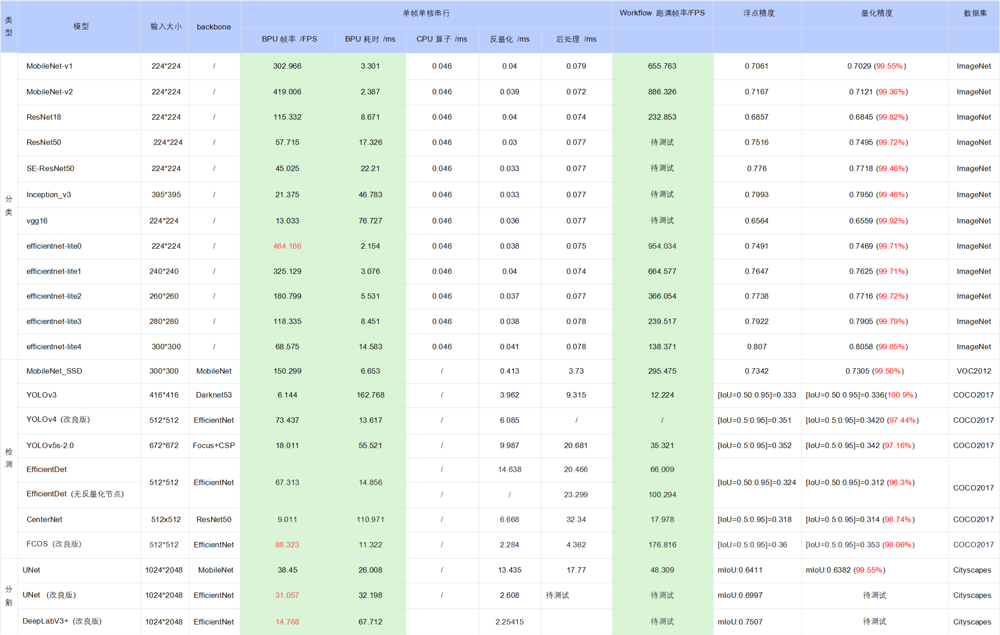
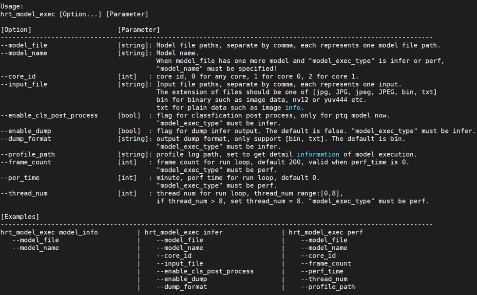
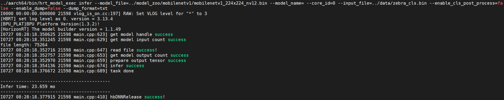
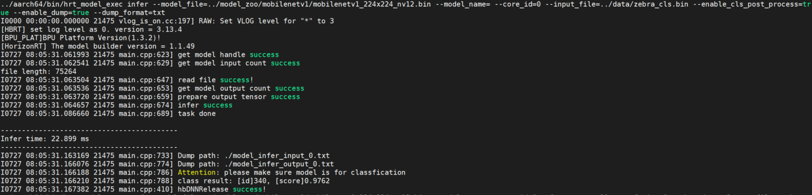
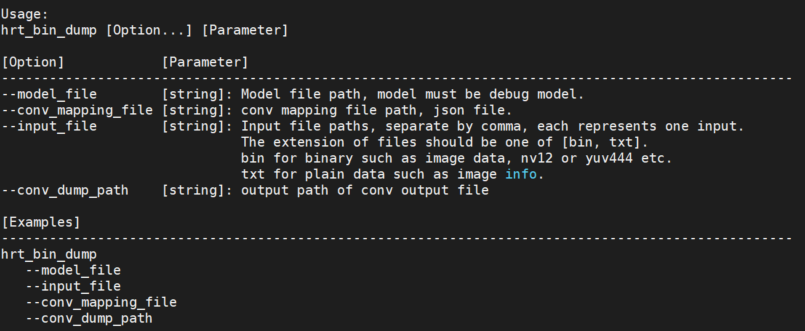
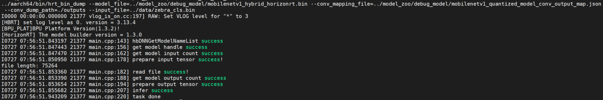

# 模型上板运行应用开发说明

## 模型推理DNN API使用示例说明

### 概述

本章节介绍模型上板运行 horizon_runtime_sample 示例包的具体用法，开发者可以体验并基于这些示例进行应用开发，降低开发门槛。

示例包提供三个方面的示例：

- 模型推理 dnn API使用示例。
- 自定义算子（custom OP）等特殊功能示例。
- 非NV12输入模型的杂项示例。

详细内容请阅读下文。

:::tip 小技巧

  horizon_runtime_sample 示例包获取请参考[《交付物说明》](/toolchain_development/intermediate/environment_config#deliverables_instructions)。 
:::

#### 示例代码包结构介绍

```bash
  +---horizon_runtime_sample
  |── README.md
  ├── code                                      # 示例源码
  │   ├── 00_quick_start                        # 快速入门示例，用mobilenetv1读取单张图片进行推理的示例代码
  │   │   ├── CMakeLists.txt
  │   │   ├── CMakeLists_x86.txt
  │   │   └── src
  │   ├── 01_api_tutorial                       # BPU SDK DNN API使用示例代码
  │   │   ├── CMakeLists.txt
  │   │   ├── mem
  │   │   ├── model
  │   │   ├── resize
  │   │   ├── roi_infer
  │   │   └── tensor
  │   ├── 02_advanced_samples                   # 特殊功能示例
  │   │   ├── CMakeLists.txt
  │   │   ├── custom_identity
  │   │   ├── multi_input
  │   │   ├── multi_model_batch
  │   │   └── nv12_batch
  │   ├── 03_misc                               # 杂项示例
  │   │   ├── CMakeLists.txt
  │   │   ├── lenet_gray
  │   │   └── resnet_feature
  │   ├── CMakeLists.txt
  │   ├── build_ultra.sh                        # aarch64编译脚本   RDK Ultra 使用
  │   ├── build_xj3.sh                          # aarch64编译脚本   RDK X3 使用
  │   └── deps_gcc9.3                           # 编译依赖库
  │       └── aarch64
  ├── ultra
  │   ├── data                                  # 预置数据文件
  │   │   ├── cls_images
  │   │   ├── custom_identity_data
  │   │   ├── det_images
  │   │   └── misc_data
  │   ├── model
  │   │   ├── README.md
  |   |   └── runtime -> ../../../model_zoo/runtime/horizon_runtime_sample   # 软链接指向OE包中的模型，板端运行环境需要自行指定模型路径
  │   ├── script                                # aarch64示例运行脚本
  │   │   ├── 00_quick_start
  │   │   ├── 01_api_tutorial
  │   │   ├── 02_advanced_samples
  │   │   ├── 03_misc
  │   │   └── README.md
  │   └── script_x86                            # x86示例运行脚本
  │       ├── 00_quick_start
  │       └── README.md
  └── xj3
      ├── data                                  # 预置数据文件
      │   ├── cls_images
      │   ├── custom_identity_data
      │   ├── det_images
      │   └── misc_data
      ├── model
      │   ├── README.md
      |   └── runtime -> ../../../model_zoo/runtime/horizon_runtime_sample   # 软链接指向OE包中的模型，板端运行环境需要自行指定模型路径
      ├── script                                # aarch64示例运行脚本
      │   ├── 00_quick_start
      │   ├── 01_api_tutorial
      │   ├── 02_advanced_samples
      │   ├── 03_misc
      │   └── README.md
      └── script_x86                            # x86示例运行脚本
          ├── 00_quick_start
          └── README.md
```

- **00_quick_start**：快速入门示例，基于 ``dnn`` API，用mobilenetv1进行单张图片模型推理和结果解析。
- **01_api_tutorial**： ``dnn`` API使用教学代码， 包括 **mem**， **model**， **resize**， **roi_infer** 和 **tensor** 五部分。
- **02_advanced_samples**：特殊功能示例，包括 **custom_identity**， **multi_input**， **multi_model_batch** 和 **nv12_batch** 功能。。
- **03_misc**：非NV12输入模型的杂项示例。
- **xj3**：RDK X3开发板示例运行脚本，预置了数据和相关模型。
- **ultra**: RDK Ultra开发板示例运行脚本，预置了数据和相关模型。
- **build_xj3.sh**：RDK X3程序一键编译脚本。
- **build_ultra.sh**：RDK Ultra程序一键编译脚本。
- **deps/deps_gcc9.3**：示例代码所需要的三方依赖, 用户在开发自己代码程序的时候可以根据实际情况替换或者裁剪。


:::caution 注意

  私有模型上板运行，请参考 ``00_quick_start/src/run_mobileNetV1_224x224.cc`` 示例代码流程进行代码重写，编译成功后可以在开发板上测试验证！
:::

### 环境构建

#### 开发板准备

1. 拿到开发板后，请将开发版镜像更新到最新版本，升级方法请参考[**系统更新**](../../installation/install_os#flash_system) 章节内容。

2. 确保本地开发机和开发板可以远程连接。 

#### 编译

编译需要当前环境安装好交叉编译工具： ``aarch64-linux-gnu-g++`` ， ``aarch64-linux-gnu-gcc``。 请使用地平线提供的开发机Docker镜像，直接进行编译使用。开发机Docker环境的获取及使用方法，请阅读[**环境安装**](/toolchain_development/intermediate/environment_config#machine_deploy) 章节内容；
根据自身使用的开发板情况，请使用horizon_runtime_sample/code目录下的 ``build_xj3.sh`` 或 ``build_ultra.sh`` 脚本，即可一键编译开发板环境下的可执行程序，可执行程序和对应依赖会自动复制到 ``xj3/script`` 目录下的 ``aarch64`` 目录下 或 ``ultra/script`` 目录下的 ``aarch64`` 目录下。

:::info 备注
  工程通过获取环境变量 ``LINARO_GCC_ROOT`` 来指定交叉编译工具的路径，用户使用之前可以检查本地的环境变量是否为目标交叉编译工具。
  如果需要指定交叉编译工具路径，可以设置环境变量 ``LINARO_GCC_ROOT`` , 或者直接修改脚本 ``build_xj3.sh`` 或 ``build_ultra.sh``，指定变量 ``CC`` 和 ``CXX``。
:::

```shell
  export CC=${GCC_ROOT}/bin/aarch64-linux-gnu-gcc
  export CXX=${GCC_ROOT}/bin/aarch64-linux-gnu-g++
```

### 示例使用

#### basic_samples 示例

模型推理​示例脚本主要在 xj3/script 和 xj3/script_x86 目录下，编译程序后目录结构如下:

```shell

  # RDK X3 使用脚本信息
    ├─script
      ├── 00_quick_start
      │   ├── README.md
      │   └── run_mobilenetV1.sh
      ├── 01_api_tutorial
      │   ├── model.sh
      │   ├── README.md
      │   ├── resize_bgr.sh
      │   ├── resize_y.sh
      │   ├── roi_infer.sh
      │   ├── sys_mem.sh
      │   └── tensor.sh
      ├── 02_advanced_samples
      │   ├── custom_arm_op_custom_identity.sh
      │   ├── README.md
      │   └── run_multi_model_batch.sh
      ├── 03_misc
      │   ├── README.md
      │   ├── run_lenet.sh
      │   └── run_resnet50_feature.sh
      ├── aarch64                        # 编译产生可执行程序及依赖库
      │   ├── bin
      │   │   ├── model_example
      │   │   ├── resize_bgr_example
      │   │   ├── resize_y_example
      │   │   ├── roi_infer
      │   │   ├── run_custom_op
      │   │   ├── run_lenet_gray
      │   │   ├── run_mobileNetV1_224x224
      │   │   ├── run_multi_model_batch
      │   │   ├── run_resnet_feature
      │   │   ├── sys_mem_example
      │   │   └── tensor_example
      │   └── lib
      │       ├── libdnn.so
      │       ├── libhbrt_bernoulli_aarch64.so
      │       └── libopencv_world.so.3.4
      └── README.md

  # RDK Ultra 使用脚本信息
    ├─script
      ├── 00_quick_start
      │   ├── README.md
      │   └── run_mobilenetV1.sh
      ├── 01_api_tutorial
      │   ├── model.sh
      │   ├── README.md
      │   ├── roi_infer.sh
      │   ├── sys_mem.sh
      │   └── tensor.sh
      ├── 02_advanced_samples
      │   ├── plugin
      │   │   └── custom_arm_op_custom_identity.sh
      │   ├── README.md
      │   ├── run_multi_input.sh
      │   ├── run_multi_model_batch.sh
      │   └── run_nv12_batch.sh
      ├── 03_misc
      │   ├── README.md
      │   ├── run_lenet.sh
      │   └── run_resnet50_feature.sh
      ├── aarch64                        # 编译产生可执行程序及依赖库
      │   ├── bin
      │   │   ├── model_example
      │   │   ├── roi_infer
      │   │   ├── run_custom_op
      │   │   ├── run_lenet_gray
      │   │   ├── run_mobileNetV1_224x224
      │   │   ├── run_multi_input
      │   │   ├── run_multi_model_batch
      │   │   ├── run_nv12_batch
      │   │   ├── run_resnet_feature
      │   │   ├── sys_mem_example
      │   │   └── tensor_example
      │   └── lib
      │       ├── libdnn.so
      │       ├── libhbrt_bayes_aarch64.so
      │       └── libopencv_world.so.3.4
      └── README.md

```

:::info 备注
- model文件夹下包含模型的路径，其中 ``runtime`` 文件夹为软链接，链接路径为 ``../../../model_zoo/runtime/horizon_runtime_sample`` ，可直接找到交付包中的模型路径
- 板端运行环境需要将模型放至 ``model`` 文件夹下
:::

#### quick_start

00_quick_start 目录下的是模型推理的快速开始示例：

```shell
  00_quick_start/
  ├── README.md
  └── run_mobilenetV1.sh
```
- ``run_mobilenetV1.sh`` ：该脚本实现使用mobilenetv1模型读取单张图片进行推理的示例功能。


#### api_tutorial

01_api_tutorial 目录下的示例，用于介绍如何使用嵌入式API。其目录包含以下脚本：

``` shell
  ├── model.sh
  ├── resize_bgr.sh
  ├── resize_y.sh
  ├── roi_infer.sh
  ├── sys_mem.sh
  └── tensor.sh
```

-  ``model.sh`` ：该脚本主要实现读取模型信息的功能。
   使用的时候，直接进入 01_api_tutorial 目录，然后直接执行 ``sh model.sh`` 即可，如下所示：

:::caution 注意

  以下示例日志都是使用 **RDK X3** 开发板的实测结果，若使用 **RDK Ultra** 开发板日志信息会有所差异，以具体实测为准！
:::

```shell
    #!/bin/sh
    /userdata/ruxin.song/xj3/script/01_api_tutorial# sh model.sh
    ../aarch64/bin/model_example --model_file_list=../../model/runtime/mobilenetv1/mobilenetv1_nv12_hybrid_horizonrt.bin
    I0000 00:00:00.000000 24638 vlog_is_on.cc:197] RAW: Set VLOG level for "*" to 3
    [HBRT] set log level as 0. version = 3.12.1
    [BPU_PLAT]BPU Platform Version(1.2.2)!
    [HorizonRT] The model builder version = 1.3.3
    I0108 04:19:27.245879 24638 model_example.cc:104] model count:1, model[0]: mobilenetv1_nv12
    I0108 04:19:27.246064 24638 model_example.cc:112] hbDNNGetModelHandle [mobilenetv1_nv12] success!
    I0108 04:19:27.246139 24638 model_example.cc:189] [mobilenetv1_nv12] Model Info:  input num: 1, input[0] validShape: ( 1, 3, 224, 224 ), alignedShape: ( 1, 4, 224, 224 ), tensorLayout: 2, tensorType: 1, output num: 1, output[0] validShape: ( 1, 1000, 1, 1 ), alignedShape: ( 1, 1000, 1, 1 ), tensorLayout: 2, tensorType: 13
```
-  ``resize_bgr.sh`` ：该脚本主要引导如何使用 ``hbDNNResize`` 这个API，
   示例实现的代码功能是将一张1352x900大小的图片，截取图片中坐标为[5，19，340，343]的部分，然后resize到402x416并保存下来。
   使用的时候，直接进入 01_api_tutorial 目录，然后直接执行 ``sh resize_bgr.sh`` 即可，如下所示：

:::caution 注意

  以下示例日志都是使用 **RDK X3** 开发板的实测结果，若使用 **RDK Ultra** 开发板日志信息会有所差异，以具体实测为准！
:::

```shell
    #!/bin/sh

    /userdata/ruxin.song/xj3/script/01_api_tutorial# sh resize_bgr.sh
    ../aarch64/bin/resize_bgr_example --image_file=../../data/det_images/kite.jpg --resize_height=416 --resize_width=402 --resized_image=./resize_bgr.jpg --crop_x1=5 --crop_x2=340 --crop_y1=19 --crop_y2=343
    I0000 00:00:00.000000 24975 vlog_is_on.cc:197] RAW: Set VLOG level for "*" to 3
    I0108 06:58:03.327212 24975 resize_bgr_example.cc:116] Original shape: 1352x900 ,dest shape:402x416 ,aligned shape:402x416
    [HBRT] set log level as 0. version = 3.12.1
    [BPU_PLAT]BPU Platform Version(1.2.2)!
    I0108 06:58:03.328739 24975 resize_bgr_example.cc:139] resize success!
    I0108 06:58:03.335835 24975 resize_bgr_example.cc:143] wait task done finished!
```
  执行成功后，当前目录会成功保存名称为resize_bgr.jpg的图片。

-  ``resize_y.sh`` ：该脚本主要引导如何使用 ``hbDNNResize`` 这个API，示例代码实现的功能是将一张图片resize到416x402。
   使用的时候，直接进入 01_api_tutorial 目录，然后直接执行 ``sh resize_y.sh`` 即可，如下所示：

:::caution 注意

  以下示例日志都是使用 **RDK X3** 开发板的实测结果，若使用 **RDK Ultra** 开发板日志信息会有所差异，以具体实测为准！
:::

```shell
    #!/bin/sh

    /userdata/ruxin.song/xj3/script/01_api_tutorial# sh resize_y.sh
    ../aarch64/bin/resize_y_example --image_file=../../data/det_images/kite.jpg --resize_height=416 --resize_width=402 --resized_image=./resize_y.jpg
    I0000 00:00:00.000000 24992 vlog_is_on.cc:197] RAW: Set VLOG level for "*" to 3
    I0108 06:59:36.887241 24992 resize_y_example.cc:101] Original shape: 1352x900 ,dest shape:402x416 ,aligned shape:402x416
    [HBRT] set log level as 0. version = 3.12.1
    [BPU_PLAT]BPU Platform Version(1.2.2)!
    I0108 06:59:36.888770 24992 resize_y_example.cc:119] resize success
    I0108 06:59:36.891711 24992 resize_y_example.cc:123] wait resize success
    I0108 06:59:36.891798 24992 resize_y_example.cc:129] spent time: 0.003463
```
  ​执行成功后，当前目录会成功保存名称为resize_y.jpg的图片。

- ``roi_infer.sh`` ： 该脚本主要引导如何使用 ``hbDNNRoiInfer`` 这个API，示例代码实现的功能是将一张图片resize到模型输入大小，转为nv12数据，并给定roi框进行模型推理（infer）。
  使用的时候，直接进入 01_api_tutorial 目录，然后直接执行 ``sh roi_infer.sh`` 即可。

- ``sys_mem.sh`` ：该脚本主要引导如何使用 ``hbSysAllocMem``、 ``hbSysFlushMem`` 和 ``hbSysFreeMem`` 这几个API。使用的时候，直接进入 01_api_tutorial 目录，执行 ``sh sys_mem.sh`` 即可。

- ``tensor.sh`` ：该脚本主要引导如何准备模型输入和输出的tensor。
  使用的时候，直接进入 01_api_tutorial 目录，执行 ``sh tensor.sh`` 即可，如下所示：

:::caution 注意

  以下示例日志都是使用 **RDK X3** 开发板的实测结果，若使用 **RDK Ultra** 开发板日志信息会有所差异，以具体实测为准！
:::

```shell
    /userdata/ruxin.song/xj3/script/01_api_tutorial# sh tensor.sh
    Tensor data type:0, Tensor layout: 2, shape:1x1x721x1836, aligned shape:1x1x721x1840
    Tensor data type:1, Tensor layout: 2, shape:1x3x773x329, aligned shape:1x3x773x336
    Tensor data type:2, Tensor layout: 2, shape:1x3x108x1297, aligned shape:1x3x108x1312
    Tensor data type:5, Tensor layout: 2, shape:1x3x858x477, aligned shape:1x3x858x477
    Tensor data type:5, Tensor layout: 0, shape:1x920x102x3, aligned shape:1x920x102x3
    Tensor data type:4, Tensor layout: 2, shape:1x3x723x1486, aligned shape:1x3x723x1486
    Tensor data type:4, Tensor layout: 0, shape:1x372x366x3, aligned shape:1x372x366x3
    Tensor data type:3, Tensor layout: 2, shape:1x3x886x291, aligned shape:1x3x886x291
    Tensor data type:3, Tensor layout: 0, shape:1x613x507x3, aligned shape:1x613x507x3
```

#### advanced_samples

02_advanced_samples 目录下的示例，用于介绍自定义算子特殊功能的使用。其目录包含以下脚本：

```shell
  ├── custom_arm_op_custom_identity.sh
  └── run_multi_model_batch.sh
```

- ``custom_arm_op_custom_identity.sh`` ：该脚本主要实现自定义算子模型推理功能，
  使用的时候，进入 02_advanced_samples 目录, 然后直接执行 ``sh custom_arm_op_custom_identity.sh`` 即可，如下所示：

:::caution 注意

  以下示例日志都是使用 **RDK X3** 开发板的实测结果，若使用 **RDK Ultra** 开发板日志信息会有所差异，以具体实测为准！
:::

```shell
    /userdata/ruxin.song/xj3/script/02_advanced_samples# sh custom_arm_op_custom_identity.sh
    ../aarch64/bin/run_custom_op --model_file=../../model/runtime/custom_op/custom_op_featuremap.bin --input_file=../../data/custom_identity_data/input0.bin,../../data/custom_identity_data/input1.bin
    I0000 00:00:00.000000 30421 vlog_is_on.cc:197] RAW: Set VLOG level for "*" to 3
    I0723 15:06:12.172068 30421 main.cpp:212] hbDNNRegisterLayerCreator success
    I0723 15:06:12.172335 30421 main.cpp:217] hbDNNRegisterLayerCreator success
    [BPU_PLAT]BPU Platform Version(1.3.1)!
    [HBRT] set log level as 0. version = 3.15.3.0
    [DNN] Runtime version = 1.15.2_(3.15.3 HBRT)
    [A][DNN][packed_model.cpp:217](1563865572232) [HorizonRT] The model builder version = 1.13.5
    I0723 15:06:12.240696 30421 main.cpp:232] hbDNNGetModelNameList success
    I0723 15:06:12.240784 30421 main.cpp:239] hbDNNGetModelHandle success
    I0723 15:06:12.240819 30421 main.cpp:245] hbDNNGetInputCount success
    file length: 602112
    file length: 602112
    I0723 15:06:12.243616 30421 main.cpp:268] hbDNNGetOutputCount success
    I0723 15:06:12.244102 30421 main.cpp:297] hbDNNInfer success
    I0723 15:06:12.257903 30421 main.cpp:302] task done
    I0723 15:06:14.277941 30421 main.cpp:306] write output tensor

  模型的第一个输出数据保存至 ``output0.txt`` 文件。

```
- ``run_multi_model_batch.sh`` ：该脚本主要实现多个小模型批量推理功能，
  使用的时候，进入 02_advanced_samples 目录, 然后直接执行 ``sh run_multi_model_batch.sh`` 即可，如下所示：

:::caution 注意

  以下示例日志都是使用 **RDK X3** 开发板的实测结果，若使用 **RDK Ultra** 开发板日志信息会有所差异，以具体实测为准！
:::

```shell
    root@x3sdbx3-hynix2G-3200:/userdata/chaoliang/xj3/script/02_advanced_samples# sh run_multi_model_batch.sh
    ../aarch64/bin/run_multi_model_batch --model_file=../../model/runtime/googlenet/googlenet_224x224_nv12.bin,../../model/runtime/mobilenetv2/mobilenetv2_224x224_nv12.bin --input_file=../../data/cls_images/zebra_cls.jpg,../../data/cls_images/zebra_cls.jpg
    I0000 00:00:00.000000 17060 vlog_is_on.cc:197] RAW: Set VLOG level for "*" to 3
    [HBRT] set log level as 0. version = 3.13.4
    [BPU_PLAT]BPU Platform Version(1.1.1)!
    [HorizonRT] The model builder version = 1.3.18
    [HorizonRT] The model builder version = 1.3.18
    I0317 12:37:18.249785 17060 main.cpp:119] hbDNNInitializeFromFiles success
    I0317 12:37:18.250029 17060 main.cpp:127] hbDNNGetModelNameList success
    I0317 12:37:18.250071 17060 main.cpp:141] hbDNNGetModelHandle success
    I0317 12:37:18.283633 17060 main.cpp:155] read image to nv12 success
    I0317 12:37:18.284270 17060 main.cpp:172] prepare input tensor success
    I0317 12:37:18.284456 17060 main.cpp:184] prepare output tensor success
    I0317 12:37:18.285344 17060 main.cpp:218] infer success
    I0317 12:37:18.296559 17060 main.cpp:223] task done
    I0317 12:37:18.296701 17060 main.cpp:228] googlenet class result id: 340
    I0317 12:37:18.296805 17060 main.cpp:232] mobilenetv2 class result id: 340
    I0317 12:37:18.296887 17060 main.cpp:236] release task success
```
#### misc

03_misc 目录下的示例，用于介绍非nv12输入模型的使用。其目录包含以下脚本：

```shell
  ├── run_lenet.sh
  └── run_resnet50_feature.sh
```
- ``run_lenet.sh`` ：该脚本主要实现Y数据输入的lenet模型推理功能，
  使用的时候，进入 03_misc 目录, 然后直接执行 ``sh run_lenet.sh`` 即可，如下所示：

:::caution 注意

  以下示例日志都是使用 **RDK X3** 开发板的实测结果，若使用 **RDK Ultra** 开发板日志信息会有所差异，以具体实测为准！
:::

```shell
    /userdata/ruxin.song/xj3/script/03_misc# sh run_lenet.sh
    ../aarch64/bin/run_lenet_gray --model_file=../../model/runtime/lenet_gray/lenet_gray_hybrid_horizonrt.bin --data_file=../../data/misc_data/7.bin --image_height=28 --image_width=28 --top_k=5
    I0000 00:00:00.000000 25139 vlog_is_on.cc:197] RAW: Set VLOG level for "*" to 3
    [HBRT] set log level as 0. version = 3.12.1
    [BPU_PLAT]BPU Platform Version(1.2.2)!
    [HorizonRT] The model builder version = 1.3.3
    I0108 07:23:35.507514 25139 run_lenet_gray.cc:145] hbDNNInitializeFromFiles success
    I0108 07:23:35.507737 25139 run_lenet_gray.cc:153] hbDNNGetModelNameList success
    I0108 07:23:35.507771 25139 run_lenet_gray.cc:160] hbDNNGetModelHandle success
    I0108 07:23:35.508070 25139 run_lenet_gray.cc:176] prepare y tensor success
    I0108 07:23:35.508178 25139 run_lenet_gray.cc:189] prepare tensor success
    I0108 07:23:35.509909 25139 run_lenet_gray.cc:200] infer success
    I0108 07:23:35.510721 25139 run_lenet_gray.cc:205] task done
    I0108 07:23:35.510790 25139 run_lenet_gray.cc:210] task post process finished
    I0108 07:23:35.510832 25139 run_lenet_gray.cc:217] TOP 0 result id: 7
    I0108 07:23:35.510857 25139 run_lenet_gray.cc:217] TOP 1 result id: 9
    I0108 07:23:35.510879 25139 run_lenet_gray.cc:217] TOP 2 result id: 3
    I0108 07:23:35.510903 25139 run_lenet_gray.cc:217] TOP 3 result id: 4
    I0108 07:23:35.510927 25139 run_lenet_gray.cc:217] TOP 4 result id: 2
```
- ``run_resnet50_feature.sh`` ：该脚本主要实现feature数据输入的resnet50模型推理功能，示例代码对feature数据做了quantize和padding以满足模型的输入条件，然后输入到模型进行infer。
  使用的时候，进入 03_misc 目录, 然后直接执行 ``sh run_resnet50_feature.sh`` 即可，如下所示：

:::caution 注意

  以下示例日志都是使用 **RDK X3** 开发板的实测结果，若使用 **RDK Ultra** 开发板日志信息会有所差异，以具体实测为准！
:::

```shell
    /userdata/ruxin.song/xj3/script/03_misc# sh run_resnet50_feature.sh
    ../aarch64/bin/run_resnet_feature --model_file=../../model/runtime/resnet50_feature/resnet50_feature_hybrid_horizonrt.bin --data_file=../../data/misc_data/np_0 --top_k=5
    I0000 00:00:00.000000 25155 vlog_is_on.cc:197] RAW: Set VLOG level for "*" to 3
    [HBRT] set log level as 0. version = 3.12.1
    [BPU_PLAT]BPU Platform Version(1.2.2)!
    [HorizonRT] The model builder version = 1.3.3
    I0108 07:25:41.300466 25155 run_resnet_feature.cc:136] hbDNNInitializeFromFiles success
    I0108 07:25:41.300708 25155 run_resnet_feature.cc:144] hbDNNGetModelNameList success
    I0108 07:25:41.300741 25155 run_resnet_feature.cc:151] hbDNNGetModelHandle success
    I0108 07:25:41.302760 25155 run_resnet_feature.cc:166] prepare feature tensor success
    I0108 07:25:41.302919 25155 run_resnet_feature.cc:176] prepare tensor success
    I0108 07:25:41.304678 25155 run_resnet_feature.cc:187] infer success
    I0108 07:25:41.373052 25155 run_resnet_feature.cc:192] task done
    I0108 07:25:41.373328 25155 run_resnet_feature.cc:197] task post process finished
    I0108 07:25:41.373374 25155 run_resnet_feature.cc:204] TOP 0 result id: 74
    I0108 07:25:41.373399 25155 run_resnet_feature.cc:204] TOP 1 result id: 815
    I0108 07:25:41.373422 25155 run_resnet_feature.cc:204] TOP 2 result id: 73
    I0108 07:25:41.373445 25155 run_resnet_feature.cc:204] TOP 3 result id: 78
    I0108 07:25:41.373468 25155 run_resnet_feature.cc:204] TOP 4 result id: 72
```
### 辅助工具和常用操作

#### 日志

本章节主要包括 ``示例日志`` 和 ``模型推理 DNN API日志`` 两部分。
其中示例日志是指交付包示例代码中的应用日志；模型推理 dnn API日志是指嵌入式dnn库中的日志。用户根据不同的需求可以获取不同的日志信息。

#### 示例日志

示例日志主要采用glog中的vlog，basic_samples参考示例中，日志内容会全部输出。

#### 模型推理 DNN API日志

关于模型推理 DNN API日志的配置，请阅读[《模型推理DNN API使用说明》](/clang_development/cdev_dnn_api/model_debug#configuration_information) 文档中的 ``配置信息`` 一节内容。

## 公版模型性能精度测评说明

### 公版模型性能精度指标

下表提供了典型深度神经网络模型在X3处理器上的性能、精度指标。



:::caution 注意

  1. 表格中的数据均为在地平线RDK X3开发板的实测结果，测试模型均来自于[horizon_model_convert_sample](../beginner.md#env_install) 模型示例包；

  2. 对于模型示例包中的 BPU/CPU 混合异构模型，单帧的耗时主要由输入量化CPU节点、模型BPU算子、模型CPU算子、输出反量化CPU节点、CPU后处理等模块构成，具体说明如下：

      a. 输入量化CPU节点：完成float32到int8的输入量化操作，该节点只在使用 featuremap 输入的模型中包含。量化耗时与输入 shape 大小成正比

      b. 模型CPU算子：
      
          ⅰ. 检测模型中未包含 CPU 算子
            
          ⅱ. 分类模型尾部的 Softmax 和 Reshape 为 CPU 算子
            
          ⅲ. 分割模型 DeepLabV3+ 尾部的 Argmax 为 CPU 算子

      c. 输出反量化CPU节点：完成int8到float32的输出反量化操作。量化耗时与输出 shape 大小成正比

      d. 地平线目前支持将模型的 量化/反量化节点手动摘除，由用户自行融入前后处理代码中实现，以减少数据重复遍历的损耗。以 EfficientDet 模型为例，摘除了反量化节点合入后处理，推理性能从 66FPS提高到100FPS

      e. 目前地平线示例模型的后处理均未做针对性的性能优化，您可以根据实际需求采用如近似高效实现等优化手段进行代码级加速

  3. 在实际应用中，BPU 和 CPU 可以并发运行，提高整体推理速度。

  4. 若实测性能与上述表格的测试结果不一致，有几个方面可能导致此种情况：

      a. DDR带宽的影响，开发板只能运行ai_benchmark程序。

      b. 算法工具链版本与系统镜像版本不完全匹配，最理想的情况是配套使用发布包的算法工具链和系统镜像。

      c. CPU降频影响，目前开发板重启后默认启用自动降频，为了获得最好的性能，您需要在开发板上执行关闭降频命令： ``echo performance > /sys/devices/system/cpu/cpufreq/policy0/scaling_governor``。
:::

### 评测方法说明

#### 简介

本章节介绍公版模型精度性能评测 ai_benchmark 示例包的具体用法， 示例包中预置了源码、可执行程序和评测脚本，开发者可以直接在地平线开发板上体验并基于这些示例进行嵌入式应用开发，降低开发门槛。

示例包提供常见的分类、检测和分割模型的性能评测和精度评测示例，详细内容请阅读下文。

:::tip 小技巧

  公版模型精度性能评测 ai_benchmark 示例包获取，请参考[《交付物说明》](/toolchain_development/intermediate/environment_config#deliverables_instructions)。 
:::

#### 示例代码包结构

```bash
  ai_benchmark/code                     # 示例源码文件夹
  ├── build_ptq_xj3.sh                  # RDK X3 使用
  ├── build_ptq_ultra.sh                # RDK Ultra 使用
  ├── CMakeLists.txt
  ├── deps/deps_gcc9.3                  # 第三方依赖库，gcc9.3为deps_gcc9.3
  │   ├── aarch64
  │   └── vdsp
  ├── include                           # 源码头文件
  │   ├── base
  │   ├── input
  │   ├── method
  │   ├── output
  │   ├── plugin
  │   └── utils
  ├── README.md
  └── src                               # 示例源码
      ├── input
      ├── method
      ├── output
      ├── plugin
      ├── simple_example.cc             # 示例主程序
      └── utils

  ai_benchmark/xj3                      # 示例包运行环境
  └── ptq                               # PTQ方案模型示例
      ├── data                          # 模型精度评测数据集
      ├── mini_data                     # 模型性能评测数据集
      │   ├── cifar10
      │   ├── cityscapes
      │   ├── coco
      │   ├── culane
      │   ├── flyingchairs
      │   ├── imagenet
      │   ├── kitti3d
      │   ├── mot17
      │   ├── nuscenes
      │   ├── nuscenes_lidar
      │   └── voc
      ├── model                         # PTQ方案nv12模型
      │   ├── README.md
      │   └── runtime -> ../../../../model_zoo/runtime/ai_benchmark/ptq   # 软链接指向OE包中的模型，板端运行环境需要自行指定模型路径
      ├── README.md
      ├── script                        # 执行脚本
      │   ├── aarch64                   # 编译产生可执行文件及依赖库
      │   ├── classification            # 分类模型示例
      │   │   ├── efficientnet_lite0
      │   │   ├── efficientnet_lite1
      │   │   ├── efficientnet_lite2
      │   │   ├── efficientnet_lite3
      │   │   ├── efficientnet_lite4
      │   │   ├── googlenet
      │   │   ├── mobilenetv1
      │   │   ├── mobilenetv2
      │   │   └── resnet18
      │   ├── config                    # 模型推理配置文件
      │   │   └── data_name_list  
      │   ├── detection                 # 检测模型示例
      │   │   ├── centernet_resnet50
      │   │   ├── efficientdetd0
      │   │   ├── fcos_efficientnetb0
      │   │   ├── preq_qat_fcos_efficientnetb0 
      │   │   ├── preq_qat_fcos_efficientnetb1
      │   │   ├── preq_qat_fcos_efficientnetb2
      │   │   ├── ssd_mobilenetv1
      │   │   ├── yolov2_darknet19
      │   │   ├── yolov3_darknet53
      │   │   └── yolov5s
      │   ├── segmentation              # 分割模型示例
      │   │   ├── deeplabv3plus_efficientnetb0
      │   │   ├── fastscnn_efficientnetb0   
      │   │   └── unet_mobilenet
      │   ├── base_config.sh            # 基础配置
      │   └── README.md
      └── tools                         # 精度评测工具
          ├── python_tools
          └── README.md

  ai_benchmark/ultra                       # 示例包运行环境
  └── ptq                               # PTQ方案模型示例
      ├── data                          # 模型精度评测数据集
      ├── mini_data                     # 模型性能评测数据集
      │   ├── cifar10
      │   ├── cityscapes
      │   ├── coco
      │   ├── culane
      │   ├── flyingchairs
      │   ├── imagenet
      │   ├── kitti3d
      │   ├── mot17
      │   ├── nuscenes
      │   ├── nuscenes_lidar
      │   └── voc
      ├── model                         # PTQ方案nv12模型
      │   │   ├── README.md
      │   │   └── runtime -> ../../../../model_zoo/runtime/ai_benchmark/ptq   # 软链接指向OE包中的模型，板端运行环境需要自行指定模型路径
      ├── README.md
      ├── script                        # 执行脚本
      │   ├── aarch64                   # 编译产生可执行文件及依赖库
      │   ├── classification            # 分类模型示例
      │   │   ├── efficientnasnet_m
      │   │   ├── efficientnasnet_s
      │   │   ├── efficientnet_lite0
      │   │   ├── efficientnet_lite1
      │   │   ├── efficientnet_lite2
      │   │   ├── efficientnet_lite3
      │   │   ├── efficientnet_lite4
      │   │   ├── googlenet
      │   │   ├── mobilenetv1
      │   │   ├── mobilenetv2
      │   │   ├── resnet18
      │   │   └── vargconvnet
      │   ├── config                    # 模型推理配置文件
      │   │   └── model  
      │   ├── detection                 # 检测模型示例
      │   │   ├── centernet_resnet101
      │   │   ├── preq_qat_fcos_efficientnetb0
      │   │   ├── preq_qat_fcos_efficientnetb2
      │   │   ├── preq_qat_fcos_efficientnetb3
      │   │   ├── ssd_mobilenetv1
      │   │   ├── yolov2_darknet19
      │   │   ├── yolov3_darknet53
      │   │   ├── yolov3_vargdarknet
      │   │   └── yolov5x
      │   ├── segmentation              # 分割模型示例
      │   │   ├── deeplabv3plus_efficientnetb0
      │   │   ├── deeplabv3plus_efficientnetm1
      │   │   ├── deeplabv3plus_efficientnetm2
      │   │   └── fastscnn_efficientnetb0
      │   ├── env.sh                    # 基础环境脚本
      │   └── README.md
      └── tools                         # 精度评测工具
             ├── python_tools
             └── README.md
```

- **code**：该目录内是评测程序的源码，用来进行模型性能和精度评测。
- **xj3**： 提供了已经编译好的应用程序，以及各种评测脚本，用来测试多种模型在地平线BPU上运行的性能，精度等(**RDK X3** 使用)。
- **ultra**： 提供了已经编译好的应用程序，以及各种评测脚本，用来测试多种模型在地平线BPU上运行的性能，精度等(**RDK Ultra** 使用)。
- **build_ptq_xj3.sh**：开发板程序一键编译脚本(**RDK X3** 使用)。
- **build_ptq_ultra.sh**：开发板程序一键编译脚本(**RDK Ultra** 使用)。
- **deps/deps_gcc9.3**：示例代码所需要的依赖，主要如下所示:

```bash
  gflags  glog  hobotlog nlohmann opencv  rapidjson
```

#### 示例模型


我们提供了开源的模型库，里面包含常用的分类、检测和分割模型，模型的命名规则为：{model_name}_{backbone}_{input_size}_{input_type}，开发者可以直接使用。

:::tip 小技巧
  以下表格中的bin模型都是通过 horizon_model_convert_sample 模型转换示例包转换编译出来的，请阅读 [horizon_model_convert_sample](../beginner.md#env_install) 章节内容进行获取。 
:::

  | MODEL              | MODEL NAME                                   |
  |--------------------|----------------------------------------------|
  | centernet_resnet101          | centernet_resnet101_512x512_nv12.bin             |
  | deeplabv3plus_efficientnetb0 | deeplabv3plus_efficientnetb0_1024x2048_nv12.bin  |  
  | deeplabv3plus_efficientnetm1 | deeplabv3plus_efficientnetm1_1024x2048_nv12.bin  |
  | efficientnasnet_m            | efficientnasnet_m_300x300_nv12.bin               |
  | efficientnet_lite4           | efficientnet_lite4_300x300_nv12.bin              |
  | fastscnn_efficientnetb0      | fastscnn_efficientnetb0_1024x2048_nv12.bin       |
  | googlenet                    | googlenet_224x224_nv12.bin                       |
  | mobilenetv1                  | mobilenetv1_224x224_nv12.bin                     |
  | mobilenetv2                  | mobilenetv2_224x224_nv12.bin                     |
  | preq_qat_fcos_efficientnetb0 | fcos_efficientnetb0_512x512_nv12.bin             |
  | preq_qat_fcos_efficientnetb2 | fcos_efficientnetb2_768x768_nv12.bin             |
  | resnet18                     | resnet18_224x224_nv12.bin                        |
  | ssd_mobilenetv1              | ssd_mobilenetv1_300x300_nv12.bin                 |
  | vargconvnet                  | vargconvnet_224x224_nv12.bin                     |
  | yolov3_darknet53             | yolov3_darknet53_416x416_nv12.bin                |
  | yolov5s                      | yolov5s_672x672_nv12.bin                         |
  | yolov5x                      | yolov5x_672x672_nv12.bin                         |


#### 公共数据集

测评示例中用到的数据集主要有VOC数据集、COCO数据集、ImageNet、Cityscapes数据集、FlyingChairs数据集、KITTI数据集、Culane数据集、Nuscenes数据集和Mot17数据集。

请在linux环境下进行下载，获取方式如下：

```shell
  VOC：http://host.robots.ox.ac.uk/pascal/VOC/  （使用VOC2012版本）

  COCO：https://cocodataset.org/#download

  ImageNet：https://www.image-net.org/download.php
  
  Cityscapes：https://github.com/mcordts/cityscapesScripts
  
  FlyingChairs：https://lmb.informatik.uni-freiburg.de/resources/datasets/FlyingChairs.en.html

  KITTI3D：https://www.cvlibs.net/datasets/kitti/eval_object.php?obj_benchmark=3d

  CULane：https://xingangpan.github.io/projects/CULane.html

  nuScenes：https://www.nuscenes.org/nuscenes#download 

  mot17：https://opendatalab.com/MOT17
```

#### 环境构建

#### 开发板准备

1. 拿到开发板后，请将开发版镜像更新到最新版本，升级方法请参考[**安装系统**](../../installation/install_os#flash_system) 章节内容。

2. 确保本地开发机和开发板可以远程连接。

#### 编译环境准备

编译需要当前环境安装好交叉编译工具 ``gcc-ubuntu-9.3.0-2020.03-x86_64-aarch64-linux-gnu``。请使用地平线提供的开发机Docker镜像，直接进行编译使用。开发机Docker环境的获取及使用方法，请阅读[**环境安装**](/toolchain_development/intermediate/environment_config#machine_deploy) 章节内容；
请使用code目录下的 ``build_ptq_xj3.sh`` 或 ``build_ptq_ultra.sh`` 脚本，即可一键编译开发板环境下的可执行程序，可执行程序和对应依赖会自动复制到 ``xj3/ptq/script`` 目录下的 ``aarch64`` 目录下 或 ``ultra/ptq/script`` 目录下的 ``aarch64`` 目录下。

:::info 备注
  需要注意 ``build_ptq_xj3.sh`` 和 ``build_ptq_ultra.sh`` 脚本里指定的交叉编译工具链的位置是 ``/opt`` 目录下，用户如果安装在其他位置，可以手动修改下脚本。
:::
```shell
  export CC=/opt/gcc-ubuntu-9.3.0-2020.03-x86_64-aarch64-linux-gnu/bin/aarch64-linux-gnu-gcc
  export CXX=/opt/gcc-ubuntu-9.3.0-2020.03-x86_64-aarch64-linux-gnu/bin/aarch64-linux-gnu-g++
```

#### 测评示例使用说明

评测示例脚本主要在 ``script`` 和 ``tools`` 目录下。 script是开发板上运行的评测脚本，包括常见分类，检测和分割模型。每个模型下面有三个脚本，分别表示：

- fps.sh：利用多线程调度实现fps统计，用户可以根据需求自由设置线程数。
- latency.sh：实现单帧延迟统计（一个线程，单帧）。
- accuracy.sh：用于精度评测。

:::caution 注意

  以下示例是使用 **RDK X3** 开发板的实测结果，若使用 **RDK Ultra** 开发板信息会有所差异，以具体实测为准！
:::

```shell
  script:

  ├── aarch64             # 编译产生的可执行文件及依赖库
  │   ├── bin
  │   └── lib
  ├── base_config.sh      # 基础配置
  ├── config              # image_name配置文件
  │   ├── data_name_list
  |   |   ├── coco_detlist.list
  │   |   ├── imagenet.list
  │   |   └── voc_detlist.list
  ├── classification      # 分类模型评测
  │   ├── efficientnet_lite0
  │   │   ├── accuracy.sh
  │   │   ├── fps.sh
  │   │   ├── latency.sh
  │   │   ├── workflow_accuracy.json
  │   │   ├── workflow_fps.json
  │   │   └── workflow_latency.json
  │   ├── mobilenetv1
  │   ├── .....
  │   └── resnet18
  ├── detection           # 检测模型
  |   ├── centernet_resnet50
  │   │   ├── accuracy.sh
  │   │   ├── fps.sh
  │   │   ├── latency.sh
  │   │   ├── workflow_accuracy.json
  │   │   ├── workflow_fps.json
  │   │   └── workflow_latency.json
  │   ├── yolov2_darknet19
  │   ├── yolov3_darknet53
  │   ├── ...
  │   └── efficientdetd0
  └── segmentation       # 分割模型
      ├── deeplabv3plus_efficientnetb0
      │   ├── accuracy.sh
      │   ├── fps.sh
      │   ├── latency.sh
      │   ├── workflow_accuracy.json
      │   ├── workflow_fps.json
      │   └── workflow_latency.json
      ├── fastscnn_efficientnetb0
      └── unet_mobilenet

```
tools目录下是精度评测需要的脚本。主要包括 ``python_tools`` 下的精度计算脚本。

```shell
  tools:

  python_tools
    └── accuracy_tools
        ├── cityscapes_metric.py
        ├── cls_eval.py
        ├── coco_metric.py
        ├── coco_det_eval.py
        ├── config.py
        ├── parsing_eval.py
        ├── voc_det_eval.py
        └── voc_metric.py

```
:::caution 注意

  评测前需要执行以下命令，将 ``ptq`` 目录拷贝到开发板上，然后将 ``model_zoo/runtime`` 拷贝到 ``ptq/model`` 目录下。
:::

:::caution 注意

  以下示例是使用 **RDK X3** 开发板的实测结果，若使用 **RDK Ultra** 开发板信息会有所差异，以具体实测为准！
:::

```shell
  scp -r ai_toolchain_package/Ai_Toolchain_Package-release-vX.X.X-OE-vX.X.X/ai_benchmark/xj3/ptq root@192.168.1.10:/userdata/ptq/

  scp -r model_zoo/runtime root@192.168.1.10:/userdata/ptq/model/
```


#### 性能评测


性能评测分为latency和fps两方面。

- 测评脚本使用说明


进入到需要评测的模型目录下，执行 ``sh latency.sh`` 即可测试出单帧延迟。如下图所示：

:::caution 注意

  以下示例是使用 **RDK X3** 开发板的实测结果，若使用 **RDK Ultra** 开发板信息会有所差异，以具体实测为准！
:::

```shell
  I0419 02:35:07.041095 39124 output_plugin.cc:80]  Infer latency:  [avg:  13.124ms,  max:  13.946ms,  min:  13.048ms], Post process latency: [avg:  3.584ms,  max:  3.650ms,  min:  3.498ms].
```

:::info 备注
  - ``infer`` 表示模型推理耗时。
  - ``Post process`` 表示后处理耗时。
:::

进入到需要评测的模型目录下执行 ``sh fps.sh`` 即可测试出帧率。如下图所示：

:::caution 注意

  以下示例是使用 **RDK X3** 开发板的实测结果，若使用 **RDK Ultra** 开发板信息会有所差异，以具体实测为准！
:::

```shell
  I0419 02:35:00.044417 39094 output_plugin.cc:109]  Throughput: 176.39fps      # 模型帧率
```
:::info 备注

  该功能采用多线程并发方式，旨在让模型可以在BPU上达到极致的性能。由于多线程并发及数据采样的原因，在程序启动阶段帧率值会较低，之后帧率会上升并逐渐趋于稳定，帧率的浮动范围控制在0.5%之内。
:::

- 命令行参数说明

:::caution 注意

  以下示例是使用 **RDK X3** 开发板的实测结果，若使用 **RDK Ultra** 开发板信息会有所差异，以具体实测为准！
:::

``fps.sh`` 脚本内容如下：

```shell

  #!/bin/sh

  source ../../base_config.sh
  export SHOW_FPS_LOG=1
  export STAT_CYCLE=10                             # 设置环境变量，FPS 统计周期

  ${app} \
    --config_file=workflow_fps.json \
    --log_level=1
```
``latency.sh`` 脚本内容如下：

```shell
  #!/bin/sh

  source ../../base_config.sh
  export SHOW_LATENCY_LOG=1                            # 设置环境变量，打印 LATENCY 级别log
  export STAT_CYCLE=5                                  # 设置环境变量，LATENCY 统计周期

  ${app} \
    --config_file=workflow_latency.json \
    --log_level=1
```

- 配置文件说明

:::info 备注

  注意：max_cache参数生效时会预处理图片并读取到内存中，为保障您的程序稳定运行，请不要设置过大的值，建议您的数值设置不超过30。
:::
以fcos_efficientnetb0模型为例，workflow_fps.json 配置文件内容如下：

```
 {
    "input_config": {
      "input_type": "image",                                    # 输入数据格式，支持图像或者bin文件
      "height": 512,                                            # 输入数据高度
      "width": 512,                                             # 输入数据宽度
      "data_type": 1,                                           # 输入数据类型：HB_DNN_IMG_TYPE_NV12
      "image_list_file": "../../../mini_data/coco/coco.lst",    # 预处理数据集lst文件所在路径
      "need_pre_load": true,                                    # 是否使用预加载方式读取数据集
      "limit": 10,
      "need_loop": true,                                        # 是否循环读取数据进行评测
      "max_cache": 10
    },
    "output_config": {
      "output_type": "image",                                   # 可视化输出数据类型
      "image_list_enable": true,
      "in_order": false                                         # 是否按顺序输出
    },
    "workflow": [
      {
        "method_type": "InferMethod",                           # Infer推理方式
        "unique_name": "InferMethod",
        "method_config": {
          "core": 0,                                            # 推理core id
          "model_file": "../../../model/runtime/fcos_efficientnetb0/fcos_efficientnetb0_512x512_nv12.bin" # 模型文件
        }
      },
      {
        "thread_count": 4,                                      # 后处理线程数
        "method_type": "PTQFcosPostProcessMethod",              # 后处理方法
        "unique_name": "PTQFcosPostProcessMethod",
        "method_config": {                                      # 后处理参数
          "strides": [
            8,
            16,
            32,
            64,
            128
          ],
          "class_num": 80,
          "score_threshold": 0.5,
          "topk": 1000,
          "det_name_list": "../../config/data_name_list/coco_detlist.list"
        }
      }
    ]
  }
```

workflow_latency.json 如下：

```
 {
    "input_config": {
      "input_type": "image",
      "height": 512,
      "width": 512,
      "data_type": 1,
      "image_list_file": "../../../mini_data/coco/coco.lst",
      "need_pre_load": true,
      "limit": 1,
      "need_loop": true,
      "max_cache": 10
    },
    "output_config": {
      "output_type": "image",
      "image_list_enable": true
    },
    "workflow": [
      {
        "method_type": "InferMethod",
        "unique_name": "InferMethod",
        "method_config": {
          "core": 0,
          "model_file": "../../../model/runtime/fcos_efficientnetb0/fcos_efficientnetb0_512x512_nv12.bin"
        }
      },
      {
        "thread_count": 1,
        "method_type": "PTQFcosPostProcessMethod",
        "unique_name": "PTQFcosPostProcessMethod",
        "method_config": {
          "strides": [
            8,
            16,
            32,
            64,
            128
          ],
          "class_num": 80,
          "score_threshold": 0.5,
          "topk": 1000,
          "det_name_list": "../../config/data_name_list/coco_detlist.list"
        }
      }
    ]
  }
```

#### 精度评测


模型精度评测分为四步：

1. 数据预处理。
2. 数据挂载。
3. 模型推理。
4. 精度计算。

- #### 数据预处理{#data_preprocess}

对于PTQ模型：数据预处理需要在x86开发机环境下运行 ``hb_eval_preprocess`` 工具，对数据集进行预处理。
所谓预处理是指图片数据在送入模型之前的特定处理操作，例如：图片resize、crop和padding等。
该工具集成于开发机模型转换编译的环境中，原始数据集经过工具预处理之后，会生成模型对应的前处理二进制文件.bin文件集.
直接运行 ``hb_eval_preprocess --help`` 可查看工具使用规则。

:::tip 小技巧

  1. 关于 ``hb_eval_preprocess`` 工具命令行参数，可键入 ``hb_eval_preprocess -h``， 或查看 PTQ量化原理及步骤说明的
     [**hb_eval_preprocess工具**](/toolchain_development/intermediate/ptq_process#hb_eval_preprocess) 一节内容。
     :::

下面将详细介绍示例包中每一个模型对应的数据集，以及对应数据集的预处理操作：

- ``VOC数据集`` ：该数据集主要用于ssd_mobilenetv1模型的评测，
  其目录结构如下，示例中主要用到 ``Main`` 文件下的val.txt文件， ``JPEGImages`` 中的源图片和 ``Annotations`` 中的标注数据：

```shell
  .
  └── VOCdevkit                  # 根目录
      └── VOC2012                # 不同年份的数据集，这里只下载了2012的，还有2007等其它年份的
          ├── Annotations        # 存放xml文件，与JPEGImages中的图片一一对应，解释图片的内容等等
          ├── ImageSets          # 该目录下存放的都是txt文件，txt文件中每一行包含一个图片的名称，末尾会加上±1表示正负样本
          │   ├── Action
          │   ├── Layout
          │   ├── Main
          │   └── Segmentation
          ├── JPEGImages         # 存放源图片
          ├── SegmentationClass  # 存放的是图片，语义分割相关
          └── SegmentationObject # 存放的是图片，实例分割相关
```

对数据集进行预处理：

```bash
  hb_eval_preprocess -m ssd_mobilenetv1 -i VOCdevkit/VOC2012/JPEGImages -v VOCdevkit/VOC2012/ImageSets/Main/val.txt -o ./pre_ssd_mobilenetv1
```
- ``COCO数据集`` ：该数据集主要用于yolov2_darknet19、yolov3_darknet53、yolov5s、efficientdetd0、fcos_efficientnetb0和centernet_resnet50等检测模型的评测，
  其目录如下，示例中主要用到 ``annotations`` 文件夹下的instances_val2017.json标注文件和 ``images`` 中的图片：

```shell
  .
  ├── annotations    # 存放标注数据
  └── images         # 存放源图片
```

对数据集进行预处理：

```bash
  hb_eval_preprocess -m model_name -i coco/coco_val2017/images -o ./pre_model_name
```
- ``ImageNet数据集`` ：该数据集主要用于EfficientNet_lite0、EfficientNet_Lite1、EfficientNet_Lite2、EfficientNet_Lite3、EfficientNet_Lite4、MobileNet、GoogleNet、ResNet等分类模型的评测，
  示例中主要用到了标注文件val.txt 和 ``val`` 目录中的源图片:

```shell
  .
  ├── val.txt
  └── val
```
对数据集进行预处理：

```bash
  hb_eval_preprocess -m model_name -i imagenet/val -o ./pre_model_name
```
- ``Cityscapes数据集`` ：该数据集用于deeplabv3plus_efficientnetb0、deeplabv3plus_efficientnetm1、deeplabv3plus_efficientnetm2和fastscnn_efficientnetb0等分割模型的评测。
  示例中主要用到了 ``./gtFine/val`` 中的标注文件和 ``./leftImg8bit/val`` 中的源图片。

```shell
  .
  ├── gtFine
  │   └── val
  │       ├── frankfurt
  │       ├── lindau
  │       └── munster
  └── leftImg8bit
      └── val
          ├── frankfurt
          ├── lindau
          └── munster
```

对数据集进行预处理：

```bash
  hb_eval_preprocess -m unet_mobilenet -i cityscapes/leftImg8bit/val -o ./pre_unet_mobilenet
```
示例中精度计算脚本的运行流程是：

1、根据 ``workflow_accurary.json`` 中的 ``image_list_file`` 参数值，去寻找对应数据集的 ``lst`` 文件；

2、根据 ``lst`` 文件存储的前处理文件路径信息，去加载每一个前处理文件，然后进行推理

所以，生成预处理文件之后，需要生成对应的lst文件，将每一张前处理文件的路径写入到lst文件中，而这个路径与数据集在开发板端的存放位置有关。
这里我们推荐其存放位置与 ``script`` 文件夹同级目录，如下：

```bash

  # RDK X3 使用如下格式：
  |-- ptq
  |   |-- data
  |   |   |-- cityscapes
  |   |   |   -- xxxx.bin             # 前处理好的二进制文件
  |   |   |   -- ....
  |   |   |   -- cityscapes.lst       # lst文件：记录每一个前处理文件的路径
  |   |   |-- coco
  |   |   |   -- xxxx.bin
  |   |   |   -- ....
  |   |   |   -- coco.lst
  |   |   |-- imagenet
  |   |   |   -- xxxx.bin
  |   |   |   -- ....
  |   |   |   -- imagenet.lst
  |   |   `-- voc
  |   |   |   -- xxxx.bin
  |   |   |   -- ....
  |   |       `-- voc.lst
  |   |-- model
  |   |   |-- ...
  |   |-- script
  |   |   |-- ...

  # RDK Ultra 使用如下格式：
  |-- ptq
  |   |-- data
  |   |   |-- cityscapes
  |   |   |   |-- pre_deeplabv3plus_efficientnetb0
  |   |   |   |   |-- xxxx.bin                            # 前处理好的二进制文件
  |   |   |   |   |-- ....
  |   |   |   |-- pre_deeplabv3plus_efficientnetb0.lst    # lst文件：记录每一个前处理文件的路径
  |   |   |   |-- pre_deeplabv3plus_efficientnetm1
  |   |   |   |-- pre_deeplabv3plus_efficientnetm1.lst
  |   |   |   |-- pre_deeplabv3plus_efficientnetm2
  |   |   |   |-- pre_deeplabv3plus_efficientnetm2.lst
  |   |   |   |-- pre_fastscnn_efficientnetb0
  |   |   |   |-- pre_fastscnn_efficientnetb0.lst
  |   |   |-- coco
  |   |   |   |-- pre_centernet_resnet101
  |   |   |   |   |-- xxxx.bin
  |   |   |   |   |-- ....
  |   |   |   |-- pre_centernet_resnet101.lst
  |   |   |   |-- pre_yolov3_darknet53
  |   |   |   |-- pre_yolov3_darknet53.lst
  |   |   |   |-- pre_yolov3_vargdarknet
  |   |   |   |-- pre_yolov3_vargdarknet.lst
  |   |   |   |-- pre_yolov5x
  |   |   |   |-- pre_yolov5x.lst
  |   |   |   |-- pre_preq_qat_fcos_efficientnetb0
  |   |   |   |-- pre_preq_qat_fcos_efficientnetb0.lst
  |   |   |   |-- pre_preq_qat_fcos_efficientnetb2
  |   |   |   |-- pre_preq_qat_fcos_efficientnetb2.lst
  |   |   |   |-- pre_preq_qat_fcos_efficientnetb3
  |   |   |   |-- pre_preq_qat_fcos_efficientnetb3.lst
  |   |   |-- imagenet
  |   |   |   |-- pre_efficientnasnet_m
  |   |   |   |   |-- xxxx.bin
  |   |   |   |   |-- ....
  |   |   |   |-- pre_efficientnasnet_m.lst
  |   |   |   |-- pre_efficientnasnet_s
  |   |   |   |-- pre_efficientnasnet_s.lst
  |   |   |   |-- pre_efficientnet_lite4
  |   |   |   |-- pre_efficientnet_lite4.lst
  |   |   |   |-- pre_googlenet
  |   |   |   |-- pre_googlenet.lst
  |   |   |   |-- pre_mobilenetv1
  |   |   |   |-- pre_mobilenetv1.lst
  |   |   |   |-- pre_mobilenetv2
  |   |   |   |-- pre_mobilenetv2.lst
  |   |   |   |-- pre_resnet18
  |   |   |   |-- pre_resnet18.lst
  |   |   |   |-- pre_vargconvnet
  |   |   |   |-- pre_vargconvnet.lst
  |   |   |-- voc
  |   |   |   |-- pre_ssd_mobilenetv1
  |   |   |   |   |-- xxxx.bin
  |   |   |   |   |-- ....
  |   |   |   |-- pre_ssd_mobilenetv1.lst
  |   |-- model
  |   |   |-- ...
  |   |-- script
  |   |   |-- ...

```
与之对应的lst文件，参考生成方式如下：

```shell

  # RDK X3 请使用如下命令：
  find ../../../data/coco/fcos -name "*bin*" > ../../../data/coco/coco.lst
  # RDK Ultra 请使用如下命令：
  find ../../../data/coco/pre_centernet_resnet101 -name "*bin*" > ../../../data/coco/pre_centernet_resnet101.lst

```

这样生成的lst文件中存储的路径为一个相对路径： ``../../../data/`` 或 ``../../../data/coco/pre_centernet_resnet101/`` ，可以与 ``workflow_accuracy.json`` 默认的配置路径吻合。
如果需要更改前处理数据集的存放位置，则需要确保对应的 ``lst`` 文件可以被 ``workflow_accuracy.json`` 读取到；其次需要确保程序根据 ``lst`` 中的路径信息，能读取到对应的前处理文件。

- #### 数据挂载

由于数据集相对较大，不适合直接放在开发板上，可以采用nfs挂载的方式供开发板读取。

开发机PC端（需要root权限）：

1. 编辑 /etc/exports, 增加一行：
   ``/nfs *(insecure,rw,sync,all_squash,anonuid=1000,anongid=1000,no_subtree_check)``。
   ``/nfs`` 表示本机挂载路径，可替换为用户指定目录
2. 执行命令 ``exportfs -a -r``，使/etc/exports 生效。

开发板端：

1. 创建需要挂载的目录：``mkdir -p /mnt``。
2. ``mount -t nfs {PC端IP}:/nfs /mnt -o nolock``。

完成将PC端的/nfs文件夹挂载至板端/mnt文件夹。按照此方式，将包含预处理数据的文件夹挂载至板端，并将/data目录软链接至板端/ptq目录下，与/script同级目录。


- #### 模型推理

:::caution 注意

  以下示例是使用 **RDK X3** 开发板的实测结果，若使用 **RDK Ultra** 开发板信息会有所差异，以具体实测为准！
:::

挂载完数据后，请登录开发板，开发板登录方法，请阅读[**开发板登录**](../../installation/remote_login) 章节内容，登录成功后，执行 ``fcos_efficientnetb0/`` 目录下的accuracy.sh脚本，如下所示：

```bash
  /userdata/ptq/script/detection/fcos# sh accuracy.sh
  ../../aarch64/bin/example --config_file=workflow_accuracy.json --log_level=2
  ...
  I0419 03:14:51.158655 39555 infer_method.cc:107] Predict DoProcess finished.
  I0419 03:14:51.187361 39556 ptq_fcos_post_process_method.cc:123] PTQFcosPostProcessMethod DoProcess finished, predict result: [{"bbox":[-1.518860,71.691170,574.934631,638.294922],"prob":0.750647,"label":21,"class_name":"
  I0118 14:02:43.636204 24782 ptq_fcos_post_process_method.cc:123] PTQFcosPostProcessMethod DoProcess finished, predict result: [{"bbox":[3.432283,164.936249,157.480042,264.276825],"prob":0.544454,"label":62,"class_name":"
  ...
```
开发板端程序会在当前目录生成 ``eval.log`` 文件，该文件就是预测结果文件。


- #### 精度计算

:::caution 注意

  精度计算部分请在 ``开发机`` 模型转换的环境下操作
:::

精度计算的脚本在 ``python_tools`` 目录下，其中 ``accuracy_tools`` 中的：
cls_eval.py是用来计算分类模型的精度；
coco_det_eval.py是用来计算使用COCO数据集评测的检测模型的精度；
parsing_eval.py是用来计算使用Cityscapes数据集评测的分割模型的精度。
voc_det_eval.py是用来计算使用VOC数据集评测的检测模型的精度。

- 分类模型

使用CIFAR-10数据集和ImageNet数据集的分类模型计算方式如下：

```shell
  #!/bin/sh

  python3 cls_eval.py --log_file=eval.log --gt_file=val.txt
```
:::info 备注

  - ``log_file``：分类模型的预测结果文件。
  - ``gt_file``：CIFAR-10和ImageNet数据集的标注文件。
:::

- 检测模型

使用COCO数据集的检测模型精度计算方式如下：

```shell
  #!/bin/sh

  python3 coco_det_eval.py --eval_result_path=eval.log --annotation_path=instances_val2017.json
```
:::info 备注

  -  ``eval_result_path``：检测模型的预测结果文件。
  -  ``annotation_path``：COCO数据集的标注文件。
:::
使用VOC数据集的检测模型精度计算方式如下：

```shell
  #!/bin/sh

  python3 voc_det_eval.py --eval_result_path=eval.log --annotation_path=../Annotations --val_txt_path=../val.txt
```
:::info 备注

  - ``eval_result_path``：检测模型的预测结果文件。
  - ``annotation_path``：VOC数据集的标注文件。
  - ``val_txt_path``：VOC数据集中ImageSets/Main文件夹下的val.txt文件。
:::
- 分割模型

使用Cityscapes数据集的分割模型精度计算方式如下：

```shell
  :linenos:

  #!/bin/sh

  python3 parsing_eval.py --width=output_width --height=output_height --log_file=eval.log --gt_path=cityscapes/gtFine/val
```
:::info 备注
  - ``width``: 分割模型的输出宽度
  - ``height``: 分割模型的输出高度
  - ``log_file``：分割模型的预测结果文件。
  - ``gt_path``：Cityscapes数据集的标注文件。
:::

#### 模型集成

模型后处理集成主要有2个步骤，以centernet_resnet50模型集成为例：

1. 增加后处理文件 ``ptq_centernet_post_process_method.cc``，以及头文件 ``ptq_centernet_post_process_method.h``。
2. 增加模型运行脚本及配置文件。

#### 后处理文件添加

:::caution 注意

  以下示例是使用 **RDK X3** 开发板举例，若使用 **RDK Ultra** 开发板信息会有所差异，以具体为准！
:::

后处理代码文件可直接复用src/method目录下任意后处理文件，主要修改 ``InitFromJsonString`` 函数，以及 ``PostProcess`` 函数即可。

``InitFromJsonString`` 函数主要是读取workflow.json中的后处理相关的参数配置，用户可自定义设置相应的输入参数。
``PostProcess`` 函数主要完成后处理的逻辑。

后处理.cc文件放置于 ``ai_benchmark/code/src/method/`` 路径下，
.h头文件放置于 ``ai_benchmark/code/include/method/`` 路径下：

```bash
  |--ai_benchmark
  |  |--code                                                 # 示例源码
  |  |  |--include
  |  |  |  |--method                                         # 在此文件夹中添加头文件
  |  |  |  |  |--ptq_centernet_post_process_method.h
  |  |  |  |  |--......
  |  |  |  |  |--ptq_yolo5_post_process_method.h
  |  |  |--src
  |  |  |  |--method                                         # 在此文件夹中添加后处理.cc文件
  |  |  |  |  |--ptq_centernet_post_process_method.cc
  |  |  |  |  |--......
  |  |  |  |  |--ptq_yolo5_post_process_method.cc
```
#### 增加模型运行脚本及配置文件

脚本目录结构如下：

```bash
  |--ai_benchmark
  |  |--xj3/ptq/script                                      # 示例脚本文件夹
  |  |  |--detection
  |  |  |  |--centernet_resnet50
  |  |  |  |  |--accuracy.sh                                # 精度测试脚本
  |  |  |  |  |--fps.sh                                     # 性能测试脚本
  |  |  |  |  |--latency.sh                                 # 单帧延时示例脚本
  |  |  |  |  |--workflow_accuracy.json                     # 精度配置文件
  |  |  |  |  |--workflow_fps.json                          # 性能配置文件
  |  |  |  |  |--workflow_latency.json                      # 单帧延时配置文件
```

#### 辅助工具和常用操作

#### 日志系统使用说明

日志系统主要包括 ``示例日志`` 和 ``模型推理API DNN日志`` 两部分。
其中示例日志是指交付包示例代码中的应用日志；DNN日志是指lib dnn库中的日志。
用户根据不同的需求可以获取不同的日志。

- 示例日志

1. 日志等级。示例日志主要采用glog中的vlog，主要分为四个自定义等级：

  - ``0`` (SYSTEM)，该等级主要用来输出报错信息；
  - ``1`` (REPORT)，该等级在示例代码中主要用来输出性能数据；
  - ``2`` (DETAIL)，该等级在示例代码中主要用来输出系统当前状态信息；
  - ``3`` (DEBUG)，该等级在示例代码中主要用来输出调试信息。
    日志等级设置规则：假设设置了级别为 ``P``，如果发生了一个级别 ``Q`` 比 ``P`` 低，
    则可以启动，否则屏蔽掉；默认DEBUG>DETAIL>REPORT>SYSTEM。

2. 日志等级设置。通过 ``log_level`` 参数来设置日志等级，在运行示例的时候，指定 ``log_level`` 参数来设置等级，
   比如指定 ``log_level=0``，即输出SYSTEM日志；如果指定 ``log_level=3``，
   则输出DEBUG、DETAIL、REPORT和SYSTEM日志。

- 模型推理API DNN日志

关于模型推理 DNN API日志的配置，请阅读[《模型推理DNN API使用说明》](/clang_development/cdev_dnn_api/model_debug#configuration_information)文档中的 ``配置信息`` 一节内容


#### 算子耗时说明


对模型算子(OP)性能的统计是通过设置 ``HB_DNN_PROFILER_LOG_PATH`` 环境变量实现的，本节介绍模型的推理性能分析，有助于开发者了解模型的真实推理性能情况。
对该变量的类型和取值说明如下：

:::info 备注

  ``export HB_DNN_PROFILER_LOG_PATH=${path}``：表示OP节点dump的输出路径，程序正常运行完退出后，产生profiler.log文件。
:::
- 示例说明

:::caution 注意

  以下示例是使用 **RDK X3** 开发板举例，若使用 **RDK Ultra** 开发板信息会有所差异，以具体为准！
:::

以下代码块以mobilenetv1模型为例，开启单个线程同时RunModel，设置 ``export HB_DNN_PROFILER_LOG_PATH=./``，则统计输出的信息如下：

```c
  {
    "perf_result": {
      "FPS": 677.6192525182025,
      "average_latency": 11.506142616271973
    },
    "running_condition": {
      "core_id": 0,
      "frame_count": 200,
      "model_name": "mobilenetv1_224x224_nv12",
      "run_time": 295.151,
      "thread_num": 1
    }
  }
  ***
  {
    "chip_latency": {
      "BPU_inference_time_cost": {
        "avg_time": 11.09122,
        "max_time": 11.54,
        "min_time": 3.439
      },
      "CPU_inference_time_cost": {
        "avg_time": 0.18836999999999998,
        "max_time": 0.4630000000000001,
        "min_time": 0.127
      }
    },
    "model_latency": {
      "BPU_MOBILENET_subgraph_0": {
        "avg_time": 11.09122,
        "max_time": 11.54,
        "min_time": 3.439
      },
      "Dequantize_fc7_1_HzDequantize": {
        "avg_time": 0.07884999999999999,
        "max_time": 0.158,
        "min_time": 0.068
      },
      "MOBILENET_subgraph_0_output_layout_convert": {
        "avg_time": 0.018765,
        "max_time": 0.08,
        "min_time": 0.01
      },
      "Preprocess": {
        "avg_time": 0.0065,
        "max_time": 0.058,
        "min_time": 0.003
      },
      "Softmax_prob": {
        "avg_time": 0.084255,
        "max_time": 0.167,
        "min_time": 0.046
      }
    },
    "task_latency": {
      "TaskPendingTime": {
        "avg_time": 0.029375,
        "max_time": 0.059,
        "min_time": 0.009
      },
      "TaskRunningTime": {
        "avg_time": 11.40324,
        "max_time": 11.801,
        "min_time": 4.008
      }
    }
  }
```
以上输出了 ``model_latency`` 和 ``task_latency``。其中model_latency中输出了模型每个OP运行所需要的耗时情况，task_latency中输出了模型运行中各个task模块的耗时情况。

:::info 备注

  程序只有正常退出才会输出profiler.log文件。
:::
#### dump工具

本节主要介绍dump工具的开启方法，一般不需要关注，只有在模型精度异常情况时开启使用。
​通过设置 ``export HB_DNN_DUMP_PATH=${path}`` 这个环境变量，可以dump出模型推理过程中每个节点的输入和输出, 根据dump的输出结果，可以排查模型推理在开发机模拟器和开发板是否存在一致性问题：即相同模型，相同输入，开发板和开发机模拟器的输出结果是否完全相同。

## 模型上板分析工具说明

### 概述

本章节介绍地平线算法工具链中模型上板推理的快速验证工具，方便开发者可以快速获取到 ``***.bin`` 模型的信息、模型推理的性能、模型debug等内容。

### hrt_model_exec 工具使用说明

``hrt_model_exec`` 工具，可以快速在开发板上评测模型的推理性能、获取模型信息等。

目前工具提供了三类功能，如下表所示：

  | **编号** | **子命令**     | **说明** |
  |----------|------|-----|
  | 1        | ``model_info`` | 获取模型信息，如：模型的输入输出信息等。 |
  | 2        | ``infer``      | 执行模型推理，获取模型推理结果。         |
  | 3        | ``perf``       | 执行模型性能分析，获取性能分析结果。     |


:::tip 小技巧

  工具也可以通过 ``-v`` 或者 ``--version`` 命令，查看工具的 ``dnn`` 预测库版本号。

  例如： hrt_model_exec -v 或 hrt_model_exec --version
:::

#### 输入参数描述

在开发板上运行 ``hrt_model_exec`` 、 ``hrt_model_exec -h`` 或 ``hrt_model_exec --help`` 获取工具的使用参数详情。
如下图中所示：



  | **编号** | **参数**                         | **类型** | **说明**                                             |
  |-----------|-------------|------|------------|
  | 1        | ``model_file``                   | string   | 模型文件路径，多个路径可通过逗号分隔。               |
  | 2        | ``model_name``                   | string   | 指定模型中某个模型的名称。                           |
  | 3        | ``core_id``                      | int      | 指定运行核。                                         |
  | 4        | ``input_file``                   | string   | 模型输入信息，多个可通过逗号分隔。                   |
  | 5        | ``roi_infer``                    | bool     | 使能resizer模型推理。                                |
  | 6        | ``roi``                          | string   | 指定推理resizer模型时所需的roi区域。                 |
  | 7        | ``frame_count``                  | int      | 执行模型运行帧数。                                   |
  | 8        | ``dump_intermediate``            | string   | dump模型每一层输入和输出。                           |
  | 9        | ``enable_dump``                  | bool     | 使能dump模型输入和输出。                             |
  | 10       | ``dump_precision``               | int      | 控制txt格式输出float型数据的小数点位数。             |
  | 11       | ``hybrid_dequantize_process``    | bool     | 控制txt格式输出float类型数据。                       |
  | 12       | ``dump_format``                  | string   | dump模型输入和输出的格式。                           |
  | 13       | ``dump_txt_axis``                | int      | 控制txt格式输入输出的换行规则。                      |
  | 14       | ``enable_cls_post_process``      | bool     | 使能分类后处理。                                     |
  | 15       | ``perf_time``                    | int      | 执行模型运行时间。                                   |
  | 16       | ``thread_num``                   | int      | 指定程序运行线程数。                                 |
  | 17       | ``profile_path``                 | string   | 模型性能/调度性能统计数据的保存路径。                |


#### 使用说明

本节介绍 ``hrt_model_exec`` 工具的三个子功能的具体使用方法

#### ``model_info``

- 概述

该参数用于获取模型信息，模型支持范围：QAT模型，PTQ模型。
该参数与 ``model_file`` 一起使用，用于获取模型的详细信息；
模型的信息包括：模型输入输出信息 ``hbDNNTensorProperties`` 和模型的分段信息 ``stage`` ；模型的分段信息是：一张图片可以分多个阶段进行推理，stage信息为[x1, y1, x2, y2]，分别为图片推理的左上角和右下角坐标，目前地平线RDK Ultra的bayes架构支持这类分段模型的推理，RDK X3上模型均为1个stage。

:::tip 小技巧

  不指定 ``model_name`` ，则会输出模型中所有模型信息，指定 ``model_name`` ，则只输出对应模型的信息。
:::
- 示例说明

1. 单模型
```
  hrt_model_exec model_info --model_file=xxx.bin
```
2. 多模型（输出所有模型信息）
```
  hrt_model_exec model_info --model_file=xxx.bin,xxx.bin  
```
3. 多模型--pack模型（输出指定模型信息）
```
  hrt_model_exec model_info --model_file=xxx.bin --model_name=xx
```


#### ``输入参数补充说明``

- 重复输入

若重复指定参数输入，则会发生参数覆盖的情况，例如：获取模型信息时重复指定了两个模型文件，则会取后面指定的参数输入 ``yyy.bin``：
```
  hrt_model_exec model_info --model_file=xxx.bin --model_file=yyy.bin
```
若重复指定输入时，未加命令行参--model_file，则会取命令行参数后面的值，未加参数的不识别，
例如：下例会忽略 ``yyy.bin``，参数值为 ``xxx.bin``：
```
  hrt_model_exec model_info --model_file=xxx.bin yyy.bin
```

#### ``infer``

- 概述

该参数用于输入自定义图片后，模型推理一帧，并给出模型推理结果。
该参数需要与 ``input_file`` 一起使用，指定输入图片路径，工具根据模型信息resize图片，整理模型输入信息。

:::tip 小技巧

  程序单线程运行单帧数据，输出模型运行的时间。
:::
- 示例说明

1. 单模型
```
  hrt_model_exec infer --model_file=xxx.bin --input_file=xxx.jpg
```
2. 多模型
```
  hrt_model_exec infer --model_file=xxx.bin,xxx.bin --model_name=xx --input_file=xxx.jpg
```



- 可选参数

  | 参数       | 说明     |
  |---------------|----------|
  | ``core_id``                     | 指定模型推理的核id，0：任意核，1：core0，2：core1；默认为 ``0``。                                                                      |
  | ``roi_infer``                   | 使能resizer模型推理；若模型输入包含resizer源，设置为 ``true``，默认为 ``false``。                                                      |
  | ``roi``                         | ``roi_infer`` 为 ``true`` 时生效，设置推理resizer模型时所需的 ``roi`` 区域以分号间隔。                                                 |
  | ``frame_count``                 | 设置 ``infer`` 运行帧数，单帧重复推理，可与 ``enable_dump`` 并用，验证输出一致性，默认为 ``1``。                                       |
  | ``dump_intermediate``           | dump模型每一层输入数据和输出数据，默认值 ``0``，不dump数据。 ``1``：输出文件类型为 ``bin``；``2``：输出类型为 ``bin`` 和 ``txt``，其中BPU节点输出为aligned数据； ``3``：输出类型为 ``bin`` 和 ``txt``，其中BPU节点输出为valid数据。|
  | ``enable_dump``                 | dump模型输出数据，默认为 ``false``。                                                                                                   |
  | ``dump_precision``              | 控制txt格式输出float型数据的小数点位数，默认为 ``9``。                                                                                 |
  | ``hybrid_dequantize_process``   | 控制txt格式输出float类型数据，若输出为定点数据将其进行反量化处理，目前只支持四维模型。                                                 |
  | ``dump_format``                 | dump模型输出文件的类型，可选参数为 ``bin`` 或 ``txt``，默认为 ``bin``。                                                                |
  | ``dump_txt_axis``               | dump模型txt格式输出的换行规则；若输出维度为n，则参数范围为[0, n], 默认为 ``4``。                                                       |
  | ``enable_cls_post_process``     | 使能分类后处理，目前只支持ptq分类模型，默认 ``false``。                                                                                |


#### ``多输入模型说明``

工具 ``infer`` 推理功能支持多输入模型的推理，支持图片输入、二进制文件输入以及文本文件输入，输入数据用逗号隔开。
模型的输入信息可以通过 ``model_info`` 进行查看。

- 示例说明
```
  hrt_model_exec infer --model_file=xxx.bin --input_file=xxx.jpg,input.txt
```

#### ``输入参数补充说明``
- ``input_file``

图片类型的输入，其文件名后缀必须为 ``bin`` / ``JPG`` / ``JPEG`` / ``jpg`` / ``jpeg`` 中的一种，feature输入后缀名必须为 ``bin`` / ``txt`` 中的一种。
每个输入之间需要用英文字符的逗号隔开 ``,``，例如： ``xxx.jpg,input.txt``。

- ``enable_cls_post_process``

使能分类后处理。子命令为 ``infer`` 时配合使用，目前只支持在PTQ分类模型的后处理时使用，变量为 ``true`` 时打印分类结果。
参见下图：




- ``roi_infer``

若模型包含resizer输入源， ``infer`` 和 ``perf`` 功能都需要设置 ``roi_infer`` 为true，并且配置与输入源一一对应的 ``input_file`` 和 ``roi`` 参数。
如：模型有三个输入，输入源顺序分别为[``ddr``, ``resizer``, ``resizer``]，则推理两组输入数据的命令行如下：

```
  // infer
  hrt_model_exec infer --model_file=xxx.bin --input_file="xx0.bin,xx1.jpg,xx2.jpg,xx3.bin,xx4.jpg,xx5.jpg"  --roi="2,4,123,125;6,8,111,113;27,46,143,195;16,28,131,183" 
  // perf
  hrt_model_exec perf --model_file=xxx.bin --input_file="xx0.bin,xx1.jpg,xx2.jpg,xx3.bin,xx4.jpg,xx5.jpg"   --roi="2,4,123,125;6,8,111,113;27,46,143,195;16,28,131,183"
```
每个 ``roi`` 输入之间需要用英文字符的分号隔开。

- ``dump_intermediate``

dump模型每一层节点的输入数据和输出数据。 ``dump_intermediate=0`` 时，默认dump功能关闭； 
``dump_intermediate=1`` 时，模型中每一层节点输入数据和输出数据以 ``bin`` 方式保存，其中 ``BPU`` 节点输出为 ``aligned`` 数据；
``dump_intermediate=2`` 时，模型中每一层节点输入数据和输出数据以 ``bin`` 和 ``txt`` 两种方式保存，其中 ``BPU`` 节点输出为 ``aligned`` 数据； 
``dump_intermediate=3`` 时，模型中每一层节点输入数据和输出数据以 ``bin`` 和 ``txt`` 两种方式保存，其中 ``BPU`` 节点输出为 ``valid`` 数据。
如： 模型有两个输入，输入源顺序分别为[``pyramid``， ``ddr``]，将模型每一层节点的输入和输出保存为 ``bin`` 文件，其中 ``BPU`` 节点输出按 ``aligned`` 类型保存，则推理命令行如下：

```
  hrt_model_exec infer --model_file=xxx.bin --input_file="xx0.jpg,xx1.bin"  --dump_intermediate=1
```
``dump_intermediate`` 参数支持 ``infer`` 和 ``perf`` 两种模式。

- ``hybrid_dequantize_process``

控制txt格式输出float类型数据。 ``hybrid_dequantize_process`` 参数在 ``enable_dump=true`` 时生效。 
当 ``enable_dump=true`` 时，若设置 ``hybrid_dequantize_process=true`` ，反量化整型输出数据，将所有输出按float类型保存为 ``txt`` 文件，其中模型输出为 ``valid`` 数据，支持配置 ``dump_txt_axis`` 和 ``dump_precision``；
若设置 ``hybrid_dequantize_process=false`` ，直接保存模型输出的 ``aligned`` 数据，不做任何处理。
如： 模型有3个输出，输出Tensor数据类型顺序分别为[float，int32，int16]， 输出txt格式float类型的 ``valid`` 数据， 则推理命令行如下：
```
  // 输出float类型数据
  hrt_model_exec infer --model_file=xxx.bin --input_file="xx.bin"  --enable_dump=true --hybrid_dequantize_process=true
```
``hybrid_dequantize_process`` 参数目前只支持四维模型。

#### ``perf``
- 概述

该参数用于测试模型的推理性能。
使用此工具命令，用户无需输入数据，程序会根据模型信息自动构造模型的输入tensor，tensor数据为随机数。
程序默认单线程运行200帧数据，当指定perf_time参数时，frame_count参数失效，程序会执行指定时间后退出。
程序运行完成后，会输出模型运行的程序线程数、帧数、模型推理总时间，模型推理平均latency，帧率信息等。

:::tip 小技巧

  程序每200帧打印一次性能信息：latnecy的最大、最小、平均值，不足200帧程序运行结束打印一次。
:::

- 示例说明

1. 单模型
```
  hrt_model_exec perf --model_file=xxx.bin
```
2. 多模型
```
  hrt_model_exec perf --model_file=xxx.bin,xxx.bin --model_name=xx
```


- 可选参数

  | 参数                | 说明                                         |
  |---------------|-----------|
  | ``core_id``                     | 指定模型推理的核id，0：任意核，1：core0，2：core1；默认为 ``0``。                                                                       |
  | ``input_file``                  | 模型输入信息，多个可通过逗号分隔。                                                                                                      |
  | ``roi_infer``                   | 使能resizer模型推理；若模型输入包含resizer源，设置为 ``true``，默认为 ``false``。                                                       |
  | ``roi``                         | ``roi_infer`` 为 ``true`` 时生效，设置推理resizer模型时所需的 ``roi`` 区域以分号间隔。                                                  | 
  | ``frame_count``                 | 设置 ``perf`` 运行帧数，当perf_time为0时生效，默认为 ``200``。                                                                          |
  | ``dump_intermediate``           | dump模型每一层输入数据和输出数据，默认值 ``0``，不dump数据。 ``1``：输出文件类型为 ``bin``；                                            |
  |                                 | ``2``：输出类型为 ``bin`` 和 ``txt``，其中BPU节点输出为aligned数据； ``3``：输出类型为 ``bin`` 和 ``txt``，其中BPU节点输出为valid数据。 |
  | ``perf_time``                   | 设置 ``perf`` 运行时间，单位：分钟，默认为 ``0``。                                                                                      |
  | ``thread_num``                  | 设置程序运行线程数，范围[1, 8], 默认为 ``1``, 设置大于8时按照8个线程处理。                                                              |
  | ``profile_path``                | 统计工具日志产生路径，运行产生profiler.log和profiler.csv，分析op耗时和调度耗时。时。                                                                      |


#### ``多线程Latency数据说明``

多线程的目的是为了充分利用BPU资源，多线程共同处理 ``frame_count`` 帧数据或执行perf_time时间，直至数据处理完成/执行时间结束程序结束。
在多线程 ``perf`` 过程中可以执行以下命令，实时获取BPU资源占用率情况。

```bash
  hrut_somstatus -n 10000 –d 1
```
输出内容如下：

```bash
  =====================1=====================
  temperature-->
          CPU      : 37.5 (C)
  cpu frequency-->
                min       cur     max
          cpu0: 240000    1200000 1200000
          cpu1: 240000    1200000 1200000
          cpu2: 240000    1200000 1200000
          cpu3: 240000    1200000 1200000
  bpu status information---->
              min        cur             max             ratio
          bpu0: 400000000 1000000000      1000000000      0
          bpu1: 400000000 1000000000      1000000000      0
```
:::info 备注

  以上示例展示的为 **RDK X3** 开发板的输出日志， 若使用 **RDK Ultra** 开发板，直接使用上述命令获取即可。
  在 ``perf`` 模式下，单线程的latency时间表示模型的实测上板性能，
  而多线程的latency数据表示的是每个线程的模型单帧处理时间，其相对于单线程的时间要长，但是多线程的总体处理时间减少，其帧率是提升的。
:::

#### ``输入参数补充说明``

- ``profile_path``

profile日志文件产生目录。
该参数通过设置环境变量 ``export HB_DNN_PROFILER_LOG_PATH=${path}`` 查看模型运行过程中OP以及任务调度耗时。
一般设置 ``--profile_path="."`` 即可，代表在当前目录下生成日志文件，日志文件为profiler.log。

- ``thread_num``

线程数(并行度)，数值表示最多有多少个任务在并行处理。
测试延时时，数值需要设置为1，没有资源抢占发生，延时测试更准确。
测试吞吐时，建议设置>2 (BPU核心个数)，调整线程数使BPU利用率尽量高，吞吐测试更准确。

```
  // 双核FPS
  hrt_model_exec perf --model_file xxx.bin --thread_num 8 --core_id 0
  // Latency
  hrt_model_exec perf --model_file xxx.bin --thread_num 1 --core_id 1
```

### hrt_bin_dump 工具使用说明

``hrt_bin_dump`` 是 PTQ debug模型的layer dump工具，工具的输出文件为二进制文件。

#### 输入参数描述

  | 编号 |          参数         |  类型  |         描述         |      说明    |
  |------|-----|--------|----|--------|
  | 1    | ``model_file``        | string | 模型文件路径。       | 必须为debug model。即模型的编译参数 ``layer_out_dump`` 需要设置为 ``True``，指定模型转换过程中输出各层的中间结果。 |
  | 2    | ``input_file``        | string | 输入文件路径。       | 模型的输入文件，支持 ``hbDNNDataType`` 所有类型的输入； IMG类型文件需为二进制文件（后缀必须为.bin），二进制文件的大小应与模型的输入信息相匹配，如：YUV444文件大小为 :math:`height * width * 3`； TENSOR类型文件需为二进制文件或文本文件（后缀必须为.bin/.txt），二进制文件的大小应与模型的输入信息相匹配，文本文件的读入数据个数必须大于等于模型要求的输入数据个数，多余的数据会被丢弃；每个输入之间通过逗号分隔，如：模型有两个输入，则： ``--input_file=kite.bin,input.txt``。                           |
  | 3    | ``conv_mapping_file`` | string | 模型卷积层配置文件。 | 模型layer配置文件，配置文件中标明了模型各层信息，在模型编译过程中生成。文件名称一般为： ``model_name_quantized_model_conv_output_map.json``。                                             |
  | 4    | ``conv_dump_path``    | string | 工具输出路径。       | 工具的输出路径，该路径应为合法路径。                                                                               |


#### 使用说明

工具提供dump卷积层输出功能，输出文件为二进制文件。
直接运行 ``hrt_bin_dump`` 获取工具使用详情。
参见下图：



:::tip 小技巧
  工具也可以通过 ``-v`` 或者 ``--version`` 命令，查看工具的 ``dnn`` 预测库版本号。

  例如： hrt_bin_dump -v 或 hrt_bin_dump --version
:::

#### 示例说明

以mobilenetv1的debug模型为例，创建outputs文件夹，执行以下命令：

```
  ./hrt_bin_dump --model_file=./mobilenetv1_hybrid_horizonrt.bin --conv_mapping_file=./mobilenetv1_quantized_model_conv_output_map.json --conv_dump_path=./outputs --input_file=./zebra_cls.bin
```
运行日志参见以下截图：



在路径 **outputs/** 文件夹下可以查看输出，参见以下截图：


